- [Ch. 2 STP](#ch-2-stp)
  - [Fundamentals](#fundamentals)
    - [versions](#versions)
  - [STP / 802.1D](#stp--8021d)
    - [Port States: 6](#port-states-6)
    - [Port Types: 3](#port-types-3)
    - [Terminology](#terminology)
    - [BDPU packet](#bdpu-packet)
    - [Spanning Tree Path Cost](#spanning-tree-path-cost)
    - [Building STP topology](#building-stp-topology)
      - [root bridge election](#root-bridge-election)
      - [identifying RP](#identifying-rp)
      - [identify DP / B](#identify-dp--b)
    - [STP toplogy change](#stp-toplogy-change)
      - [case 1: RP ok](#case-1-rp-ok)
      - [case 2: RP down](#case-2-rp-down)
        - [indirect link failure](#indirect-link-failure)
      - [case 3: other's RP down](#case-3-others-rp-down)
  - [RSTP / 802.1W](#rstp--8021w)
    - [port states: 3](#port-states-3)
    - [port roles: 4](#port-roles-4)
    - [port types: 3](#port-types-3-1)
    - [Building STP topology](#building-stp-topology-1)
    - [RSTP convergence](#rstp-convergence)
- [Ch. 3 Advanced STP Tunning](#ch-3-advanced-stp-tunning)
  - [STP topology tunning](#stp-topology-tunning)
    - [Placing the root bridge](#placing-the-root-bridge)
    - [Modifying port cost](#modifying-port-cost)
    - [Modifying port priority](#modifying-port-priority)
    - [Additional STP protection](#additional-stp-protection)
      - [Root guard](#root-guard)
      - [STP portfast](#stp-portfast)
      - [BPDU guard](#bpdu-guard)
      - [BDPU filter](#bdpu-filter)
      - [Problems with Unidirectional Links](#problems-with-unidirectional-links)
        - [STP loop guard](#stp-loop-guard)
        - [Unidirectional Link Detection](#unidirectional-link-detection)
- [Ch. 4 Multiple Spanning Tree Protocol](#ch-4-multiple-spanning-tree-protocol)
  - [Problem to solve](#problem-to-solve)
  - [Per-VLAN STP (PVST)](#per-vlan-stp-pvst)
  - [MST instance (MSTI) / 802.1S](#mst-instance-msti--8021s)
    - [MST region](#mst-region)
    - [internal spanning tree (IST)](#internal-spanning-tree-ist)
    - [MST config](#mst-config)
    - [MST tuning](#mst-tuning)
    - [MST misconfig](#mst-misconfig)
      - [VLAN assigned to IST](#vlan-assigned-to-ist)
      - [Trunk link pruning](#trunk-link-pruning)
    - [MST region boundary](#mst-region-boundary)

# Ch. 2 STP

* Problem: redundant links between switches adds reliability, but also causing possible loops
  * broadcast causes infinite loop / storm!
    * ARP
  * no TTL in layer 2

## Fundamentals

* idea: prevent loop by exchanging messages to detect redundancy then remove it
* message: BPDU (bridge protocol data units)
  * enable switches to become aware of other switches
  * send out every 2 sec
* steps: 
  * root bridge election
  * block redundant ports
    * redundant ports will be active if working one fail 

### versions

STP has multiple iterations:

* 802.1D, original specification
* Per-VLAN Spanning Tree (PVST)
* Per-VLAN Spanning Tree Plus (PVST+)
* 802.1W Rapid Spanning Tree Protocol (RSTP)
* 802.1S Multiple Spanning Tree Protocol (MST)

## STP / 802.1D

### Port States: 6

* disabled
  * no BPDUs even
* blocking
  * a port in blocking state can be either a DP or a blocking port
* listening
  * neither forwarding traffic, nor learning MAC addresses
  * BPDUs ok
  * transitional
    * 15 sec
* learning
  * not forwarding traffic, but learning MAC addresses
  * BPDUs ok
  * transitional
    * 15 sec
* forwarding
  * send/recv any traffic
* broken

### Port Types: 3

* Root port (RP)
  * only one RP per VLAN
  * upstream connection
* Designated port (DP)
  * recv/sent BPDUs
  * only one active DP per link
  * downstream connection
* Blocking port
  * not forwarding traffic
  * receive and process BPDUs, but not sending BPDUs
  * no connection

### Terminology

* **BPDU**
  * Bridge Protocol Data Unit
  * dest. MAC addr: 01:80:c2:00:00:00
  * build the tree and notify the changes
  * two types:
    * Config BPDU
    * Topology change notification (TCN) BDPU
* **Root bridge**
  * top / root of the tree
  * all ports are DP
* **System priority**: This 4-bit value indicates the preference for a switch to be root bridge. 
  * default: 32,768
    * incremental by 4096
  * lower wins
  * `spanning-tree vlan <vlan-id> priority <priority>`
* **System ID extension**: This 12-bit value indicates the VLAN that the BPDU correlates to.
* **Bridge Identifier (BID)**: This is a combination of _MAC address, system ID extension, and system priority_ of the bridge.
  * root bridge id
  * local bridge id
* **Root path cost**: combined cost for a specific path toward the root switch
* Timers
  * **Max age**: If a switch loses contact with the BPDU’s source, it assumes that the BPDU information is still valid for the duration of the Max Age timer.
    * default: 20 seconds
    * config: `spanning-tree vlan <vlan-id> max-age <maxage>`. 
  * **Hello time**: time interval that a BPDU is advertised out of a port. 
    * default: 2 seconds
    * config: `spanning-tree vlan <vlan-id> hello-time <hello-time>`.
  * **Forward delay**: This is the amount of time that a port stays in a listening and learning state after topology change
    * default: 15 seconds per state
    * config: `spanning-tree vlan <vlan-id> forward-time <forward-time>`.

> STP was defined before modern switches existed. The devices that originally used STP were known as bridges. The terms *bridge* and *switch* are interchangeable in this context.

### BDPU packet

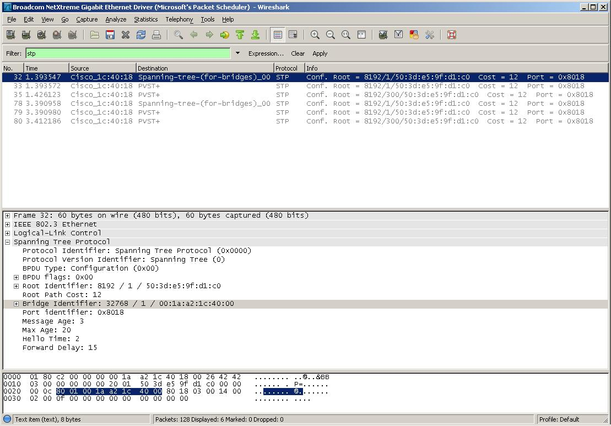

* STP BPDU Structure

| Field                 | Value                      |
|-----------------------|----------------------------|
| **Protocol Identifier** | 0x0000                    |
| **Version**             | 0x00                      |
| **BPDU Type**           | 0x00 (Configuration BPDU) |
| **Flags**               | 0x00 (Topology Change: No) |
| **Root Bridge ID**      | 8192 / 1 / 50:3d:e5:9f:d1:c0 |
| **Root Path Cost**      | 0x0000000C (12)           |
| **Bridge ID**           | 32768 / 1 / 00:1a:a2:1c:40:00 |
| **Port ID**             | 0x8018                    |
| **Message Age**         | 0x0003 (3 second)         |
| **Max Age**             | 0x0014 (20 seconds)       |
| **Hello Time**          | 0x0002 (2 seconds)        |
| **Forward Delay**       | 0x000F (15 seconds)       |

* **Bridge ID**: Combines the priority and MAC address of the sending switch

### Spanning Tree Path Cost

* **short mode**: 16-bit value, with a reference value of 20 Gbps.
* **long mode**: 32-bit value, with a reference speed of 20 Tbps.

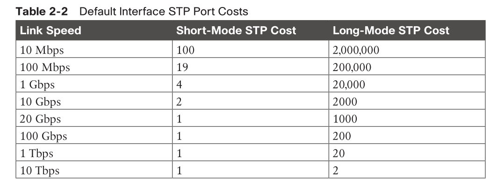

> When a switch generates the BPDUs, the root path cost includes only the calculated metric to the root and does not include the cost of the port out which the BPDU is advertised.

### Building STP topology

#### root bridge election

* everyone assume it's the root, and send out BDPUs to everyone
* the **lowest priority** in the bridge identifier win
* If the neighbor’s configuration BPDU is preferred to its own BPDU
  * the switch updates its BPDUs to include the new root bridge identifier along with a new root path cost that correlates to the total path cost to reach the new root bridge. 
  * This process continues until all switches in a topology have identified the root bridge switch.

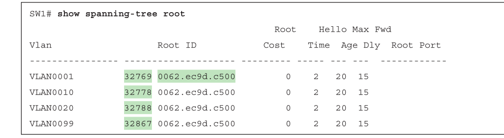

* The priority in the configuration BPDU packets is actually the priority plus the value of the sys-id-ext (which is the VLAN number).
  * looking at VLAN 10, which has a priority of 32,778, which is 10 higher than 32,768.

#### identifying RP

* comparing all local ports which received a BPDU of interest
1. The port associated to lowest path **cost** is more preferred.
2. The port associated to the lowest system **priority** of the advertising switch is preferred next.
3. The port associated to the lowest system **MAC address** of the advertising switch is preferred next.
4. When multiple links are associated to the same switch, the lowest port priority from the advertising switch is preferred.
5. When multiple links are associated to the same switch, the lower port number from the advertising switch is preferred.

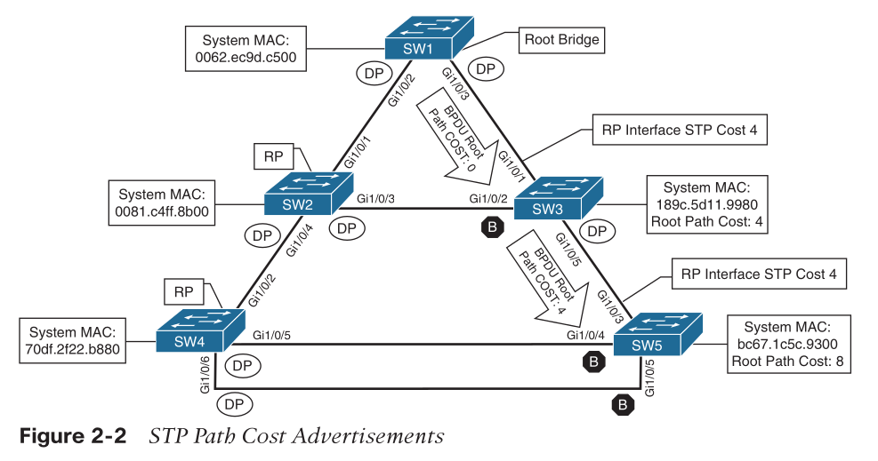
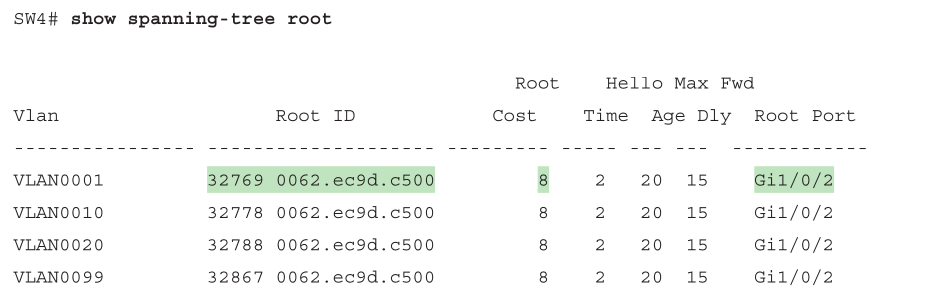

#### identify DP / B

* The port other than RP is a designated port
* comparing two BPDUs received by two ports of a single link 
1. The switch with the lower path **cost** to the root bridge forwards packets, and the one with the higher path cost blocks.
2. The system priority of the local switch is compared to the system **priority** of the remote switch. The local port is moved to a blocking state if the remote system priority is lower than that of the local switch. 
3. The system MAC address of the local switch is compared to the system **MAC address** of the remote switch. The local designated port is moved to a blocking state if the remote system MAC address is lower than that of the local switch.

```
show spanning-tree root
show spanning-tree vlan 1 [detail]
show spanning-tree interface interface-id [detail] ! for trunk interfaces

SW3# show spanning-tree interface gi1/0/1 detail
! Output omitted for brevity
Port 1 (GigabitEthernet1/0/1) of VLAN0001 is root forwarding
Port path cost 4, Port priority 128 (?), Port Identifier 128.1.
Designated root has priority 32769, address 0062.ec9d.c500
Designated bridge has priority 32769, address 0062.ec9d.c500
Designated port id is 128.3 (on remote?), designated path cost 0
Timers: message age 16, forward delay 0, hold 0
Number of transitions to forwarding state: 1
Link type is point-to-point by default
BPDU: sent 15, received 45908
```

### STP toplogy change

#### case 1: RP ok

* In a stable Layer 2 topology, configuration BPDUs always flow from the root bridge toward the edge switches.
* The switch that detects a link status change sends a topology change notification (TCN) BPDU toward the root bridge, out its RP.
* Upon receipt of the TCN, the root bridge creates a new configuration BPDU with the Topology Change flag set, and it is then flooded to all the switches.
* When a switch receives a configuration BPDU with the Topology Change flag set, all switches change their MAC address timer to the forwarding delay timer (with a default of 15 seconds). 
  * This flushes out MAC addresses for devices that have not communicated in that 15-second window but maintains MAC addresses for devices that are actively communicating.
  * Flushing the MAC address table prevents a switch from sending traffic to a host that is no longer reachable by that port. 
    * side effect of flushing the MAC address table is that it temporarily increases the unknown unicast flooding while it is rebuilt. 
    * The MAC address timer is then reset to normal (300 seconds by default) after the second configuration BPDU is received.

---

Q: what is this MAC address timer?
A: aging mac address if not seeing it on port for 5 min, remove it and someone has to redo arp

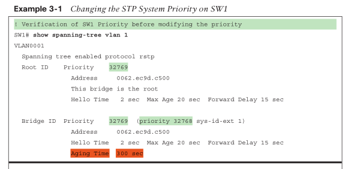

#### case 2: RP down

* no TCN can be sent out
* re-determine DP
  * ~~receiving new Config BPDU (w/ topology change flag set)~~
  * detected link failure
  * previous blocking ports now in listening -> learning state
  * The total convergence time for SW3 is 30 seconds
    * 15 seconds for the listening state
    * 15 seconds for the learning state
  * SW3’s Gi1/0/2 became RP.

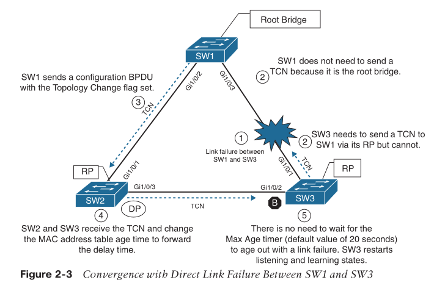

#####  indirect link failure

* link still UP, but data corrupted
* SW3 has to wait RP's Max Age timer expire, wait 20s extra

#### case 3: other's RP down


* the Max Age timer is per BPDU
  * every 2 sec, the peer need refresh it, or timer starts
    * the key for a port transition from blocking to other types

## RSTP / 802.1W

* coming from PVST/PVST+
  * per-Vlan spanning tree
  * cisco proprietary
* require a handshake process
  * if failed, back to 802.1D

### port states: 3

* discarding
  * not forwarding any traffic
* learning
  * forward only BPDUs
  * learn mac addresses
* forwarding

### port roles: 4

* root port (RP)
* designated port (DP)
* alternate port
  * alternatives to root
* backup port
  * provides link redundancy to a hub (shared)

### port types: 3

* w.r.t. SPT
* edge port
  * connected to edge devices like PCs
  * STP portfast enabled
* non-edge port
  * has received BPDUs
* p2p port
  * full-duplex to another RSTP switch

### Building STP topology

1. check full-duplex
2. handshake to decide which port is DP via system priority
3. inferior sw marks RP, all others are in discarding state
4. inferior sw ack root bridge (if no ack, fall back to 802.1D)
5. inferior sw moves RP to forwarding, superior sw moves all DP to forwarding
6. repeat for other ports / sw

### RSTP convergence

* RSTP age out port info after 6 sec
  * loss 3x consecutive hello

# Ch. 3 Advanced STP Tunning

## STP topology tunning

### Placing the root bridge

* root bridge = core switch / boundary between layer2 and layer3
* secondary root: minimize changes to STP when primary down
* via change of priority
  * 4 bits
  * range: 0 - 61440
    * in increments of 4096, 1 bit = 4096
  * default: 32768

```
spanning-tree vlan <vlan-id> priority <priority>
spanning-tree vlan <vlan-id> root {primary | secondary} [diameter diameter]
! run a script to change priority to make it root bridge
! default primary priority: 24576, secondary: 28672
! script will automatically lower the default if some sw has a lower priority
```

> The best way to prevent erroneous devices from taking over the STP root role is to set the priority to 0 for the primary root switch and to 4096 for the secondary root switch. In addition, root guard should be used (as discussed later in this chapter).

### Modifying port cost

* to change port role between DP and blocking
```
SW3# conf t
SW3(config)# interface gi1/0/1
SW3(config-if)# spanning-tree cost 1
```

### Modifying port priority

* For multiple equal-cost links between two bridges
* default port priority is 128. 
* __do so on the switch which is closer to root__

> Remember that if system ID and port cost are the same, so the next check is port priority, followed by the port number. Both the port priority and port number are controlled by the upstream switch, because it is closer to the root bridge.
>
> the lower port priority of the sending bridge is preferred at the receiving bridge. 

```
SW4# conf t
SW4(config)# interface gi1/0/6
SW4(config-if)# spanning-tree port-priority 64

SW4# show spanning-tree vlan 1
Interface Role  Sts Cost Prio.Nbr  Type
------------------- ---- --- --------- -------- --------------------------------
Gi1/0/2 Root FWD 4  128.2 P2p
Gi1/0/5 Desg FWD 4  128.5 P2p
Gi1/0/6 Desg FWD 4  64.6  P2p
```

### Additional STP protection

* possible looping: flapped MAC address
* shown in syslog

```
12:40:30.044: %SW_MATM-4-MACFLAP_NOTIF: Host 70df.2f22.b8c7 in vlan 1 is flapping
between port Gi1/0/3 and port Gi1/0/2
```

* check STP if enabled and working properly

#### Root guard

* Root guard is placed on **designated ports** toward other switches that should never become root bridges.
  * Upon receipt of a superior BPDU from DP, the port is placed into a root inconsistent state
* Root guard is enabled with the interface command `spanning-tree guard root`.

> In the sample topology shown in Figure 3-1, root guard should be placed on SW2’s Gi1/0/4 port toward SW4 and on SW3’s Gi1/0/5 port toward SW5. This placement prevents SW4 and SW5 from ever becoming root bridges but still allows SW2 to maintain connectivity to SW1 via SW3 if the link connecting SW1 to SW2 fails.

#### STP portfast

* The STP portfast feature **disables TCN generation** for access ports.
  * host connects to access ports and they should never generate TCN
* also allow the access ports bypass the earlier 802.1D STP states (learning and listening) and forward traffic immediately.

```
SW1(config)# interface gigabitEthernet 1/0/13
SW1(config-if)# switchport mode access
SW1(config-if)# switchport access vlan 10
SW1(config-if)# spanning-tree portfast
! globally on all access ports 
spanning-tree portfast default

! or use
switchport host
!   switchport mode will be set to access
!   spanning-tree portfast will be enabled
!   channel group will be disabled
```

> enabling portfast changes the RSTP port type to an Edge port.

#### BPDU guard

* If a BPDU is received on a portfast-enabled port, the portfast functionality is automatically removed from that port, and it progresses through the learning and listening states.
  * e.g.: a switch is connected now instead of a pc
* BPDU guard shutdown the port by placing the port into an `ErrDisabled` state upon receipt of a BPDU
  * to prevent any unauthorized switches behind host
  * also prevent risk of introducing loop

```
spanning-tree portfast bpduguard default
```

> BPDU guard is typically configured with all host-facing ports that are enabled with portfast.

* restore from `ErrDisabled` is not automatically, use `errdisable recovery cause bpduguard`

> The Error Recovery service operates every 300 seconds (5 minutes). This can be changed to a value of 30 to 86,400 seconds with the global configuration command `errdisable` recovery interval time.


#### BDPU filter

* blocks BPDUs from being transmitted out a port
* globally, `spanning-tree portfast bpdufilter default`

> Be careful with the deployment of BPDU filter because it could cause problems. Most network designs do not require BPDU filter, which adds an unnecessary level of complexity and also introduces risk.

#### Problems with Unidirectional Links

* like fiber
* one direction may down, but the other is still up
* can cause a loop
  * link to root still showing UP
  * BDPU timer expires, new RP selected
  * traffic received on new RP, which should come from root, will be forwarded to root 

##### STP loop guard

* prevents any alternative or root ports from becoming designated ports due to loss of BPDUs on the root port
* if loop detected, `show spanning-tree vlan x` will show `*LOOP_Inc`

```
! global
spanning-tree loopguard default
```

> It is important to note that loop guard should not be enabled on portfast-enabled ports (because it directly conflicts with the root/alternate port logic).

##### Unidirectional Link Detection

* very much like BFD
* in `aggressive` mode, if no ack from remote in 1s, port down
* need be configured on both ends

```
! global
udld enable [aggressive]
```

# Ch. 4 Multiple Spanning Tree Protocol

## Problem to solve

* The original 802.1D standard supported only one STP instance for an entire switch network - **Common Spanning Tree (CST)**
* hard to do load balancing
  * blocking port cannot be used by any Vlan
  * e.g., 3-nodes-full-mesh topology, all traffic need go through root bridge
    * even SW2 has a DP to SW3, but SW2 won't learn any MAC sourced from SW3

  

## Per-VLAN STP (PVST)

* allows root bridge on different switches or cost port differently peer vlan

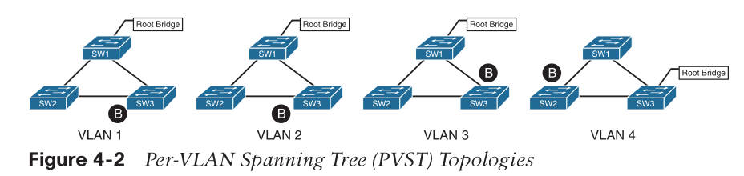

* VLAN 3: the blocking port moves to the SW1 ←→ SW3 link via STP tuning to address the needs of the traffic between SW2 (where servers attach) and SW3 (where clients attach). 
* VLAN 4: devices on VLAN 4 reside only on SW2 and SW3, so moving the blocking port to the SW2 ←→ SW1 link allows for optimal traffic flow.
* may cause CPU busy dealing with BPDUs, esp. during convergence

## MST instance (MSTI) / 802.1S

* problem: what if we have thousands of VLANs?
* MST maps new VLAN to existing STP tree / _MST instance_ which was built prior
  * based on where root bridge is

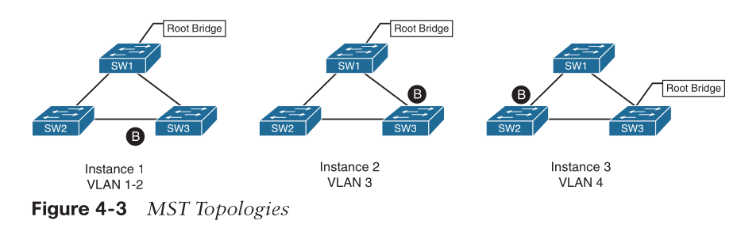

### MST region

* a group of MST switches with the same high-level configuration
  * same region name
  * same version number
* a MST region appear as a single virtual switch to external switches
  * backward compatibility

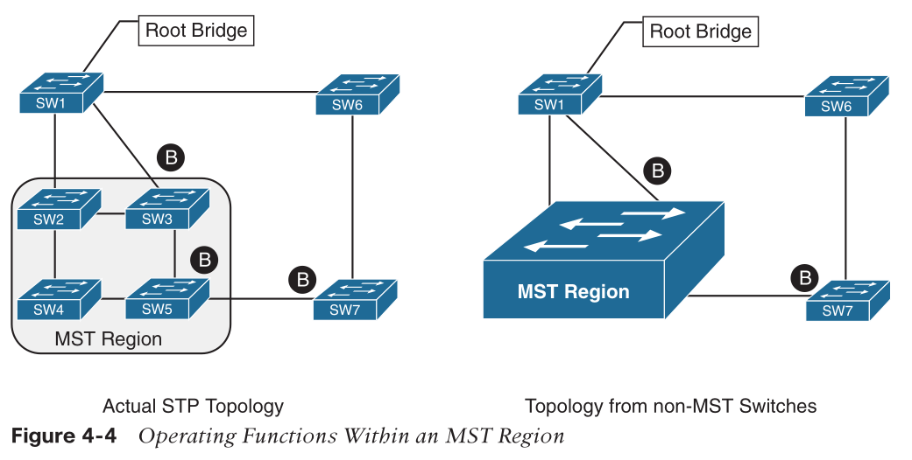

* Normally, SW3 would mark port towards SW1 as an RP
  * but because it sees the topology from a larger collective
    * it is blocking that port rather than blocking the port between SW2 and SW3
* from SW7’s perspective, SW5 appears to be one hop away to root

### internal spanning tree (IST)

* special MST instance for a MST region, instance 0
* by default, all VLANs associated with IST

### MST config

* root switch defines itself
* other switch tune port priority / port cost

```
SW1(config)# spanning-tree mode mst
! `primary` keyword sets the priority to 24,576,
! `secondary` keyword sets the priority to 28,672.
SW1(config)# spanning-tree mst 0 root primary
SW1(config)# spanning-tree mst 1 root primary
SW1(config)# spanning-tree mst 2 root primary
SW1(config)# spanning-tree mst configuration
! MST regions are recognized by switches that share a common name
SW1(config-mst)# name ENTERPRISE_CORE
! version number must match for all switches in the same MST region
SW1(config-mst)# revision 2
SW1(config-mst)# instance 1 vlan 10,20
SW1(config-mst)# instance 2 vlan 99

SW1# show spanning-tree mst configuration
```

### MST tuning

* tuning of port cost and port priority
  * lower priority win if there are multiple links between two switches

```
SW3(config)# interface gi1/0/1
SW3(config-if)# spanning-tree mst 0 cost 1
SW4(config)# interface gi1/0/5
SW4(config-if)# spanning-tree mst 0 port-priority 64
```

### MST misconfig

#### VLAN assigned to IST

* IST runs on all ports so some ports will be blocked which may be VLAN is assigned to


* in IST
  * SW1 is the root bridge, and all of its ports are designated ports
  * SW2 must block either Gi1/0/1 or Gi1/0/2. 
    * SW2 blocks Gi1/0/2, based on the port identifier
  * IST has a different tree than VLAN 10
* VLAN 10 assign to another MSTI

#### Trunk link pruning

* pruning VLANs from trunk = allow a set of vlans on one trunk, and other vlans on another trunk -> load balancing

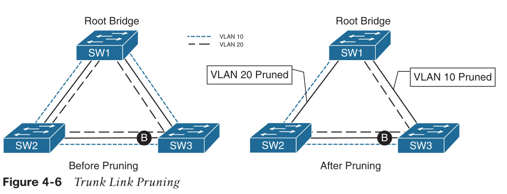

* SW1 and SW3 cannot talk to the servers on SW2 because VLAN20 is not allowed on SW2's only link out
  * VLANs on the trunk links have changed, while the MSTI topology has not

> A simple rule to follow is to prune all the VLANs in the same MSTI for a trunk link.

### MST region boundary

* An MST region boundary is any port that connects to a switch that is in a different MST region or that connects to 802.1D or 802.1W BPDUs.
  * MSTIs/802.1S BPDU never interact outside the region
  * they live in different worlds/views:
    * PVST: per vlan, there is a tree
    * MST: per tree, there is/are VLAN(s)
  * but they still need interact...
* PVST simulation mechanism
  * for MST switch (802.1S) to talk to PVST switch (802.1D/W), MST switch do this:
    ```
    when boundary port receives a PVST BPDU:
      # start PVST simulation
      for each vlan: 
        sending out PVST BPDUs based on IST (aka MST 0) topology
    ```
> When the MST boundary receives PVST+ BPDUs, it does not map the VLANs to the appro- priate MSTIs. Instead, the MST boundary maps only the PVST+ BPDU from VLAN 1 to the IST instance.
> only the VLAN 1 PVST BPDU is used for the IST and that the IST BPDU is a one-to-many translation of IST BPDUs to all PVST BPDUs.

* design considerations:
  * MST reegion as root bridge
    * making the IST instance more preferable than any other switch in the PVST+ topology
    * recall MST region appears as a single entity
      * PVST can load balance on a VLAN-by-VLAN basis

    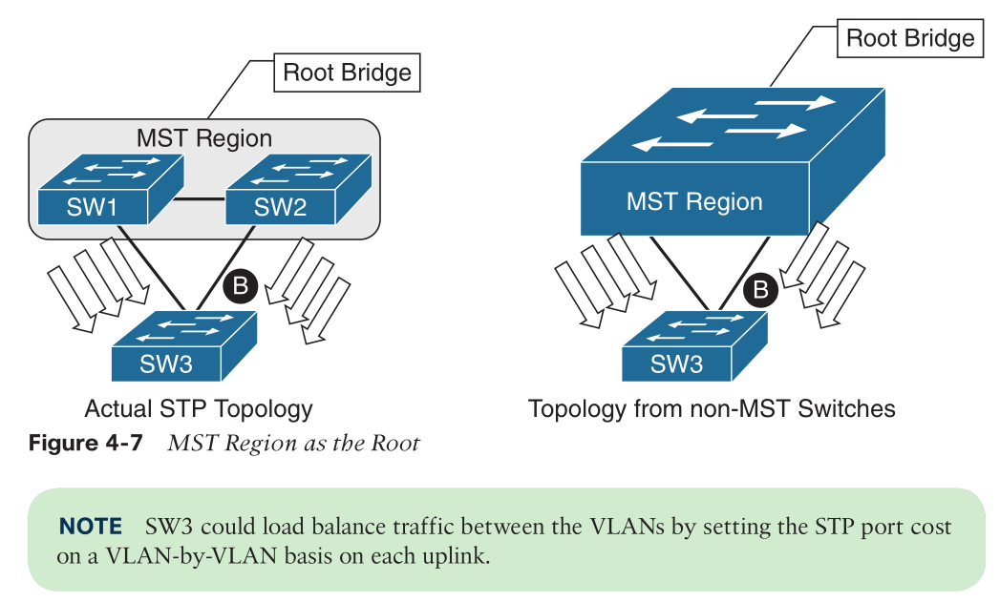

  * MST region not a root bridge for any VLAN
    * MST region boundary ports can only block or forward for all VLANs
    * not option to load balance
    * PVST simulation check
      * If an MST switch detects a better BPDU for a specific VLAN on a boundary port from an non-MST switch, the switch will use BPDU guard to block this port. 
        * to prevent the non-MST info changes its own MSTI topology
      * this may isolate downstream switches, but ensure a loop-free topology
