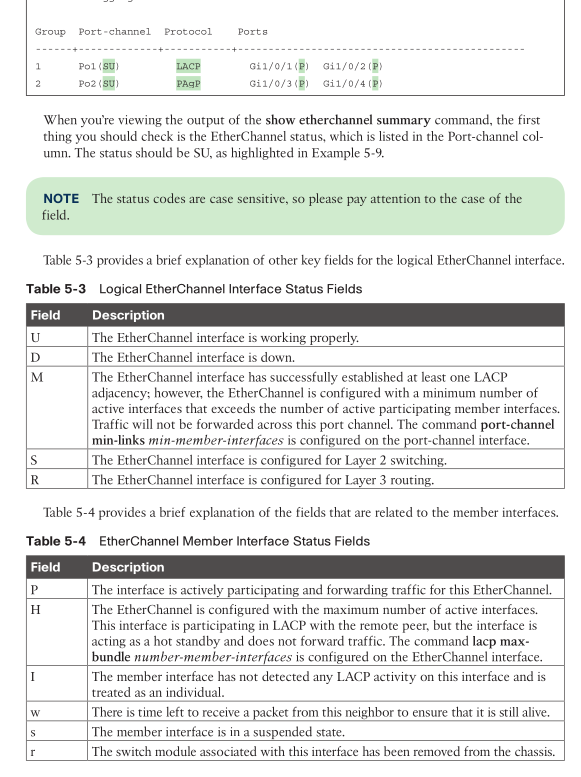

- [VLAN trunking protocol (VTP)](#vlan-trunking-protocol-vtp)
  - [VTP communication](#vtp-communication)
  - [VTP config](#vtp-config)
  - [VTP verify](#vtp-verify)
  - [about `revision`](#about-revision)
- [Dynamic Trunking Protocol](#dynamic-trunking-protocol)
  - [config](#config)
- [EtherChannel Bundle / 802.3AD](#etherchannel-bundle--8023ad)
  - [Dynamical Link Aggregation Protocol](#dynamical-link-aggregation-protocol)
  - [Advanced LACP Configuration Options](#advanced-lacp-configuration-options)
    - [LACP Fast](#lacp-fast)
    - [Minimum Number of EtherChannel Member Interfaces](#minimum-number-of-etherchannel-member-interfaces)
    - [Maximum Number of EtherChannel Member Interfaces](#maximum-number-of-etherchannel-member-interfaces)
      - [LACP System Priority](#lacp-system-priority)
      - [LACP Interface/Port Priority](#lacp-interfaceport-priority)
  - [Troubleshooting](#troubleshooting)
  - [Load balancing](#load-balancing)

* switch-to-switch connectivity

# VLAN trunking protocol (VTP)

* cisco proprietary
* without VTP, adding a new VLAN need add it to all switches
* with VTP, config once on one switch, populate automatically to all other switches
* VTP Domain
  * VTP server
    * new/delete/edit VLANs
  * VTP client
    * VLANs cannot be configured locally on a VTP client.
  * Transparent
    * receive and forward VTP advertisements but do not modify the local VLAN database
  * Off
    * not forward VTP messages
* VTP version
  * v1/v2: VLAN ID $\in$ [1..1005]
  * v3: VLAN id $\in$ [1..4094]

## VTP communication

* via multicast
* 3 types of advertisements
  * summary
    * link state like, every 300s
    * includes the VTP version, domain, configuration revision number, and time stamp.
  * subset
    * when change occurs
  * client request
    * when client felt it was left behind

## VTP config

```
SW1(config)# vtp domain CISCO
SW1(config)# vtp version 3
SW1(config)# vtp mode server
SW1(config)# vtp password pnet
SW1(config)# exit

SW1# vtp primary
This system is becoming primary server for feature vlan
No conflicting VTP3 devices found.
Do you want to continue? [confirm]
09:25:02.038: %SW_VLAN-4-VTP_PRIMARY_SERVER_CHG: 0062.ec9d.c500 has become the primary server for the VLAN VTP feature
```

## VTP verify

```
show vtp status
```

## about `revision`

> It is very important that every switch that connects to a VTP domain has the VTP revision number reset to 0. Failing to reset the revision number on a switch could result in the switch providing an update to the VTP server. This is not an issue if VLANs are added but is catastrophic if VLANs are removed because those VLANs will be removed throughout the domain.

> Which of the following is a common disastrous VTP problem with moving a switch from one location to another?
> b. The moved switch sends an update to the VTP server and deletes VLANs.

# Dynamic Trunking Protocol

* dynamically forming a trunk port
* two switches negotiate via Dynamic Trunking Protocol
* cisco proprietary

## config

* 3 modes:
  * Trunk mode
    * `switchport mode trunk`
  * Dynamic desirable
    * `switchport mode dynamic desirable`
    * acts as an access port
    * but listen for and generate DTP packets
  * Dynamic auto
    * `switchport mode dynamic auto`
    * acts as an access port
    * only listen for DTP packets, not generate DTP packets
    * default mode on Catalyst switches
* 5 combinations to make a trunk link
  * `dynamic auto` and `dynamic desirable`
  * `dynamic desirable` and `dynamic desirable`
  * `trunk` and `trunk`
  * `trunk` and `dynamic auto`
  * `trunk` and `dynamic desirable`
* verify
  * `show interface [interface-id] trunk`
* disable negotiation
  * `switchport nonegotiate`
* BCP
  * > configure both ends of a link as a fixed port type (using switchport mode access or switchport mode trunk)

# EtherChannel Bundle / 802.3AD

* link aggregation spec
* form a _logical interface_ / link from multiple physical link
  * (active) _member interfaces_
  * one member down, the logical interface may still up -> redundancy
* STP operates on logical links
* can be used for access or trunk or routing
  * etherbundle = layer 1.5
* alias
  * `EtherChannel`, `EtherChannel bundle`, and `port channel`

## Dynamical Link Aggregation Protocol

* Link Aggregation Control Protocol (LACP)
  * standard
  * using multicast MAC address `0180:C200:0002`
  * `passive`: only listen and respond
  * `active`: sending LACP packets out
* Port Aggregation Protocol (PAgP)
  * cisco proprietary
  * using multicast MAC address `0100:0CCC:CCCC`
  * `auto` and `desirable` (similar to LACP `passive` and `active` respectively)
* config

```
SW1(config)# interface range gi1/0/1-2
SW1(config-if-range)# channel-group 1 mode active
Creating a port-channel interface Port-channel 1
SW1(config-if-range)# interface port-channel 1
SW1(config-if)# switchport mode trunk

SW2(config)# interface range gi1/0/1-2
SW2(config-if-range)# channel-group 1 mode passive
Creating a port-channel interface Port-channel 1
SW2(config-if-range)# interface port-channel 1
SW2(config-if)# switchport mode trunk
```

* verify

```
show etherchannel summary
show interface port-channel <port-channel-id>
show etherchannel port
show lacp neighbor [detail]
show lacp counters
clear lacp counters
show pagp neighbor
show pagp counters
```



## Advanced LACP Configuration Options

### LACP Fast

* original LACP advertisement every 30s
* 3x loss (90s) -> member link down
* `lacp rate fast`: advertise every 1s
  * config on both ends
* link down in 3s

### Minimum Number of EtherChannel Member Interfaces

* min number of links to make bundle active and up
* `port-channel min-links <min-links>`

### Maximum Number of EtherChannel Member Interfaces

* if total number of member links > max, some links will go hot-standby
  * by comparing LACP port priority. A lower port priority is preferred. 
  * If the port priority is the same, then the lower interface number is preferred.
* `lacp max-bundle <max-links>`
> This may be done to ensure that the active member interface count proceeds with powers of two (for example, 2, 4, 8) to accommodate load-balancing hashes.

#### LACP System Priority

* to pick primary switch
  * primary sw decide which member links go active, which go hot-standy
    * lower system priority wins
* `lacp system-priority priority`

#### LACP Interface/Port Priority

* to pick which interface/port go active or hot-standy
  * lower wins
* `lacp port-priority priority`

## Troubleshooting

* all the member interfaces must have the same characteristics
  * port status: active/up
  * port type: layer2 or layer3
  * port mode: access or trunk
  * trunk port
    * native vlan id
    * allowed vlan
  * speed: must be same
  * duplex
  * MTU: for layer3 ports
  * load interval ?
  * storm control ?

## Load balancing

* `port-channel load-balance hash`
* hash()
  * dst-ip: Destination IP address
  * dst-mac: Destination MAC address
  * dst-mixed-ip-port: Destination IP address and destination TCP/UDP port
  * dst-port: Destination TCP/UDP port
  * src-dst-ip: Source and destination IP addresses
  * src-dest-ip-only: Source and destination IP addresses only
  * src-dst-mac: Source and destination MAC addresses
  * src-dst-mixed-ip-port: Source and destination IP addresses and source and destination TCP/UDP ports
  * src-dst-port: Source and destination TCP/UDP ports only
  * src-ip: Source IP address
  * src-mac: Source MAC address
  * src-mixed-ip-port: Source IP address and source TCP/UDP port
  * src-port: Source TCP/UDP port
* `show etherchannel load-balance`
* > Another critical point is that a hash is a binary function, so links should be in powers of two (for example, 2, 4, 8) to be consistent
* `show etherchannel port` to show each member link traffic
