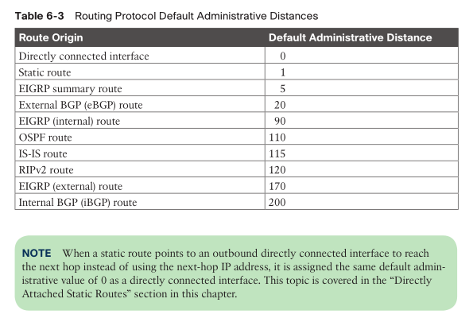

- [Routing Protocol Overview](#routing-protocol-overview)
  - [Distance Vector Algorithms](#distance-vector-algorithms)
  - [EIGRP](#eigrp)
  - [Path Vector Algorithms](#path-vector-algorithms)
  - [Link State Algorithms](#link-state-algorithms)
- [Path Selection](#path-selection)
  - [prefix length](#prefix-length)
  - [administrative distance (AD)](#administrative-distance-ad)
  - [metrics](#metrics)
    - [ECMP](#ecmp)
    - [Unequal-Cost load balancing](#unequal-cost-load-balancing)
- [Static Routing](#static-routing)
  - [Directly attached static routes](#directly-attached-static-routes)
  - [Recursive static routes](#recursive-static-routes)
  - [Fully specified static routes](#fully-specified-static-routes)
  - [Floating static routing](#floating-static-routing)
  - [Static route to NULL](#static-route-to-null)
  - [IPv6 static routes](#ipv6-static-routes)
- [Policy-Based Routing](#policy-based-routing)
- [Virtual Routing and Forwarding (VRF)](#virtual-routing-and-forwarding-vrf)


# Routing Protocol Overview

* IGP
  * Routing Information Protocol Version 2 (RIPv2)
  * Enhanced Interior Gateway Routing Protocol (EIGRP)
  * Open Shortest Path First (OSPF)
  * Intermediate System-to-Intermediate System (IS-IS)
* EGP
  * Border Gateway Protocol (BGP)

## Distance Vector Algorithms

* Distance: cost, e.g., hop count
  * RIPv2 only consider hop count, no link speed or anything else
* Vector: direction/next-hop
* **Bellman-Ford** / Ford-Fulkerson
  * tell the neighbors about the world
  * not the complete network map, but the best routes of a router's own
  * less CPU and memory

## EIGRP

* still a distance vector RP
  * hybrid RP with some link-state characteristics
* sending updates when network changes, not flooding
* cost = $f(bw; delay; reliability; load; MTU; etc.)$
  * by default, using min(bw) + total path delay
* option to do load balancing over multiple routes

## Path Vector Algorithms

* BGP
* cost = $f(path attributes)$
  * local_pref
  * AS Path
  * origin
  * MED

## Link State Algorithms

* link state and link metric
* Dijkstra (DIKE-struh)
  * tell the world about the neighbors
  * advertise routing info. as exactly received
  * flooding
  * complete map
  * heavier on CPU and memory
* OSPF
  * Link State Advertisements (LSA)
  * v3 start support IPv6
* ISIS
  * Link State Packets (LSP)
  * TLVs

# Path Selection

* from RIB (Routing Information Base)
  * learned from routing protocols

## prefix length 

* longest prefix match

## administrative distance (AD)

* trustworthiness of where learned this route



> The RIB is programmed from the various routing protocol processes. Every routing protocol presents the **same** information to the RIB for insertion: the _destination network_, the _next-hop IP address_, the _AD_, and _metric_ values.

## metrics

* varies from routing protocols
* Most IGPs prefer internally learned routes over external routes and further prioritize the path with the **lowest metric**.

### ECMP

* for load balancing
* all IGP supports ECMP

### Unequal-Cost load balancing

* EIGRP only
* traffic not evenly distributed over links
  * ratio can be checked

```
R1# show ip route 10.3.3.0
Routing entry for 10.3.3.0/24
    Known via "eigrp 100", distance 90, metric 3328, type internal
    Redistributing via eigrp 100
    Last update from 10.14.1.4 on GigabitEthernet0/4, 00:00:53 ago
    Routing Descriptor Blocks:
    * 10.14.1.4, from 10.14.1.4, 00:00:53 ago, via GigabitEthernet0/4
        Route metric is 3328, traffic share count is 120
        Total delay is 30 microseconds, minimum bandwidth is 1000000 Kbit
        Reliability 255/255, minimum MTU 1500 bytes
        Loading 1/255, Hops 2
    10.12.1.2, from 10.12.1.2, 00:00:53 ago, via GigabitEthernet0/2
        Route metric is 5632, traffic share count is 71
        Total delay is 120 microseconds, minimum bandwidth is 1000000 Kbit
        Reliability 255/255, minimum MTU 1500 bytes
        Loading 1/255, Hops 2

! R1 forwards 71 packets toward R2 for every 120 packets forwarded toward R4.
```

# Static Routing

## Directly attached static routes

* p2p serial link
  * not ethernet, no need for ARP
  
```
! ip route network subnet-mask next-hop-interface-id
ip route 10.11.11.0 255.255.255.0 Serial 1/0
```

> Configuring a directly attached static route to an interface that uses ARP (that is, Ethernet) causes problems and is not recommended. The router must repeat the ARP pro- cess for every destination that matches the static route, which consumes CPU and memory.

## Recursive static routes

* A recursive static route specifies the IP address of the next-hop address.
* the router queries the RIB to locate the route toward the next- hop IP address (connected, static, or dynamic) and then cross-references the adjacency table.
* less ARP traffic b/c we only need one ARP for next-hop ip
* can tolerate some network changes as long as next-hop ip is reachable via new links

```
! ip route network subnet-mask next-hop-ip
ip route 10.11.11.0 255.255.255.0 10.12.1.1
```

* can support multi-hop recursive static routes
  * multiple route lookups

## Fully specified static routes

* A static route with both an interface and a next-hop IP address
* more predictable routing over network changes

```
! ip route network subnet-mask interface-id next-hop-ip
ip route 10.11.11.0 255.255.255.0 GigabitEthernet0/0 10.12.1.1
```

> Specifying the next-hop address along with the physical interface removes the recursive lookup and does not involve the ARP processing problems that occur when using only the outbound interface.

## Floating static routing

* A floating static route is configured with an AD higher than that of the primary route.
* for providing backup connectivity for prefixes learned via dynamic routing protocols.

```
R1(config)# ip route 10.22.22.0 255.255.255.0 10.12.1.2 10
R1(config)# ip route 10.22.22.0 255.255.255.0 Serial 1/0 210

! 2nd route won't show up in `sh ip route` unless 1st route down
! use `sh ip route 10.22.22.0 to check AD (as "distance")
```

## Static route to NULL

* drop packets w/o involving CPU
* avoiding routing loops, e.g.:
  * company ABC has acquired the 172.16.0.0/20 from ISP, but only used 172.16.1.0/24
  * The service provider places a static route for the 172.16.0.0/20 to ABC
  * a computer on the Internet sends a packet to 172.16.5.5
  * The ISP sends the packet to R1 because of the 172.16.0.0/20 static route
  * ABC looks into the RIB, and the longest match for that prefix is the default route back to the ISP, so ABC sends the packet back to the ISP
* to prevent that, ABC do

```
ip route 172.16.0.0 255.255.240.0 Null0

! 172.16.1.0/24 still routable b/c longest match
```

## IPv6 static routes

```
! enable IPv6 routing
ipv6 unicast-routing

! add new route
ipv6 route 2001:db8:22::/64 2001:db8:12::2
```

# Policy-Based Routing

* if..else conditional forwarding
  * by protocol
  * by source ip, and/or dest. ip
  * etc.
* PBR policies do not modify the RIB because the policies are not universal for all packets
  * `show ip route` won't see PBR routes

# Virtual Routing and Forwarding (VRF)

* creating separate virtual router (VM like functionally) with its own IFs/RIB/FIB on a physical router
* VRF instances are completely isolated (like VMs)
* global VRF (like vlan 1)
* allow same/overlapping IP address ranges

```
vrf definition <vrf-name>
address-family {ipv4 | ipv6}

! interface submodule
interface <if-id>
vrf forwarding <vrf-name>
ip address <ip-address> <subnet-mask> [secondary]
! or
ipv6 address <ipv6-address/prefix-length>

show ip route vrf <vrf-name>
```

