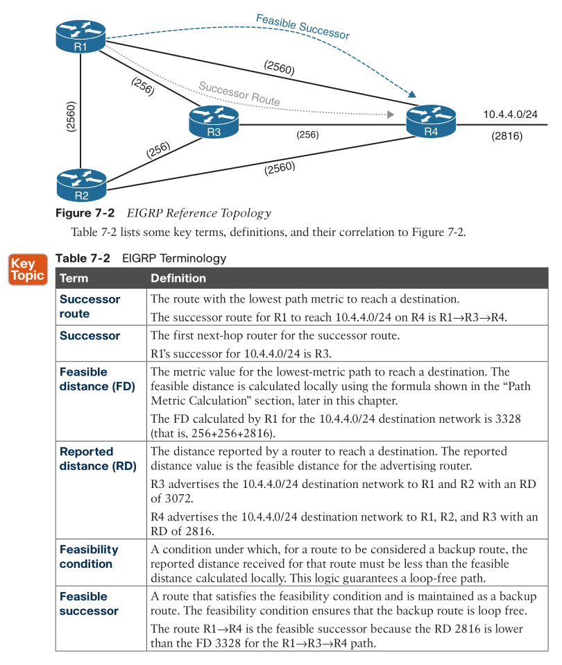
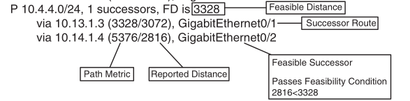
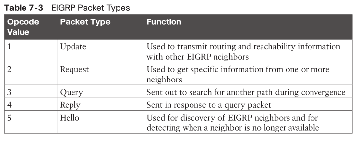
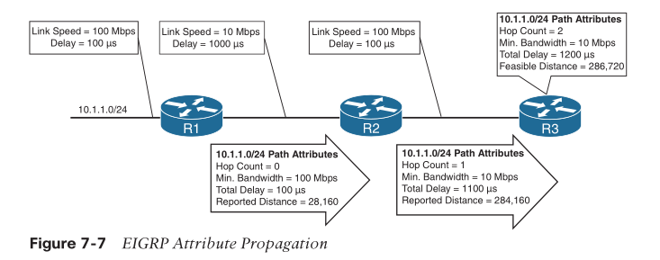
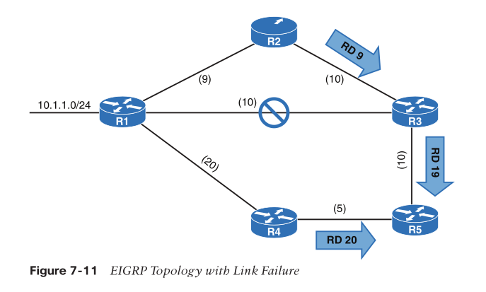

- [Basics](#basics)
  - [Autonomous System](#autonomous-system)
  - [Terminology](#terminology)
  - [Topology Table](#topology-table)
- [EIGRP Neighbors](#eigrp-neighbors)
- [Path Metric Calculation](#path-metric-calculation)
  - [wide metrics](#wide-metrics)
  - [load balancing](#load-balancing)
- [Failure Detection and Timers](#failure-detection-and-timers)
  - [Convergence](#convergence)
- [Route Summarization](#route-summarization)

# Basics

* initially Cisco proprietary
* now RFC7868
* diffusing update algorithm (DUAL)
* enable fast convergence using precalculated loop-free backup paths
* cost involves not hop count, but bw and delay

## Autonomous System

* not same BGP AS
* A router can run multiple EIGRP processes. 
* Each process operates under the context of an autonomous system, which represents a common routing domain / AS.
  * ASes are isolated
* Routers within the same domain use the same metric calculation formula and exchange routes only with members of the same AS

## Terminology



* successor route: best path
* FD: path cost
  * FD = RD from next hop + cost to the next hop
* feasibility condition: RD < FD(best path) -> backup routes

## Topology Table

* Network prefix
* EIGRP neighbors that have advertised that prefix
* Metrics from each neighbor (for example, reported distance, hop count)
* Values used for calculating the metric (for example, load, reliability, total delay, minimum bandwidth)

```
R1# show ip eigrp topology
```



* The 10.4.4.0/24 route is **passive (P)**, which means the topology is **stable**. 
* During a topology change, routes go into an **active (A)** state when **computing a new path**.

# EIGRP Neighbors

* EIGRP neighbors exchange the entire routing table when forming an adjacency, and 
* advertise only incremental updates when topology changes
* 5 packet types
* IP protocol: 88
* multicast: 224.0.0.10
  * the corresponding MAC multicast: 01:00:5E:00:00:0A
    > * Every multicast group IP address is mapped to a specific MAC address.
    > * The first 24 bits are always **01:00:5E**
    > * and the 25th bit is always 0
    > * The low-order 23 bits of the multicast MAC address are copied from the low-order 23 bits of the IP multicast group address.



# Path Metric Calculation

* lowest metric wins

$$
Metric = 256 * [(K_1 * min. BW + \frac{K_2 * min. BW}{256 – Load} + K_3 * Delay) * \frac{K_5}{K_4 + Reliability}]
$$

* _min. BW_: $10^7$/(**slowest link speed** in the path)
  * $10^7$ referrs to 10G, measured in Kbps
  * slowest link is the actual bw one can actually use
* _Delay_ is the total measure of delay in the path, measured in tens of microseconds (µs)
* $K_1$ and $K_2$ are reference bw
* By default, $K_1$ and $K_3$ have the value 1, and $K_2$, $K_4$, and $K_5$ are set to 0

$$
Metric = 256* (\frac{10^7}{Min. Bandwidth}+\frac{Total Delay}{10})
$$




## wide metrics

* 10us delay will dominate the metric when if bw goes beyond 10G

$$
Wide Metric = 65,536 * [(\frac{K_1 * 10^7}{min. BW} + \frac{\frac{K_2 * 10^7}{min. BW}}{256-Load} + \frac{K_3 * Latency}{10^{-6}} + K_6 * Extended) * \frac{K_5}{K_4+Reliability}]
$$

* Latency is the total interface delay measured in picoseconds ($10^{–12}$) instead of measuring in microseconds ($10^{–6}$)
* $K_6$ measure jitter, energy, or other future attributes
* backward compatibility
  * As long as K1 through K5 are the same and K6 is not set, the two metrics styles allow adjacency between routers. 
  * EIGRP is able to detect when peering with a router using classic metrics, and it unscales the metric.

## load balancing

* support both ECMP and non-equal cost multiple path
  * as long as installed in the EIGRP RIB, the routes will be used for routing
* variance value: FD for a route multiplied by the EIGRP _variance multiplier_. 
  * Any feasible successor’s FD with a metric below the EIGRP variance value is installed into the RIB. 
  * EIGRP installs multiple routes up to the maximum number of ECMP routes
* variance multiplier: dividing the feasible successor metric by the successor route metric provides the variance multiplier.

# Failure Detection and Timers

* Hello packets as heartbeat
* __hello timer__: 5s
  * T1 or lower: 60s
* __hold time__: 3x hello timer

## Convergence

* recomputing the paths where the down neighbor was successor
* the feasible successor, if one exists, instantly becomes the successor route



* if no feasible successor, DUAL recomputes
  * route state: P(assive) to A(ctive)
  * sending query packets to downstream routers, which in turn queries their downstream routers recursively, until someone knows a passive route
    * queries are tracked per neighbor per prefix basis
  * delay is set to $\infty$ to signal it has no routes


# Route Summarization

* to scale EIGRP
* EIGRP summarizes routes on a per-interface basis and not under the routing process.
* component routes: more specifics
* The summary route is not advertised until one of the component routes matches it
* summarization also creates a query boundary and shrinks the query domain when a route goes active during convergence