- [Basics](#basics)
  - [ASN](#asn)
  - [Path Attributes](#path-attributes)
  - [Address Family](#address-family)
  - [inter-router comm.](#inter-router-comm)
  - [Session Types](#session-types)
  - [BGP Messages](#bgp-messages)
    - [OPEN](#open)
  - [Neighbor States](#neighbor-states)
- [Config](#config)
  - [Three Tables](#three-tables)
  - [Route Advertisement](#route-advertisement)
    - [from Indirect Sources](#from-indirect-sources)
  - [Receiving Routes](#receiving-routes)
  - [Example](#example)
  - [IPv4 Route Summarization](#ipv4-route-summarization)
    - [Two BGP summarization techniques](#two-bgp-summarization-techniques)
    - [config](#config-1)
    - [auto-aggregate](#auto-aggregate)
    - [aggregation with `AS_SET`](#aggregation-with-as_set)
  - [MP-BGP for IPv6](#mp-bgp-for-ipv6)
- [Advanced](#advanced)
  - [BGP Multihoming](#bgp-multihoming)
  - [Conditional Matching](#conditional-matching)
    - [access control lists (ACLs)](#access-control-lists-acls)
    - [prefix lists](#prefix-lists)
    - [AS path ACLs](#as-path-acls)
  - [Route Maps](#route-maps)
    - [four components](#four-components)
    - [Rules](#rules)
    - [example](#example-1)
    - [match conditions](#match-conditions)
    - [what if ACL has a `deny`?](#what-if-acl-has-a-deny)
    - [optional actions](#optional-actions)
    - [`continue`](#continue)
  - [BGP Route Filtering and Manipulation](#bgp-route-filtering-and-manipulation)
    - [Distribute list](#distribute-list)
    - [Prefix list](#prefix-list)
    - [AS path ACL/filtering](#as-path-aclfiltering)
    - [Route maps](#route-maps-1)
    - [apply changes](#apply-changes)
  - [BGP Communities](#bgp-communities)
    - [Well-Known Communities](#well-known-communities)
    - [Private Communities](#private-communities)
    - [Enabling BGP Community](#enabling-bgp-community)
    - [Match BGP Community](#match-bgp-community)
    - [Set Private BGP Community](#set-private-bgp-community)
  - [Understanding BGP Path Selection](#understanding-bgp-path-selection)
    - [Order](#order)

# Basics

## ASN

* private ASN
  * 64,512–65,534 are private ASNs in the 16-bit ASN range, and 
    * 65,535 is not here b/c it is a reserved ASN for reserved community value
    > The community attribute values ranging from 0x0000000 through 0x0000FFFF and 0xFFFF0000 through 0xFFFFFFFF are hereby reserved. - RFC1997
  * 4,200,000,000–4,294,967,294 are private ASNs within the extended 32-bit range

## Path Attributes

* Well-known mandatory
* Well-known discretionary
* Optional transitive
* Optional non-transitive
>
* Well-known vs Optional
  * everyone must implement or not
* mandatory vs discretionary 
  * every prefix must have it or not
* transitive vs non-transitive
  * if unrecognized, relay or drop

## Address Family

* Multiprotocol-BGP (MP-BGP)
* AFI
* SAFI: Subsequent Address Family Identifier
  * unicast or multicast
* Every address family maintains a separate database and configuration for each protocol (address family + sub-address family) in BGP.
  * allows routing policy be per-(AFI-SAFI) based

## inter-router comm.

* no dynamic neighbor discovery
* TCP: 179
* most recent implementation set do-not-fragmentation (DF) bit
  * replying on path MTU discovery
* multi-hop neighboring
  * IGP can only do one-hop (non-tcp, no routes before routing)

## Session Types 

* iBGP vs eBGP
  * eBGP TTL = 1, iBGP TTL = 255
  * eBGP modifies next-hop addr
  * eBGP adds its ASN when advertising

## BGP Messages

* 4 packet types
  * OPEN
  * UPDATE
  * KEEPALIVE
    * 1/3 hold timer
  * NOTIFICATION
    * error being detected

### OPEN

* hold timer
  * Cisco default: 180s
    * 3x KEEPALIVE interval
  * smaller value wins if neighbor has a different timer value
* Router ID (RID)
  * 32b
  * used for iBGP loop prevention

## Neighbor States

* Idle
* Connect
* Active
  * retrying connect
* OpenSent
  * ASN/Neighbor IP must as configured
* OpenConfirm
* Established

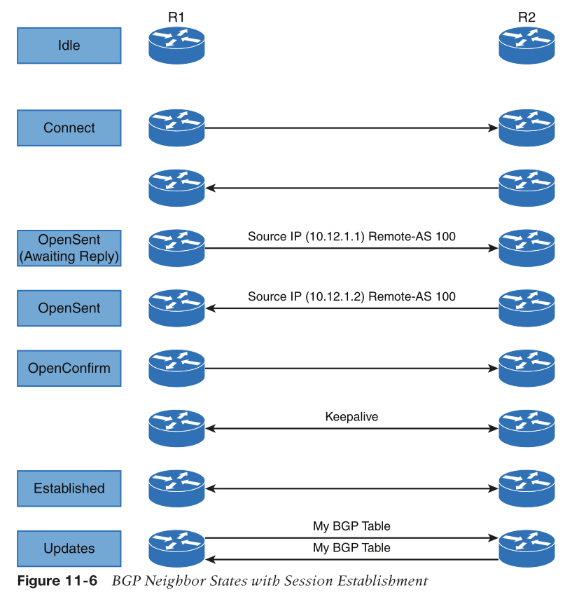

# Config

```
R1# (Default IPv4 Address-Family Enabled)
router bgp 65100
    neighbor 10.12.1.2 remote-as 65200
    network 10.12.1.0 mask 255.255.255.0
    network 192.168.1.1 mask 255.255.255.255
!
R2# (Default IPv4 Address-Family Disabled)
router bgp 65200
    no bgp default ipv4-unicast
    neighbor 10.12.1.1 remote-as 65100
    !
    ! Initialize the address family `address-family <afi> <safi>`
    ! afi: ipv4 or ipv6, safi: unicast (default) or multicast
    address-family ipv4
        neighbor 10.12.1.1 activate
        network 10.12.1.0 mask 255.255.255.0
        network 192.168.1.1 mask 255.255.255.255
```

* neighbor ip address is the interface ip address for single-hop BGP
  * BGP will check source IP addr to match the configured
* check
```
show bgp ipv4 unicast summary
show bgp ipv4 unicast neighbors 10.12.1.1
```

## Three Tables

* Adj-RIB-In
  * original, before inbound routing policy
* Loc-RIB / BGP Table
  * local routes
  * receiving routes after inbound policy
* Adj-RIB-Out
  * routes go to BGP peers

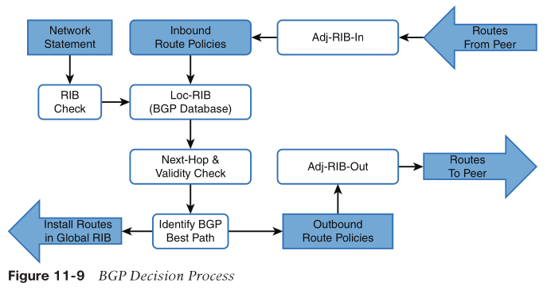

## Route Advertisement

* explicitly configured
  * `network <network> mask <subnet-mask> [route-map <route-map-name>]`
    * `route-map` sets specific BGP path attributes
* then routes checked against RIB, if ok, go into BGP Loc-RIB
  * connected routes' next-hop field = 0.0.0.0
  * IGP routes' next-hop stays
    * both will be changed to BGP session IP when out
* routes match route policies -> BGP Adj-RIB-Out

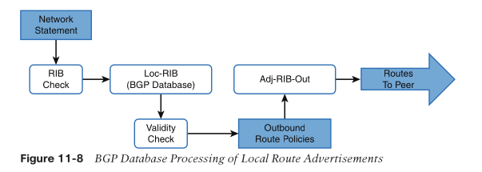

### from Indirect Sources

* redistribute OSPF-leared routes
  * `redistribute ospf 1`
    * BGP Origin code will be `incomplete` for redistributed routes

> Redistributing routes learned from an IGP into BGP is completely safe; however, BGP learned routes should be redistributed into an IGP with caution.
> BGP table just too big

## Receiving Routes

```
! show bgp <afi> <safi>
show bgp ipv4 unicast
show bgp ipv4 unicast | begin Network
show bgp ipv4 unicast 10.12.1.0
show bgp ipv4 unicast summary
! check Adj-RIB-Out
! show bgp <afi> <safi> neighbor <ip-address> advertised routes
show bgp ipv4 unicast neighbors 10.12.1.2 advertised-routes
! check global RIB
show ip route bgp | begin Gateway
```

* Metric: Multiple-exit discrimator (MED): An optional non-transitive BGP path
attribute
  * the metric value in global RIB will be reflected here
* LocPrf: Local Preference: A well-known discretionary BGP path attribute used in the BGP best-path algorithm for the specific path.
* Weight: A locally significant Cisco-defined attribute used in the BGP best-path algorithm for the specific path.

## Example

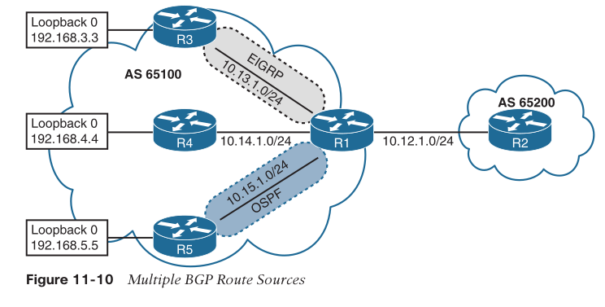
* R1 config
```
R1#
router bgp 65100
    network 10.12.1.0 mask 255.255.255.0
    network 192.168.1.1 mask 255.255.255.255
    network 192.168.3.3 mask 255.255.255.255
    network 192.168.4.4 mask 255.255.255.255
    redistribute ospf 1
    neighbor 10.12.1.2 remote-as 65200
```
* global RIB
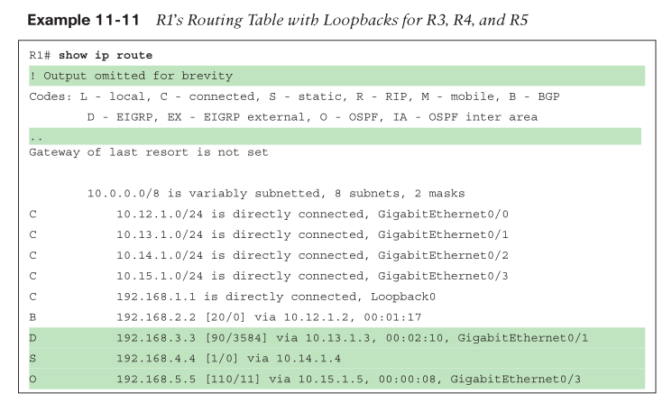
* BGP table
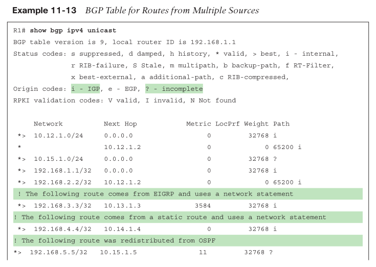
  * the next hop matches the next hop learned from the RIB and 
  * the origin code is IGP (for routes learned from network statement) or incomplete (redistributed). 
  * The metric is carried over from R3’s and R5’s IGP routing protocols and is reflected as the MED.
* R2's routing table
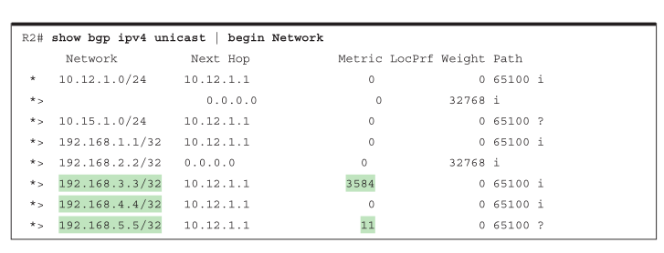

## IPv4 Route Summarization

### Two BGP summarization techniques

* Static: Create a static route to Null0 for the summary network prefix and then advertise the prefix with a `network` statement. 
  * The downfall of this technique is that the summary route is always advertised, even if the networks are not available.
* Dynamic: Configure an aggregation network prefix with a `aggregate-address` statement
  * When viable component routes that match the aggregate network prefix enter the BGP table, then the aggregate prefix is created. 
  * The originating router sets the next hop to Null0 as a discard route for the aggregated prefix for loop prevention.

### config

* `aggregate-address <network> <subnet-mask> [summary-only] [as-set]`
* `summary-only`: only advertise aggregated routes, no more specifics
  * otherwise, the aggregated route (the supernet) is advertised in addition to the specific original component network prefixes
  * AS_PATH, MED, Communities are not included in new advertisement

```
R1# show running-config | section router bgp
router bgp 65100
aggregate-address 172.16.0.0 255.255.240.0 summary-only
redistribute connected
neighbor 10.12.1.2 remote-as 65200

R2# show running-config | section router bgp
router bgp 65200
    no bgp default ipv4-unicast
    neighbor 10.12.1.1 remote-as 65100
    neighbor 10.23.1.3 remote-as 65300
    !
    address-family ipv4
        aggregate-address 192.168.0.0 255.255.0.0
        redistribute connected
        neighbor 10.12.1.1 activate
        neighbor 10.23.1.3 activate
```

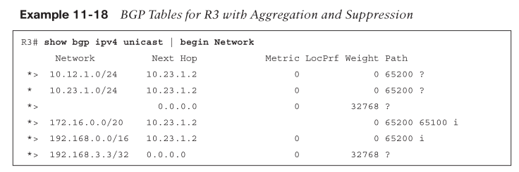

### auto-aggregate

* this attribute indicates that a loss of path information has occurred

```
R2# show running-config | section router bgp
router bgp 65200
    no bgp default ipv4-unicast
    neighbor 10.12.1.1 remote-as 65100
    neighbor 10.23.1.3 remote-as 65300
    address-family ipv4
        aggregate-address 192.168.0.0 255.255.0.0 summary-only
        aggregate-address 172.16.0.0 255.255.240.0 summary-only
        redistribute connected
        neighbor 10.12.1.1 activate
        neighbor 10.23.1.3 activate
```

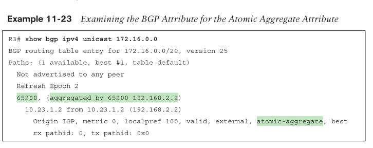

### aggregation with `AS_SET`

* to keep the BGP path information history
* the summary route, BGP path information from the component routes is copied over. 
* The AS_Path settings from the original component routes are stored in the AS_SET portion of the AS_Path.

```
R2# show running-config | section router bgp
router bgp 65200
    no bgp default ipv4-unicast
    neighbor 10.12.1.1 remote-as 65100
    neighbor 10.23.1.3 remote-as 65300
    address-family ipv4
        aggregate-address 192.168.0.0 255.255.0.0 as-set summary-only
        aggregate-address 172.16.0.0 255.255.240.0 as-set summary-only
        redistribute connected
        neighbor 10.12.1.1 activate
        neighbor 10.23.1.3 activate
```
* R2
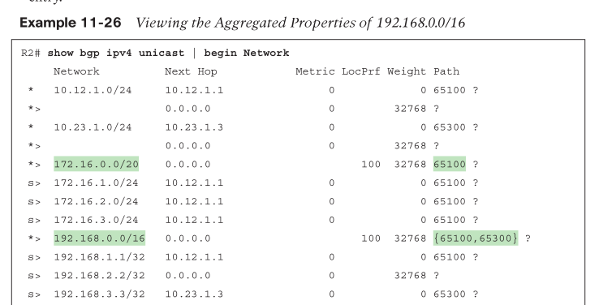
  * `s>` means route is suppressed, not advertising

* R3
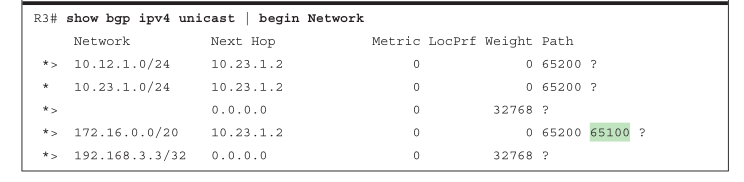
  * 192.168.0.0/16 is missing because AS_SET from R2 including R3's ASN
  > R2 is summarizing all of the loopback networks from R1 (AS 65100), R2 (AS 65200), and R3 (AS 65300). And now that R2 is copying all component routes’ BGP path attributes into the AS_SET information,

## MP-BGP for IPv6

* IPv4 unicast: AFI: 1, SAFI: 1
* IPv6 unicast: AFI: 2, SAFI: 1
* MP also applying to MPLS

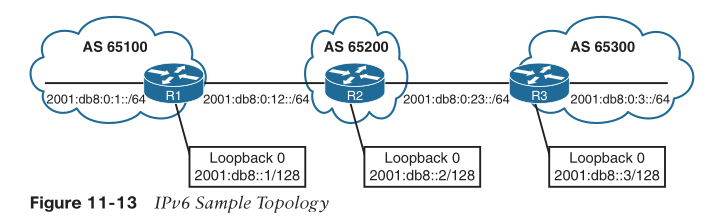

* config
```
R2
router bgp 65200
    bgp router-id 192.168.2.2
    no bgp default ipv4-unicast
    neighbor 2001:DB8:0:12::1 remote-as 65100
    neighbor 2001:DB8:0:23::3 remote-as 65300
    !
    address-family ipv6
        neighbor 2001:DB8:0:12::1 activate
        neighbor 2001:DB8:0:23::3 activate
        network 2001:DB8::2/128
        network 2001:DB8:0:12::/64
        network 2001:DB8:0:23::/64
```

* verifying peering
  * `show bgp ipv6 unicast neighbors <ip-address> [detail]`
* verifying routes
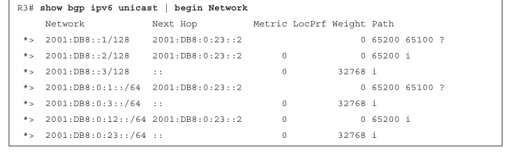
* verifying global RIB
  * `show ipv6 route bgp | begin Application`
* address aggregation
  * same as IPv4

# Advanced

## BGP Multihoming

* multihoming by
  * dual circuits to same router in same ISP
  * dual circuits to different router in same ISP
  * dual circuits to different ISPs
  * different router to different ISPs
* avoid to be transit for ISPs -> transit routing
  * only advertise your own local routes / LAN-facing routes instead of WAN-learned routes

> Transit routing at the data center or other planned locations is normal in enterprise designs because they have accounted for the bandwidth. Typically, this is done when some branches are available only with one SP, and the other branches connect with a different SP.

## Conditional Matching

### access control lists (ACLs)

* applicable to not only data packets, but also routes
* access control entries (ACEs)
* start from top (lowest sequence), proceeds down (higher)
  * no match with any ACEs -> deny
* action: permit / deny
  * if no match statement, then permit
* standard ACL
  * solely based on source IP
  * 1-99, 1300-1999, or named ACL
  * `ip access-list standard {<acl-number> | <acl-name>}`
  * `[sequence] {permit | deny } <source> <source-wildcard>`
  * `any` = `0.0.0.0 255.255.255.255`
  * `host` = a /32 IP address and source-wildcard can be omitted.
* extended ACL
  * based on src / dst IP / port, protocol, etc
  * 100-199, 2000-2699, or named ACL
  * `ip access-list extended {<acl-number> | <acl-name>}`
  * `[sequence] {permit | deny} <protocol> <source> <source-wildcard> <destination> <destination-wildcard>`
* Extended ACLs react **differently** when matching BGP routes than when matching IGP routes.
  * `<destination> <destination-wildcard>` will match netmask instead of dest. IP

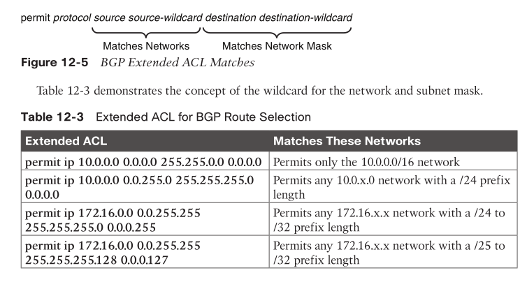

### prefix lists

* Many network engineers prefer this over the ACL network selection method.
* a high-order bit pattern and a high-order bit count
* matching length parameters

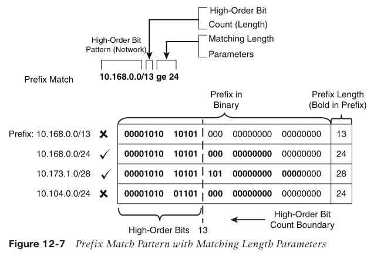

* `ip/ipv6 prefix-list <prefix-list-name> [seq <sequence-number>] {permit | deny} <high-order-bit-pattern/high-order-bit-count> [ge <ge-value>] [le <le-value>]`

```
ip prefix-list RFC1918 seq 5 permit 192.168.0.0/16 ge 32
ip prefix-list RFC1918 seq 10 deny 0.0.0.0/0 ge 32
ip prefix-list RFC1918 seq 15 permit 10.0.0.0/8 le 32
ip prefix-list RFC1918 seq 20 permit 172.16.0.0/12 le 32
ip prefix-list RFC1918 seq 25 permit 192.168.0.0/16 le 32

! ensure that only /32 prefixes exist in the 192.168.0.0 network in the prefix list

ipv6 prefix-list PRIVATE-IPV6 seq 5 permit 2001:2::/48 le 128
ipv6 prefix-list PRIVATE-IPV6 seq 10 permit 2001:db8::/32 le 128
```

* Sequencing enables the deletion of a specific entry
* prefix lists cannot be resequenced

### AS path ACLs

* use regular expressions (regex)
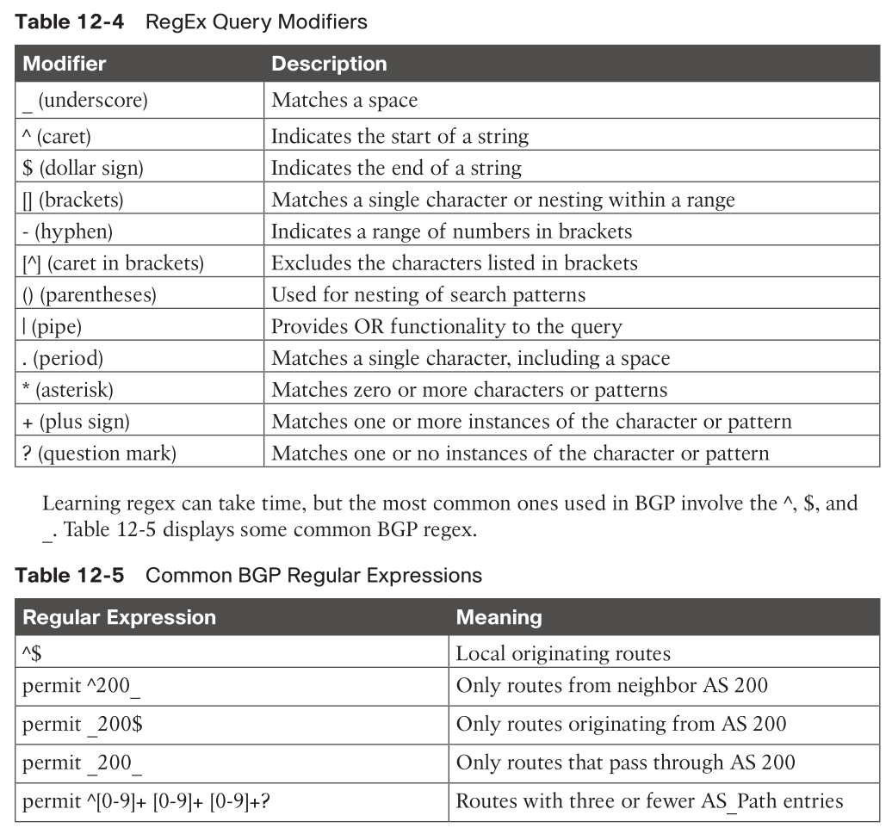

`ip as-path access-list 1 permit ^$`

## Route Maps

* modifying a unique routing policy on a neighbor-by-neighbor basis.

### four components

* Sequence number
* Conditional matching criteria: Identifies prefix (the prefix itself, BGP path attribute, next hop, etc.).
* Processing action: default is Permit
* Optional action
* `route-map <route-map-name> [permit | deny] [<sequence-number>]`

### Rules

* If a processing action is not provided, the default value permit is used.
* If a sequence number is not provided, the sequence number is incremented by 10 automatically.
* If a matching statement is not included, an implied match all prefixes is associated with the statement.
* Processing within a route map stops after all optional actions have processed (if configured) after matching a conditional matching criterion.
* An **implicit deny** or drop is associated for prefixes that are not associated with a permit action.

### example
```
route-map EXAMPLE permit 10
    match ip address ACL-ONE
! Prefixes that match ACL-ONE are permitted. Route-map completes processing
! upon a match
route-map EXAMPLE deny 20
    match ip address ACL-TWO
! Prefixes that match ACL-TWO are denied. Route-map completes processing upon
! a match
route-map EXAMPLE permit 30
    match ip address ACL-THREE
    set metric 20
! Prefixes that match ACL-THREE are permitted and their metric is modified.
! Route-map completes processing upon a match
route-map EXAMPLE permit 40
! Because matching criteria were not specified, all other prefixes are permitted
! If this sequence was not configured, all other prefixes would drop because of the
! implicit deny with route-maps
```

### match conditions

| match Command | Description |
|---|---|
| match as-path _acl-number_ | Selects prefixes based on a regex query to isolate the ASN in the BGP path attribute (PA) AS path. The AS path ACLs are numbered 1 to 500. |
| match ip address {_acl-number_ \| _acl-name_} | Selects prefixes based on network selection criteria defined in the ACL. This command allows for multiple match variables. |
| match ip address prefix-list _prefix-list-name_ | Selects prefixes based on prefix selection criteria. This command allows for multiple match variables. |
| match local-preference _local-preference_ | Selects prefixes based on the BGP attribute local preference. |
| match metric {_1-4294967295_ \| external _1-4294967295_} [+- _deviation_] | Selects prefixes based on a metric that can be exact, a range, or within an acceptable deviation. |
| match tag _tag-value_ | Selects prefixes based on a numeric tag (0 to 4294967295) that was set by another router.|
| match community {_1-500_ \| _community-list-name_ [exact]} | Selects prefixes based on a community list ACL. The community list ACLs are numbered 1 to 500. |

* most command allows for multiple match variables, except match metric
* for multiple variables (ACLs, prefix list, tag, etc.), it is OR op
* for a particular sequence, if multiple matches, it is AND op

### what if ACL has a `deny`?

* Matching a `deny` statement in the conditional match criteria excludes the route from that sequence in the route map.

```
ip access-list standard ACL-ONE
    deny 172.16.1.0 0.0.0.255
    permit 172.16.0.0 0.0.255.255

route-map EXAMPLE permit 10
    match ip address ACL-ONE
!
route-map EXAMPLE deny 20
    match ip address ACL-ONE
!
route-map EXAMPLE permit 30
    set metric 20
```

* `172.16.1.0/24` will reach seq 30
  * it's denied in ACL, means it's not part of seq 10 matching
* `172.16.2.0/24` will reach seq 10

### optional actions

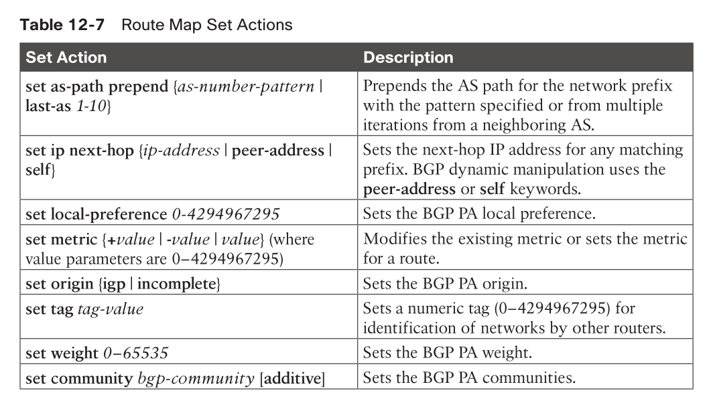

### `continue`

* allows the route map to continue processing other route map sequences.
* not commonly used because it adds complexity to troubleshooting

## BGP Route Filtering and Manipulation

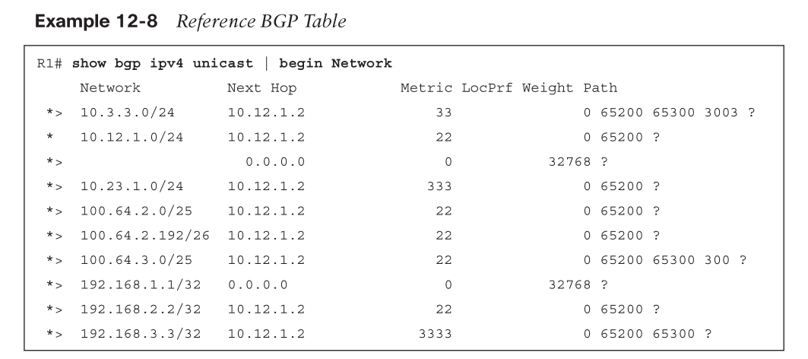

### Distribute list

* Distribute lists perform route filtering on a neighbor-by-neighbor basis, using standard or extended ACLs.

```
R1#
ip access-list extended ACL-ALLOW
    permit ip 192.168.0.0 0.0.255.255 host 255.255.255.255
    permit ip 100.64.0.0 0.0.255.0 host 255.255.255.128
!
router bgp 65100
    neighbor 10.12.1.2 remote-as 65200
    address-family ipv4
        neighbor 10.12.1.2 activate
        neighbor 10.12.1.2 distribute-list ACL-ALLOW in
```

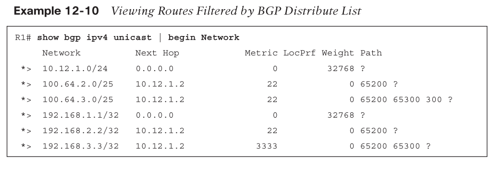

* note `100.64.2.192/26` route is rejected because the prefix length does not match the second `ACL-ALLOW` entry
  * 先非(mask)后与(target prefix) should be 0 -> match
  * `(NOT 255.255.255.128 =) 0.0.0.127 AND 100.62.2.192 = 0.0.0.32 != 0`

### Prefix list

* Prefix lists perform route filtering on a neighbor-by-neighbor basis, using a prefix list.

```
R1# configure terminal
Enter configuration commands, one per line. End with CNTL/Z.
R1(config)# ip prefix-list RFC1918 seq 5 permit 192.168.0.0/16 ge 32
R1(config)# ip prefix-list RFC1918 seq 10 deny 0.0.0.0/0 ge 32
R1(config)# ip prefix-list RFC1918 seq 15 permit 10.0.0.0/8 le 32
R1(config)# ip prefix-list RFC1918 seq 20 permit 172.16.0.0/12 le 32
R1(config)# ip prefix-list RFC1918 seq 25 permit 192.168.0.0/16 le 32
R1(config)# router bgp 65100
R1(config-router)# address-family ipv4 unicast
R1(config-router-af)# neighbor 10.12.1.2 prefix-list RFC1918 in
```

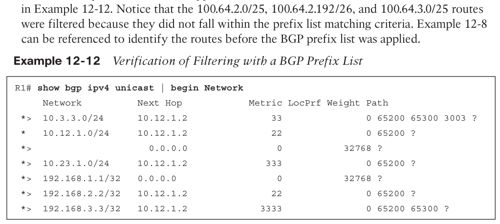

### AS path ACL/filtering

```
R2#
ip as-path access-list 1 permit ^$
!
router bgp 65200
    neighbor 10.12.1.1 remote-as 65100
    neighbor 10.23.1.3 remote-as 65300
    address-family ipv4 unicast
        neighbor 10.12.1.1 activate
        neighbor 10.23.1.3 activate
        neighbor 10.12.1.1 filter-list 1 out
        neighbor 10.23.1.3 filter-list 1 out
```

### Route maps

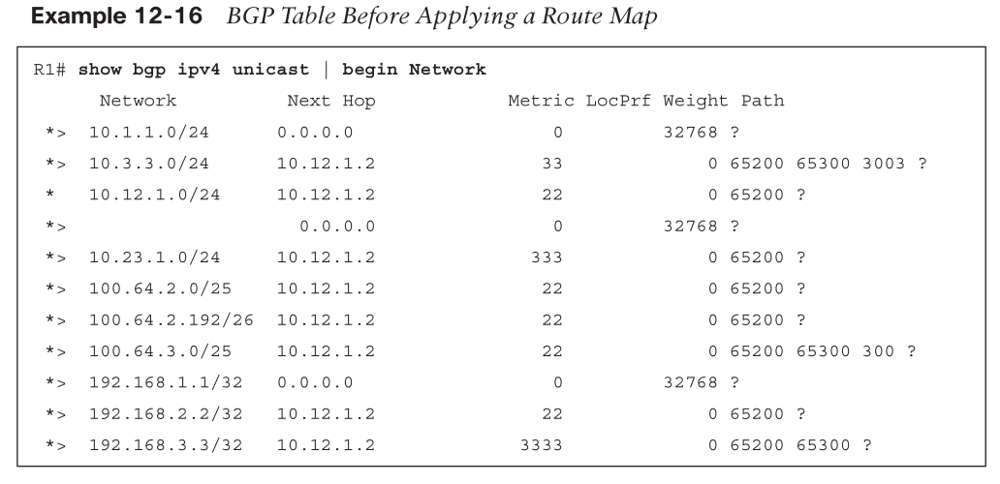

* design goal:
  1. Deny any routes that are in the 192.168.0.0/16 network range by using a prefix list.
  2. Match any routes originating from AS 65200 that are within the 100.64.0.0/10 network range and set the BGP local preference to 222.
  3. Match any routes originating from AS 65200 that did not match step 2 and set the BGP weight to 23456.
  4. Permit all other routes to process.

```
ip prefix-list FIRST-RFC1918 permit 192.168.0.0/16 le 32
ip as-path access-list 1 permit _65200$
ip prefix-list SECOND-CGNAT permit 100.64.0.0/10 le 32
!
route-map AS65200IN deny 10
    description Deny RFC1918 192.168.0.0/16 routes via Prefix List Matching
    match ip address prefix-list FIRST-RFC1918
!
route-map AS65200IN permit 20
    description Change local preference for AS65200 originated route in 100.64.x.x/10
    match ip address prefix-list SECOND-CGNAT
    match as-path 1
    set local-preference 222
!
route-map AS65200IN permit 30
    description Change the weight for AS65200 originated routes
    match as-path 1
    set weight 23456
!
route-map AS65200IN permit 40
    description Permit all other routes un-modified
!
router bgp 65100
    neighbor 10.12.1.2 remote-as 65200
    address-family ipv4 unicast
        neighbor 10.12.1.2 activate
        neighbor 10.12.1.2 route-map AS65200IN in
```

### apply changes

* When a BGP policy changes, the BGP table must be processed again so that the neighbors can be notified accordingly.
* `clear ip bgp <peer ip-address> [soft]`
* `soft`:
  * invalidates the BGP cache
  * requests a full advertisement from its BGP peer.
  * `route refresh` capability
    * the peer re-advertises (refreshes) the prefixes to the requesting router, allowing for the inbound policy to process using the new policy changes.
    * negotiated when the session is established.
* per AFI-SAFI: `clear bgp afi safi {ip-address|*} soft [in | out]`

## BGP Communities

* tagging routes
* modifying BGP routing policy on upstream and downstream routers
* optional transitive
* 32 bits
  * two 16 bits number (ASN:TAG)
* RFC8092 extends to > 32b

### Well-Known Communities

* (0xFFFF:0x0) -> (0xFFFF:0xFFFF)
* Internet
  * routes should be advertised to the whole Internet
* No_Advertise
  * routes should not be advertised
* Local-AS
  * routes should not go to eBGP, but ok to BGP confederation
* No_Export
  * routes should not go to eBGP, but ok to iBGP

### Private Communities

* Private BGP communities follow a particular convention where the first 16 bits represent the AS of the community origination, and the second 16 bits represent a pattern defined by the originating AS. 
* A private BGP community pattern can vary from organization to organization, does not need to be registered, 
* can signify geographic locations for one AS while signifying a method of route advertisement in another AS. 
* Some organizations publish their private BGP community patterns on websites such as www.onesc.net/communities/.

### Enabling BGP Community

* by default, no BGP communities are advertised
* enable it: `neighbor ip-address send-community [standard | extended | both]`
* formatting: `ip bgp-community new-format`

### Match BGP Community

```
R1#
ip community-list 100 permit 333:333
!
route-map COMMUNITY-CHECK deny 10
    description Block Routes with Community 333:333 in it
    match community 100
route-map COMMUNITY-CHECK permit 20
    description Allow routes with either community in it
    set weight 111
!
router bgp 65100
    address-family ipv4 unicast
        neighbor 10.12.1.2 route-map COMMUNITY-CHECK in
```

### Set Private BGP Community

```
ip prefix-list PREFIX10.23.1.0 seq 5 permit 10.23.1.0/24
ip prefix-list PREFIX10.3.3.0 seq 5 permit 10.3.3.0/24
!
route-map SET-COMMUNITY permit 10
    match ip address prefix-list PREFIX10.23.1.0
    set community 10:23
route-map SET-COMMUNITY permit 20
    match ip address prefix-list PREFIX10.3.3.0
    set community 3:0 3:3 10:10 additive
route-map SET-COMMUNITY permit 30
!
router bgp 65100
    address-family ipv4
        neighbor 10.12.1.2 route-map SET-COMMUNITY in
```

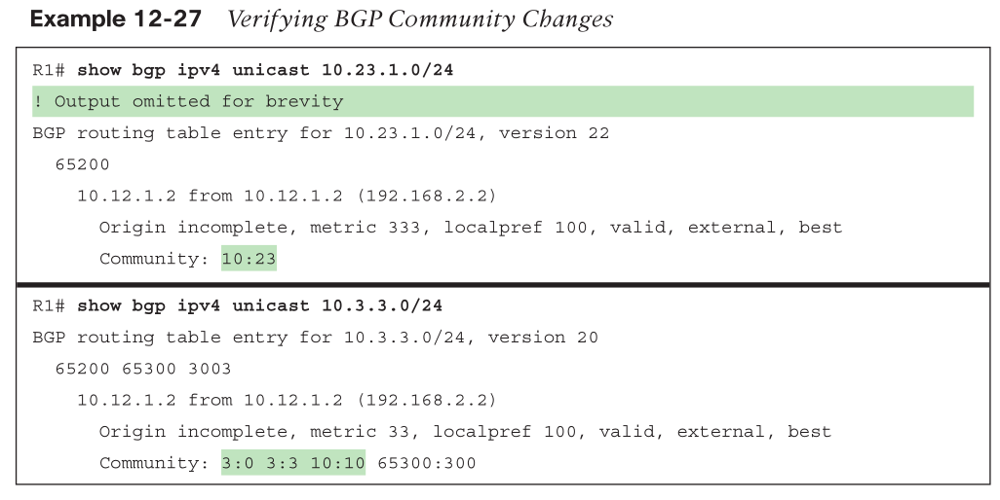

## Understanding BGP Path Selection

* `show bgp ipv4 unicast 172.16.0.0/24 best-path-reason`

### Order

1. Weight
   * Cisco-defined attribute
   * 16 bits
   * not advertised
   * higher weight wins
2. Local preference
   * advertised only to iBGP
   * default: 100
   * higher wins
3. Locally originated (network statement, redistribution, or aggregation)
4. AIGP
   * Accumulated Interior Gateway Protocol (AIGP) Metric
   * optional nontransitive
5. Shortest AS_Path
6. Origin type
   * IGP > EGP > incomplete
7. Lowest MED
   * influence inbound traffic coming from same AS
   * advertise received MED to iBGP only
   * BGP sets the MED automatically to the IGP path metric
8. eBGP over iBGP
   * eBGP > confederation eBGP > iBGP
   * hot-potato routing
9.  Lowest IGP metric to next hop
10. Prefer the path from the oldest eBGP session
11. Prefer the route that comes from the BGP peer with the lower RID
12. Prefer the route with the minimum cluster list length
13. Prefer the path that comes from the lowest neighbor address
