- [Basics](#basics)
- [Multicast Addressing](#multicast-addressing)
  - [Layer 2 Multicast Address](#layer-2-multicast-address)
    - [address overlapping](#address-overlapping)
- [Internet Group Management Protocol](#internet-group-management-protocol)
  - [IGMPv2](#igmpv2)
    - [3 Main Types](#3-main-types)
    - [Process](#process)
      - [Join](#join)
      - [leave](#leave)
      - [membership query/report](#membership-queryreport)
      - [router election](#router-election)
  - [IGMPv3](#igmpv3)
  - [IGMP Snooping](#igmp-snooping)
- [Protocol Independent Multicast](#protocol-independent-multicast)
  - [Source Trees](#source-trees)
  - [Shared Trees](#shared-trees)
  - [Terminology](#terminology)
  - [PIM operating mode](#pim-operating-mode)
  - [PIM Comm.](#pim-comm)
  - [PIM Dense Mode](#pim-dense-mode)
  - [PIM Sparse Mode](#pim-sparse-mode)
    - [overview](#overview)
    - [key steps](#key-steps)
  - [Designated Router](#designated-router)
  - [RPF Forwarding](#rpf-forwarding)
  - [PIM Forwarder](#pim-forwarder)
- [Rendezvous Points](#rendezvous-points)
  - [Static RP](#static-rp)
  - [Auto-RP](#auto-rp)
    - [Candidate RPs (C-RPs)](#candidate-rps-c-rps)
    - [RP Mapping Agents (MA)](#rp-mapping-agents-ma)
  - [PIM BSR](#pim-bsr)

# Basics

* Unicast (one-to-one)
* Broadcast (one-to-all)
* Multicast (one-to-many)
* Multicast relies on 
  * Internet Group Management Protocol (IGMP) for its operation in Layer 2
  * Protocol Independent Multicast (PIM) for its operation in Layer 3

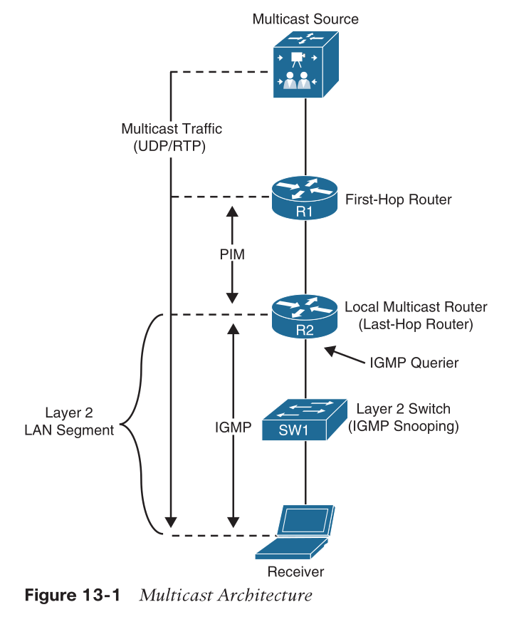

* multicast distribution tree (MDT)
  * The data packets are known as a _stream_ that uses a special destination IP address, known as a _group address_.
* Common applications
  * Cisco TelePresence
  * real-time video, IPTV
  * stock tickers 
  * video/audio conferencing
  * gaming
  * etc.

# Multicast Addressing

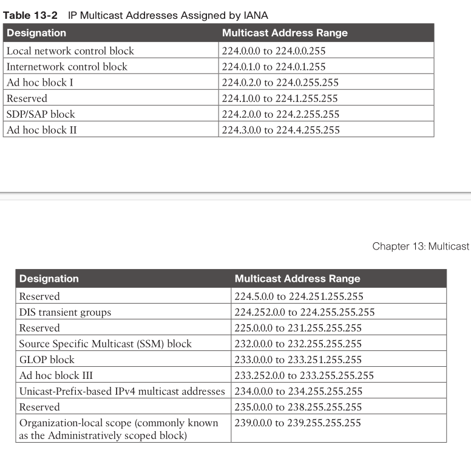

* Local network control block (224.0.0.0/24): protocol control traffic, not forwarded outside of a broadcast domain.
  * all hosts in this subnet (224.0.0.1)
  * all routers in this subnet (224.0.0.2)
  * all PIM routers (224.0.0.13)
* Internetwork control block (224.0.1.0/24): protocol control traffic, may be forwarded through the Internet.
  * Network Time Protocol (NTP) (224.0.1.1)
  * Cisco-RP-Announce (224.0.1.39)
  * Cisco-RP-Discovery (224.0.1.40)
* Source Specific Multicast (SSM) block (232.0.0.0/8)
  * SSM is a PIM extension (RFC 4607)
  * SSM forwards traffic to receivers from only those multicast sources for which the receivers have explicitly expressed interest.
* GLOP block (233.0.0.0/8): globally scoped statically assigned addresses. 
  * mapping the domain’s ASN, expressed in octets as X.Y, into the middle two octets of the GLOP block, yielding an assignment of 233.X.Y.0/24 (RFC 3180)
  * Domains with a 32-bit ASN may apply for space in ad-hoc block III or can consider using IPv6 multicast addresses.
* Organization-Local Scope (239.0.0.0/8):
  * RFC 2365, multicast version of RFC1918

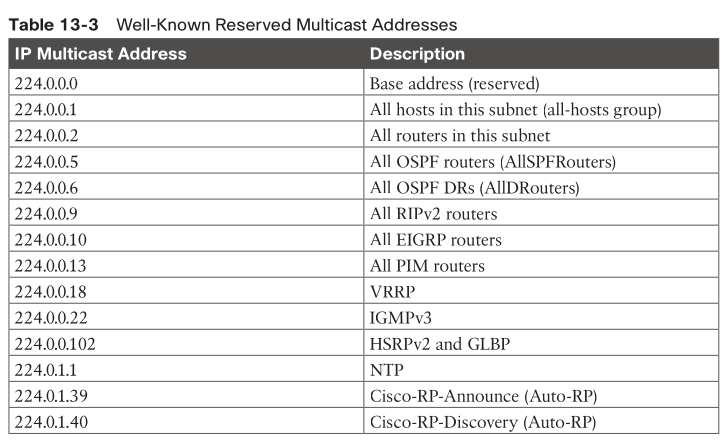

## Layer 2 Multicast Address

* Every multicast group address (IP address) is mapped to a special MAC address
* 01:00:5E:xx:xx:xx (b0 -> b47)
  * the 7th bit: individual/group bit (I/G) bit
    * 1: multicast
  * the 25th bit: 
    * always 0 for multicast
* __The receiver reprograms its NIC to accept the multicast MAC group address__

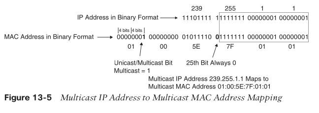

### address overlapping

* b/c only part of multicast IP addr mapped to MAC, overlapping may occur
  * multicast IP, its first 4 bits are fixed: 1110
  * 23bits mapped to MAC
  * 32 - 5 - 23 = 5
  * 2^5=32 multicast IP may be overlapped

# Internet Group Management Protocol

* IGMPv2
  * RFC2236
* IGMPv3
  * add support to SSM (Source Specific Multicast)
  * backward compatible with v2 and v1

## IGMPv2

* like ICMP, it's over IP
* protocol: 2
* router alert option: set
* TTL: 1

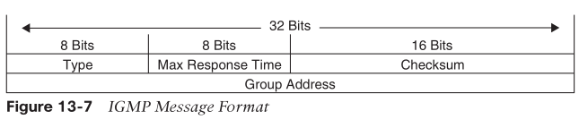

* max response time
  * set only in membership query message
  * default: 10s
  * the maximum allowed time before sending a responding report in units of 1/10 second.
  * like CSMA/CD, receiver randomly delays report, and not sending report if it hears someone already sent

### 3 Main Types

* Version 2 membership report (type value 0x16)
  * aka, IGMP join
  * or to respond to a local router’s membership query message.
* Version 2 leave group (type value 0x17)
  * used by receivers to indicate they want to leave.
* General membership query (type value 0x11)
  * periodically sent to the all-hosts 224.0.0.1
  * see whether there are any receivers. 
  * the group address field is set to 0.0.0.0.
* Group specific membership query (type value 0x11):
  * the group address field is the group address

### Process

#### Join

* receiver sends out IGMP join ->
* router got it, send out PIM join -> 
* router got stream and forward to receiver

#### leave

* receiver want to leave ->
  * if itself is the last receiver who responds the membership query
    * send out leave message
  * else
    * leave quietly, someone still in the group
* router got the leave message, send out group-specific membership query
  * if no one left
    * router remove IGMP state of that group

#### membership query/report

* router periodically send out membership query ->
* receiver(s) delay a bit, no more than max response time
  * if timer expires and no one send out report
    * send out membership report
  * else
    * pass

#### router election

* multiple router in the LAN
* routers send general membership query
  * src ip: router interface address
  * dst ip: 224.0.0.1
* lowest interface address wins
* elected router periodically (default 60s) send out general membership query message
  * "I'm still alive"
  * or new election will begin
  * default waiting time: 2x 60s

## IGMPv3

* receiver can specify which source it want to receive multicast stream
* new field in meembership query message
* new type: v3 membership report
* two modes:
  * include list: wanted sources
  * exclude list: not-wanted sources
    * empty exclude list: want any sources

## IGMP Snooping

* reduce flooding
  * receiver already reprogrammed its NIC with a multicast MAC address
  * switch not learned that multicast MAC, so it will flood multicast data packets to all ports
* switch maintains a table: <interface, multicast group>
  * learned that from IGMP joins
* switch only "flood" those interfaces which initially joined the group
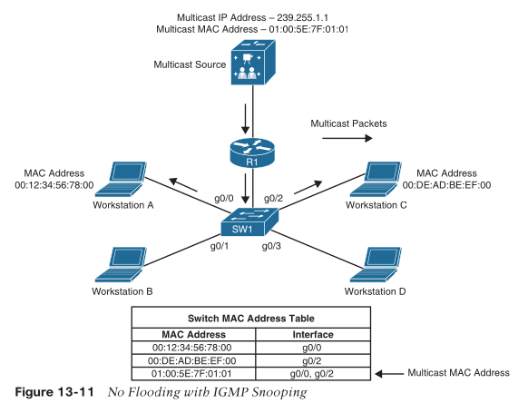

# Protocol Independent Multicast

* RFC4601
* Distribution Tree
  * Source Trees (Shortest Path Trees, SPT)
  * Shared Trees

## Source Trees

* (S,G)
  * server, group
* root at source

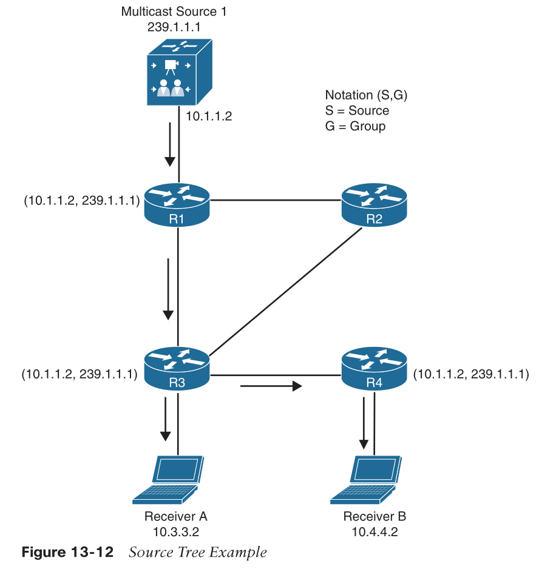

## Shared Trees

* Rendezvous Point Tree (RPT)
* root at rendezvous point, a designated router
* (*,G)
  * traffic routed based on G, regardless of S
  * fewer multicast routing entries
  * but receiver get traffic from all sources
  * and, it may be security risk that malicious source can also send to receivers

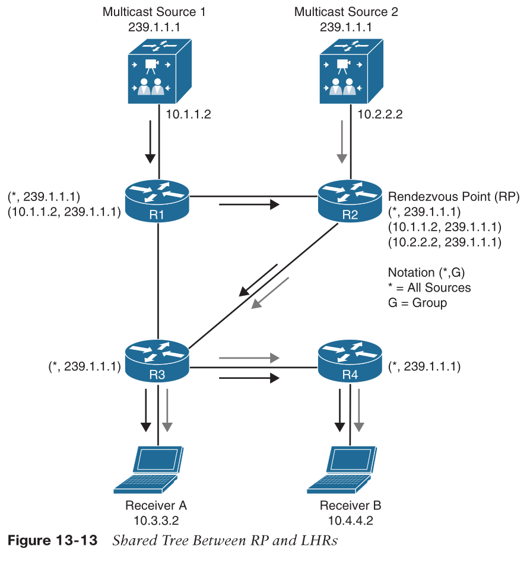

## Terminology

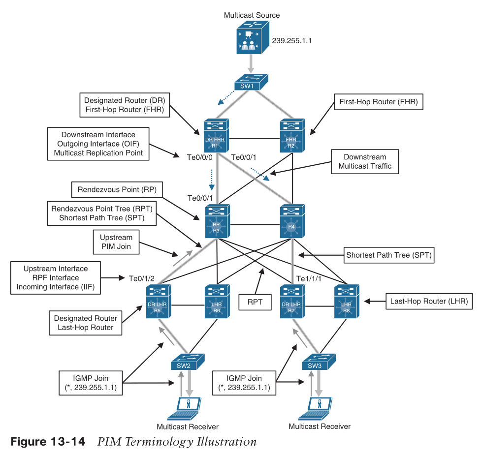

* Reverse Path Forwarding (RPF) interface
  * interface to Source or RP
  * uses the unicast routing table to decide RPF
    * based on AD and metric
  * highest interface address is tie-breaker
* RPF neighbor
  * PIM neighbor on the RPF interface
* upstream
  * toward source
  * upstream interface
    * RPF interface
    * IIF: incoming interface
* downstream
  * toward receiver
  * downstream interface
    * OIF: outgoing interface
    * OIL: outgoing interface list
* LHR
* FHR
* MRIB: multicast RIB
* MFIB: multicast FIB
* Multicast state / SPT state
  * in mroute table
  * __(S,G, IIF, OIL, ...)__

## PIM operating mode

* PIM Dense Mode (PIM-DM)
* PIM Sparse Mode (PIM-SM)
* PIM Sparse Dense Mode
  * dynamically determine which one to use
    * if RP is known, go PIM-SM
    * else go PIM-DM
* PIM Source Specific Multicast (PIM-SSM)
* PIM Bidirectional Mode (Bidir-PIM)
* ASM: any-source multicast = PIM-DM + PIM-SM

## PIM Comm.

* protocol: 103
* unicast
  * PIM register
  * PIM register stop
  * TTL > 1
* multicast
  * PIM Hello
  * 224.0.0.13
  * TTL = 1

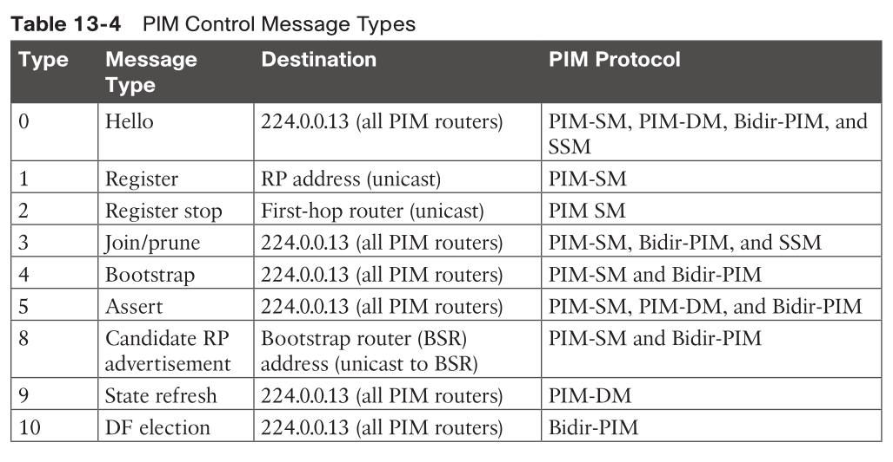

* Hello
  * every 30s
  * to 224.0.0.13
  * also elect designated router
* PIM Join
  * mrouter along the path adds a new OIF to OIL to mtable (S/*,G,IIF,OIL) 

## PIM Dense Mode

* when receivers are dense
  * assume every subnet has at least one receiver
* result in a SPT
  * but (S,G) remains on each router even after pruning
* flooding to all PIM-DM routers initially
* if a LHR found no downstream receiver, it sends prune message towards source
* if a router received multicast traffic via a non-RPF interface, it send out prune message via non-RPF interface
* prune expires every 3 minutes, result in reflooding
* applicable to small / non-production network

## PIM Sparse Mode

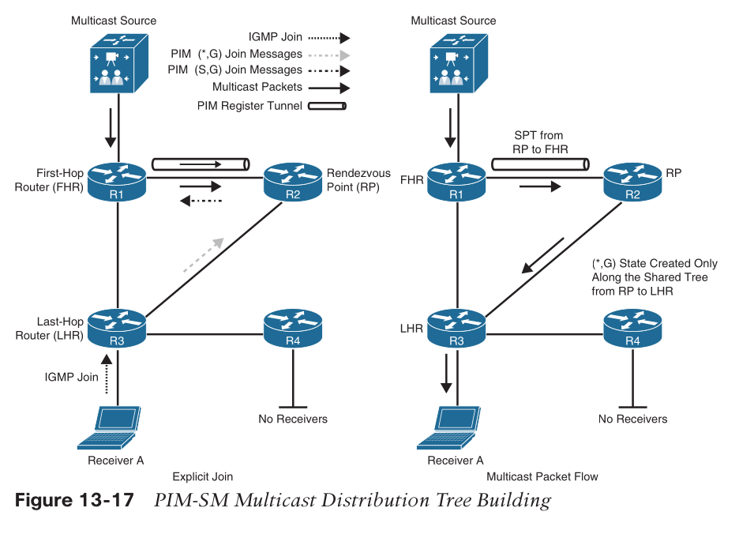

### overview

* a receiver sending an IGMP join to the LHR
* LHR sends a PIM join (*,G) to the RP
* RP sends a PIM join (S,G) to the FHR
* two trees are created at last
  * an SPT from the FHR to the RP (S,G)
  * a shared tree from the RP to the LHR (*,G)
* [JNCIS note on multicast operation](https://github.com/xleonzhao/JNCIS/blob/master/Multicast.md#multicast-operation-theory)

### key steps

* shared Tree Join / receiver arrives RP
  * LHR PIM join (*,G) to RP
* source registration / source arrives RP -> source/receiver meet
  * FHR PIM register to RP via RIM register tunnel
  * RP PIM Join (S,G) to FHR
  * multicast data arrives RP natively
  * RP PIM register-stop to FHR, tunnel remains up
  * multicast data from RP to LHR
* switchover from RPT to SPT
  * LHR PIM Join (S,G) towards source
  * multicast data arrives LHR
  * LHR PIM Prune to RP
  * PR may PIM Prune to FHR if no interested receiver left on RP
    * mrouter along the path removes OIF from mtable's OIL
    * source stop sending multicast data to RP
  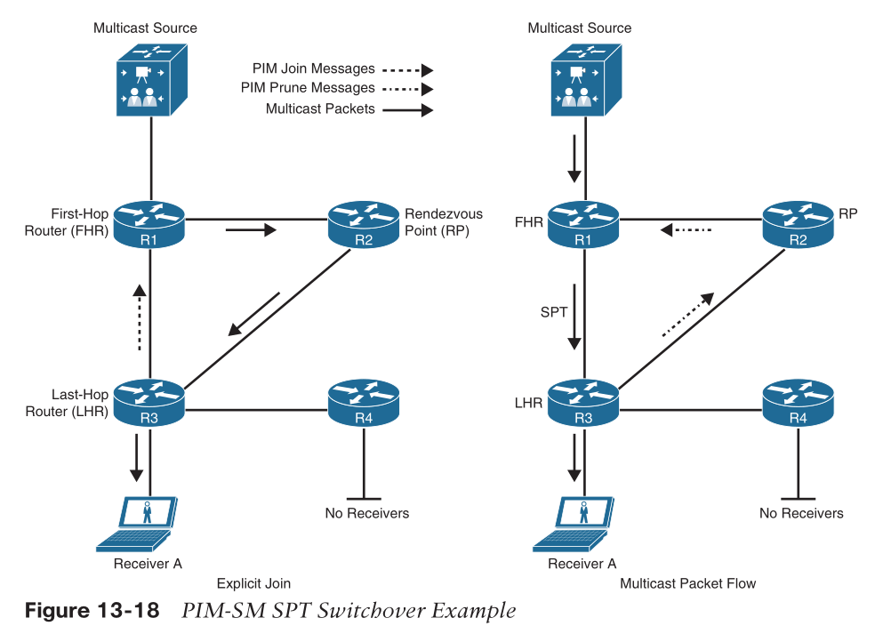

## Designated Router

* for LAN
  * we don't want multiple LHR/FHR do the same work
* via Hello messages
* highest IP wins
* can be configured over DR priority
  * default: 1
  * higher wins
* hold time: 3.5x Hello interval, 105s

## RPF Forwarding

* If a router receives a multicast packet on an interface it uses to send unicast packets to the source, the packet has arrived on the RPF interface.
* If the packet arrives on the RPF interface, a router forwards the packet out the interfaces present in the outgoing interface list (OIL) of a multicast routing table entry.
* If the packet does not arrive on the RPF interface, the packet is discarded to prevent loops.
* RPF check
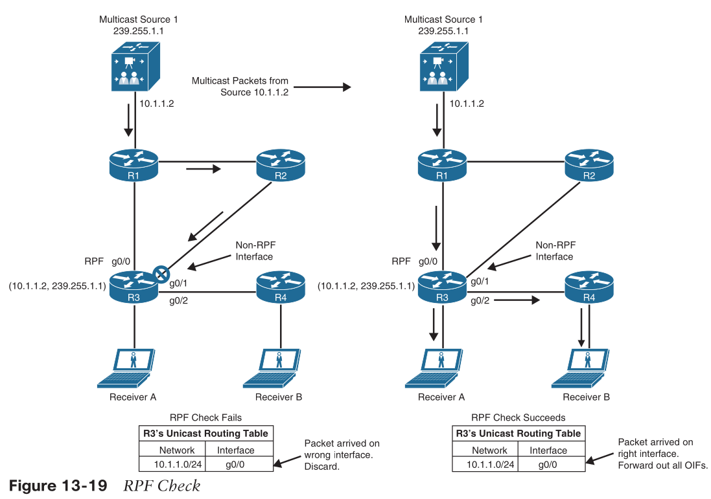

## PIM Forwarder

* occurs on LAN and mostly PIM-DM
  * PIM-SM may also do it, in some specific network topology/design
  * page 363 for reference
* when a LHR receives multicast data from OIF
  * trigger PIM assert mechanism
* PIM assert message sent to LAN
  * with AD and metric to source
  * lower AD then lower metric then highest IP wins
* losers remove OIF from its OIL
* after 3 minutes, reelect again

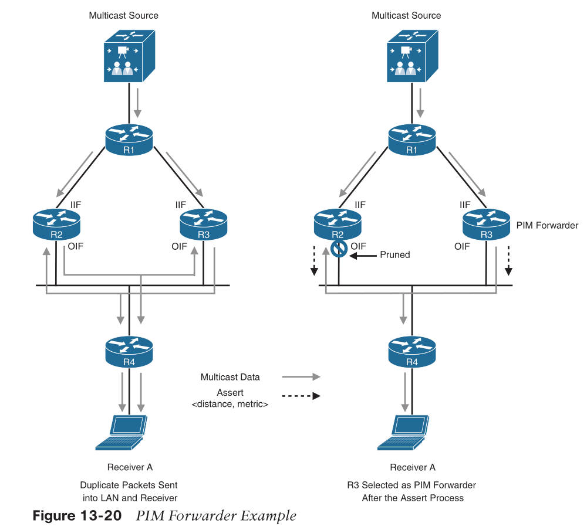

# Rendezvous Points

* rann.day.voo
* how to know who is RP?
  * static config
  * dynamic learning
    * Auto-RP
    * PIM bootstrap router (BSR)

## Static RP

* easy
* no failover

## Auto-RP

* Cisco proprietary
* distribution of group-to-RP mapping
  * load balancing
  * failover

### Candidate RPs (C-RPs)

* C-RP send RP announcement message
  * every 60s
  * to 224.0.1.39 (Cisco-RP-Announce)
  * including
    * group address
      * default group range: 224.0.0.0/4
      * or specific group
    * C-RP IP
    * hold time (=3x announcement interval, 3min)
* highest IP wins

### RP Mapping Agents (MA)

* joins 224.0.1.39 to listen
* maintain a table (group, RP, hold time)
* advertise the mapping to 224.0.1.40 (Cisco-RP-Discovery)
  * (group, elected RP)
  * every 60s
  * or change happens
* all PIM router joined 224.0.1.40
* multiple MA is ok, just couple more duplicate but identical mapping msg

## PIM BSR

* RFC5059
* not compatible with Auto-RP
* group-to-RP mapping
  * Multicast group range
  * RP priority
  * RP address
  * Hash mask length
  * SM/Bidir flag
* flooding to all PIM interfaces
  * to 224.0.0.13
  * TTL=1
* multiple BSR co-exist
  * election based on BSR priority
  * highest win
  * or highest IP win
* C-RPs unicast to BSR its group addresses: C-RP-Adv
* BSR sends all mapping to all PIM routers every 60s
  * no selection of best PP
  * leaves it to router
* each router runs the same hash algorithm to select RP