- [Basics](#basics)
- [Generic Routing Encapsulation (GRE) Tunnels](#generic-routing-encapsulation-gre-tunnels)
  - [config](#config)
  - [GRE works with IGP](#gre-works-with-igp)
    - [recursive routing](#recursive-routing)
- [IPsec Fundamentals](#ipsec-fundamentals)
  - [Basics](#basics-1)
    - [Authentication header (AH)](#authentication-header-ah)
    - [Encapsulating Security Payload (ESP)](#encapsulating-security-payload-esp)
      - [Two modes of transport](#two-modes-of-transport)
    - [Diffie-Hellman (DH)](#diffie-hellman-dh)
    - [Transform Sets](#transform-sets)
      - [HMAC](#hmac)
  - [Internet Key Exchange / IKEv1](#internet-key-exchange--ikev1)
    - [Phase 1 (Main Mode)](#phase-1-main-mode)
    - [Phase 1 (Aggressive mode)](#phase-1-aggressive-mode)
    - [Phase 2 (Quick Mode)](#phase-2-quick-mode)
  - [IKEv2](#ikev2)
  - [IPsec VPNs](#ipsec-vpns)
    - [Site-to-Site/LAN-to-LAN IPsec VPNs](#site-to-sitelan-to-lan-ipsec-vpns)
      - [Site-to-Site GRE over IPsec transport mode](#site-to-site-gre-over-ipsec-transport-mode)
        - [use crypto maps](#use-crypto-maps)
        - [use IPsec profile](#use-ipsec-profile)
        - [verify](#verify)
      - [Site-to-Site VTI over IPsec](#site-to-site-vti-over-ipsec)
        - [verify](#verify-1)
- [Cisco Locator/ID Separation Protocol (LISP)](#cisco-locatorid-separation-protocol-lisp)
  - [Basics](#basics-2)
    - [LISP routing architecture](#lisp-routing-architecture)
    - [LISP control plane protocol](#lisp-control-plane-protocol)
    - [LISP data plane protocol](#lisp-data-plane-protocol)
  - [LISP Operation](#lisp-operation)
    - [Map registration and map notify](#map-registration-and-map-notify)
    - [Map request and map reply](#map-request-and-map-reply)
    - [LISP data path](#lisp-data-path)
    - [Proxy ETR](#proxy-etr)
    - [Proxy ITR](#proxy-itr)
- [Virtual Extensible Local Area Network (VXLAN):](#virtual-extensible-local-area-network-vxlan)
  - [VTEPs (virtual tunnel endpoints)](#vteps-virtual-tunnel-endpoints)
  - [Protocols](#protocols)
  - [Cisco Software-Defined Access (SD-Access)](#cisco-software-defined-access-sd-access)

# Basics

* an overlay tunnel can be built on top of another overlay tunnel
  * e.g.: MPLS tunnel is tunneled via GRE to reach another AS, and GRE tunnel is tunneled over IPSec for security
    * MPLS over GRE over IPSec
* Different combinations of overlay tunneling and encryption technologies opened the door to next-generation overlay fabric networks such as:
  * Software-Defined WAN (SD-WAN)
  * Software-Defined Access (SD-Access)
  * Application Centric Infrastructure (ACI)
  * Cisco Virtual Topology System (VTS)

# Generic Routing Encapsulation (GRE) Tunnels

* originally created to provide transport for non-routable legacy protocols such as Internetwork Packet Exchange (IPX) across an IP network
* use cases
  * penetrating firewall/ACL
  * connect discontiguous networks
  * create VPNs
* over both IPv4 and IPv6

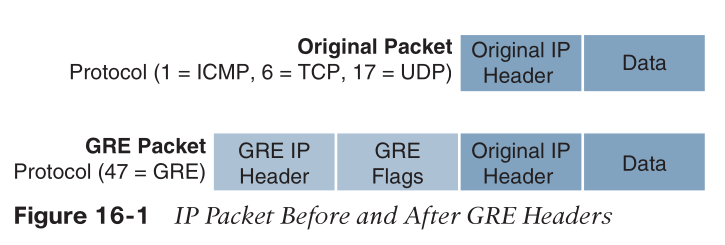
* GRE header: 24B

## config

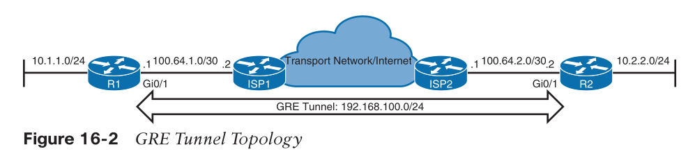

* GRE tunnel can act as an interface
  * use loopback IP for src/dst IP
  * the line protocol enters an up state when the router detects that a route to the tunnel destination exists in the routing table.

```
R1#
interface Tunnel100
    bandwidth 4000
    ip address 192.168.100.1 255.255.255.0
    ip mtu 1400
    keepalive 5 3
    tunnel source GigabitEthernet0/1
    tunnel destination 100.64.2.2
!
router ospf 1
    router-id 1.1.1.1
    network 10.1.1.1 0.0.0.0 area 1
    network 192.168.100.1 0.0.0.0 area 0
!
ip route 0.0.0.0 0.0.0.0 100.64.1.2

R2
interface Tunnel100
    bandwidth 4000
    ip address 192.168.100.2 255.255.255.0
    ip mtu 1400
    keepalive 5 3
    tunnel source GigabitEthernet0/1
    tunnel destination 100.64.1.1
!
router ospf 1
    router-id 2.2.2.2
    network 10.2.2.0 0.0.0.255 area 2
    network 192.168.100.2 0.0.0.0 area 0
!
ip route 0.0.0.0 0.0.0.0 100.64.2.1

R1# show interfaces tunnel 100 | include Tunnel.*is|Keepalive|Tunnel s|Tunnel p
    Tunnel100 is up, line protocol is up
    Keepalive set (5 sec), retries 3
    Tunnel source 100.64.1.1 (GigabitEthernet0/1), destination 100.64.2.2
    Tunnel protocol/transport GRE/IP
```

* optionally, define
  * _tunnel BW_ as reference bandwidth for IGP calculation
    * `bandwidth [1-10000000 in kbps]`
  * _keepalives_
    * `keepalive [seconds [retries]]`
    * default: 10s, retries: 3
  * _MTU_
    * `ip mtu mtu`

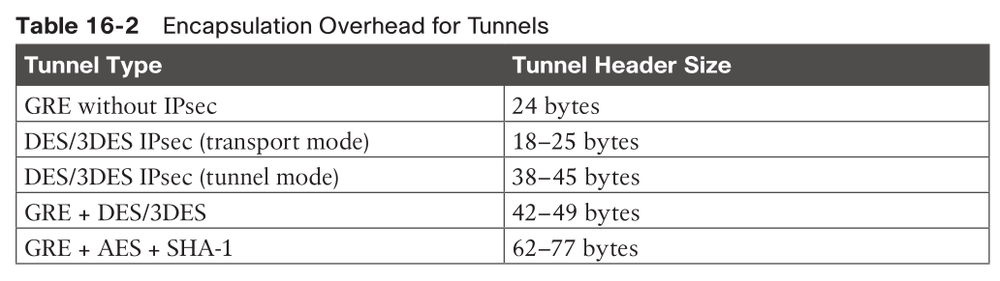

## GRE works with IGP

* tunnel interface acts as a virtual link across the underlay network

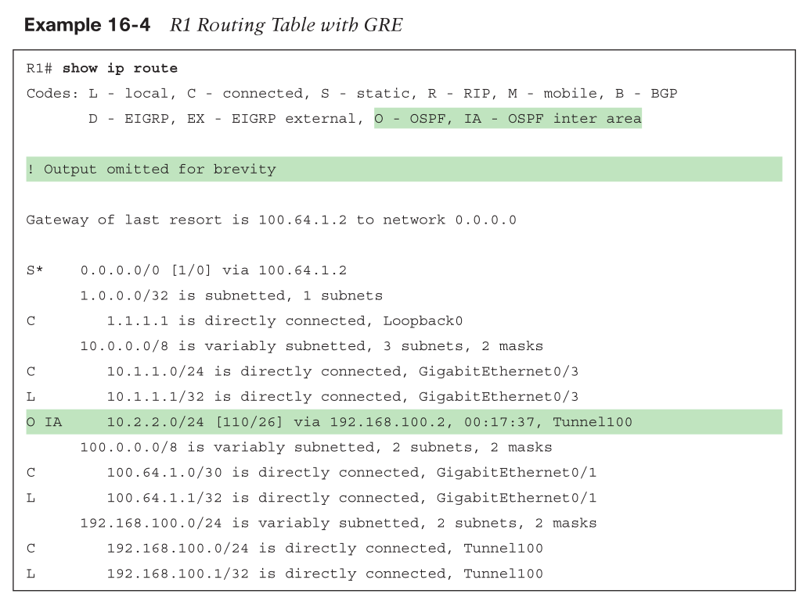

### recursive routing

* use the tunnel to reach the tunnel endpoint address
  * e.g.: R1 and R2 advertise 100.64/16, the internet-facing IP, to IGP
  * R1 GRE dst IP is 100.64.2.2
  * R1 routing table shows to reach 100.64.2.2, go GRE tunnel interface
* GRE tunnel endpoint interface/addressing / underlaying network interfaces/addressing should not be advertised via IGP

# IPsec Fundamentals

* security services
  * authentication
  * confidentiality
  * integrity
  * replay detection

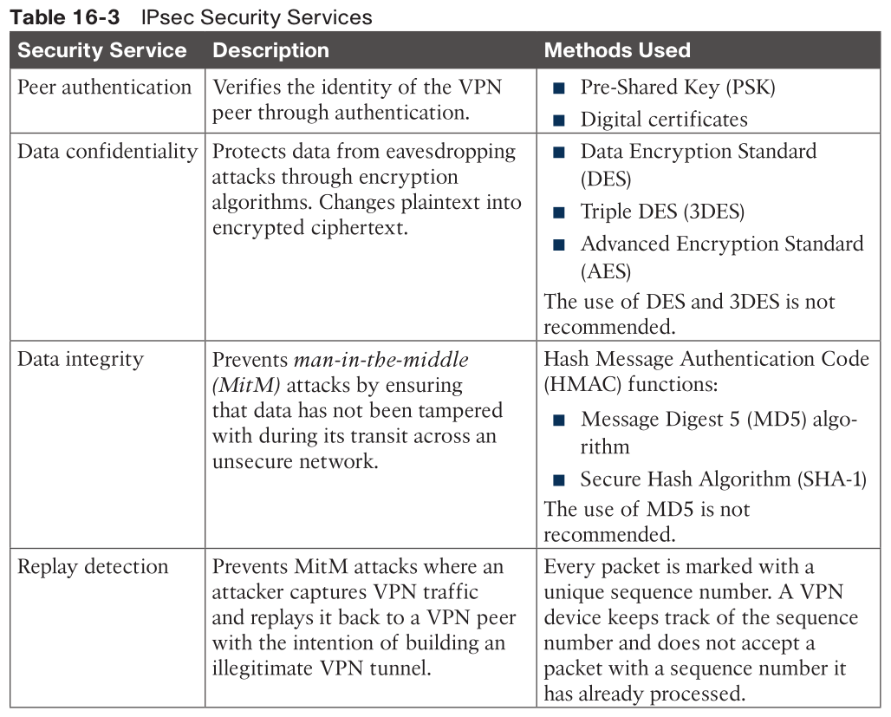

## Basics

### Authentication header (AH)

* protocol: 51
* no encryption/confidentiality
* no support NAT traversal
* its use is not recommended, unless authentication is all that is desired

### Encapsulating Security Payload (ESP)

* protocol: 50
* _payload_ is the portion of the original packet that is encapsulated within the IPsec headers
* support confidentiality and NAT traversal

#### Two modes of transport

* _Tunnel mode_: Encrypts the entire original packet and adds a new set of IPsec headers. These new headers are used to route the packet and also provide overlay functions.
* _Transport mode_: Encrypts and authenticates only the packet payload. This mode does not provide overlay functions and routes based on the original IP headers.

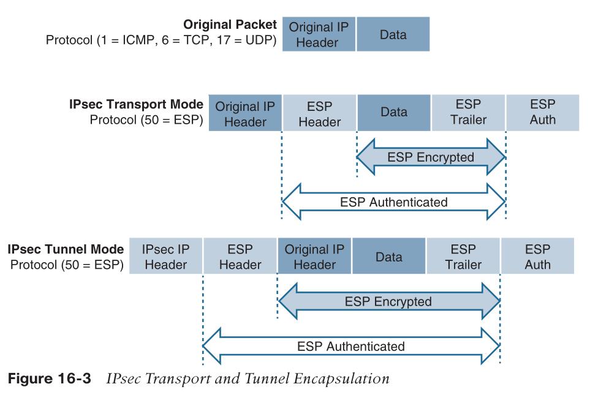

### Diffie-Hellman (DH)

* An asymmetric key exchange protocol that enables two peers to establish a shared secret key
  * Agree on a public key: Alice and Bob agree on a large prime number, \(p\), and a generator, \(g\).
  * Choose private keys: Alice chooses a secret integer, \(a\), as her private key. Bob chooses his own private key, \(b\).  
  * Calculate public keys: Alice calculates her public key as \(g^{a}\bmod p\). Bob calculates his public key in the same way.  
  * Compute the shared secret: Alice and Bob can both compute the same shared secret number by combining their private keys with the other party's public key. The shared secret is \(g^{ab}\bmod p\).  
  * Diffie-Hellman Key Agreement Method (RFC 2631)

* Cisco recommends avoiding DH groups 1, 2, and 5 and instead using DH groups 14 and higher.
  * group 1 uses 768 bits, group 2 uses 1024, and group 5 uses 1536

### Transform Sets

* a combination of security protocols and algorithms
  * e.g.: ah-sha256-hmac, esp-aes 256, esp-sha-hmac
* negotiated during IPSec security associations (SA) establishment

#### HMAC 

* Hash-based Message Authentication Code
* verify both the integrity and authenticity of a message
* uses a cryptographic hash function in combination with a secret key to produce a hash value
* requires a secret cryptographic key shared between the sender and the receiver a prior

## Internet Key Exchange / IKEv1

* RFC2409
* UDP port: 500
* Internet Security Association and Key Management Protocol (ISAKMP)
  * a framework for authentication and key exchange between two peers to establish, modify, and tear down SAs
* IKE is the implementation of ISAKMP using the Oakley and Skeme key exchange techniques. 
  * Oakley provides Perfect Forward Secrecy (PFS) for keys, identity protection, and authentication; 
    * PFS: a compromised key does not compromise future keys
  * Skeme provides anonymity, repudiability, and quick key refreshment.
* Two phases
  * phase 1: ISAKMP SA - Security Association Setup
    * bidrectional
    * Establishes a secure and authenticated communication channel between the two peers (devices). The key exchange in this phase allows the peers to securely authenticate each other and negotiate cryptographic parameters.
  * phase 2: IPsec SA - Data Protection Setup
    * unidirectional
    * Uses the secure channel established in Phase 1 to negotiate and establish the actual IPsec Security Associations (SAs) for encrypting the data traffic between the devices.

### Phase 1 (Main Mode)

* 6 messages exchanged
* Initial exchange
  * MM1: Initiator → Proposes algorithms, DH group, and nonce.
    * Hash algorithm
    * Encryption algorithm
    * Authentication algorithm
    * parameters
      * DH group #
      * lifetime
  * MM2: Responder → Accepts or rejects proposals and sends alternative.
* DH key exchange
  * MM3: Initiator → Sends its identity.
  * MM4: Responder → Sends its identity.
    * encryption key established
* Authentication
  * MM5: Initiator → Verifies the authentication (e.g., PSK or public-key).
  * MM6: Responder → Acknowledges authentication

### Phase 1 (Aggressive mode)

* 3 messages exchanged 
* AM1: In this message, the initiator sends all the information contained in MM1 through MM3 and MM5.
* AM2: This message sends all the same information contained in MM2, MM4, and MM6.
* AM3: This message sends the authentication that is contained in MM5.
* comparing to main mode: AM faster, fewer messages, but less secure, not as much identity protection.

### Phase 2 (Quick Mode) 

* 3 messages exchanged
* QM1: Initiator → Proposes IPsec parameters (encryption, integrity).
* QM2: Responder → Accepts or rejects proposals.
* QM3: Initiator → Acknowledges the final parameters.

## IKEv2

* communications consist of request and response pairs called exchanges and sometimes just called request/response pairs.
* IKE_SA_INIT (Initiator → Responder): Proposes algorithms and nonce, begins Diffie-Hellman exchange.
* IKE_SA_INIT Response (Responder → Initiator): Responds with chosen algorithms and nonce, sends public keys.
* IKE_AUTH (Initiator → Responder): Sends identity and authentication data (e.g., certificate or PSK).
* IKE_AUTH Response (Responder → Initiator): Responds with authentication and identity verification.
* CREATE_CHILD_SA (Initiator → Responder): Requests the creation of the IPsec tunnel.
* CREATE_CHILD_SA Response (Responder → Initiator): Responds with confirmation, IPsec tunnel established.

## IPsec VPNs

* Site-to-Site VPN
  * not scalable due to management overhead
* Cisco Dynamic Multipoint VPN (DMVPN)
  * hub-and-spoke
  * spoke-to-spoke
  * combining multipoint GRE (mGRE) tunnels, IPsec, and Next Hop Resolution Protocol (NHRP).
* Cisco Group Encrypted Transport VPN (GET VPN)
  * over private WAN or MPLS
  * encryption over private networks addresses regulatory-compliance guidelines
* Cisco FlexVPN
  * cisco's implementation of IKEv2
  * site-to-site, remote access, hub-to-spoke, spoke-to-spoke
* Remote VPN Access
  * for remote users to access corporate network

### Site-to-Site/LAN-to-LAN IPsec VPNs

* encrypt the traffic going over the GRE tunnel with IPsec
  * GRE tunnel has no security
* 3 modes
  * GRE over IPsec transport mode
  * GRE over IPsec tunnel model / IPsec over GRE
    * to avoid double encapsulation (from GRE and IPsec), choose transport mode.
  * IPsec tunnel mode with VTI (Virtual Tunnel Interface)
    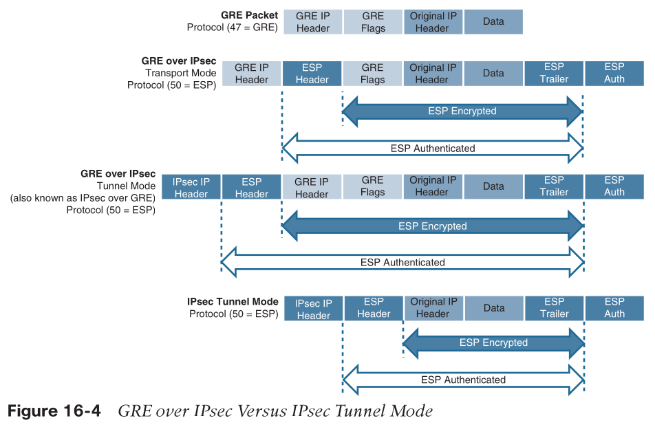

#### Site-to-Site GRE over IPsec transport mode

* 2 ways to encrypt traffic
  * use crypto maps
    * not recommended
      * Crypto maps cannot natively support the use of MPLS.
      * Configuration can become overly complex.
      * Crypto ACLs are commonly misconfigured.
      * Crypto ACL entries can consume excessive amounts of TCAM space.
    * but still widely used
  * use IPsec profiles

##### use crypto maps

```
R1#
! `crypto isakmp policy <priority>`
! priority: 1 highest
crypto isakmp policy 10
    ! `authentication group {rsa-sig | rsa-encr | pre-share}`
    ! - public keys (rsa-encr), digital certificates (rsa-sig), or PSK (pre-share)
    authentication pre-share
    hash sha256
    encryption aes
    ! 14: The 2048-bit DH group
    ! then incremental by 1024 for group 15 and 16
    group 14
!
! crypto isakmp key <keystring> address <peer-address> [mask]
! - keystring is the secret
! - 0.0.0.0 0.0.0.0 matches any
crypto isakmp key CISCO123 address 100.64.2.2
!
crypto ipsec transform-set AES_SHA esp-aes esp-sha-hmac
    mode transport
!
!! crypto map conf
!! acl to classify VPN traffic which should be protected by IPsec
ip access-list extended GRE_IPSEC_VPN
    10 permit gre host 100.64.1.1 host 100.64.2.2
!
! crypto map <map-name> <seq-num> [ipsec-isakmp]
crypto map VPN 10 ipsec-isakmp
    match address GRE_IPSEC_VPN
    set transform-set AES_SHA
    set peer 100.64.2.2
!!
!
interface GigabitEthernet0/1
    ip address 100.64.1.1 255.255.255.252
    !! crypt map config
    !! under physical interface, not tunnel interface
    crypto map VPN
    !!
!
interface Tunnel100
    bandwidth 4000
    ip address 192.168.100.1 255.255.255.0
    ip mtu 1400
    tunnel source GigabitEthernet0/1
    tunnel destination 100.64.2.2
!
router ospf 1
    router-id 1.1.1.1
    network 10.1.1.1 0.0.0.0 area 1
    network 192.168.100.1 0.0.0.0 area 0
```

##### use IPsec profile

```
R2#
!
crypto isakmp policy 10
    authentication pre-share
    hash sha256
    encryption aes
    group 14
!
crypto isakmp key CISCO123 address 100.64.1.1
!
crypto ipsec transform-set AES_SHA esp-aes esp-sha-hmac
    mode transport
!
!! IPsec profile config
crypto ipsec profile IPSEC_PROFILE
    set transform-set AES_SHA
!!
!
interface GigabitEthernet0/1
    ip address 100.64.2.2 255.255.255.252
interface Tunnel100
    bandwidth 4000
    ip address 192.168.100.2 255.255.255.0
    ip mtu 1400
    tunnel source GigabitEthernet0/1
    tunnel destination 100.64.1.1
    !! IPsec profile config
    tunnel protection ipsec profile IPSEC_PROFILE
    !!
!
router ospf 1
    router-id 2.2.2.2
    network 10.2.2.0 0.0.0.255 area 2
    network 192.168.100.2 0.0.0.0 area 0
```

##### verify

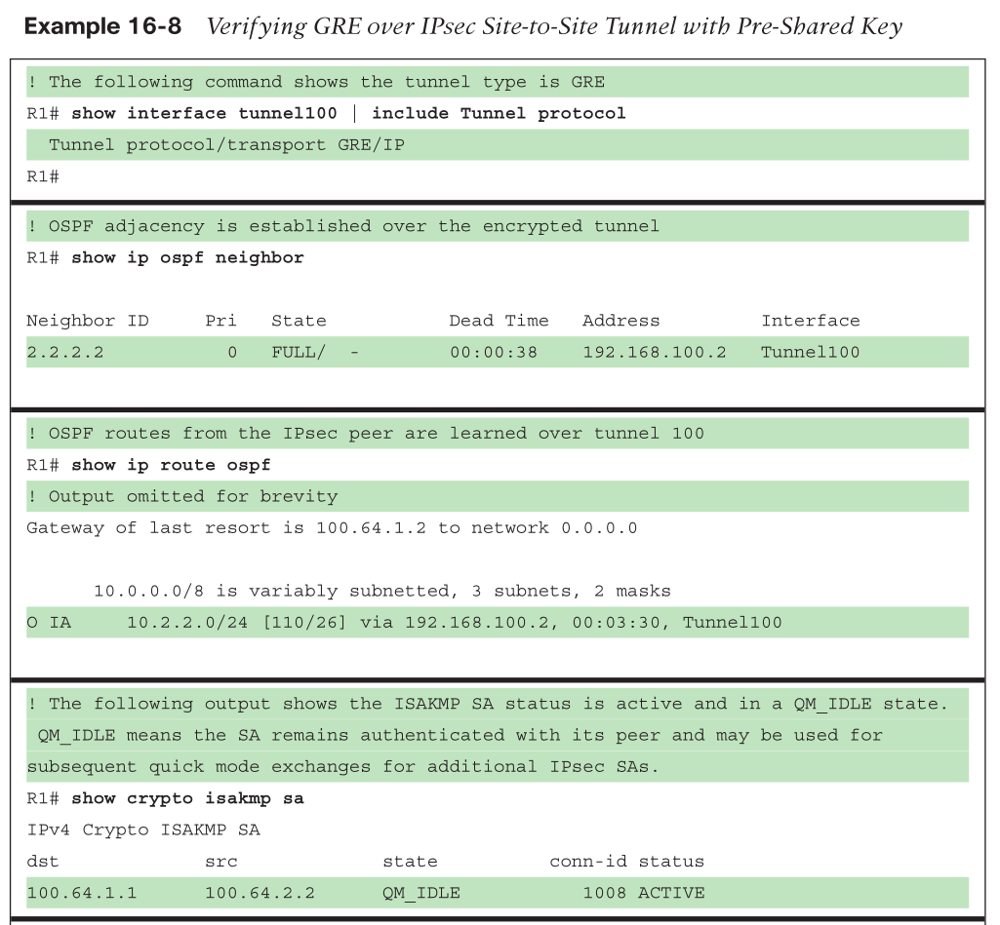

```
! The following command displays information about the IPsec SA
R1# show crypto ipsec sa
! Output omitted for brevity
! pkts encaps shows the number of outgoing packets that have been encapsulated
! pkts encrypt shows the number of outgoing packets that have been decrypted
! pkts decaps shows the number of incoming packets that have been decapsulated
! pkts decrypt shows the number of incoming packets that have been decrypted
#pkts encaps: 40, #pkts encrypt: 40, #pkts digest: 40
#pkts decaps: 38, #pkts decrypt: 38, #pkts verify: 38
..
! The following output shows there is an IPsec SA established with 100.64.2.2
local crypto endpt.: 100.64.1.1, remote crypto endpt.: 100.64.2.2
..
! The following output shows the IPsec SA is active as well as the transform set 
! and the transport mode negotiated for both IPsec SAs
inbound esp sas:
    spi: 0x1A945CC1(445930689)
        transform: esp-aes esp-sha-hmac ,
        in use settings ={Transport, }
        ..
        Status: ACTIVE(ACTIVE)
outbound esp sas:
    spi: 0xDBE8D78F(3689469839)
        transform: esp-aes esp-sha-hmac ,
        in use settings ={Transport, }
        ..
        Status: ACTIVE(ACTIVE)
```

#### Site-to-Site VTI over IPsec

* similar to those for GRE over IPsec configuration using
IPsec profiles
* use `tunnel mode ipsec {ipv4 | ipv6}` under the tunnel interface

```
R1#
! VTI uses IPsec profiles, therefore, the crypto map
! needs to be removed from interface GigabitEthernet0/1
interface GigabitEthernet0/1
    no crypto map VPN
! Change transport mode to tunnel
crypto ipsec transform-set AES_SHA esp-aes esp-sha-hmac
    mode tunnel
! Configure IPsec profile
crypto ipsec profile IPSEC_PROFILE
    set transform-set AES_SHA
!
! Enable VTI on tunnel interface and apply IPSec profile
interface Tunnel100
    tunnel mode ipsec ipv4
    tunnel protection ipsec profile IPSEC_PROFILE

R2#
! Change transport mode to tunnel
crypto ipsec transform-set AES_SHA esp-aes esp-sha-hmac
    mode tunnel
! Enable VTI on tunnel interface
interface Tunnel100
    tunnel mode ipsec ipv4
```

##### verify

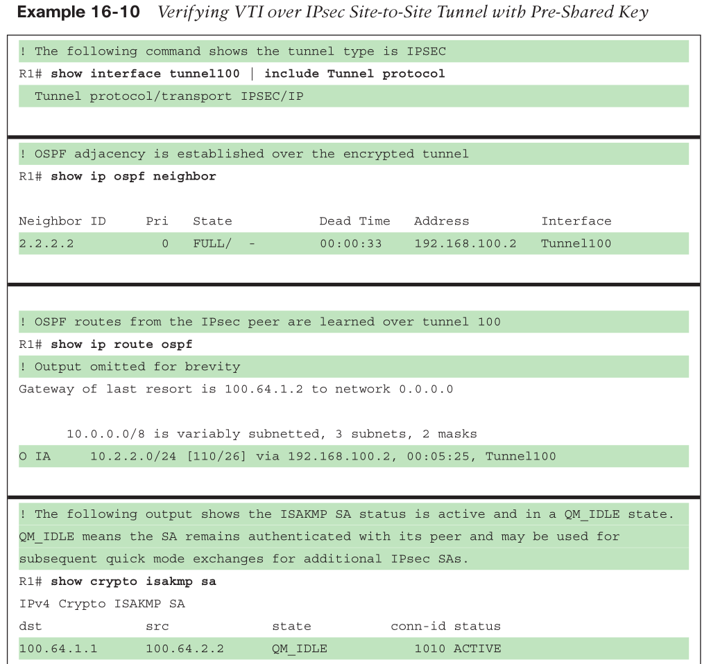

```
R1# show crypto ipsec sa
! Output omitted for brevity
! pkts encaps shows the number of outgoing packets that have been encapsulated
! pkts encrypt shows the number of outgoing packets that have been decrypted
! pkts decaps shows the number of incoming packets that have been decapsulated
! pkts decrypt shows the number of incoming packets that have been decrypted
#pkts encaps: 47, #pkts encrypt: 47, #pkts digest: 47
#pkts decaps: 46, #pkts decrypt: 46, #pkts verify: 46
..
! The following output shows there is an IPsec SA established with 100.64.2.2
local crypto endpt.: 100.64.1.1, remote crypto endpt.: 100.64.2.2
..
..
! The following output shows the IPsec SA is active as well as the transform
set and the transport mode negotiated for both IPsec SAs
inbound esp sas:
    spi: 0x8F599A4(150313380)
        transform: esp-aes esp-sha-hmac ,
        in use settings ={Tunnel, }
        ..
        Status: ACTIVE(ACTIVE)
outbound esp sas:
    spi: 0x249F3CA2(614415522)
        transform: esp-aes esp-sha-hmac ,
        in use settings ={Tunnel, }
        ..
        Status: ACTIVE(ACTIVE)
```

# Cisco Locator/ID Separation Protocol (LISP)

* to address routing scalability problems on the Internet, i.e., DFZ
  * also for data centers, campus nets, SD-Access, etc..
* big router needed for 
  * larger and larger Internet routing table
    * hard to aggregate provider independent routes
    * more specifics for traffic engineering
  * multi-homing w/o default routes
  * handle routing instability

## Basics

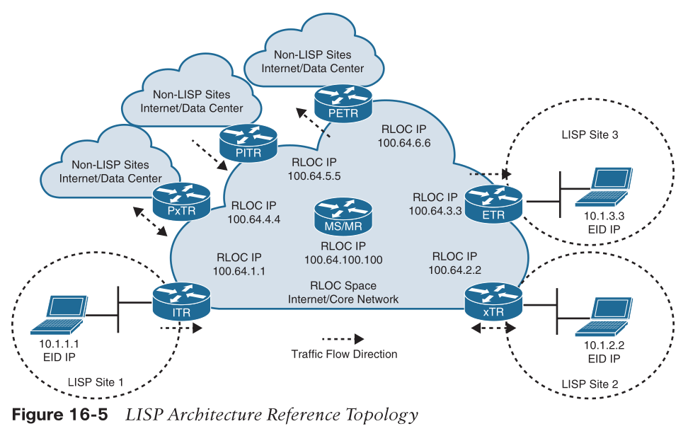

* Endpoint identifier (EID): An EID is the IP address of an endpoint within a LISP site.
* LISP site: This is the name of a site where LISP routers and EIDs reside.
* Ingress tunnel router (ITR): ITRs are LISP routers that LISP-encapsulate IP packets coming from EIDs that are destined outside the LISP site.
* Egress tunnel router (ETR): ETRs are LISP routers that de-encapsulate LISP- encapsulated IP packets coming from sites outside the LISP site and destined to EIDs within the LISP site.
* Tunnel router (xTR): xTR refers to routers that perform ITR and ETR functions (which are most routers).
* Proxy ITR (PITR): PITRs are just like ITRs but for non-LISP sites that send traffic to EID destinations.
* Proxy ETR (PETR): PETRs act just like ETRs but for EIDs that send traffic to destinations at non-LISP sites.
* Proxy xTR (PxTR): PxTR refers to a router that performs PITR and PETR functions.
* LISP router: A LISP router is a router that performs the functions of any or all of the following: ITR, ETR, PITR, and/or PETR.
* Routing locator (RLOC): An RLOC is an IPv4 or IPv6 address of an ETR that is Internet facing or network core facing.
* Map server (MS): This network device (typically a router) learns EID-to-prefix mapping entries from an ETR and stores them in a local EID-to-RLOC mapping database.
* Map resolver (MR): This network device (typically a router) receives LISP- encapsulated map requests from an ITR and finds the appropriate ETR to answer those requests by consulting the map server.
* Map server/map resolver (MS/MR): When MS and the MR functions are implemented on the same device, the device is referred to as an MS/MR.

### LISP routing architecture

* separates IP addresses into endpoint identifiers (EIDs) and routing locators (RLOCs). 
  * endpoints can roam from site to site, only changes RLOC.
* EIDs and RLOCs can be either IPv4 or IPv6

### LISP control plane protocol

* DNS-like
  * resolve an EID into an RLOC
* LISP router -> LISP mapping system: Where is EID 10.1.2.2?
* LISP mapping system -> LISP router: RLOC is 100.64.2.2

### LISP data plane protocol

* IPinIP/UDP encapsulation
  * outer IP
    * added by ITR
  * outer UDP header
    * added by ITR
    * src UDP: randomized for better ECMP load sharing
    * dst UDP: 4341
  * LISP shim header
    * for device-/path-level network virtualization
    * instance ID: like VRF/VPN ID for MPLS/L3VPN
      * 24b
  * inner header / original IP header

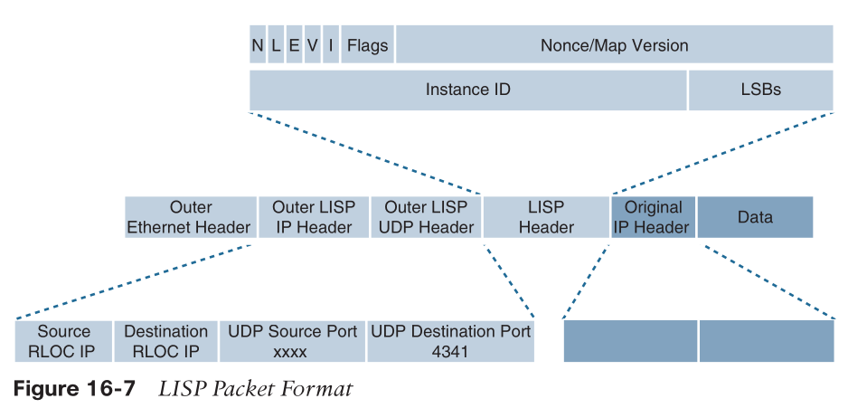

## LISP Operation

### Map registration and map notify

* ETR routers need to be configured with the EID prefixes within the LISP site 
* <EID, RLOC> will be registered with the MS
* MS sends a map notify message to the ETR to confirm
  * UDP port: 4342

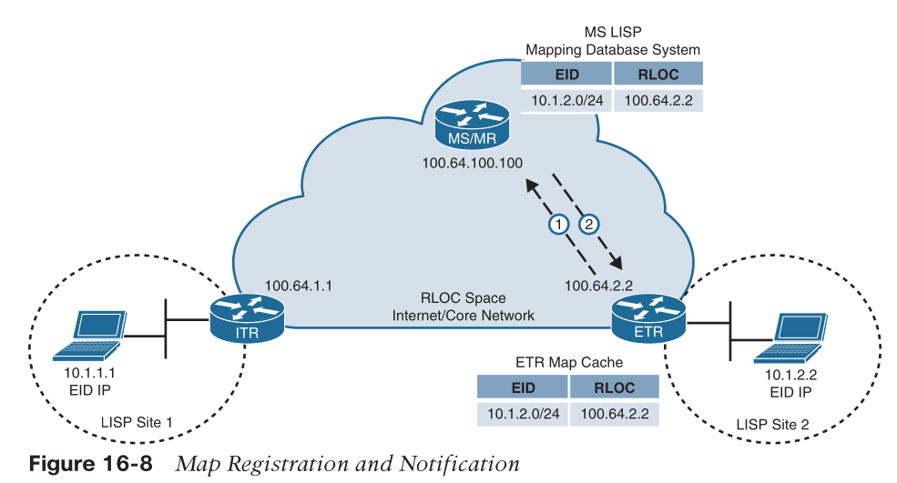

> An ETR by default responds to map request messages, but in a map register message it may request that the MS answer map requests on its behalf by setting the proxy map reply flag (P-bit) in the message.

### Map request and map reply

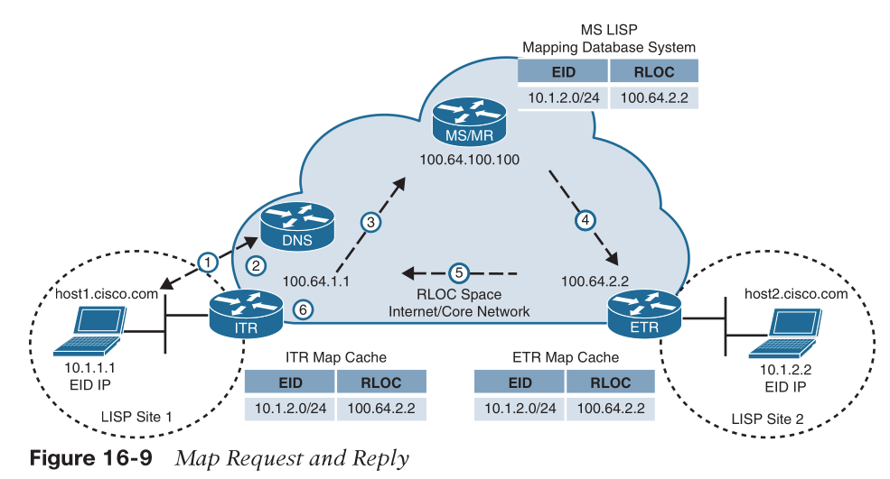

1. endpoint sends packets to ITR via IGP
2. ITR checks FIB, if no routes found, check local map cache against src IP
   * is src IP a registered EID?
3. ITR queries MR for dst IP
   * where is this EID?
   * dst. UDP: 4342
4. MR queries MS, then MS queries ETR
5. ETR replies to ITR
   * src UDP: 4342 
6. ITR caches reply, adds info to FIB

### LISP data path

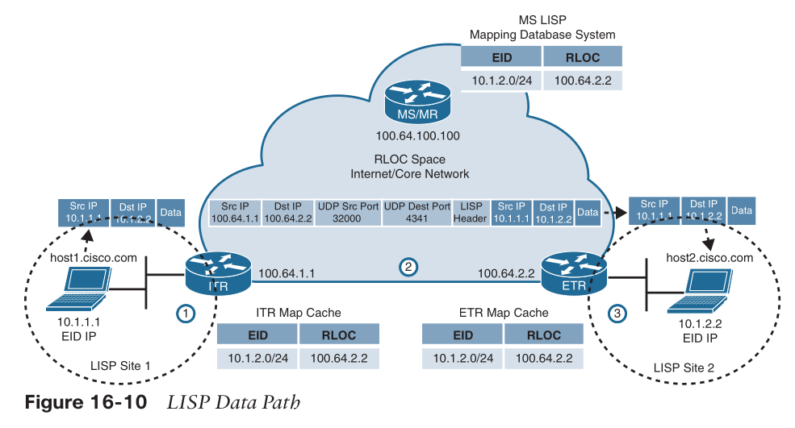

2. ITR adds an outer header
   * src IP: ITR RLOC IP
   * dst IP: ETR RLOC IP
   * dst UDP: 4341
3. ETR receives the encapsulated packet and de-encapsulates it to forward it to
host2.

### Proxy ETR

* PETR connects to non-LISP site
* PETR not register any EID addresses

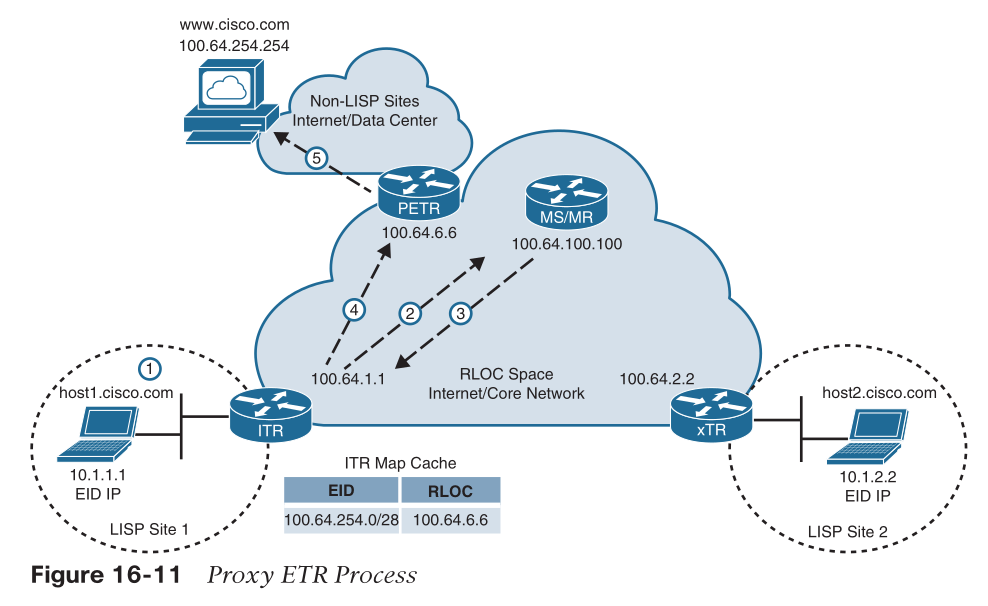

* Step 2.The ITR sends a map request to the MR for 100.64.254.254 (www.cisco.com)
* Step 3.The mapping database system responds with a negative map reply that includes a calculated non-LISP prefix for the ITR .
  * calculated non-LSP prefix: 100.64.254.0/28
    * shortest prefix that matches the dst IP but not match any registered EIDs
  * ITR must be configured to send traffic to the PETR’s RLOC for **any** destinations for which a negative map reply is received
* Step 4.The ITR add <calculated non-LISP prefix, configured PETR> to its mapping cache and FIB, sending LISP-encapsulated packets to the PETR.
* Step 5.The PETR de-encapsulates the traffic and sends it to www.cisco.com.

### Proxy ITR

* for non-LISP sites to reach EIDs
* behave same as ITR
  * no check src ip if it's registered

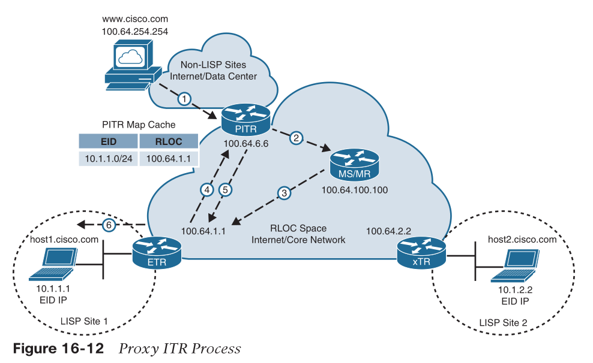

# Virtual Extensible Local Area Network (VXLAN):

* problem to address
  * for VMs and Containers
    * each has its MAC address
      * MAC table size larger in switch
      * 12b VLAN ID only support 4096 VLANs
  * STP blocks a large number of links
  * ECMP not supported
  * Host mobility is difficult

* MAC-in-IP/UDP tunneling
* UDP port: 4789
  * Linux default: 8472

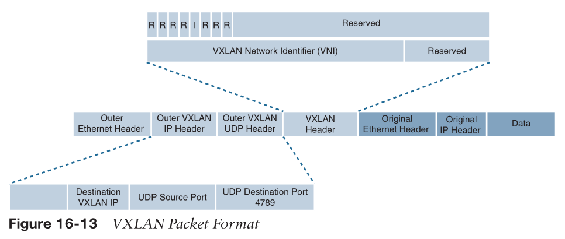

* VNI (VXLAN network identifier): 24b
  * ~16M vxlan segments / overlay networks

## VTEPs (virtual tunnel endpoints)

* originate/terminate tunnels
* Each VTEP has two interfaces:
  * Local LAN interfaces:
    * interfaces on the local LAN segment provide bridging between local hosts.
  * IP interface
    * core-facing network interface for VXLAN
    * IP address helps identify the VTEP in the network
    * also does encapsulation and de-encapsulation here

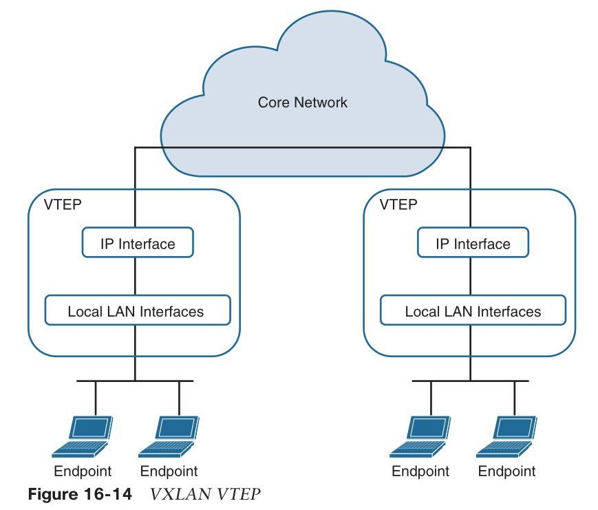

## Protocols

* IETF only defines VXLAN data plane protocol
* up to vendors to define control plane protocol
* Cisco has 4
  * VXLAN with Multicast underlay
  * VXLAN with static unicast VXLAN tunnels
  * VXLAN with MP-BGP EVPN control plane
  * VXLAN with LISP control plane

> MP-BGP EVPN and Multicast are the most popular control planes used for data center and private cloud environments. For campus environments, VXLAN with a LISP control plane is the preferred choice.

## Cisco Software-Defined Access (SD-Access)

* an implementation of VXLAN with the LISP control plane

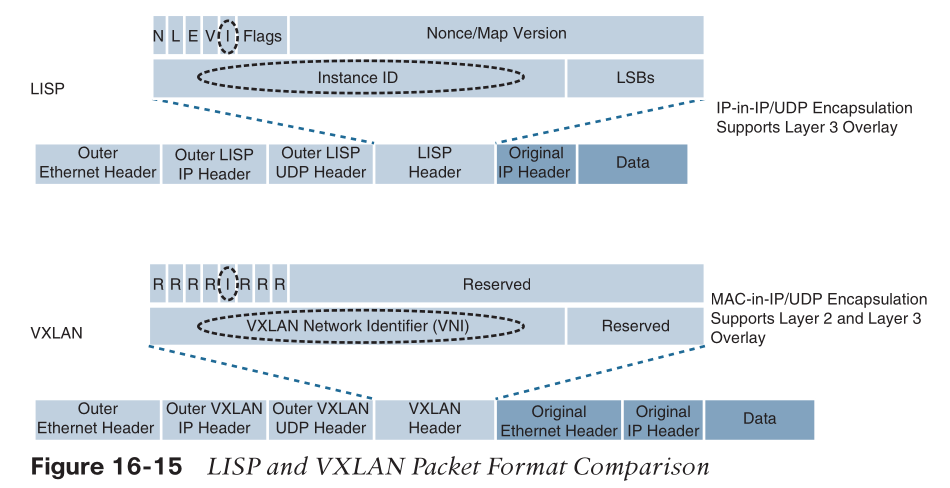

* LISP is only capable of performing IP-in-IP/UDP 
* VXLAN is capable of encapsulating the original Ethernet header to support Layer 2 and Layer 3 overlays.

