- [Fabric network](#fabric-network)
  - [Key differences between SD-Access and SD-WAN](#key-differences-between-sd-access-and-sd-wan)
- [SD-Access](#sd-access)
  - [SD-Access Fabric Concepts](#sd-access-fabric-concepts)
    - [Virtual network (VN)](#virtual-network-vn)
    - [Host pool](#host-pool)
    - [Scalable group](#scalable-group)
    - [Anycast gateway](#anycast-gateway)
  - [Physical Layer](#physical-layer)
  - [Network Layer](#network-layer)
    - [Underlay Network](#underlay-network)
    - [Overlay Network](#overlay-network)
      - [SD-Access Control Plane](#sd-access-control-plane)
      - [SD-Access Fabric Data Plane](#sd-access-fabric-data-plane)
      - [SD-Access Fabric Policy Plane](#sd-access-fabric-policy-plane)
      - [SD-Access Fabric Roles and Components](#sd-access-fabric-roles-and-components)
        - [Fabric Edge Nodes](#fabric-edge-nodes)
        - [Fabric Control Plane Node](#fabric-control-plane-node)
        - [Fabric Border Nodes](#fabric-border-nodes)
        - [Fabric Wireless Controller (WLC)](#fabric-wireless-controller-wlc)
  - [Controller Layer](#controller-layer)
  - [Management Layer](#management-layer)
    - [Cisco DNA Design Workflow](#cisco-dna-design-workflow)
    - [Cisco DNA Policy Workflow](#cisco-dna-policy-workflow)
    - [Cisco DNA Provision Workflow](#cisco-dna-provision-workflow)
    - [Cisco DNA Assurance Workflow](#cisco-dna-assurance-workflow)
- [SD-WAN](#sd-wan)
  - [Cisco SD-WAN](#cisco-sd-wan)
    - [vBond Orchestrator](#vbond-orchestrator)
    - [vSmart Controller](#vsmart-controller)
      - [OMP](#omp)
    - [vManage NMS](#vmanage-nms)
    - [Cisco SD-WAN Edge Devices](#cisco-sd-wan-edge-devices)
    - [vAnalytics](#vanalytics)
  - [SD-WAN Policy](#sd-wan-policy)
    - [Application-Aware Routing (AAR)](#application-aware-routing-aar)
  - [Cisco SD-WAN Cloud OnRamp (CoR)](#cisco-sd-wan-cloud-onramp-cor)
    - [Cloud OnRamp for SaaS](#cloud-onramp-for-saas)
      - [multi-homed with different ISPs/DIA](#multi-homed-with-different-ispsdia)
      - [single DIA and gateway](#single-dia-and-gateway)
    - [Cloud OnRamp for IaaS](#cloud-onramp-for-iaas)

# Fabric network

* an _overlay network_ (_virtual network_ [VN]) built over an _underlay network_ (physical network) using overlay tunneling technologies such as VXLAN.
* enabling 
  * host mobility
  * network automation
  * network virtualization
  * segmentation
* next-gen overlay fabric technologies
  * SD-Access
    * main components of the Cisco Digital Network Architecture (Cisco DNA)
      * intent-based networking in Cisco enterprise networks
    * designed only for enterprise campus and branch networks
  * SD-WAN
    * used to be MPLS, Dynamic Multipoint Virtual Private Network (DMVPN) or Intelligent WAN (IWAN)
    * recent changes
      * majority of enterprise traffic flows to public clouds and the Internet
    * SD-WAN fabric is a cloud-based WAN

## Key differences between SD-Access and SD-WAN

| Feature/Aspect  | **SD-Access**  | **SD-WAN**  |
|-- |--|--|
| **Purpose**                 | Manages the **local enterprise network (LAN)**, including campus networks. | Manages the **WAN infrastructure**, connecting branch offices, data centers, and cloud. |
| **Scope**                   | Focuses on **intra-site connectivity** (within a building or campus). | Focuses on **inter-site connectivity** (between multiple branches, data centers, and cloud). |
| **Primary Use Case**        | Simplifies and secures network management within a campus environment. | Optimizes WAN traffic across diverse connectivity options like MPLS, broadband, and LTE. |
| **Underlying Architecture** | Builds on Cisco **DNA Center** for automation, segmentation, and assurance. | Builds on **vManage** as the central controller for policy and orchestration. |
| **Technology**              | Implements a **fabric-based architecture** with features like VXLAN for virtualization. | Uses **overlay tunnels** (e.g., IPSec) and routing protocols to connect geographically distributed locations. |
| **Key Focus**               | - User and device identity - Network segmentation - Policy enforcement within the LAN or campus. | - WAN link optimization - Application performance - Secure, dynamic routing across WAN links. |
| **Security**                | Includes features like **macro and micro-segmentation** to isolate traffic within the campus. | Includes **end-to-end encryption**, secure internet breakout, and integration with security platforms like Cisco Umbrella. |
| **Connectivity**            | Deals primarily with wired and wireless LANs. | Integrates multiple WAN types (MPLS, broadband, LTE, satellite, etc.). |
| **Performance Optimization**| Improves performance through policy-driven automation and analytics (local focus). | Optimizes application traffic with features like **application-aware routing** and dynamic path selection. |
| **Examples of Use Cases**    | - University campus networks - Corporate headquarters - Hospitals and large enterprise buildings. | - Connecting global branch offices - Cloud-based application access - Hybrid WAN connectivity. |

# SD-Access

* problem to address
  * constant growth of users and endpoints
    * security policies
    * management overhead
  * manual config
  * mobility
  * trouble-shooting
* solutions
  * network automation
    * via DNA center
  * network assurance and analytics
    * telemetry
  * host mobility
  * identity services
    * Cisco Identity Services Engine (ISE)
  * policy enforcement
    * ACL not scalable
      * relying on IP addresses and subnets
    * Security Group Access Control Lists (SGACLs)
  * secure segmentation
    * guest
    * corporate
    * facilities
    * IoT
  * network virtualization
    * VRF / VN
    * each with a distinct set of access policies
* two main components
  * Cisco Campus fabric solution
    * managed via CLI/API using NETCONF/YANG
  * Cisco DNA Center
* arch.

## SD-Access Fabric Concepts

### Virtual network (VN)

* VRF instances
* In the control plane, LISP instance IDs are used to maintain separate VRF instances
* In the data plane, edge nodes add a VXLAN VNID to the fabric encapsulation

### Host pool

* a group of endpoints assigned to an IP pool subnet
* Fabric edge nodes have a Switched Virtual Interface (SVI) for each host pool to be used by endpoints and users as their default gateway
* SD-Access fabric uses EID mappings to advertise each host pool (per instance ID)

### Scalable group

* a group of endpoints with similar policies
  * security policy
  * QoS
  * policy-based routing (PBR)
  * network segmentation
* Assignment to a scalable group
  * static: per fabric edge port
  * dynamic: authentication through AAA or RADIUS using Cisco ISE
* same scalable group is configured on all fabric edge and border nodes
  * centralized managed/defined by DNA
  * populated via TrustSec
* SGT tag ID in each VXLAN header
  
> direct one-to-one relationship between host pools and scalable groups. 
> Therefore, the scalable groups operate within a VN by default.

### Anycast gateway

* provides a pervasive Layer 3 default gateway where the same SVI is provisioned on every edge node with the same SVI IP and MAC address
* e.g.: 10.1.0.0/24
  * deployed across all of the edge nodes in the fabric
  * an endpoint located in that subnet can be moved to any edge node within the fabric without a change to its IP address or default gateway
  * endpoint move around but still reach the same SVI and other endpoints in the same VLAN.

## Physical Layer

* Cisco devices of the SD-Access fabric
  * Cisco switches: Multiple types of Cisco Catalyst/Nexus switches are supported
  * Cisco routers
  * Cisco wireless: Cisco WLCs and APs
  * Cisco controller appliances: Cisco DNA Center and Cisco ISE are required
* must support all of the hardware ASICs and FPGAs and software requirements

## Network Layer

* underlay layer
  * transport IP packets
* overlay layer
  * tunneled network virtually interconnects all network devices to form a fabric of inter-connected nodes

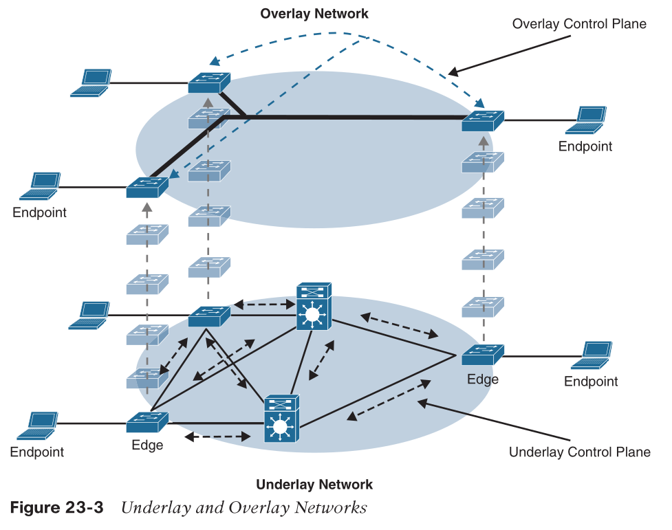

### Underlay Network

* recommend to use ISIS
  * neighbor establishment without IP dependency
  * agnostic to IPv4/v6
* manual underlay
  * not controlled by DNA
* automated underlay
  * configured and managed by DNA Center LAN Automation feature
    * create an IS-IS network
    * use Cisco Network Plug and Play feature to deploy both unicast and multicast routing information
    * doesn't allow manual customization

### Overlay Network

* fully automated via DNA, including
  * all necessary overlay control plane protocols and addressing
  * all global configurations

> It is also possible to manually configure the overlay network without using DNA Center; however, when the overlay network is managed via the CLI or API using NETCONF/ YANG, the solution is considered to be a campus fabric solution and not SD-Access.

#### SD-Access Control Plane

* LISP
  * endpoint identifier (EID)
  * routing locator (RLOC)
* eliminating the need for each router to process every possible IP destination address and route
  * by moving destination information to a centralized mapping database (MS)
* each router only manages its local routes (RLOC) and query the map system to locate destination EIDs
  * smaller routing table
  * dynamic host mobility
  * address-agnostic mapping
    * IPv4, IPv6, MAC
  * network segmentation
    * VRF
* LISP enhancements
  * distributed Anycast Gateway
  * VN Extranet
  * Fabric Wireless

#### SD-Access Fabric Data Plane

* VxLAN
  * MAC-in-IP
  * not use LISP data plane
    * IP-in-IP
* enhanced to support Cisco TrustSec Scalable Group Tags (SGTs)
  * adding new fields to the first 4 bytes of the VXLAN header
    * VXLAN Group Policy Option (VXLAN-GPO)

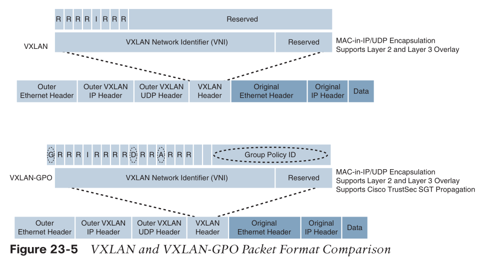

* Group Policy ID: 16-bit identifier that is used to carry the SGT tag.
  * support 64000 SGT tags
* Group Based Policy Extension Bit (G Bit)
  * =1 indicates an SGT tag is being carried within the Group Policy ID field
* Don’t Learn Bit (D Bit)
  * =1: indicates that the egress virtual tunnel endpoint (VTEP) must not learn the source address of the encapsulated frame.
* Policy Applied Bit (A Bit)
  * only meaningful when the G bit field is set to 1
  * =1: indicates that the group policy has already been applied to this packet, and further policies must not be applied by network devices
  * =0: group policies must be applied by network devices, and they must set the A bit to 1 after the policy has been applied.

#### SD-Access Fabric Policy Plane

* TrustSec
  * SGT tags are assigned to authenticated groups of users or end devices
  * Policies are based on SGT tags, not IP/MAC addresses
* Support for both network-based segmentation using VNs (VRF instances) and group- based segmentation (policies)
* Dynamic enforcement of group-based policies, regardless of location for both wired and wireless traffic
* Extended policy enforcement to external networks (such as cloud or data center networks) by transporting the tags to Cisco TrustSec-aware devices using SGT Exchange Protocol (SXP)

#### SD-Access Fabric Roles and Components

* 5 basic device roles in the fabric overlay
  * Control plane node
    * contains the settings, protocols, and mapping tables to provide the endpoint-to-location (EID-to-RLOC) mapping system for the fabric overlay.
  * Fabric border node
    * connects external Layer 3 networks to the SDA fabric
    * e.g., core layer device
  * Fabric edge node
    * connects wired endpoints to the SDA fabric
    * e.g., access or distribution layer device
  * Fabric WLAN controller (WLC)
    * connects APs and wireless endpoints to the SDA fabric
  * Intermediate nodes
    * intermediate routers or extended switches do not provide any sort of SD-Access fabric role other than underlay services.

> the core layer routers in this figure are acting as fabric border nodes and control plane nodes

##### Fabric Edge Nodes

* function:
  * onboarding and mobility services for wired users and devices
    * device including fabric-enabled WLCs and APs
  * are LISP tunnel routers (xTR)
  * also provides
    * anycast gateway
    * endpoint authentication
    * assignment endpoints to overlay host pools (static or DHCP)
    * enforce group-based policy for traffic to fabric endpoints
    * performs the encapsulation and de-encapsulation of traffic to and from its connected endpoints
* what it does:
  * first identifies and authenticates wired endpoints (through 802.1x)
  * place them in a host pool (SVI and VRF instance) and scalable group (SGT assignment)
  * registers the specific EID host address (MAC/IP) with the control plane node.

##### Fabric Control Plane Node

* a LISP map server/resolver (MS/MR)
  * maintains a simple host tracking database to map EIDs to RLOCs (current fabric edge or border node)
* enhanced functions
  * fabric wireless and SGT mapping
* what it does:
  * receives registrations from fabric edge or border nodes for known EID prefixes from wired endpoints and from fabric mode WLCs for wireless clients.
  * resolves lookup requests from fabric edge or border nodes to locate destination EIDs
  * updates fabric edge nodes and border nodes with wired and wireless client mobility and RLOC information.

> Control plane devices must maintain all endpoint (host) mappings in a fabric. A device with sufficient hardware and software scale for the fabric must be selected for this function.

##### Fabric Border Nodes

* are LISP proxy tunnel routers (PxTR)
* connect external Layer 3 networks to the SD-Access fabric
* translate reachability and policy information, such as VRF and SGT information, from one domain to another.
* 3 types of border nodes:
  * Internal border (rest of company): Connects only to the known areas of the organization (for example, WLC, firewall, data center).
  * Default border (outside): Connects only to unknown areas outside the organization (Internet or public cloud)
    * configured with a default route to reach external unknown networks
  * Internal + default border (anywhere): Connects transit areas as well as known areas of the company
    * combines internal and default border functionality into a single node.

##### Fabric Wireless Controller (WLC)

* connects APs and wireless endpoints to the SD-Access fabric
* performs PxTR registrations to the fabric control plane (on behalf of the fabric edges)
  * a fabric edge for wireless clients
  * EID -> AP -> Fabric edge node
* traditionally, data plane (wireless client data) traffic needs to be tunneled to the WLC through the Control and Provisioning of Wireless Access Points (CAPWAP) tunnel
* SD-Access data plane is distributed using VXLAN directly from the fabric-enabled APs

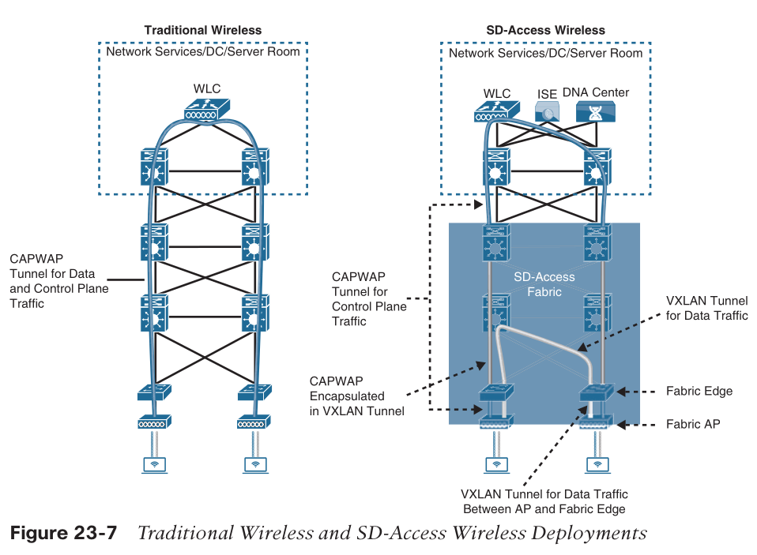

## Controller Layer

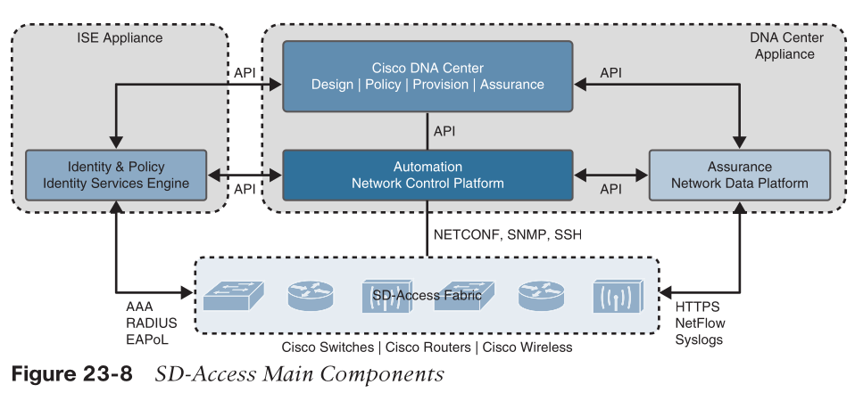

* 3 main components
  * Cisco Network Control Platform (NCP)
    * provides all the underlay and fabric automation and orchestration services for the physical and network layers
      * via NETCONF/YANG, SNMP, ssh, etc.
  * Cisco Network Data Platform (NDP)
    * data collection and analytics and assurance subsystem
      * data correlation through multiple sources
        * NetFlow, Switched Port Analyzer (SPAN)
  * Cisco Identity Services Engine (ISE)
    * provide all the identity and policy services for the physical layer and network layer
    * dynamic endpoint-to-group mapping
      * places the profiled endpoints into the correct scalable group and host pool
    * programming group-based policies on the network devices
    * 802.1x, MAC Authentication Bypass (MAB), and Web Authentication (WebAuth)

## Management Layer

* UI/UX to end user
  * who doesn't need to know technical details on LISP/VXLAN/etc..
* primary workflows defined by Cisco DNA Center: 
  * design, policy, provision, and assurance

### Cisco DNA Design Workflow

* design tools:
  * Network Hierarchy: Used to set up geolocation, building, and floorplan details and associate them with a unique site ID.
  * Network Settings: Used to set up network servers (such as DNS, DHCP, and AAA), device credentials, IP management, and wireless settings.
  * Image Repository: Used to manage the software images and/or maintenance updates, set version compliance, and download and deploy images.
  * Network Profiles: Used to define LAN, WAN, and WLAN connection profiles (such as SSID) and apply them to one or more sites.

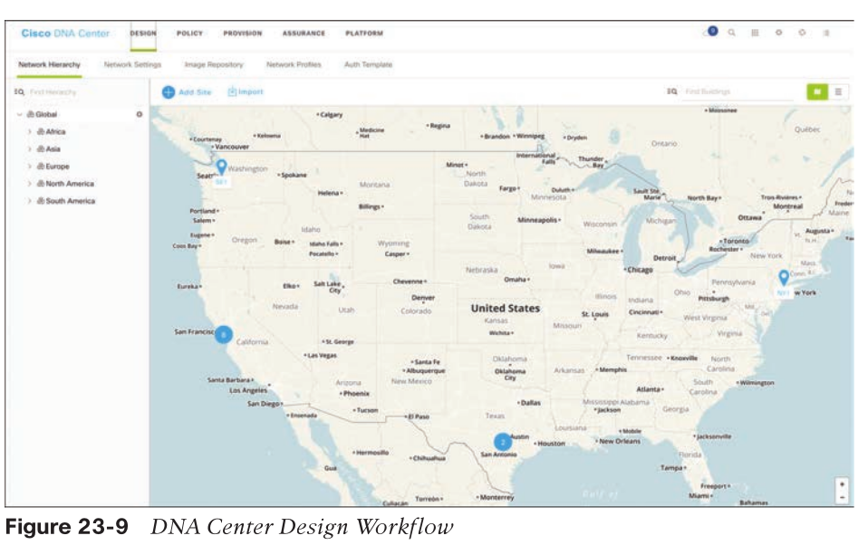

### Cisco DNA Policy Workflow

* policy tools
  * Group-Based Access Control: Used to create group-based access control policies, which are the same as SGACLs.
  * IP-Based Access Control
  * Application QoS
  * Traffic Copy: Used to configure Encapsulated Remote Switched Port Analyzer (ERSPAN) to copy the IP traffic flow between two entities to a specified remote destination for monitoring or troubleshooting purposes.
  * Virtual Network: Used to set up the virtual networks (or use the default VN) and associate various scalable groups.

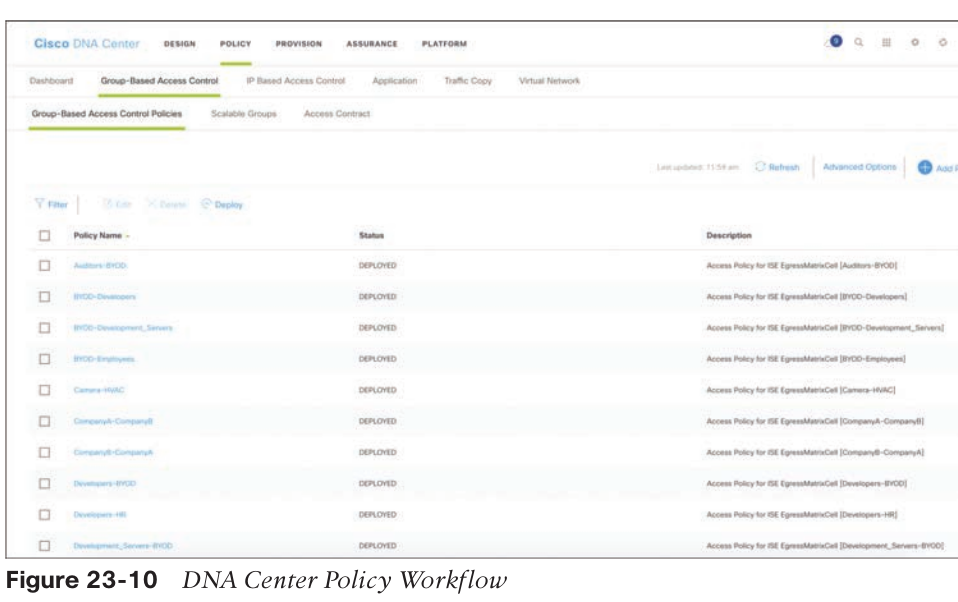

### Cisco DNA Provision Workflow

* provision tools
  * Devices: Used to assign devices to a site ID, confirm or update the software version, and provision the network underlay configurations.
  * Fabrics: Used to set up the fabric domains (or use the default LAN fabric).
  * Fabric Devices: Used to add devices to the fabric domain and specify device roles (such as control plane, border, edge, and WLC).
  * Host Onboarding: Used to define the host authentication type (static or dynamic) and assign host pools (wired and wireless) to various VNs.

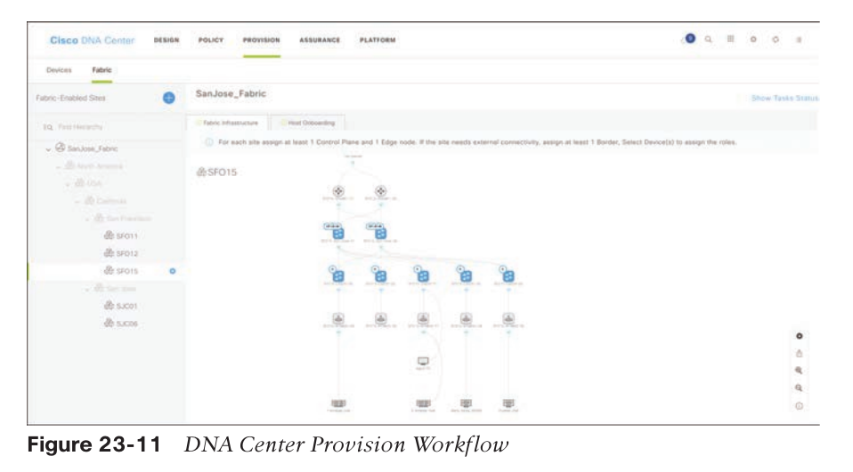

### Cisco DNA Assurance Workflow

* assurance tools
  * Client 360: Used to monitor and resolve client-specific status and issues (such as onboarding and app experience), with links to connected devices.
  * Devices 360: Used to monitor and resolve device-specific status and issues (such as resource usage and loss and latency), with links to connected clients.
  * Issues: Used to monitor and resolve open issues (reactive) and/or developing trends (proactive) with clients and devices at various sites.

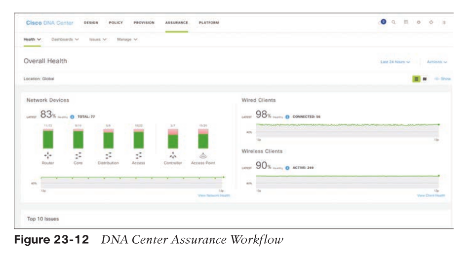

# SD-WAN

* problem to address
  * WAN traffic optimization
  * extend to public cloud
  * transport-agnostic WAN
    * IP, MPLS, 4/5G, satellite, etc.
  * ...
* solutions
  * Cisco SD-WAN (based on Viptela)
    * cloud-based initiatives
      * digital transformation
  * Meraki SD-WAN
    * unified threat management (UTM)
      * firewall
      * IPS
      * VPN
      * antivirus
      * antispam
      * web content filtering

> The original Viptela hardware platforms running a dedicated Viptela OS are referred to as vEdge routers
> vEdge router platforms are no longer available
> The Cisco IOS XE platform devices are referred to as cEdge routers, and use a unified image with autonomous features starting with 17.2 version of software

## Cisco SD-WAN

* cloud-delivered overlay

* components
  * SD-WAN edge devices
    * physical or virtual devices forward traffic across transports (that is, WAN circuits/media) between locations.
  * vManage Network Management System (NMS)
    * SD-WAN controller provides GUI for managing and monitoring the SD-WAN solution.
  * vSmart controller
    * SD-WAN controller advertises routes and data policies to edge devices.
  * vBond orchestrator
    * SD-WAN controller authenticates and orchestrates connectivity between edge devices, vManage, and vSmart controllers.
  * vAnalytics
    * optional analytics and assurance service.
* controllers can be device or VM

### vBond Orchestrator

* a virtualized vEdge device
* known by dns name
* components
  * Authentication
    * authenticating every devices using certificates and RSA cryptography.
  * NAT detection
    * detect if devices are being placed behind NAT devices using Session Traversal Utilities for NAT (STUN) [RFC 5389] mechanisms.
  * Load balancing
    * load balancing of sessions to fabrics that have multiple vSmart or vManage controllers.
* has a permanent control plane connection over a Datagram Transport Layer Security (DTLS) tunnel with every vSmart controller

### vSmart Controller

* uses DTLS tunnels with edge devices to establish Overlay Management Protocol (OMP) neighborships
* convert policies from vManager and send to edge devices
  * logical tunnel topologies (such as hub and spoke, regional, and partial mesh)
  * service chaining
  * traffic engineering
  * segmentation per VPN topology

#### OMP

* similar to BGP
* learn routes from edge
* advertise routes/next hop to edge
* signal policies
  * policy e.g.: YouTube requires no more than 1% loss and 150 ms latency

### vManage NMS

* GUI
* contains all of the edge device configurations
* controls software updates
* policy creation
* also provides a method of configuring the SD-WAN fabric via APIs

### Cisco SD-WAN Edge Devices

* can be physical or virtual machine
* a standard router
* added SD-WAN overlay control and data plane
* DTLS tunnel to vSmart
* IPsec with other SD-WAN routers

### vAnalytics

* Visibility into applications and infrastructure across the WAN
* Forecasting and what-if analysis

## SD-WAN Policy

* The most powerful component of Cisco SD-WAN is the ability to push a unified policy across the fabric
* polcies
  * local policy
    * part of edge device config
      * ACL
      * QoS
      * Routing
  * Centralized policy
    * Topology
      * control plane policy
      * drop or modify routing behaviors by changing path metrics or even the next-hop.
    * VPN Membership
      * control plane policy
      * control the advertisement of specific VPN prefixes to a specific site.
    * Application-Aware Routing (AAR)
      * data plane policy
      * enhances the forwarding of packets on an application-by-application basis, based on the characteristics of a tunnel.
    * Traffic Data
      * data plane policy
      * filter traffic on an application-by-application basis (or more general characteristics)
      * modify traffic flows (change the next-hop, service-chaining, or even NAT), QoS functions, and/or implement packet loss protection mechanisms.

### Application-Aware Routing (AAR)

* use the Bidirectional Forwarding Detection (BFD) probes in the SD-WAN tunnels to track a tunnel’s packet loss, latency, and jitter
* AAR provides the ability to consider factors in path selection outside of those used by standard routing protocols
* switch transport if needed

## Cisco SD-WAN Cloud OnRamp (CoR)

* more SaaS applications
  * Office 365
  * Salesforce
* IaaS
  * GCP
  * AWS
* improve QoE by monitoring and adjusting
* extending the SD-WAN fabric to the public cloud

### Cloud OnRamp for SaaS

* the edge device sends small HTTP probes to the SaaS application to measure latency and loss.
* Viptela Quality of Experience (vQoE) score
  * 0: worst
  * 10: best
* make a switch dynamically based on score
* cannot do load balancing though
* forwarding decision is made on an application-by-application basis

#### multi-homed with different ISPs/DIA

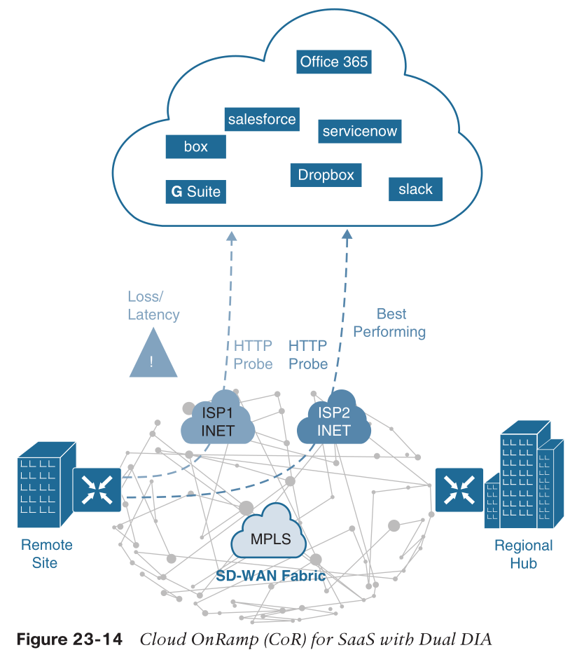

#### single DIA and gateway

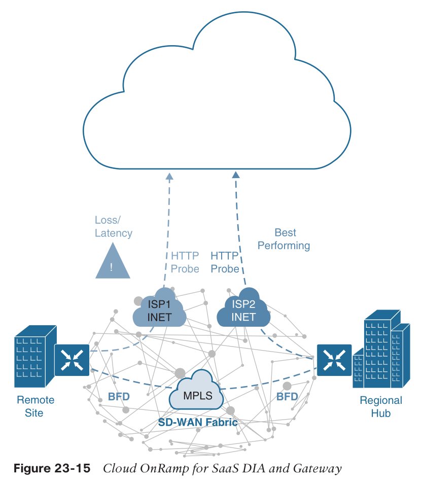

* gateway reports its http performance stats to remote site edge device via OMP through vSmart
* remote site make decision based on
  * gateway's stats, plus
  * SD-WAN fabric stats from BFD

### Cloud OnRamp for IaaS

* With the Cisco SD-WAN solution, ubiquitous connectivity, zero-trust security, end-to-end segmentation, and application-aware QoS policies can be extended into the IaaS environments by using SD-WAN cloud routers

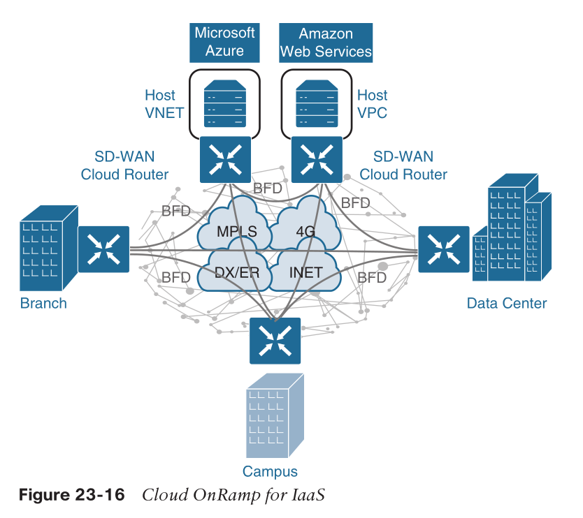