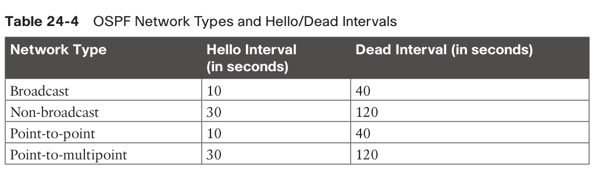

- [Basics](#basics)
- [Network Diagnostic Tools](#network-diagnostic-tools)
  - [ping](#ping)
  - [traceroute](#traceroute)
- [Debugging](#debugging)
  - [debugging OSPF](#debugging-ospf)
    - [MTU issues](#mtu-issues)
    - [Incorrect interface types](#incorrect-interface-types)
    - [Improperly configured network mask](#improperly-configured-network-mask)
  - [Conditional Debugging](#conditional-debugging)
    - [`debug ip packet`](#debug-ip-packet)
  - [SNMP](#snmp)
  - [syslog](#syslog)
- [NetFlow and Flexible NetFlow](#netflow-and-flexible-netflow)

# Basics

> many small networks are very complex, and 
> many very large networks are simple in design and complexity

# Network Diagnostic Tools

## ping

* `ping x.x.x.x ?`
* MTU issue: send 1500-byte packets with the DF bit set
> Never underestimate the power of ping!

## traceroute

* tries up to 30 times/hops before completing

# Debugging

## debugging OSPF

* `debug ip ospf adj`
* `debug ip ospf hello`
* `undebug all`

### MTU issues

```
R1#
19:20:42.559: OSPF-1 ADJ Et0/1: Rcv DBD from 4.4.4.4 seq 0x247A opt 0x52 flag 0x7 len 32 mtu 1400 state EXCHANGE
19:20:42.559: OSPF-1 ADJ Et0/1: Nbr 4.4.4.4 has smaller interface MTU
```

### Incorrect interface types

* affect default hello timers



```
R4#
19:45:45.127: OSPF-1 HELLO Et0/1: Mismatched hello parameters from 192.168.14.1
! R4 is receiving a dead interval of 40, while it has a configured dead interval of 120
19:45:45.127: OSPF-1 HELLO Et0/1: Dead R 40 C 120, Hello R 10 C 30

! fix
R4(config)# interface ethernet0/1
R4(config-if)# ip ospf network broadcast
```

### Improperly configured network mask

```
R1#
20:55:05.468: OSPF-1 HELLO Et0/1: Rcv hello from 4.4.4.4 area 0 192.168.14.4
20:55:05.468: OSPF-1 HELLO Et0/1: No more immediate hello for nbr 4.4.4.4, which has been sent on this intf 2 times

R4#
21:05:57.927: OSPF-1 HELLO Et0/1: Mismatched hello parameters from 192.168.14.1
21:05:57.927: OSPF-1 HELLO Et0/1: Dead R 40 C 40, Hello R 10 C 10 Mask R 255.255.255.0 C 255.255.255.248
```

## Conditional Debugging

* debug can cause less resourceful network device unresponsive or crash

### `debug ip packet`

* better use an ACL to limit scope
* options:
  * <1-199>: Access list
  * <1300-2699>: Access list with expanded range
  * detail: More debugging detail

```
R4(config)# access-list 100 permit ip any 192.168.14.0 0.0.0.255
R4(config)# access-list 100 permit ip 192.168.14.0 0.0.0.255 any
R4# debug ip packet 100
```

* specify an interface

```
R4# debug interface Loopback0
Condition 1 set
R4# debug ip packet 100
IP packet debugging is on for access list 100
R4# show debug
Generic IP:
    IP packet debugging is on for access list 100
Condition 1: interface Lo0 (1 flags triggered)
    Flags: Lo0
21:39:59.033: IP: tableid=0, s=192.168.14.1 (Ethernet0/3), d=4.4.4.4 (Loopback0), routed via RIB
..
R4# undebug all
All possible debugging has been turned off
R4# undebug interface loopback0
This condition is the last interface condition set.
Removing all conditions may cause a flood of debugging
messages to result, unless specific debugging flags
are first removed.
Proceed with removal? [yes/no]: yes
```

## SNMP

* authentication
  * SNMPv1, v2c use community string
    * should be secured by ACL
  * SNMPv3 use username and SHA/MD5, and/or DES/AES encryption
* operations
  * SNMP Agent/NMS -> get-request, get-next-request, get-bulk-request, set-request
  * MIB SNMP Agent -> get-response, traps
* config SNMP
  * Define the SNMP host or the NMS to send traps to.
  * Create an access list to restrict access via SNMP.
  * Define the read-only community string.
  * Define the read/write community string.
  * Define the SNMP location.
  * Define the SNMP contact.

```
R1(config)# access-list 99 permit 192.168.14.100 0.0.0.0
R1(config)# snmp-server community READONLY ro 99
R1(config)# snmp-server community READWRITE rw 99
! to see all available traps, use `snmp-server enable traps ?`
R1(config)# snmp-server enable traps config
R1(config)# snmp-server host 192.168.14.100 traps READONLY
```

## syslog

* ensure NTP is enabled to make time sync'd
* 7 levels of log levels, similar to Linux kernel
* 3 places to put log
  * console
  * logging buffer
  * syslog server like Splunk
    * UDP: 514
* logging buffer
```
! setup
R1(config)# logging buffer 100000
R1(config)# logging buffer debugging
R1(config)# do show logging
!
! working with `debug` command
R1(config)# no logging console
R1(config)# end
R1# debug ip ospf hello
OSPF hello debugging is on
R1# show logging
```
* log server
```
R1(config)# logging host 192.168.14.100
R1(config)# logging trap 7
R1(config)# do show logging
```

# NetFlow and Flexible NetFlow


