- [Secure Network Access Control](#secure-network-access-control)
  - [Network Security Design for Threat Defense](#network-security-design-for-threat-defense)
  - [Next-Generation Endpoint Security](#next-generation-endpoint-security)
    - [Cisco Talos](#cisco-talos)
    - [Cisco Secure Malware Analytics (Threat Grid)](#cisco-secure-malware-analytics-threat-grid)
    - [Cisco Advanced Malware Protection (AMP)](#cisco-advanced-malware-protection-amp)
    - [Cisco Secure Client (AnyConnect)](#cisco-secure-client-anyconnect)
    - [Cisco Umbrella](#cisco-umbrella)
    - [Cisco Secure Web Appliance (WSA)](#cisco-secure-web-appliance-wsa)
    - [Cisco Secure Email (ESA)](#cisco-secure-email-esa)
    - [Cisco Secure IPS (FirePOWER NGIPS)](#cisco-secure-ips-firepower-ngips)
    - [Cisco Secure Firewall (NGFW)](#cisco-secure-firewall-ngfw)
    - [Cisco Secure Firewall Management Center (FMC)](#cisco-secure-firewall-management-center-fmc)
    - [Cisco Secure Network Analytics (Stealthwatch Enterprise)](#cisco-secure-network-analytics-stealthwatch-enterprise)
    - [Cisco Secure Cloud Analytics (Stealthwatch Cloud)](#cisco-secure-cloud-analytics-stealthwatch-cloud)
    - [Cisco Identity Services Engine (ISE)](#cisco-identity-services-engine-ise)
      - [Cisco Platform Exchange Grid (pxGrid)](#cisco-platform-exchange-grid-pxgrid)
  - [Network Access Control (NAC)](#network-access-control-nac)
    - [802.1x](#8021x)
      - [EAP methods](#eap-methods)
      - [EAP chaining](#eap-chaining)
    - [MAC Authentication Bypass (MAB)](#mac-authentication-bypass-mab)
    - [Web Authentication (WebAuth)](#web-authentication-webauth)
      - [Local Web Authentication (LWA)](#local-web-authentication-lwa)
      - [Central Web Authentication with Cisco ISE (CWA)](#central-web-authentication-with-cisco-ise-cwa)
      - [Enhanced Flexible Authentication (FlexAuth)](#enhanced-flexible-authentication-flexauth)
    - [Cisco Identity-Based Networking Services (IBNS) 2.0](#cisco-identity-based-networking-services-ibns-20)
    - [Cisco TrustSec](#cisco-trustsec)
      - [SGT naming](#sgt-naming)
      - [Ingress Classification](#ingress-classification)
      - [Propagation](#propagation)
      - [Egress Enforcement](#egress-enforcement)
    - [MACsec](#macsec)
      - [Frame header](#frame-header)
      - [Downlink MACsec](#downlink-macsec)
      - [Uplink MACsec](#uplink-macsec)

# Secure Network Access Control

## Network Security Design for Threat Defense

* SAFE: Secure Architectural Framework
* PINs: Places In the Network
  * branch
    * less secure PIN
    * endpoint malware (fake POS)
    * rogue APs
  * campus
    * phishing
    * malware propagation
    * botnets
  * data center
    * main target
  * edge
    * highest risk PIN
  * cloud
    * SP SLA
  * WAN
    * connect PINs together
* secure domains
  * central management
  * security intelligence
  * compliance
    * PCI DSS 3.0 (Payment Card Industry Data Security Standard version 3.0)
      * security standards for organizations that handle cardholder data to protect against fraud and breaches.
    * HIPAA
  * segmentation
    * boundaries of data/user
    * IP addressing/VLANs/ACL
    * new TrustSec/SGT, group-based policy
      * leveraging identity-aware infrastructure to enforce policies in an automated and scalable manner.
  * threat defense
    * traffic telemetry
    * file reputation
    * context (device, user, role, location, time, etc.)
  * secure services
    * VPN
    * ACL

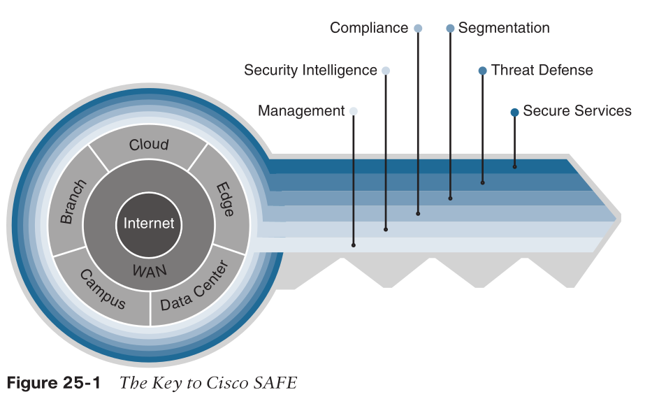

* continuum
  * before
    * set policies
      * know me, know enemy
    * firewall
    * network access control
    * identity services
  * during
    * incident response
    * IPS
    * malware protection
    * email/web security
  * after
    * contain / remediate attack
    * lessons learned

## Next-Generation Endpoint Security

* dynamic threats

### Cisco Talos

* cisco threat intelligence team
* per day, receiving
  * 16 billion web requests
  * 600 billion emails
  * 1.5 million unique malware samples
* collaborates with others
  * snort
  * honeypots
  * ...

### Cisco Secure Malware Analytics (Threat Grid)

* file analysis
  * static
  * dynamic
    * sandbox
      * malware detects sandbox as well
      * counter that detection by not having the typical instrumentation
      * run via Glovebox to interact with malware
    * behavior analysis
* upload file to cloud-based Analytics

### Cisco Advanced Malware Protection (AMP)

* Malware Defense
* arch.
  * AMP Cloud (private or public)
    * file reputation
      * malware/clean/unknown/custom
  * AMP connectors
    * upload file to AMP cloud
    * send a hash of file
  * Threat intelligence from Cisco Talos and Cisco Secure Malware Analytics

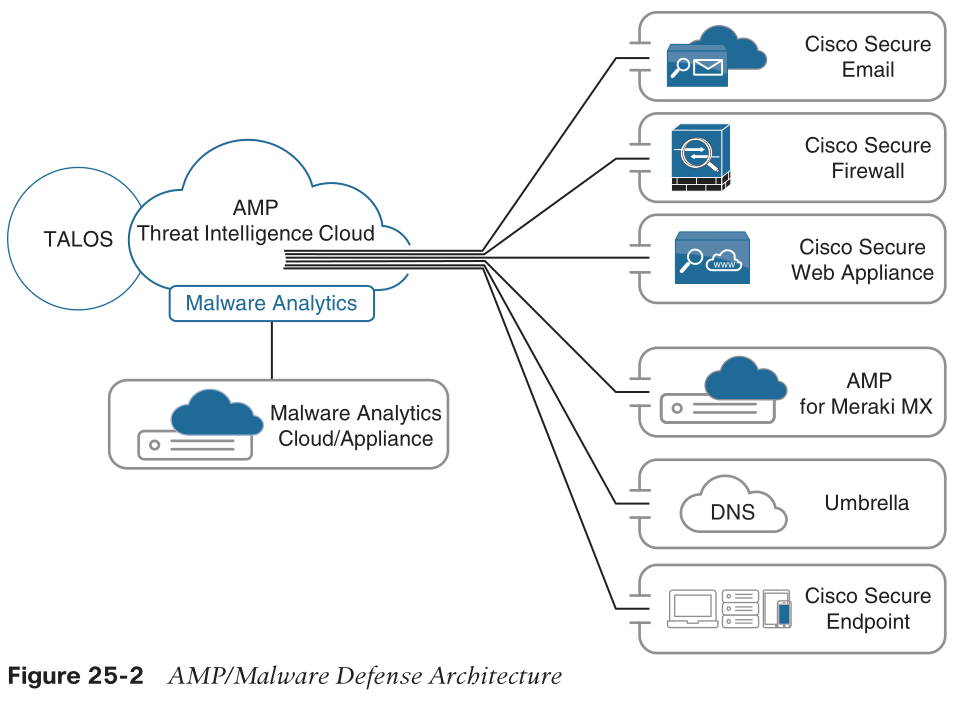

### Cisco Secure Client (AnyConnect)

* TLS/SSL VPN
  * SSL is deprecated by IETF
* host scan
* compliance

### Cisco Umbrella

* OpenDNS
  * anycast DNS
  * DNS traffic is routed to the closest location
> Security intelligence is gathered from an average of 500 billion daily DNS requests from more than 90 million users.
> All this data is fed in real time into Umbrella’s massive graph database, where statistical and machine learning models are continuously run against it.

### Cisco Secure Web Appliance (WSA)

* hardware
  * but can be a virtual appliance as well
* block malware

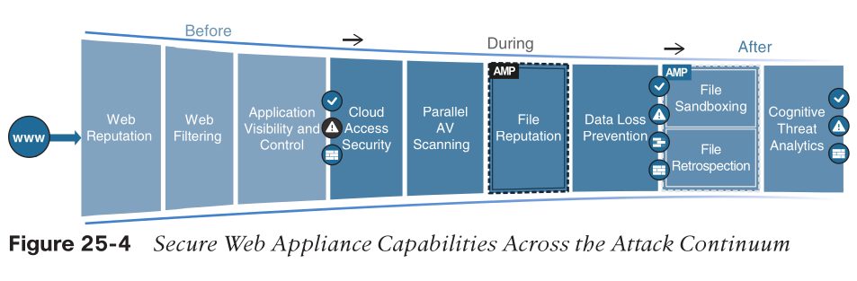

* before attack
  * working with Talo which updates the database every 3-5 minutes
  * Web reputation filters
    * Cisco Secure Web Appliance analyzes and categorizes unknown URLs and blocks those that fall below a defined security threshold
    * eval
      * domain owner
      * the server where the site is hosted
      * the time the site was created
      * the type of site
    * score
    * act
      * allow
      * block
      * warning
  * URL filtering
    * check against a database of 50M blocked sites
    * Dynamic Content Analysis (DCA) engine
      * scan text
      * calculates model document proximity
  * Cisco Application Visibility and Control (AVC)
    * most granular control over application and usage behavior
      * AVC can be configured to permit users to access Facebook or YouTube while blocking users from activities such as clicking the “Like” button or viewing certain videos or YouTube channels.
* During
  * Secure Web Appliance identify and blocks 0-day threats
    * via intelligence from cloud access security broker (CASB) providers, Talos, and AMP
  * cloud access security
    * threats in cloud apps
      * monitor their usage in real-time
  * Parallel antivirus (AV) scanning
    * multiple antivirus software running same time
  * Layer 4 traffic monitoring
    * botnet/spyware's phone-home communications
  * File reputation and analysis with Cisco AMP
  * Data loss prevention (DLP)
    * checking outbound traffic
    * Internet Content Adaptation Protocol (ICAP)
    * DPI
      * content markers
        * confidential files
        * credit card numbers
        * personal information
* After
  * Cisco AMP retrospection capabilities
  * data collected for machine learning

### Cisco Secure Email (ESA)

* hardware appliance or as a cloud offering called Cisco Secure Email Threat Defense
* from Talos and others
  * Global threat intelligence
  * Reputation filtering
* Spam protection
  * Cisco Context Adaptive Scanning Engine (CASE)
  * false position rate: < 1/1M
* Forged email detection
  * protects high-value targets such as executives against business email compromise (BEC) attacks
* Cisco Advanced Phishing Protection (CAPP)
  * machine learning to model trusted email behavior on the Internet, within organizations, and between individuals
  * stop identity deception–based attacks such as fraudulent senders, social engineering, and BEC attacks
* Cisco Domain Protection (CDP)
  * prevent phishing emails from being sent using a customer domain
* Malware defense
* Graymail detection and Safe Unsubscribe
  * graymail typically comes with an unsubscribe link, which may be used for phishing
* URL-related protection and control
* Outbreak filters
  * rewrite URLs in email
* traffic delivered to WSA to scan
* Web interaction tracking
  * report who clicked which rewritten URL
* Data security for sensitive content in outgoing emails
  * automatically protected by encryption, footers and disclaimers,

### Cisco Secure IPS (FirePOWER NGIPS)

* IDS + blocking
* Real-time contextual awareness
  * OS
  * applications
  * users
  * ...
* Advanced threat protection
  * AMP for Networks
  * Secure Malware Analytics sandboxing solutions
* Intelligent security automation
  * automating protection policy updates
  * network anomaly detection
  * tagging potentially affected hosts
* Unparalleled performance and scalability
* Application visibility and control (AVC) and URL filtering
* Centralized management
  * Cisco Secure Firewall Management Center (FMC)
* Snort IPS detection engine
* Open API
* Integration with Cisco ISE

### Cisco Secure Firewall (NGFW)

* industry’s first fully integrated, threat-focused NGFW with unified management
  * integrating Cisco integrated ASA software with the Cisco Secure IPS services software
* per Gartner, an NGFW firewall must include
  * Standard firewall capabilities such as stateful inspection
  * An integrated IPS
  * Application-level inspection (to block malicious or risky apps)
  * The ability to leverage external security intelligence to address evolving security threats
* Cisco Secure Firewall is available in the following form factors:
  * Cisco Secure Firewall Appliances
  * Cisco Secure Industrial Security Appliance (ISA)
  * Cisco Secure Firewall Threat Defense Virtual
  * Cisco Secure Firewall Cloud Native
  * Cisco Secure Web Application Firewall (WAF) and bot protection
  * All ASA 5500-X appliances (except 5585-X)
* software
  * ASA software image
    * standard legacy firewall
    * Adaptive Security Appliance
  * ASA software image with Cisco Secure IPS software image (FirePOWER NGIPS)
    * only on 5500-X appliances (except the 5585-X)
  * Firepower Threat Defense (FTD) software image
    * on all Cisco Secure Firewall and ASA 5500-X appliances (except the 5585-X)

> In Cisco’s documentation, FirePOWER (uppercase) refers to the Cisco Secure IPS (NGIPS) services software or the NGIPS services ASA module, while Firepower (lowercase) refers to the Cisco Secure Firewall or the FTD unified image.

### Cisco Secure Firewall Management Center (FMC)

* ggregates and correlates threat events, contextual information, and network device performance data
* monitor information that Cisco Secure Firewall devices are reporting

### Cisco Secure Network Analytics (Stealthwatch Enterprise)

* collector and aggregator of network telemetry data
* against both outsiders and insiders
  * command-and-control (C&C) attacks
  * ransomware
  * DDoS attacks
  * illicit cryptomining
  * unknown malware
  * inside threats
* scaled 
  * into the cloud (when used in combination with Cisco Secure Cloud Analytics)
  * across the network
  * to branch locations
  * in the data center
  * down to the endpoints
* components
  * Cisco Secure Network Analytics Manager, formerly Stealthwatch Management Console (SMC)
    * analytics from up to 25 Flow Collectors, Cisco ISE, and other sources
  * Cisco Secure Network Analytics Flow Collectors
    * Netflow, IPFIX
    * can pinpoint malicious patterns in encrypted traffic using Encrypted Traffic Analytics (ETA), without having to decrypt it
  * Cisco Secure Network Analytics Flow Rate License
  * optionally
    * Cisco Secure Network Analytics Flow Sensors
      * generate netflow
    * Cisco Secure Network Analytics UDP Director
      * central flow collector and replicator
    * Cisco Telemetry Broker
      * central telemetry collector and replicator
    * Cisco Secure Network Analytics Data Store
      * central data store
    * Cisco Secure Network Analytics Endpoint License
    * Cisco Secure Cloud Analytics
      * extend visibility into AWS, GCP, Azure
* also can be used for network performance and capacity planning

### Cisco Secure Cloud Analytics (Stealthwatch Cloud)

* a cloud-based Software-as-a-Service (SaaS) solution
* detect attacks from cloud and Internet
* deployment
  * Cisco Secure Cloud Analytics Public Cloud Monitoring, formerly Stealthwatch Cloud Public Cloud Monitoring
    * agentless
    * virtual private cloud (VPC) flow logs
    * integrated with additional AWS services such as Cloud Trail, Amazon CloudWatch, AWS Config, Inspector, Identity and Access Management (IAM), etc.
  * Cisco Secure Network Analytics SaaS, formerly Stealthwatch Cloud Private Network Monitoring
    * threat detection for the on-premises network, delivered from a cloud-based SaaS solution
    * collected metadata is encrypted and sent to the Cisco Secure Cloud Ana- lytics platform for analysis
      * metadata only

### Cisco Identity Services Engine (ISE)

* network visibility
  * who
  * which applications installed/running
  * which endpoints
* integration with Cisco DNA
* Centralized secure network access control
  * RADIUS
  * 802.1x/EAP, MAB, and local and centralized WebAuth
* Centralized device access control
  * TACACS+
* Cisco TrustSec
  * implements Cisco TrustSec policy
    * SGT tags, SGACLS
* Guest lifecycle management
* Streamlined device onboarding
  * automates 802.1x supplicant provisioning and certificate enrollment
  * integrates with mobile device management (MDM)/ enterprise mobility management (EMM) vendors for mobile device compliance and enrollment
* Internal certificate authority (CA)
* Device profiling
  * endpoint-specific authorization policies based on device type
* Endpoint posture service
  * for compliance/audits
    * is latest OS
    * is firewall enabled
    * is anti-malware app installed
* Active Directory support
  * Microsoft
  * Kerberos based authentication
    * user uses username and password
      * but password was hashed, plaintext never transferred
    * primarily relying on symmetric encryption

#### Cisco Platform Exchange Grid (pxGrid)

* shares contextual information using a single API between different Cisco platforms as well as partners
* pxGrid is an IETF framework
  * pxGrid Server: central pxGrid controller
  * pxGrid nodes: all Cisco and third-party security platforms
  * pxGrid 1.0: Released with ISE 1.3 and based on Extensible Messaging and Presence Protocol (XMPP)
    * kinda obselete
  * pxGrid 2.0: Uses WebSocket and the REST API over Simple Text Oriented Message Protocol (STOMP) 1.2
      ```
      Session={ip=[192.168.1.2]
      Audit Session Id=0A000001000000120001C0AC
      UserName=dewey.hyde@corelab.com
      ADUserDNSDomain=corelab.com
      ADUserNetBIOSName=corelab,
      ADUserResolvedIdentities=dewey.hyde@corelab.com
      ADUserResolvedDNs=CN=Dewey Hyde
      CN=Users
      DC=corelab
      DC=com
      MacAddresses=[00:0C:C1:31:54:69]
      State=STARTED
      ANCstatus=ANC_Quarantine
      SecurityGroup=Quarantined_Systems
      EndpointProfile=VMWare-Device
      NAS IP=192.168.1.1
      NAS Port=GigabitEthernet0/0/1
      RADIUSAVPairs=[ Acct-Session-Id=0000002F]
      Posture Status=null
      Posture Timestamp=
      LastUpdateTime=Sat Aug 21 11:49:50 CST 2019
      Session attributeName=Authorization_Profiles
      Session attributeValue=Quarantined_Systems
      Providers=[None]
      EndpointCheckResult=none
      IdentitySourceFirstPort=0
      IdentitySourcePortStart=0
      ```

## Network Access Control (NAC)

### 802.1x

* port-based NAC (PNAC)
* components
  * Extensible Authentication Protocol (EAP)
    * RFC 4187
    * message format / protocol for encapsulated transport for authentication parameters
  * EAP method / EAP type
    * authentication methods
  * EAP over LAN (EAPoL)
    * layer 2 encapsulation protocol defined by 802.1x
    * for transport EAP messages
  * RADIUS
    * provide AAA to EAP
* roles
  * supplicant
    * client
  * authenticator
    * liaison between client and server
      * takes the EAPoL encapsulated frame from the supplicant
      * encapsulates it within the RADIUS packet
      * sent to the authentication server
      * opens up the port if the authentication server directs it to
    * switch / WLC
  * authentication server
    * RADIUS server
  
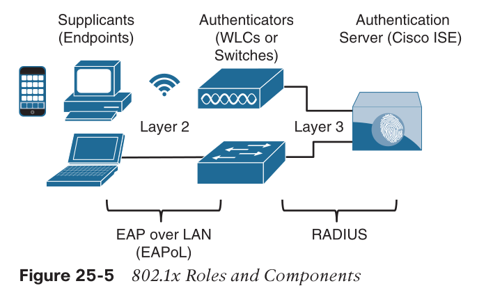

* EAPoL ethernet frame:
  * Destination MAC Address
  * Source MAC Address
  * EtherType (0x888E)
  * EAPOL Protocol Data
* process

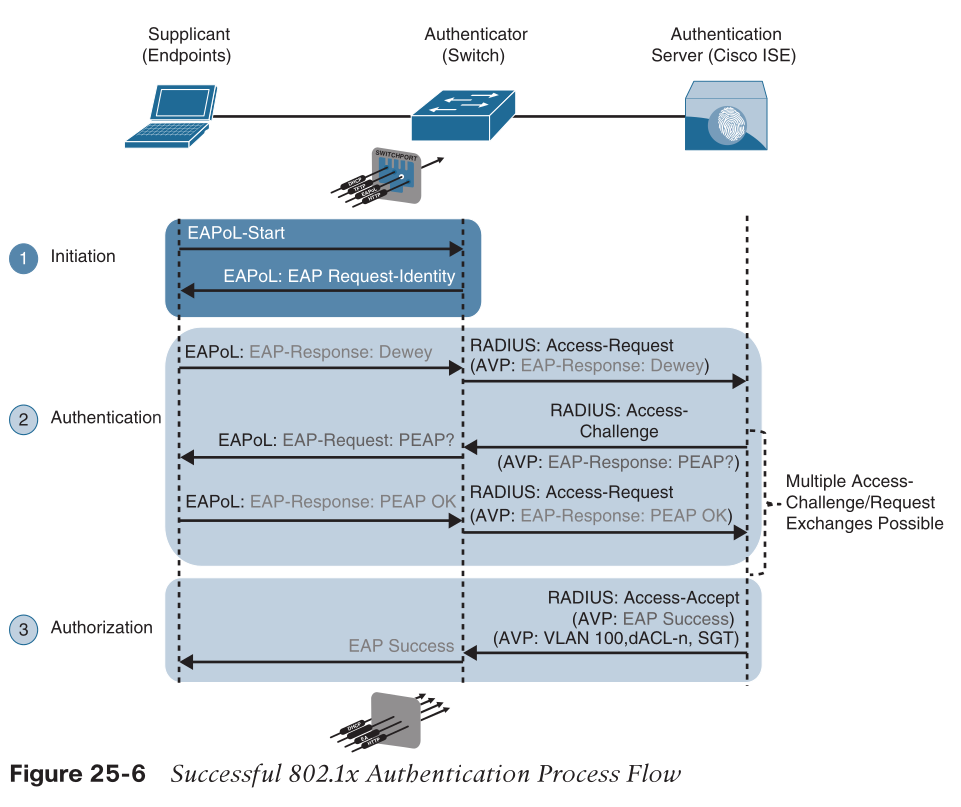

#### EAP methods

* how to auth. user?
  * by a shared secret
  * by a rsa-like keys/certs
* EAP challenge-based authentication method
  * Extensible Authentication Protocol-Message Digest 5 (EAP-MD5)
    * hide the credentials in a hash
    * one-way authentication
* EAP TLS authentication method
  * Extensible Authentication Protocol-Transport Layer Security (EAP-TLS)
    * use PKI
    * mutual authentication
    * need install certs on supplicant
* EAP tunneled TLS authentication methods
  * Protected Extensible Authentication Protocol (PEAP)
    * only server need install certs
    * use inner auth. method to authenticate client
  * Extensible Authentication Protocol Flexible Authentication via Secure Tunneling (EAP-FAST)
    * like PEAP
    * by cisco
    * re-authenticate faster by using protected access credentials (PACs)
      * PAC is similar to a secure cookie
    * support EAP chaining
  * Extensible Authentication Protocol Tunneled Transport Layer Security (EAP-TTLS)
    * like PEAP
    * not widely used
    * support additional inner methods
      * legacy Password Authentication Protocol (PAP)
      * Challenge Handshake Authentication Protocol (CHAP)
      * Microsoft Challenge Handshake Authentication Protocol (MS-CHAP)
* EAP inner authentication methods
  * EAP Microsoft Challenge Handshake Authentication Protocol Version 2 (EAP-MSCHAPv2)
    * PEAPv0
    * username/password
    * auth. against MS Active Directory
  * EAP Generic Token Card (EAP-GTC)
    * PEAPv1
    * cisco thing
    * alternative to MSCHAPv2
    * against any identity store
      * OTP token server
      * LDAP
      * NetIQ eDirectory
  * EAP TLS
    * TLS in TLS
    * rarely used

> EAP inner authentication methods are tunneled within PEAP, EAP-FAST, and EAP-TTLS, which are also known as _outer_ or _tunneled TLS authentication methods_.
> Similar to the way an HTTPS/TLS session is established before user type in username/password

#### EAP chaining

* combine machine and user authentication in one outer TLS tunnel
* allows the assignment of greater privileges or posture assessments to users who connect to the network using corporate-managed devices

### MAC Authentication Bypass (MAB)

* port-based NAC
* use MAC address
  * switch learn it via first packet

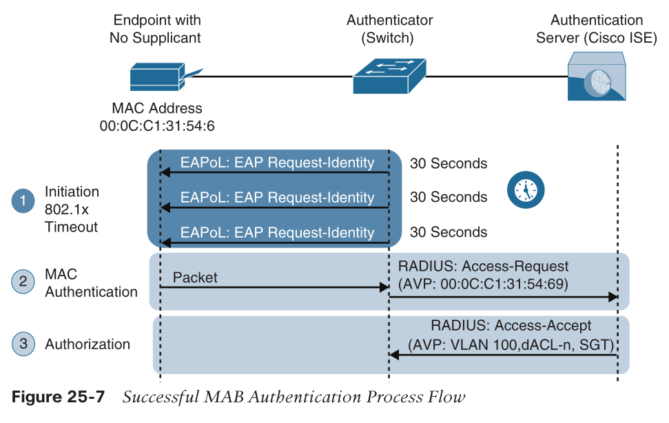

* as a fallback to 802.1x
  * if 802.1x is enabled
  * after 3x timeout (90s), switch from 802.1x to MAB
* MAC addr can be spoofed
  * limit the access
* authorization options
  * Downloadable ACLs (dACLs)
  * Dynamic VLAN assignment (dVLAN)
  * Security Group Tags (SGT) tags

### Web Authentication (WebAuth)

* fallback for MAB if both enabled
* used in hotels etc
* still need RADIUS
* two types of WebAuth:
  * Local Web Authentication
  * Centralized Web Authentication with Cisco ISE

#### Local Web Authentication (LWA)

* a locally hosted web portal running in the switch where username/password were entered
  * not customizable/brandable
* switch send to RADIUS server on behalf of user

> Cisco switches and a variety of third-party 802.1x-compliant switches have the option to assign a guest VLAN to endpoints that don’t have an 802.1x supplicant. 
> Many production deployments of 802.1x still use this legacy option to provide wired guests access to the Internet; 
> however, it is important to note that guest VLAN and LWA are mutually exclusive.

#### Central Web Authentication with Cisco ISE (CWA)

* support posture profiling, dACL, VLAN authorization
* also client provisioning, posture assessments, acceptable use policies, password changing, self-registration, and device registration
* process:
  1. The endpoint entering the network does not have a configured supplicant or the supplicant is misconfigured.
  2. The switch performs MAB, sending the RADIUS access-request to Cisco ISE (the authentication server).
  3. The authentication server (ISE) sends the RADIUS result, including a URL redirection, to the centralized portal on the ISE server itself.
  4. The endpoint is assigned an IP address, DNS server, and default gateway using DHCP.
  5. The end user opens a browser and enters credentials into the centralized web portal. Unlike with LWA, the credentials are stored in ISE and are tied together with the MAB coming from the switch.
  6. ISE sends a re-authentication change of authorization (CoA-reauth) to the switch.
  7. The switch sends a new MAB request with the same session ID to ISE. ISE sends the final authorization result to the switch for the end user, including an authorization option such as a downloadable ACL (dACL).

#### Enhanced Flexible Authentication (FlexAuth)

* allowing multiple authentication methods concurrently
  * no need to wait timeout for proceeded methods

### Cisco Identity-Based Networking Services (IBNS) 2.0

* offers authentication, access control, and user policy enforcement
* end-to-end access policy
* apply to wired / wireless
* combining
  * Enhanced FlexAuth (Access Session Manager)
  * Cisco Common Classification Policy Language (C3PL)
  * Cisco ISE

### Cisco TrustSec

* next-gen access control
  * VLANs
  * firewall/ACL rules
* use Security Group Tags (SGT) for 
  * ingress tagging
    * SGT delivered to the authenticator as an authorization option
  * egress filtering
    * allow or drop
    * at any egress point of the TrustSec network

#### SGT naming

* SGT tags represent the context of the user, device, use case, or function. 
* This means SGT tags are often named after particular roles or business use cases. 
  * For example, a corporate user with a Mac that successfully authenticates via 802.1x using EAP chaining could be assigned an SGT by ISE named `Mac_Corporate`. 
  * If the Mac is not compliant with posture requirements because it is not owned by the corporation, then it can be assigned an SGT named `Mac_Guest`.
* SGT has a corresponding SG ID, which will be in L2 header

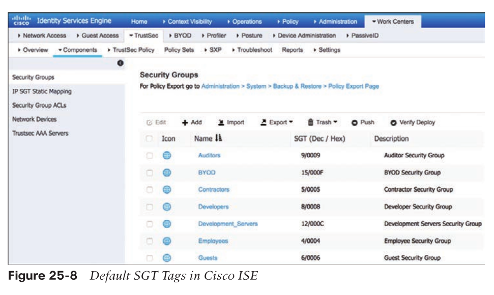

#### Ingress Classification

* Dynamic assignment
  * conventional networks
* Static assignment
  * data centers
    * no 802.1x needed
  * IP to SGT
  * subnet to SGT
  * VLAN to SGT tag
  * Layer 2 interface to SGT tag
  * Layer 3 logical interface to SGT tag
  * Port to SGT tag
  * Port profile to SGT tag

#### Propagation

* Inline tagging
  * only by Cisco network devices with ASIC support for TrustSec

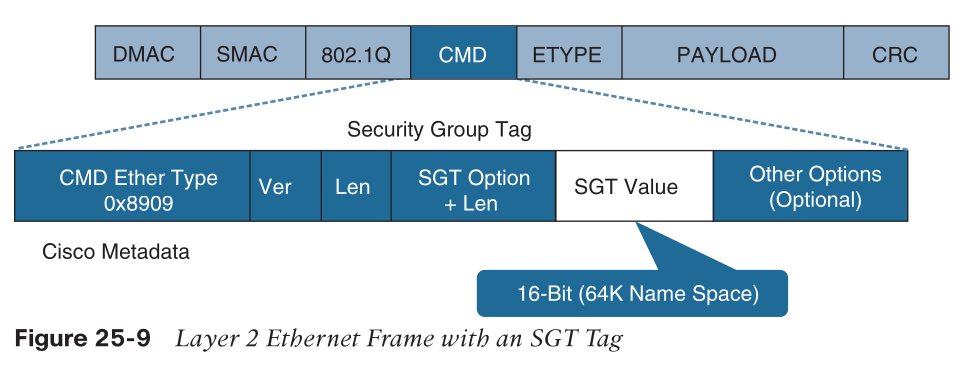

* SGT Exchange Protocol (SXP) propagation
  * TCP-based
  * peer-to-peer
  * for devices not supporting inline tagging
  * speaker
  * listener
* propagating IP-to-SGT mapping

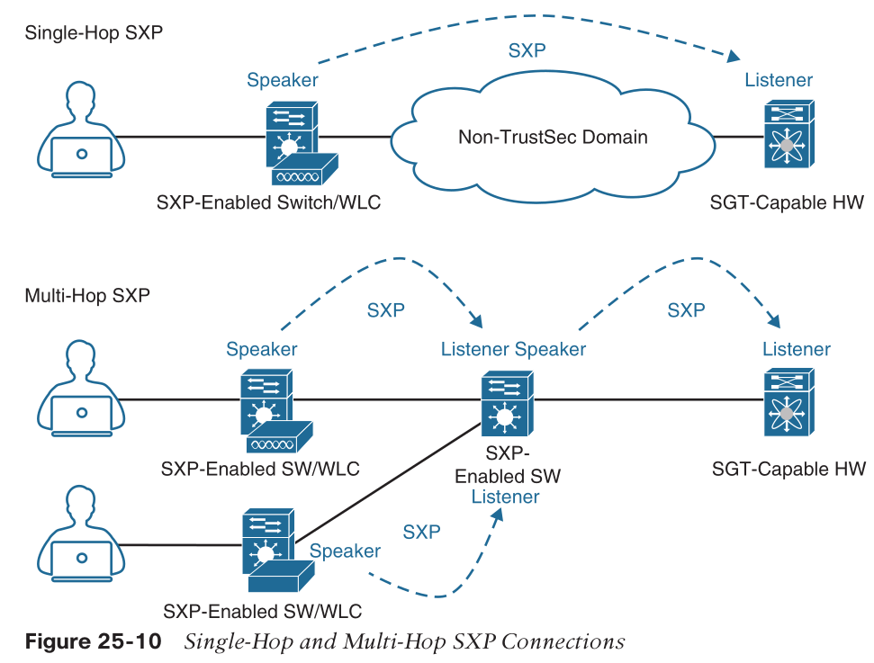

* SGT-capable HW will always tagging
* a database will be maintained at each SXP device

#### Egress Enforcement

* Security Group Firewall (SGFW)
  * tag-based rules defined locally on the firewall
* Security Group ACL (SGACL)
  * filtering based on source and destination SGT tags
    * src/dst acl matrix
    * can be more granular
      * e.g., only allow SSH

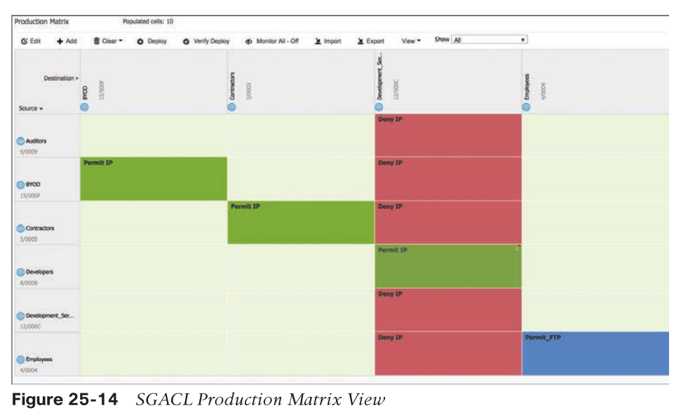

> Notice that traffic is blocked on egress and not on ingress.

* SGT based network segmentation
  * more granular than VLAN-based

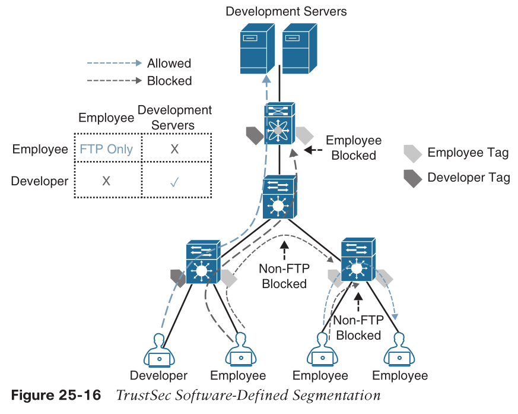

### MACsec

* 802.1AE

* hop-by-hop
  * only between MACsec peers
  * then decrypted to allow switches to look into SGT etc
* two keying protocols
  * Security Association Protocol (SAP)
    * cisco proprietary
    * only between switches
  * MACsec Key Agreement (MKA) protocol
    * manages session keys and encryption keys
    * supported between endpoints and the switch as well as between switches.

#### Frame header

* 16-byte MACsec Security Tag field (802.1AE header)
* 16-byte Integrity Check Value (ICV)

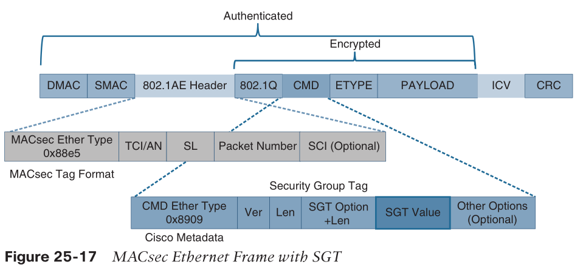

* TCI/AN (third octet): Tag Control Information/Association Number field, designating the version number if confidentiality or integrity is used on its own
* SL (fourth octet): Short Length field, designating the length of the encrypted data
* Packet Number (octets 5–8): The packet number for replay protection and building of the initialization vector
* SCI (octets 9–16): Secure Channel Identifier, for classifying the connection to the virtual port

#### Downlink MACsec

* encrypted link between an endpoint and a switch
* requires 
  * MACsec-capable switch
  * MACsec-capable supplicant on the endpoint (such as Cisco Secure Client)

#### Uplink MACsec

* encrypting a link between switches with 802.1AE
* by default, use SAP