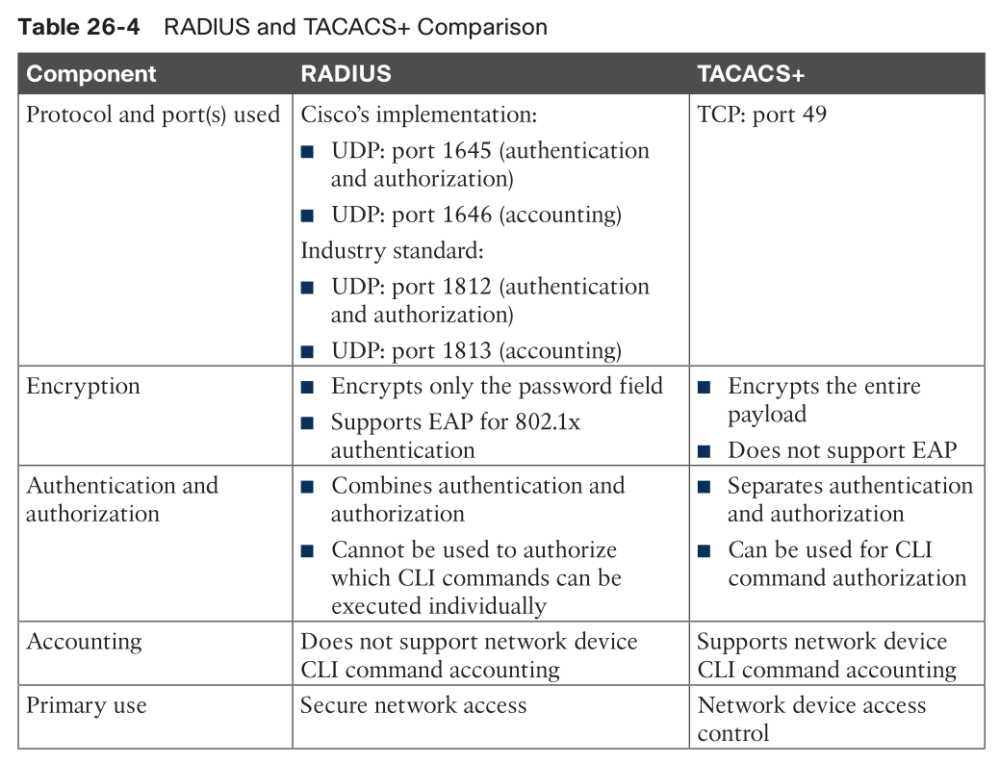
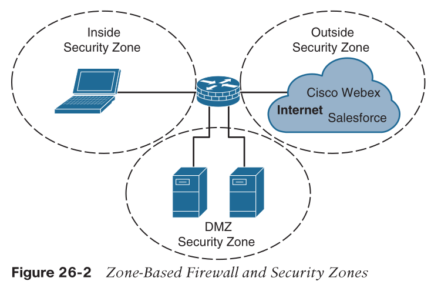

- [Access Control Lists (ACLs)](#access-control-lists-acls)
  - [Wildcard Mask](#wildcard-mask)
  - [Numbered standard ACLs](#numbered-standard-acls)
  - [Numbered extended ACLs](#numbered-extended-acls)
  - [Named ACLs](#named-acls)
  - [Port ACLs (PACLs)](#port-acls-pacls)
  - [VLAN ACLs (VACLs)](#vlan-acls-vacls)
  - [PACL, VACL, and RACL Interaction](#pacl-vacl-and-racl-interaction)
- [Terminal Lines and Password Protection](#terminal-lines-and-password-protection)
  - [Password Types](#password-types)
  - [Username and Password Authentication](#username-and-password-authentication)
  - [Config](#config)
    - [line local password](#line-local-password)
    - [line local username and password](#line-local-username-and-password)
    - [Privilege Levels and Role-Based Access Control (RBAC)](#privilege-levels-and-role-based-access-control-rbac)
      - [EXEC Idle Timeout](#exec-idle-timeout)
      - [absolute timeout](#absolute-timeout)
    - [Controlling Telnet/SSH Access to vty Lines](#controlling-telnetssh-access-to-vty-lines)
      - [Enabling SSH vty Access](#enabling-ssh-vty-access)
- [Authentication, Authorization, and Accounting (AAA)](#authentication-authorization-and-accounting-aaa)
  - [TACACS+](#tacacs)
  - [RADIUS](#radius)
  - [Config](#config-1)
- [Zone-Based Firewall (ZBFW)](#zone-based-firewall-zbfw)
  - [Config](#config-2)
- [Control Plane Policing (CoPP)](#control-plane-policing-copp)
- [Device Hardening](#device-hardening)

# Access Control Lists (ACLs)

* sequential lists of access control entries (ACEs)
* start at lowest seq, proceed down
* stop when there is a match
* implicit deny at the end
* no effect until 
  * applied to interface
    * also need direction (in / out)
    * Cisco routers allow only one inbound ACL and one outbound ACL per interface.
  * used for other services
    * route maps
    * class maps
    * NAT
    * SNMP
    * vty line
    * traffic classifier

## Wildcard Mask

* ACL use wildcard masks instead of subnet masks
  * wildcard mask = inverted subnet mask = 255.255.255.255 - subnet mask
  * subnet mask: 255.255.255.0
  * wildcard mask: 0.0.0.255
    * 0: exactly
    * 255: anything between 0 to 255

## Numbered standard ACLs

* solely based on the source network
* 1–99 and 1300–1999.
* `any` = `0.0.0.0 255.255.255.255`
* `host` = `<ip> 0.0.0.0`

```
! access-list <acl-number> { deny | permit } <source> [<source-wildcard>] [log]

R1(config)# access-list 1 deny 172.16.0.0 0.0.255.255
R1(config)# access-list 1 deny host 192.168.1.1
R1(config)# access-list 1 permit any
R1(config)# interface GigabitEthernet0/1
R1(config-if)# ip access-group 1 in
```

## Numbered extended ACLs

* based on source, destination, protocol, port, or a combination of other packet attributes
* 100–199 and 2000–2699.

```
! access-list <acl-number> {deny|permit} <protocol> <source> <source-wildcard> [ <operator> <port> ]
<destination> <destination-wildcard> [ <operator> <port> ] [<protocol-options>] [log | log-input]

R1(config)# access-list 100 deny tcp any any eq 23
R1(config)# access-list 100 deny icmp any any
R1(config)# access-list 100 deny ip host 10.1.2.2 host 10.1.2.1
R1(config)# access-list 100 permit ip any any
R1(config)# interface GigabitEthernet0/1
R1(config-if)# ip access-group 100 in
```
* `protocol`:
  * `ip`: Any IP protocol.
  * `tcp`, `udp`: For TCP/UDP traffic.
  * `icmp`: For ping and other ICMP messages.
* `operator`: 
  * for TCP/UDP, `eq`, `lt`, and `gt` keywords to match the port
  * order matters
    * `20 permit tcp any eq 1719 any`
      * any to any subnets with _source_ port 1719
    * `access-list 110 permit tcp 192.168.1.0 0.0.0.255 10.10.10.0 0.0.0.255 eq 80`
      * permits TCP traffic from the `192.168.1.0/24` subnet to reach the `10.10.10.0/24` subnet on _dest._ port 80
    > * If the operator is positioned after the source and source-wildcard , it must match the source port.
    > * If the operator is positioned after the destination and destination-wildcard , it must match the destination port.
    > -- [cisco doc on ACL](https://www.cisco.com/c/en/us/td/docs/ios-xml/ios/security/a1/sec-a1-cr-book/sec-cr-a2.html#wp4698537840)

## Named ACLs

* functionality same as numbered ACL

```
R1(config)# ip access-list standard STANDARD_ACL
R1(config-std-nacl)# deny 172.16.0.0 0.0.255.255
R1(config-std-nacl)# deny host 192.168.1.1
R1(config-ext-nacl)# permit any
R1(config-ext-nacl)# exit
R1(config)# interface GigabitEthernet0/1
R1(config-if)# ip access-group STANDARD_ACL in

R1(config)# ip access-list extended EXTENDED_ACL
R1(config-ext-nacl)# deny tcp any any eq 23
R1(config-ext-nacl)# deny icmp any any
R1(config-ext-nacl)# deny ip host 10.1.2.2 host 10.1.2.1
R1(config-ext-nacl)# permit ip any any
R1(config-ext-nacl)# exit
R1(config)# interface GigabitEthernet0/1
R1(config-if)# ip access-group EXTENDED_ACL in
```


## Port ACLs (PACLs)

* support MAC address ACLs
* in addition to L3 filtering
* limitations
  * only support incoming traffic
  * only in hardware
  * no support to filter IPv6

```
R1(config)# ip access-list extended PACL
R1(config-ext-nacl)# deny tcp any any eq 23
R1(config-ext-nacl)# deny icmp any any
R1(config-ext-nacl)# deny ip host 10.1.2.2 host 10.1.2.1
R1(config-ext-nacl)# permit ip any any
R1(config-ext-nacl)# exit
R1(config)# interface GigabitEthernet0/1
R1(config-if)# switchport
R1(config-if)# ip access-group PACL in
```

## VLAN ACLs (VACLs)

* filter traffic
  * bridged within a VLAN, or 
  * routed into or out of a VLAN
* `vlan access-map`consists of one or more
  * `match`
  * `action`
* apply to vlan(s)
  * `vlan filter <vlan-access-map-name> <vlan-list>`
  * `vlan-list` e.g.: `20`, `5-30`, `1,2–4,6`

```
SW1(config)# ip access-list extended ICMP
SW1(config-ext-nacl)# permit icmp any any
SW1(config-ext-nacl)# exit
SW1(config)# ip access-list extended TELNET
SW1(config-ext-nacl)# permit tcp any any eq 23
SW1(config-ext-nacl)# exit
SW1(config)# ip access-list extended OTHER
SW1(config-ext-nacl)# permit ip any any
SW1(config-ext-nacl)# exit
SW1(config)# vlan access-map VACL_20 10
SW1(config-access-map)# match ip address ICMP
SW1(config-access-map)# action drop
SW1(config-access-map)# exit
SW1(config)# vlan access-map VACL_20 20
SW1(config-access-map)# match ip address TELNET
SW1(config-access-map)# action drop log
SW1(config-access-map)# exit
SW1(config)# vlan access-map VACL_20 30
SW1(config-access-map)# match ip address OTHER
SW1(config-access-map)# action forward
SW1(config)# vlan filter VACL_20 vlan-list 20
```

## PACL, VACL, and RACL Interaction

* Bridged traffic processing order (within the same VLAN)
  1. Inbound PACL on the switch port (for example, VLAN 10)
  2. Inbound VACL on the VLAN (for example, VLAN 10)
  3. Outbound VACL on the VLAN (for example, VLAN 10)
* Routed traffic processing order (across VLANs)
  1. Inbound PACL on the switch port (for example, VLAN 10)
  2. Inbound VACL on the VLAN (for example, VLAN 10)
  3. Inbound ACL on the SVI (for example, SVI 10)
  4. Outbound ACL on the SVI (for example, SVI 20)
  5. Outbound VACL on the VLAN (for example, VLAN 20)

> Downloadable ACLs (dACLs) are another form of PACL that can be assigned dynamically by a RADIUS authentication server, such as Cisco ISE
> if a PACL is configured on a switch port and a dACL is assigned by Cisco ISE on the same switch port, the dACL overwrites the PACL.

# Terminal Lines and Password Protection

* 3 console lines
  * `show running-config | section line`
  * console port: `cty`
    * `line con 0`
    * local access via a console terminal
  * auxiliary port: `aux`
    * `line aux 0`
    * remote access via a modem
    * should be disabled in most cases
      * `no exec` under line aux 0
  * virtual terminal: `vty`
    * `line vty 0 4`
    * remote telnet/ssh
* protect lines
  * password configured directly on the line
  * username-based authentication
  * AAA server

## Password Types

* ordered by evolution
* type 0
  * plaintext
  * `enable password`
  * `username password`
  * `line password`
* type 7
  * use a cisco encryption
    * very weak
    * online tools can decrypt in a sec
  * `service password-encryption`
    * encrypt passwords in config and telnet session
* type 4
  * deprecated
* type 5
  * use MD5 hashing
  * still weak
  * `enable secret`
* type 8
  * use the Password-Based Key Derivation Function 2 (PBKDF2) with a SHA-256 hashed secret and password salting
  * recommended
* type 9
  * use the scrypt hashing algorithm and password salting
  * recommended by cisco

## Username and Password Authentication

* 3 ways
  * type 0: `username {username} password {password}`
  * type 5: `username {username} secret {password}`
  * type 5/8/9: `username {username} algorithm-type {md5 | sha256 | scrypt} secret {password}`

## Config

### line local password

* either type 0 or 7
* not recommended

```
line con 0
  password My.C0n5ole.P@s5
  login
line aux 0
  password My.AuX.P@s5
  login
line vty 0 4
  password My.vTy.P@s5
  login
```

### line local username and password

* to enable username-based authentication
  * `login local` under line configuration mode 

```
! type 5 hashed password: $1$<salt>$<hashed_password>
! e.g.: $1$b1Ju$kZbBS1Pyh4QzwXyZ1kSZ2/
!       - $1$: MD5 with a salt
!       - b1Ju: salt
!       - kZbBS1Pyh4QzwXyZ1kSZ2/: hashed password
username type5 secret 5 $1$b1Ju$kZbBS1Pyh4QzwXyZ1kSZ2/
username type9 secret 9 $9$vFpMf8elb4RVV8$seZ/bDAx1uV4yH75Z/nwUuegLJDVCc4UXOAE83JgsOc
!
! Output Omitted for Brevity
line con 0
  login local
line aux 0
  login local
line vty 0 4
  login local
```

### Privilege Levels and Role-Based Access Control (RBAC)

* level 0: includes the `disable`, `enable`, `exit`, `help`, and `logout` commands.
* level 1: _User EXEC_ mode. cannot make configuration changes
* level 15: _Privileged EXEC_ mode. the highest privilege level
* level 2-14: customized access control
  * `privilege {mode} level {level} {com-mand string}

```
R1(config)# username noc privilege 5 algorithm-type scrypt secret cisco123
R1(config)# privilege exec level 5 configure terminal
R1(config)# privilege configure level 5 interface
R1(config)# privilege interface level 5 shutdown
R1(config)# privilege interface level 5 no shutdown
R1(config)# privilege interface level 5 ip address

R1# show privilege
```

* centralized solution
  * use AAA server (Cisco ISE), via TACACS+ protocol
  * local user config as fallback

#### EXEC Idle Timeout

* default: 10 minutes
* change default
```
line con 0
  ! 5 min 0 sec
  exec-timeout 5 0
line vty 0 4
  ! 2 min 30 sec
  exec-timeout 2 30
  ! disable EXEC timeout
  ! exec-timeout 0 0
  ! or
  ! no exec-timeout
```

#### absolute timeout

* regardless of idle or active session

```
line vty 4
  exec-timeout 2 0
  ! logging out user after 10 minutes whatsoever 
  absolute-timeout 10
  ! give a warning 20 seconds before logging user out
  logout-warning 20
```

### Controlling Telnet/SSH Access to vty Lines

* allow only trusted IP addresses to access vty
  * `access-class {access-list-number|access-list-name} {in|out}`
  ```
  R2(config)# access-list 1 permit 10.12.1.0 0.0.0.255
  R2(config)# line vty 0 4
  R2(config-line)# access-class 1 in
  R2(config-line)# end
  ```
* allow only ssh
  * `transport input {all | none | telnet | ssh}`
    * `all`: both telnet and ssh
    * `none`: neither telnet nor ssh
  * `show line`

#### Enabling SSH vty Access

* configure `hostname` and `domain-name`
* generate rsa keys
  * hostname
  * domain name
  * keygen

```
R1(config)# hostname R1
R1(config)# ip domain-name cisco.com
R1(config)# crypto key generate rsa
...
! min modulus length: 768
! recommended length: 2048
How many bits in the modulus [512]: 768
```

* force use only sshv2
  * `ip ssh version 2`

# Authentication, Authorization, and Accounting (AAA)

* Authentication: _who are you?_
* Authorization: _what are you allowed/prohibited?_
* Accounting: _you've been watched_
* requires a _protocol_ designed to carry authentication requests and responses, including authorization results and accounting logs
  * popular protocols:
    * Remote Authentication Dial-In User Service (RADIUS)
    * Terminal Access Controller Access-Control System Plus (TACACS+)
* used for
  * device access control
  * network access control

## TACACS+

* TCP, port 49
* since 1990s
* client/server
  * switch as client
* mainly for device access control
  * TACACS+ can request authorization separately
    * a switch can request a TACACS+ server to authorize every command a user try to execute
    * RADIUS needs to return all authorization parameters in a single reply
* separate AAA into independent functions

## RADIUS

* IETF standard
* used for network access control
  * supports 802.1x/EAP



> starting with ISE 2.0, ISE has taken over as Cisco’s AAA server for both RADIUS and TACACS+.

## Config

1. create a local user with pri. 15 as fallback
2. enable AAA
```
aaa new-model
```
3. add TACACS+ server
```
! IOS XE versions prior to 16.12.2
tacacs-server host { <hostname> | <host-ip-address> } key <key-string>

! IOS XE versions 16.12.2 and later
tacacs server <name>
address ipv4 { <hostname> | <host-ip-address> }
key <key-string>
```
4. create AAA group
```
aaa group server tacacs+ <group-name>
server name <server-name>
! multiple servers can be added here for fallover
```
5. enable AAA login authentication
```
aaa authentication login { default | <custom-list-name> } <method1> [ <method2> ... ]
! e.g.:
aaa authentication login default group ISE-TACACS+ local enable
! first try method1: ISE-TACACS+ server group
! then try method2: local user
! if all fails, simply enable privileged EXEC mode
```
6. enable AAA authorization for EXEC
```
aaa authorization exec { default | <custom-list-name> } <method1> [ <method2> ... ]
```
7. enable AAA authorization for the console
```
aaa authorization console
! Authorization for the console is disabled by default
```
8. enable AAA command authorization
```
aaa authorization commands {<privilege level>} { default | <custom-list-name> } <method1> [ <method2> ... ]
```
9. enable command authorization in global configuration mode
```
aaa authorization config-commands
```
10. enable login accounting
```
aaa accounting exec { default | <custom-list-name> } { start-stop | stop-only | wait-start } <method1> [ <method2> ... ]
! start-stop: start accounting when session starts, stop when session ends
```
11. enable command accounting
```
aaa accounting command {<privilege level>} { default | <custom-list-name> } { start-stop | stop-only | wait-start } <method1> [ <method2> ... ]
```

> recommended to include the `if-authenticated` method at the end of every single authorization command to allow all commands to be authorized as long as the user has successfully authenticated locally
> so that at fallback, no need to try TACACS+ for authorization

```
aaa new-model
tacacs server ISE-PRIMARY
  address 10.10.10.1
  key my.S3cR3t.k3y
tacacs server ISE-SECONDARY
  address 20.20.20.1
  key my.S3cR3t.k3y
aaa group server tacacs+ ISE-TACACS+
  server name ise-primary
  server name ise-secondary
aaa authentication login default group ISE-TACACS+ local
aaa authentication login CONSOLE-CUSTOM-AUTHENTICATION-LIST local line enable
aaa authentication enable default group ISE-TACACS+ enable
aaa authorization exec default group ISE-TACACS+ if-authenticated
! define a named method list for EXEC 
aaa authorization exec CONSOLE-CUSTOM-EXEC-AUTHORIZATION-LIST none
aaa authorization commands 0 CONSOLE-CUSTOM-COMMAND-AUTHORIZATION-LIST none
aaa authorization commands 1 CONSOLE-CUSTOM-COMMAND-AUTHORIZATION-LIST none
aaa authorization commands 15 CONSOLE-CUSTOM-COMMAND-AUTHORIZATION-LIST none
aaa authorization commands 0 default group ISE-TACACS+ if-authenticated
aaa authorization commands 1 default group ISE-TACACS+ if-authenticated
aaa authorization commands 15 default group ISE-TACACS+ if-authenticated
aaa authorization console
aaa authorization config-commands
aaa accounting exec default start-stop group ISE-TACACS+
aaa accounting commands 0 default start-stop group ISE-TACACS+
aaa accounting commands 1 default start-stop group ISE-TACACS+
aaa accounting commands 15 default start-stop group ISE-TACACS+
line con 0
  authorization commands 0 CONSOLE-CUSTOM-COMMAND-AUTHORIZATION-LIST
  authorization commands 1 CONSOLE-CUSTOM-COMMAND-AUTHORIZATION-LIST
  authorization commands 15 CONSOLE-CUSTOM-COMMAND-AUTHORIZATION-LIST
  authorization exec CONSOLE-CUSTOM-EXEC-AUTHORIZATION-LIST
  privilege level 15
  login authentication CONSOLE-CUSTOM-AUTHENTICATION-LIST
line vty 0 4
  <uses default method-lists for AAA>
```

> the AAA server also needs to be configured with the AAA client information (hostname, IP address, and key), the login credentials for the users, and the commands the users are authorized to execute on the device.

# Zone-Based Firewall (ZBFW)

* stateful fw
* included in IOS XE
* security zones
  * ports assigned to a zone
    * M ports -> 1 zone
  * traffic between zones will be policy-ed
    * traffic from a non-security zone to a security zone will be dropped



* two built-in zones
  * self
    * include all ports/ip addresses
    * ssh/snmp/routing protocol traffic is allowed w/o policy-ed
  * default
    * any ports not a member of any zone goes here

## Config

```
! define security zone
Zone security OUTSIDE
  description OUTSIDE Zone used for Internet Interface

! define ACL
ip access-list extended ACL-IPSEC
  permit udp any any eq non500-isakmp
  permit udp any any eq isakmp
ip access-list extended ACL-PING-AND-TRACEROUTE
  permit icmp any any echo
  permit icmp any any echo-reply
  permit icmp any any ttl-exceeded
  permit icmp any any port-unreachable
  permit udp any any range 33434 33463 ttl eq 1
ip access-list extended ACL-ESP
  permit esp any any
ip access-list extended ACL-DHCP-IN
  permit udp any eq bootps any eq bootpc
ip access-list extended ACL-GRE
  permit gre any any

! define inspection class map
class-map type inspect match-any CLASS-OUTSIDE-TO-SELF-INSPECT
  match access-group name ACL-IPSEC
  match access-group name ACL-PING-AND-TRACEROUTE
class-map type inspect match-any CLASS-OUTSIDE-TO-SELF-PASS
  match access-group name ACL-ESP
  match access-group name ACL-DHCP-IN
  match access-group name ACL-GRE

! define inspection policy map
policy-map type inspect POLICY-OUTSIDE-TO-SELF
  class type inspect CLASS-OUTSIDE-TO-SELF-INSPECT
    inspect
  class type inspect CLASS-OUTSIDE-TO-SELF-PASS
    pass
  class class-default
    drop

! apply policy map
zone-pair security OUTSIDE-TO-SELF source OUTSIDE destination self
  service-policy type inspect POLICY-OUTSIDE-TO-SELF

! add interface to security zone
interface GigabitEthernet 0/2
  zone-member security OUTSIDE

! verify
R1# show policy-map type inspect zone-pair
R1# show ip access

! won't work because traffic from self to outside is blocked
! by default, traffic won't be allowed from one zone to another

! more ACL
ip access-list extended ACL-DHCP-OUT
  permit udp any eq bootpc any eq bootps
ip access-list extended ACL-ICMP
  permit icmp any any

! more class-map
class-map type inspect match-any CLASS-SELF-TO-OUTSIDE-INSPECT
  match access-group name ACL-IPSEC
  match access-group name ACL-ICMP
class-map type inspect match-any CLASS-SELF-TO-OUTSIDE-PASS
  match access-group name ACL-ESP
  match access-group name ACL-DHCP-OUT

! more policy-map
policy-map type inspect POLICY-SELF-TO-OUTSIDE
  class type inspect CLASS-SELF-TO-OUTSIDE-INSPECT
    inspect
  class type inspect CLASS-SELF-TO-OUTSIDE-PASS
    pass
  class class-default
    drop log

! apply new policy-map
zone-pair security SELF-TO-OUTSIDE source self destination OUTSIDE
  service-policy type inspect POLICY-SELF-TO-OUTSIDE
```

# Control Plane Policing (CoPP)

* QoS policy to control plane traffic
  * limit traffic to a given rate
  * limit traffic goes to CPU
* have to be careful b/c it is control traffic
  * measure then police
  * `violate` action is set to `transmit` for all the vital classes until a baseline for normal traffic flows is established. 
    * over time, the rate can be adjusted. 
  * Cisco Embedded Packet Capture (EPC)
    * capture traffic and export to PCAP files
* any traffic not explicitly permitted in the policy will be dropped by default if the policy has an implicit deny any at the end.

```
! ACL
ip access-list extended ACL-CoPP-ICMP
  permit icmp any any echo-reply
  permit icmp any any ttl-exceeded
  permit icmp any any unreachable
  permit icmp any any echo
  permit udp any any range 33434 33463 ttl eq 1
!
ip access-list extended ACL-CoPP-IPsec
  permit esp any any
  permit gre any any
  permit udp any eq isakmp any eq isakmp
  permit udp any any eq non500-isakmp
  permit udp any eq non500-isakmp any
!
ip access-list extended ACL-CoPP-Initialize
  permit udp any eq bootps any eq bootpc
!
ip access-list extended ACL-CoPP-Management
  permit udp any eq ntp any
  permit udp any any eq snmp
  permit tcp any any eq 22
  permit tcp any eq 22 any established
!
ip access-list extended ACL-CoPP-Routing
  permit tcp any eq bgp any established
  permit eigrp any host 224.0.0.10
  permit ospf any host 224.0.0.5
  permit ospf any host 224.0.0.6
  permit pim any host 224.0.0.13
  permit igmp any any
!
! does not classify unicast routing protocol packets such as 
! unicast PIM, unicast OSPF, and unicast EIGRP.
! so those traffic will not match any ACL here.
!
! Class-map
class-map match-all CLASS-CoPP-IPsec
  match access-group name ACL-CoPP-IPsec
class-map match-all CLASS-CoPP-Routing
  match access-group name ACL-CoPP-Routing
class-map match-all CLASS-CoPP-Initialize
  match access-group name ACL-CoPP-Initialize
class-map match-all CLASS-CoPP-Management
  match access-group name ACL-CoPP-Management
class-map match-all CLASS-CoPP-ICMP
  match access-group name ACL-CoPP-ICMP
!
! Policy-map
policy-map POLICY-CoPP
  class CLASS-CoPP-ICMP
    police 8000 conform-action transmit exceed-action transmit violate-action drop
  class CLASS-CoPP-IPsec
    police 64000 conform-action transmit exceed-action transmit violate-action transmit
  class CLASS-CoPP-Initialize
    police 8000 conform-action transmit exceed-action transmit violate-action drop
  class CLASS-CoPP-Management
    police 32000 conform-action transmit exceed-action transmit violate-action transmit
  class CLASS-CoPP-Routing
    police 64000 conform-action transmit exceed-action transmit violate-action transmit
  class class-default
    police 8000 conform-action transmit exceed-action transmit violate-action drop
!
! under normal conditions, nothing should exist within the class-default
!
! Apply
control-plane
  service-policy input POLICY-CoPP
```

* monitoring

```
R1# show policy-map control-plane input
...
Class-map: CLASS-CoPP-Routing (match-all)
  92 packets, 123557 bytes
  5 minute offered rate 4000 bps, drop rate 0000 bps
  Match: access-group name ACL-CoPP-Routing
  police:
    cir 64000 bps, bc 2000 bytes, be 2000 bytes
    conformed 5 packets, 3236 bytes; actions: transmit
    exceeded 1 packets, 1383 bytes; actions: transmit
    violated 86 packets, 118938 bytes; actions: transmit
    conformed 1000 bps, exceeded 1000 bps, violated 4000 bps
...
```
* policer: `cir 64000 bps, bc 2000 bytes, be 2000 bytes`
  * CIR (Committed Information Rate)
  * BC (Committed Burst Size)
  * BE (Excess Burst Size)
  * Traffic below CIR: Forwarded without penalty.
  * Traffic within CIR + BC: Forwarded but may be marked as "exceed."
  * Traffic exceeding CIR + BC + BE: marked as "violated.", maybe dropped.
* stats: `5 minute offered rate 4000 bps, drop rate 0000 bps`
  * in the last 5 min,
    * avg rate of receiving traffic in this class is 4Kbps
    * avg drop rate is 0
 
# Device Hardening

* disable unused sevices
* for internet-facing interfaces
  * Disable topology discovery tools
    * Cisco Discovery Protocol (CDP)
      * `no cdp enable`
    * Link Layer Discovery Protocol (LLDP)
      * `no lldp transmit`, `no lldp receive`
  * Disable IP redirect services
    * router sends an ICMP redirects if it detects network traffic hairpinning on it
    * `no ip redirects`
  * Disable proxy ARP
    * proxy actual router to respond ARP requests
    * `no ip proxy-arp`
* services
  * Disable service configuration
    * auto config from a TFTP server
    * `no service config`
  * Disable the Maintenance Operation Protocol (MOP) service
    * not needed anymore
    * `no mop enabled`
  * Disable the packet assembler/disassembler (PAD) service
    * for X.25
    * `no service pad`
* Enable keepalives for TCP sessions
  * `service tcp-keepalive-in`
  * `service tcp-keepalive-out`
  * inactive tcp sessions will be removed
