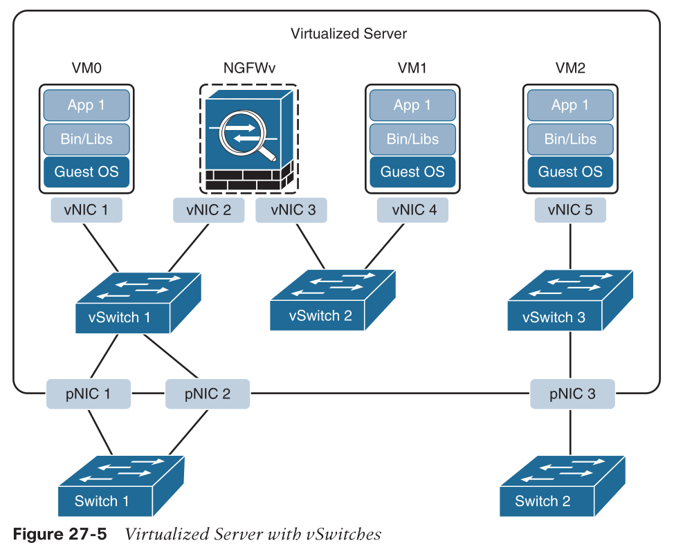
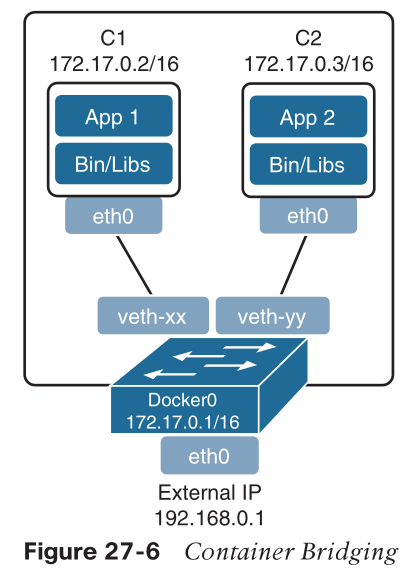
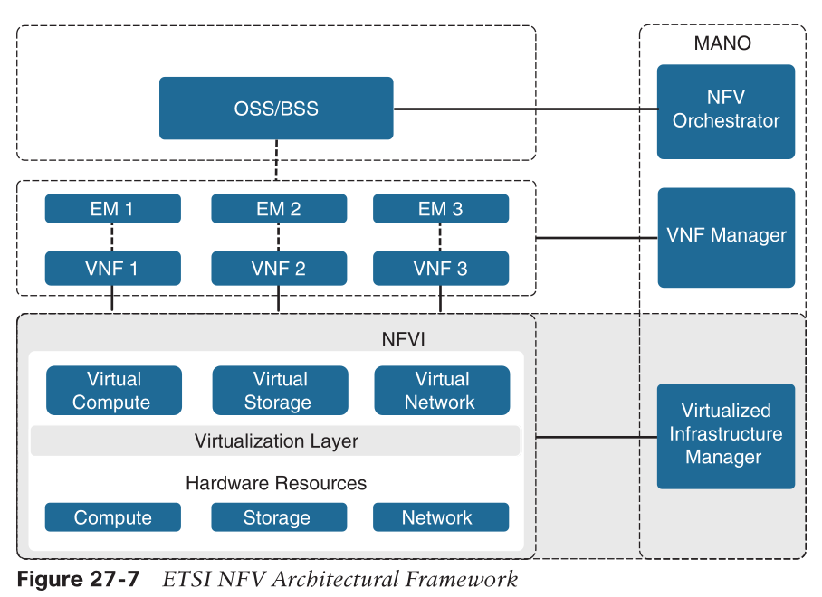
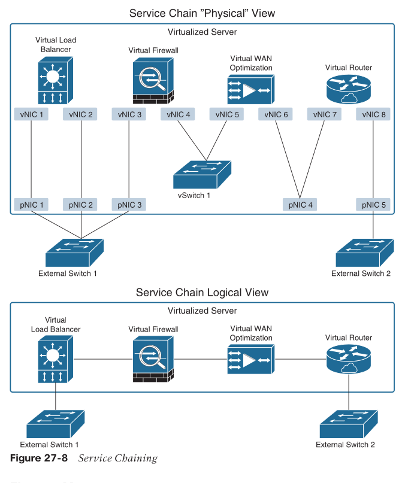
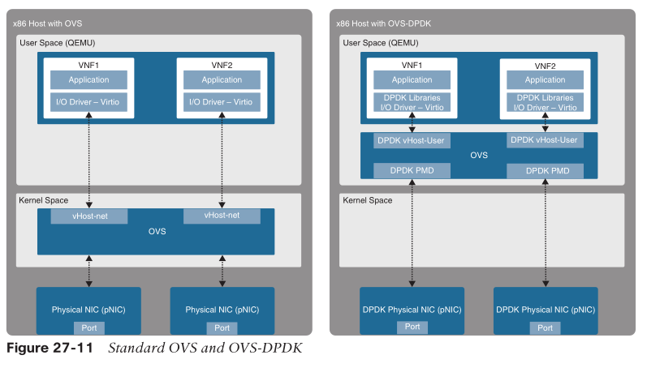
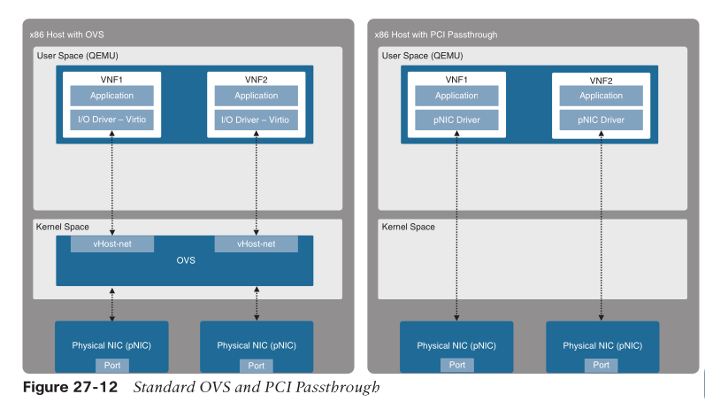
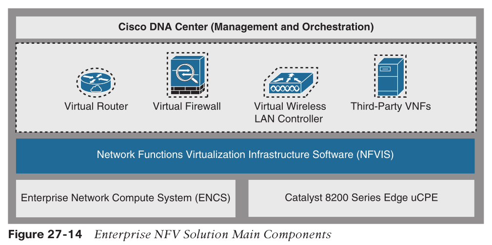
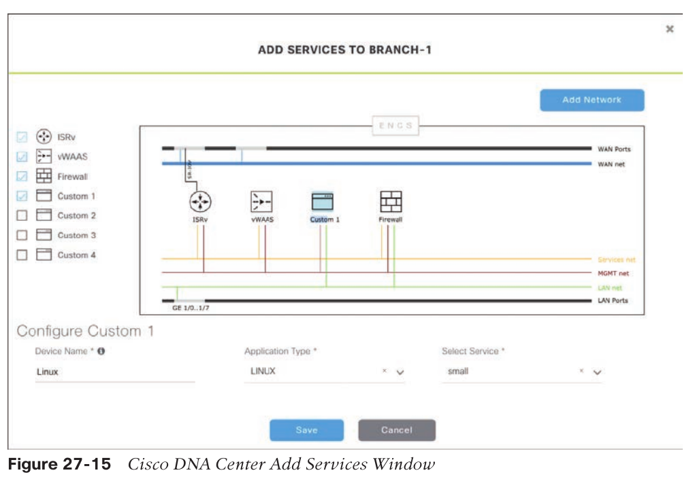

# Server Virtualization

* resources underutilized
  * single server -> single OS -> single application

## Hypervisors/VM

* type 1: bare mental/native
* type 2: on a host OS
* VM migration
  * one of key features

## containers

* isolated environment in which app and its dependencies (bin/libs) are running
* sharing the underlying resources
* container engines
  * rkt (pronounced “rocket”)
  * Open Container Initiative
  * LXD (pronounced “lexdi”), from Canonical Ltd.
  * Linux-VServer
  * Windows Containers

## vSwitch

* software-based layer-2 switch that operates like a physical Ethernet switch
  * enables VMs to communicate with each other
  * enables VMs to communicate with external physical networks via pNICs
* traffic cannot flow from one vSwitch to another
  * need go through some sort of VNF like NGFWv
* vSwitches cannot share the same pNIC
* popular ones
  * Open vSwitch (OVS)
  * VMware’s vSphere Standard Switch (VSS), the vSphere Distributed Switch (VDS),
  and the NSX vSwitch
  * Microsoft Hyper-V Virtual Switch
  * Libvirt Virtual Network Switch

* distributed virtual switching
  * no need to configure each individual vSwitch
  * behave as a single distributed vSwitch
    * centralized management
      * simplify the admin
      * consistent config
    * migrate network stats and policies when VM migrates
* containers
  * vSwitch = virtual bridge
  * docker0: 172.17.0.0/16
  * if need talk to containers in a different node, need routing or overlay
    * or use an orchestrator like k8s

# Network Functions Virtualization (NFV)

* a standard architectural framework created by the European Telecommunications Standards Institute (ETSI)
  * to decouple network functions from proprietary hardware-based appliances
  * to run network functions on a standard x86 servers
  * also defines how to manage and orchestrate the network functions

## Architecture

### Network function (NF)

* the function performed by a physical appliance, such as a firewall or a router function.

### NFV infrastructure (NFVI)

* all the hardware and software components that comprise the platform environment in which virtual network functions (VNFs) are deployed

### Virtual Network Function (VNF)

* software version of an NF
* typically runs as a VM
* commonly used for Layer 4 through Layer 7 functions
  * load balancers (LBs)
  * application delivery controllers (ADCs)
  * firewalls
  * intrusion detection systems (IDSs)
  * WAN optimization appliances
* also can perform Layer 2 and Layer 3 functions, such as those provided by routers and switches.
* examples of Cisco VNFs:
  * Cisco Catalyst 8000V
  * Cisco Secure Firewall ASA Virtual
  * Cisco Secure Firewall Threat Defense Virtual

### Virtualized Infrastructure Manager (VIM)

* manage and control the NFVI hardware __resources__ (compute, storage, and network) and the virtualized resources
* collect of performance measurements and fault information
* perform lifecycle management (setup, maintenance, and teardown) of all NFVI resources as well as VNF service chaining

### Service chaining

* connecting two or more VNFs in a chain to provide an NFV service or solution

### Element managers (EMs) / element management systems (EMSs)

* functional management of VNFs
  * perform fault, configuration, accounting, performance, and security (FCAPS) functions for VNFs
* A single EM can manage one or multiple VNFs
* an EM can also be a VNF

### Management and Orchestration (MANO)

* __NFV orchestrator__: creating, maintaining, and tearing down VNF network services
* __VNF manager__: manages the lifecycle of one or multiple VNFs as well as FCAPS for the virtual components of a VNF

### Operations Support System (OSS)/Business Support System (BSS)

* OSS:
  * a platform typically operated by service providers (SPs) and large enterprise networks
  * maintaining network inventory, provisioning new services, configuring network devices, and resolving network issues
* BSS:
  * combination of product management, customer management, revenue management (billing), and order management systems

## VNF Performance

* traffic patterns:
  * north-south: VNF <-> pNIC (physical NIC)
  * east-west: VNF <-> VNF
* virtualization overhead
  * hypervisor/vSwitch
* OVS receiving packets:
    1. Data traffic is received by the __pNIC__ and placed into an __Rx queue__ (ring buffers) within the pNIC.
    2. The pNIC sends the packet and a packet descriptor to the __main memory buffer__ through DMA. The packet descriptor includes only the memory location and size of the packet.
    3. The pNIC sends an IRQ to the CPU.
    4. The CPU transfers control to the pNIC driver, which services the IRQ, receives the packet, and moves it into the network stack, where it eventually arrives in a socket and is placed into a __socket receive buffer__.
    5. The packet data is copied from the socket receive buffer to the __OVS virtual switch data buffer__.
    6. OVS processes the packet and forwards it to the VM. This entails switching the packet between the kernel and user space, which is expensive in terms of CPU cycles.
    7. The packet arrives at the virtual NIC (__vNIC__) of the VM and is placed into an __Rx queue__.
    8. The vNIC sends the packet and a packet descriptor to the __virtual memory buffer__ through DMA.
    9. The vNIC sends an IRQ to the vCPU.
    10. The vCPU transfers control to the vNIC driver, which services the IRQ, receives the packet, and moves it into the network stack, where it eventually arrives in a socket and is placed into a __socket receive buffer__.
    11. The packet data is copied and sent to the __application__ in the VM.
* IRQ storm
  * any activity the CPU is doing must be stopped
  * the state must be saved
  * the interrupt must be processed
  * the original process must be restored
* improvements
  * OVS Data Plane Development Kit (OVS-DPDK)
  * PCI passthrough
  * Single-root I/O virtualization (SR-IOV)

### OVS-DPDK

* OVS with DPDK in user space
* DPDK Poll Mode Driver (PMD)
  * poll data directly from pNIC
  * data from pNIC directly go to userspace then VNF
  * bypass kernel network stack
  * no need for IRQ
* need one or more CPU core dedicate to PMD

### PCI passthrough

* map a pNIC to one VNF
  * exclusive use of pNIC by VNF

### SR-IOV

* enhancement to PCI passthrough that allows multiple VNFs to share the same pNIC
  * like VM to real machine
* emulates multiple PCIe devices on a single PCIe device
  * _virtual functions (VFs)_: emulated PCIe devices are called , and the 
  * _physical functions (PFs)_: physical PCIe devices
* VNFs have direct access to the VFs, using PCI passthrough technology

* two modes:
  * _Virtual Ethernet Bridge (VEB)_: Traffic between VNFs attached to the same pNIC is hardware switched directly by the pNIC.
  * _Virtual Ethernet Port Aggregator (VEPA)_: Traffic between VNFs attached to the same pNIC is switched by an external switch.

# Cisco Enterprise Network Functions Virtualization (ENFV)

* branch office has many network gears
  * management overhead
* replaces physical firewalls, routers, WLC, load balancers, and so on with virtual devices running in a single x86 platform
  * less devices to manage
  * easy to upgrade to new version/features
  * remotely operable
  * VM migration, snapshots, etc.
* Centralizes management through __Cisco DNA Center__
* Supports Cisco SD-WAN cEdge and vEdge virtual router onboarding

## Cisco ENFV Solution Architecture

* four main components
  * Management and Orchestration (MANO): Cisco DNA Center, also allows for easy automation
  * VNFs: VNFs provide the desired virtual networking functions.
  * Network Functions Virtualization Infrastructure Software (NFVIS): OS with hypervisor
  * Hardware resources: x86-based computers/servers

### Management and Orchestration

* a centralized dashboard and tools to design, provision, manage, and monitor all
branch sites across the enterprise
* two main functions
  * to roll out new branch locations
  * to deploy new VNFs and virtualized services
 

* network profiles
  * define design requirements and virtual services
    * Configuration for LAN and WAN virtual interfaces
    * Services or VNFs to be used and their requirements, such as service chaining parameters, CPU, and memory requirements
    * Device configuration required for the VNFs
  * assign to branch sites
  * also to enforce policies

* Plug and Play provisioning: automatically and remotely provision and onboard new network devices
  1. a new ENFV platform up
  2. use Plug and Play to register with DNA Center
  3. DNA Center matches the site to the assigned network profile
  4. DNA Center provisions and onboards the device automatically

### Virtual Network Functions and Applications

* Applications running in a Linux server or Windows server can also be instantiated on top of NFVIS and can be supported by DNA Center
* Cisco-supported VNFs include the following:
  * Cisco Catalyst 8000V Edge for Viptela SD-WAN and virtual routing
  * Cisco vEdge SD-WAN Cloud Router for Viptela SD-WAN
  * Cisco virtual Wide Area Application Services (vWAAS) for virtualized WAN optimization
  * Cisco Catalyst 9800-CL Cloud Wireless Controller for virtualized wireless LAN
  controllers
  * Cisco Secure Firewall ASA Virtual for a virtual firewall
  * Cisco Secure Firewall Threat Defense Virtual for integrated firewall and intrusion detection and prevention
  * ThousandEyes
  * Meraki vMX
* 3rd-party vendors

### Network Function Virtualization Infrastructure Software (NFVIS)

* provides the VIM functionality

* Linux kernel
* KVM, QEMU, libvirt, OVS
* VM lifecycle management
  * NFVIS embedded Elastic Services Controller (ESC) Lite / ESC-Lite
    * creating and deleting VNFs and adding CPU cores, memory, and storage
    * built-in VNF monitoring and alarming (SNMP or syslogs)
    * auto restart of VNFs when they are down
* Plug and Play client
  * bringing up / config any NFVIS-based host in automated way
  * communicates with a Plug and Play server running in Cisco DNA Center
  * quick and error-free deployment of network services
* Orchestration
  * REST, CLI, HTTPS, and NETCONF/YANG
* Device management
  * toolset for resource management (CPU cores, assigned, free)

#### Hardware

* Cisco Enterprise Network Compute System (ENCS)
* Cisco Catalyst 8200 Series Edge uCPE