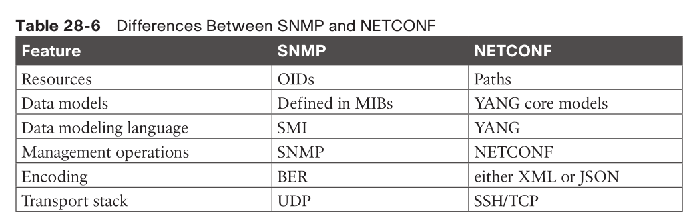
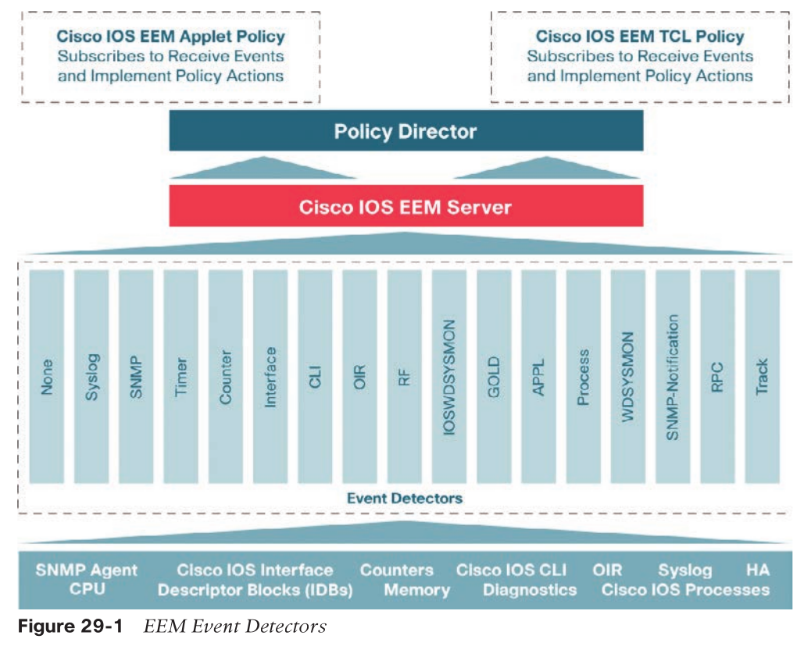
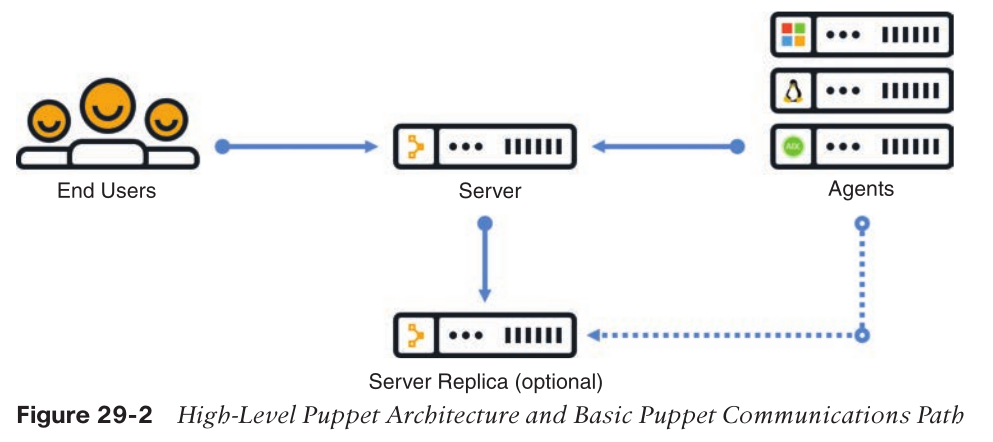
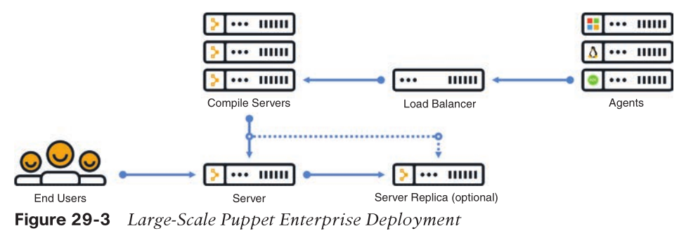
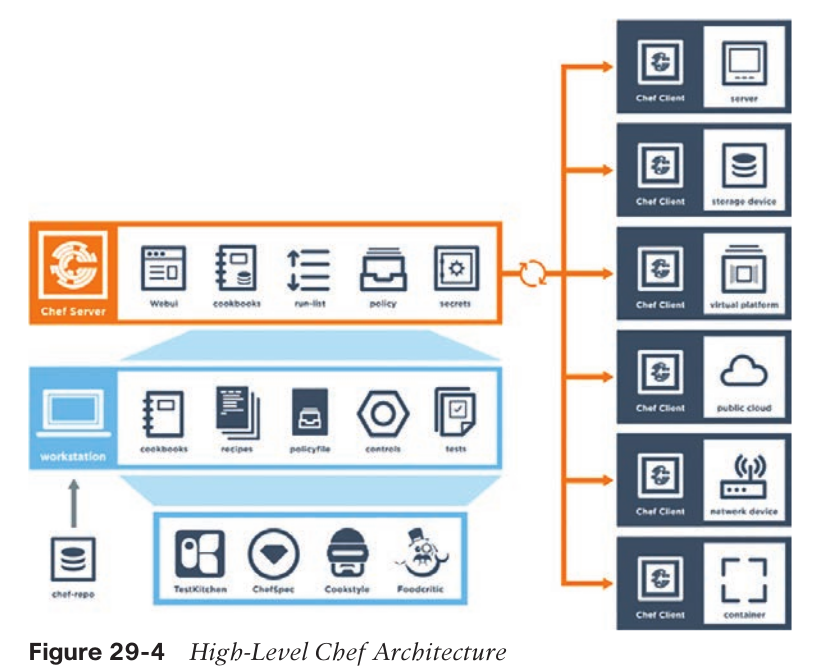
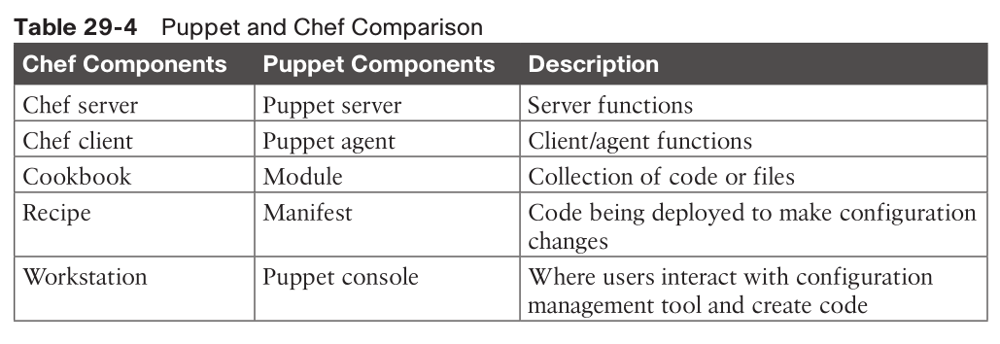
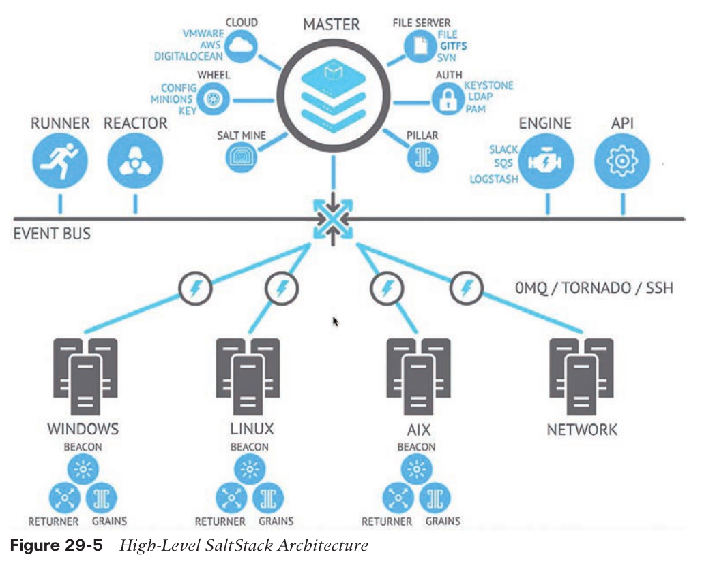

- [Network Programmability Concepts](#network-programmability-concepts)
  - [API](#api)
    - [REST API security](#rest-api-security)
    - [Cisco DNA Center APIs](#cisco-dna-center-apis)
    - [Cisco vManage APIs](#cisco-vmanage-apis)
  - [Data Models and Supporting Protocols](#data-models-and-supporting-protocols)
    - [YANG Data Models](#yang-data-models)
    - [NETCONF](#netconf)
    - [RESTCONF](#restconf)
      - [Example (ChatGPT)](#example-chatgpt)
- [Automation Tools](#automation-tools)
  - [Embedded Event Manager (EEM)](#embedded-event-manager-eem)
    - [EEM Applets](#eem-applets)
    - [EEM and Tcl Scripts](#eem-and-tcl-scripts)
    - [EEM Summary](#eem-summary)
  - [Agent-Based Automation Tools](#agent-based-automation-tools)
    - [Puppet](#puppet)
      - [Puppet modules](#puppet-modules)
        - [Manifests](#manifests)
      - [Puppet Forge](#puppet-forge)
    - [Chef](#chef)
    - [SaltStack (Agent and Server Mode)](#saltstack-agent-and-server-mode)
  - [Agentless Automation Tools](#agentless-automation-tools)
    - [Ansible](#ansible)
      - [YAML](#yaml)
    - [Puppet Bolt](#puppet-bolt)
    - [SaltStack SSH (Server-Only Mode)](#saltstack-ssh-server-only-mode)
  - [Comparison](#comparison)

# Network Programmability Concepts

* Command-Line Interface (CLI)
* Application Programming Interface (API)
* Data Models and Supporting Protocols
* Cisco DevNet

## API

* northbound API
  * application/mgmt <-> controller
  * use TLS
* southbound API
  * controller <-> network devices
* Representational State Transfer (REST)
  * RESTful APIs
  * CRUD ops
    * GET: READ
    * POST: CREATE
    * PUT: replace data / UPDATE
    * PATCH: append data / UPDATE
    * DELETE: remove data / DELETE
* Postman
  * an application that makes it possible to interact with APIs using a console-based approach
  * good for API testing
* JSON: JavaScript Object Notation
  * objects starts with curly braces
  * key / value pair
* HTTP status codee
  * 201: Created
  * __400__: Bad request
    * client side issue
  * __401__: Unauthorized
    * failed user authentication
  * __403__: Forbidden
    * maybe authenticated but access denied
  * 405: not allowed/supported

### REST API security

* Authentication
  * basic authentication
    * cisco DNA center
  * token
    * after successful auth.
    * valid per session
* Authorization
  * or 403
* Confidentiality
  * HTTPS/TLS
* Availability
  * rate limiting
* ACL

### Cisco DNA Center APIs

* https://developer.cisco.com/learning/tracks/dnacenter-programmability/
* JSON
* basic authentication method to DNA Token API
* get token
  * https://sandboxdnac.cisco.com/api/system/v1/auth/token
  * POST
  * Authorization: Basic Auth
    * devnetuser/Cisco123!
  * Headers:
    * Content-Type: application/json
* list of network devices
  * https://sandboxdnac.cisco.com/api/v1/network-device
    * GET
    * Headers
      * add `X-Auth-Token`
  * https://sandboxdnac.cisco.com/api/v1/network-device?limit=1&offset=2
    * only get 2nd device

### Cisco vManage APIs

* w.r.t. Cisco SD-WAN
* https://developer.cisco.com/sdwan
* Headers Content-Type key must be application/x-www-form-urlencoded

## Data Models and Supporting Protocols

* Yet Another Next Generation (YANG) modeling language
* Network Configuration Protocol (NETCONF)
* RESTCONF

### YANG Data Models

* RFC 6020
* an alternative to SNMP MIB
* data models are used
  * to describe whatever can be configured on a device
  * everything that can be monitored on a device
  * all the administrative actions that can be executed on a device, such as resetting counters or rebooting the device
  * all the notifications that the device is capable of generating
* a tree structure
  * similar to XML
  * constructed in modules
* Every element has a defined type
* makes a clear distinction between configuration data and state information

```
list interface {
    key "name";
    leaf name {
       type string;
    }
    leaf speed {
        type enumeration {
            enum 10m;
            enum 100m;
            enum auto;
        }
    }
    leaf observed-speed {
        type uint32;
        config false;
    }
}
```

* There is a list of interfaces. 
  * Of the available interfaces, there is a specific interface 
    * that has three configurable speeds. 
      * those speeds are 10 Mbps, 100 Mbps, and auto
    * The leaf named observed-speed cannot be configured due to the `config false` command.

### NETCONF

* RFC 4741 and RFC 6241
* use YANG data model
* runs over ssh/TLS/SOAP
* use XML
* distinguish between configuration data and operational data
  * SNMP cannot
* use path instead of OID
  * `interfaces/interface/eth0`



* use cases
  * Collecting the status of specific fields
  * Changing the configuration of specific fields
  * Taking administrative actions
  * Sending event notifications
  * Backing up and restoring configurations
  * Testing configurations before finalizing the transaction
* NETCONF operations
  * `get`: Requests running configuration and state information of the device
  * `get-config`: Requests some or all of the configuration from a datastore
  * `edit-config`: Edits a configuration datastore by using CRUD operations
  * `copy-config`: Copies the configuration to another datastore
  * `delete-config`: Deletes the configuration

```
<rpc-reply message-id="urn:uuid:0e2c04cf-9119-4e6a-8c05-238ee7f25208"
xmlns="urn:ietf:params:xml:ns:netconf:base:1.0" xmlns:nc="urn:ietf:params:
xml:ns:netconf:base:1.0">
    <data>
        <native xmlns="http://cisco.com/ns/yang/ned/ios">
            <router>
                <ospf>
                    <id>100</id>
                    <redistribute>
                        <connected>
                        <redist-options>
                            <subnets/>
                        </redist-options>
                        </connected>
                    </redistribute>
                    <network>
                        <ip>10.10.0.0</ip>
                        <mask>0.0.255.255</mask>
                        <area>0</area>
                    </network>
                    <network>
                        <ip>20.20.0.0</ip>
                        <mask>0.0.255.255</mask>
                        <area>0</area>
                    </network>
                    <network>
                        <ip>100.100.0.0</ip>
                        <mask>0.0.255.255</mask>
                        <area>0</area>
                    </network>
                </ospf>
            </router>
        </native>
    </data>
</rpc-reply>
```

### RESTCONF

* RFC 8040
* provide a RESTful API experience
* use either JSON or XML

```
RESTCONF GET
------------------------
URL: https://10.85.116.59:443/restconf/data/Cisco-IOS-XE-native:native/logging/ monitor/severity
Headers: {'Accept-Encoding': 'gzip, deflate', 'Accept': 'application/yang-data+json, application/yang-data.errors+json'}

Body:
RESTCONF RESPONSE
----------------------------
200
{
    "Cisco-IOS-XE-native:severity": "critical"
}
```

#### Example (ChatGPT)

```python
import requests
import json
from requests.auth import HTTPBasicAuth

# Device details
url = "https://192.168.0.1/restconf/data/ietf-interfaces:interfaces/interface=GigabitEthernet1"
headers = {
    "Content-Type": "application/yang-data+json",
    "Accept": "application/yang-data+json"
}
auth = HTTPBasicAuth("username", "password")

# Payload
payload = {
    "ietf-interfaces:interface": {
        "name": "GigabitEthernet1",
        "description": "Configured via RESTCONF",
        "type": "iana-if-type:ethernetCsmacd",
        "enabled": True,
        "ietf-ip:ipv4": {
            "address": [
                {
                    "ip": "192.168.1.1",
                    "netmask": "255.255.255.0"
                }
            ]
        }
    }
}

# RESTCONF PUT request
response = requests.put(url, headers=headers, auth=auth, data=json.dumps(payload), verify=False)

# Output the response
print(f"Status Code: {response.status_code}")
print(f"Response: {response.text}")
```

* verify
  * `https://<device-ip>/restconf/data/ietf-interfaces:interfaces/interface=GigabitEthernet1`

# Automation Tools

* most common and repetitive configs
  * onboarding
    * Device name/IP address
    * Usernames/passwords
    * SNMP settings
  * policies
    * Quality of service
    * Access list entries
  * Compliance
* why?
  * reduces the risk of human error by automatically **duplicating known best practices** that have been **thoroughly tested** in an environment
* why not?
  * can be dangerous as well
* process
  * start with the desired outcome
  * create a pla to move forward
* PPDIOO
  * Prepare, Plan, Design, Implement, Operate, Optimize

## Embedded Event Manager (EEM)

* software applet
* tcl
* supported by device



* http://www.cisco.com/c/en/us/products/ios-nx-os-software/ios-embedded-event-manager-eem/index.html.

### EEM Applets

* building blocks
  * events
  * actions
* monitor interface down and notify neteng via email
```
event manager applet LOOP0
    event syslog pattern "Interface Loopback0.* down" period 1
    action 1.0 cli command "enable"
    action 2.0 cli command "config terminal"
    action 3.0 cli command "interface loopback0"
    action 4.0 cli command "shutdown"
    action 5.0 cli command "no shutdown"
    action 5.5 cli command "show interface loopback0"
    action 6.0 syslog msg "I've fallen, and I can't get up!"
    action 7.0 mail server 10.0.0.25 to neteng@yourcompany.com
        from no-reply@yourcompany.com subject "Loopback0 Issues!"
        body "The Loopback0 interface was bounced. Please monitor
        accordingly. "$_cli_result"
```

* see the output

```
debug event manager all ! all the output for the configured actions
debug event manager action cli ! only CLI related output
debug event manager action mail ! only mail related output
```

* monitor CLI commands by people

```
event manager environment filename Router.cfg
event manager environment tftpserver tftp://10.1.200.29/
event manager applet BACKUP-CONFIG
    event cli pattern "write mem.*" sync yes
    action 1.0 cli command "enable"
    action 2.0 cli command "configure terminal"
    action 3.0 cli command "file prompt quiet"
    action 4.0 cli command "end"
    action 5.0 cli command "copy start $tftpserver$filename"
    action 6.0 cli command "configure terminal"
    action 7.0 cli command "no file prompt quiet"
    action 8.0 syslog priority informational msg "Configuration File Changed! TFTP backup successful."
```

> The file prompt quiet command disables the IOS confirmation mechanism that asks to confirm a user’s actions.

* EEM support variables

|EEM Variable|Description|Example
|:--|:--|:--|
|_email_server|SMTP server IP address or DNS name|10.0.0.25 or MAILSVR01|
|_email_to|Email address to send email to|neteng@yourcompany.com|
|_email_from|Email address of sending party|no-reply@yourcompany.com|
|_email_cc|Email address of additional email receivers|helpdesk@yourcompany.com|

### EEM and Tcl Scripts

* applet calls Tcl scripts

```
event manager applet Ping
    ! no event to be monitored
    ! triggered manually
    event none
    action 1.0 cli command "enable"
    action 1.1 cli command "tclsh flash:/ping.tcl"

Router# event manager run Ping

Router# more flash:ping.tcl
foreach address {
192.168.0.2
192.168.0.3
192.168.0.4
192.168.0.5
192.168.0.6
} { ping $address}
```

### EEM Summary

## Agent-Based Automation Tools

* Puppet
* Chef
* SaltStack (agent and server mode)
* models: push and pull.
  * Push models push configuration from a centralized tool or management server, 
  * Pull models check in with the server to see if there is any change in the configuration, and if there is, the remote devices pull the updated configuration files down to the end device.

### Puppet

* Ruby
* capable to periodically verify the configuration on devices
  * if a configuration is changed, it can be alerted on as well as automatically put back to the previous configurations
    * standardize device configurations
    * enforcing a specific set of parameters
* Cisco supported
  * Catalyst switches
  * Nexus switches
  * Unified Computing System (UCS) servers
* arch
  * agent and server comm. via SSL
    * agent need certificates installed



* Puppet Installation Modes

|Installation Type|Scale
|:--|:--
|Monolithic|Up to 4000 nodes
|Monolithic with compile servers|4000 to 20,000 nodes
|Monolithic with compile servers and standalone PE-PostgreSQL|More than 20,000 nodes



#### Puppet modules 

* allow for the configuration of practically anything that can be configured manually. 
* cisco specific module: `cisco_ios`
  * contains multiple manifests and leverages SSH to connect to devices. 
  * Each of these manifests is used to modify the running configuration on Cisco Catalyst devices
* components
  * Manifests
  * Templates
  * Files

##### Manifests

* code that configures the devices
* `.pp`

```
# Puppet NTP_Server.pp Manifest
ntp_server { '1.2.3.4':
    ensure => 'present',
    key => 94,
    prefer => true,
    minpoll => 4,
    maxpoll => 14,
    source_interface => 'Vlan 42',
}
```

#### Puppet Forge

* https://forge.puppet.com
* sharing modules/manifests

### Chef

* Ruby (and Erlang)
* arch



* vs puppet



* `knife`
  * tool to upload cookbooks to the Chef server
  * `knife upload <cookbookname>`
* `kitchen`
  * where cookbooks/recipes can be automatically tested
  * testing framework (by Ruby)
    * Bash Automated Testing System (BATS)
    * Minitest
    * RSpec
    * Serverspec
* Chef server deployments
  * Chef Solo: The Chef server is hosted locally on the workstation.
  * Chef Client and Server: This is a typical Chef deployment with distributed components.
  * Hosted Chef: The Chef server is hosted in the cloud.
  * Private Chef: All Chef components are within the same enterprise network.
* client/server
  * client: OHAI
    * service installed on thee nodes
  * client collect states and send to server
  * server check to see if there are any new config need to be pushed

* example

```
Chef::Log.info('Demo cisco_command_config provider')

cisco_command_config 'loop42' do
    action :update
    command '
        interface loopback42
            description Peering for AS 42
            ip address 192.168.1.42/24
    '
end

cisco_command_config 'system-switchport-default' do
    command 'no system default switchport'
end

cisco_command_config 'feature_bgp' do
    command ' feature bgp'
end

cisco_command_config 'router_bgp_42' do
    action :update
    command '
        router bgp 42
            router-id 192.168.1.42
            neighbor 10.1.1.1
            remote-as 99
            address-family ipv4 unicast
                network 1.0.0.0/8
                redistribute static route-map bgp-statics
    '
end

cisco_command_config 'route42' do
    action :update
    command ' ip route 10.42.42.42/32 Null0 '
end

# The following tests 'no' commands that do not
# nvgen when enabled.
# We need to first configure the port-channel interface
# so that it exists before applying the 'no' commands.

cisco_command_config 'port-channel55-setup' do
    action :update
    command '
        feature bfd
        interface port-channel55
    '
end

cisco_command_config 'port-channel55' do
    action :update
    command '
        interface port-channel55
        no switchport
        no bfd echo
        no ip redirects
    '
End
```

### SaltStack (Agent and Server Mode)

* Python
* arch



* masters/minions
  * servers/agents
* run remote commands in parallel
  * distributed messaging platform: 0MQ
* event driven
  * reactors
    * on master
    * listen/check any deviation/changes from desired
      * Command-line configuration
      * Disk/memory/processor utilization
      * Status of services
  * beacons
    * on minions
    * monitor if there are config changes
    * if yes, report to masters
      * remote execution system
  * jobs
    * actions done on the device
    * saved for review/reuse
* pillars/grains
  * modules or recipes
  * grains
    * on minions
    * collect data / response to requests
    * by `salt-minion` daemon
      * similar to OHAI
  * Pillars
    * on master
    * store data
      * can be grouped/separated by nodes
      * confidential / sensitive data for particular nodes
* GUI
  * SynDic
* Salt Formulas
  * instructions or states to/from nodes in YAML/DSL
* DSL
  * targets
    * minionID
    * regex
  * commands
  * arguments
    * `module.function <arguments>`
  * e.g.:
    * `salt '*' cmd.run 'ls -l /etc'`
    * `salt '*' network.interfaces`
  
## Agentless Automation Tools

### Ansible

* Python
* purchased by RedHat in 2015
* nothing need be installed on nodes
* but some task may prolong the process

|Components|Description|Use Case
|:--|:--|:--
|Playbook|A set of plays for remote systems|Enforcing configuration and/or deployment steps
|Play|A set of tasks applied to a single host or a group of hosts|Grouping a set of hosts to apply policy or configuration to them
|Task|A call to an Ansible module|Logging in to a device to issue a show command to retrieve output

* commands

|CLI Command|Use Case
|:--|:--
|ansible|Runs modules against targeted hosts
|ansible-playbook|Runs playbooks
|ansible-docs|Provides documentation on syntax and parameters in the CLI
|ansible-pull|Changes Ansible clients from the default push model to the pull model
|ansible-vault|Encrypts YAML files that contain sensitive data

* host groups
  * named
  * variables from `group_vars/$group_name` applied to groups

* example
  * `ios_config` and `ios_command` ansible module

```
---
- hosts: CSR1KV-1
    gather_facts: false
    connection: local
    tasks:
      - name: Configure GigabitEthernet2 Interface
        ios_config:
            lines:
                - description Configured by ANSIBLE!!!
                - ip address 10.1.1.1 255.255.255.0
                - no shutdown
            parents: interface GigabitEthernet2
            host: "{{ ansible_host }}"
            username: cisco
            password: testtest

      - name: WR MEM
        ios_command:
            commands:
                - write memory
            host: "{{ ansible_host }}"
            username: cisco
            password: testtest
```

#### YAML

```yaml
---
# dictionary
Employee1:
    Name: John Dough
    Title: Developer
    Nickname: Mr. DBug
    # list
    Skills:
        - CLI
        - Security
        - Automation
---
```

### Puppet Bolt

* Ruby, open source
* client-less version of puppet
* via SSH as well
* two ways of use
  * Orchestrator-driven tasks
    * leverage Puppet arch.
  * Standalone tasks
    * connect directly to device
* `bolt command run <command name>`
* `bolt script run <script name>`
  * can be any like python scripts
  * copies the script into a temporary directory on the remote device
  * executes the script
  * captures the results
  * removes the script
* `bolt task run <modulename::taskfilename>`
  * via API
  * help: `bolt task show <modulename::taskfilename>`

### SaltStack SSH (Server-Only Mode)

* Salt SSH
* installs a lightweight version of SaltStack in a temporary directory
* then optionally delete the temporary directory upon completion
  * or left there
* Roster File
  * `.ssh/config` like
> considerably slower than the 0MQ distributed messaging library

## Comparison

|Factor|Puppet|Chef|Ansible|SaltStack
|:--|:--|:--|:--|:--
|Architecture|Puppet servers and puppet agents|Chef server and Chef clients|Control station and remote hosts|Salt master and minions
|Language|Puppet DSL|Ruby DSL|YAML|YAML
|Terminology|Modules and manifests|Cookbooks and recipes|Playbooks and plays|Pillars and grains
|Support for large-scale deployments|Yes|Yes|Yes|Yes
|Agentless version|Puppet Bolt|N/A|Yes|Salt SSH

