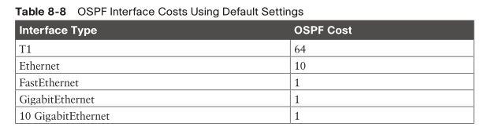
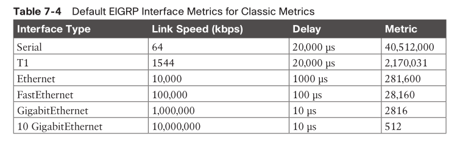
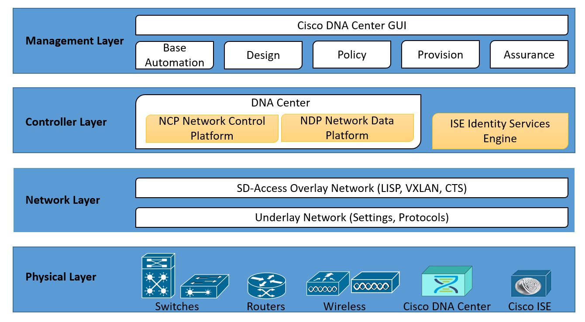
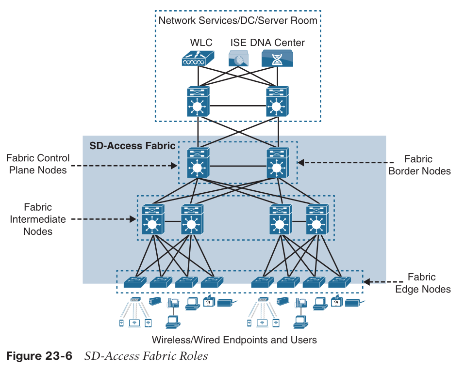
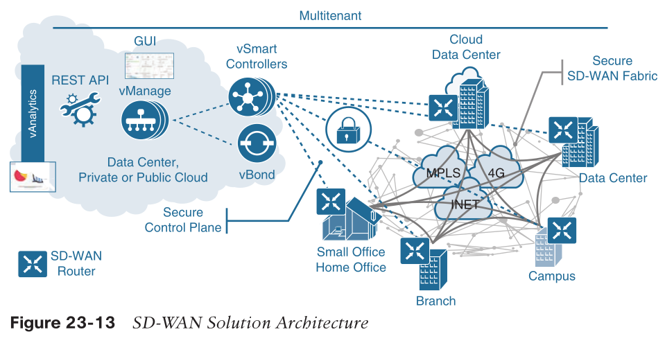

- [Protocol Numbers](#protocol-numbers)
- [Special IP Addresses](#special-ip-addresses)
- [Winner selection](#winner-selection)
  - [Lower wins](#lower-wins)
  - [Higher wins](#higher-wins)
- [ACL](#acl)
- [Metric calculation](#metric-calculation)
- [EtherChannel](#etherchannel)
- [DTP](#dtp)
- [BGP](#bgp)
- [EIGRP](#eigrp)
- [Wireless](#wireless)
- [Debug levels](#debug-levels)
- [SD-Access](#sd-access)
- [SD-WAN](#sd-wan)
- [SDN](#sdn)
- [Automation](#automation)

# Protocol Numbers

| Protocol | Number |
|:--|:--|
| EIGRP | 88
| OSPF | 89
| IGMPv2 | 2
| PIM | 103
| IPSEC AH | 51
| IPSEC ESP | 50
| GRE | 47
| PAgP | 0x0104

# Special IP Addresses

| Group | Address |
|:--|:--|
| OSPFv2 AllSPFRouters | 224.0.0.5 01:00:5E:00:00:05
| OSPFv2 AllDRouters | 224.0.0.6 01:00:5E:00:00:06
| OSPFv3 AllSPFRouters | FF02::05: | 
| OSPFv3 AllDRouters | FF02::06: |
| All PIM routers | 224.0.0.13 |
| Auto-RP/Cisco-RP-announce | 224.0.1.39 |
| Auto-RP/Cisco-RP-Discovery | 224.0.1.40 |
| VRRP | 224.0.0.18 
| PAgP | 0100:0CCC:CCCC |
| LACP | 0180:C200:0002 |

# Winner selection

## Lower wins

* STP root bridge election:
  * the **lowest priority** and then the **lowest MAC** address
* Routing
  * lower AD wins
    * 0: directly connected routes

## Higher wins

* HSRP/VRRP: 
  * higher priority wins, then highest IP wins
  * default: 100
* OSPF DR election
  * higher interface `ip ospf priority N` wins

# ACL

* numbered ACL: 1–99 and 1300–1999
* numbered extended ACL: 100-199 and 2000-2699

# Metric calculation

* STP
  * ref. bw (short mode): 20Gbps
  * ref. bw (long mode): 20Tbps
  
* OSPF
  * ref. bw: 100Mbps
  
* EIGRP
  * ref. bw: 10Gbps in Kbps
  

# EtherChannel 

* successful condition
  * on/on
  * at least one side is the initiator
    * LACP `active`
    * PAgP `desirable`

# DTP 

* port mode
  * at least one side is the initiator (`desirable`) or static `trunk`

# BGP

* AS Path flags
  * `i`: route configured with bgp `network` statement
  * `?`: route learned from another routing protocol like OSPF
  * `e`: route learned from EGP, rarely used

# EIGRP 

* route state
  * passive (P): route stable
  * active (A): route is **computing a new path**

# Wireless 

* roaming
  * intracontroller
    * same WLC
  * intercontroller
    * layer 2
      * WLCs in same VLAN
    * layer 3
      * WLCs in diff VLAN

* segmentation

# Debug levels

| | | | |
|--|--|--|--|
|emergencies|0|System unstable|LOG_EMERG
|alerts|1|Immediate action needed|LOG_ALERT
|critical|2|Critical conditions|LOG_CRIT
|errors|3|Error conditions|LOG_ERR
|warnings|4|Warning conditions|LOG_WARNING
|notifications|5|Normal but significant conditions|LOG_NOTICE
|informational|6|Informational messages only|LOG_INFO
|debugging|7|Debugging messages|LOG_DEBUG

# SD-Access

* Arch.

* overlay network:
  * control plane
    * LISP
  * data plane
    * VxLAN
  * policy plane
    * TrustSec/SGT

# SD-WAN

* Arch.

# SDN

* ETSI/NFV Arch.

# Automation

|Factor|Puppet|Chef|Ansible|SaltStack
|:--|:--|:--|:--|:--
|Architecture|Puppet servers and puppet agents|Chef server and Chef clients|Control station and remote hosts|Salt master and minions
|Language|Puppet DSL|Ruby DSL|YAML|YAML
|Terminology|Modules and manifests|Cookbooks and recipes|Playbooks and plays|Pillars and grains
|Support for large-scale deployments|Yes|Yes|Yes|Yes
|Agentless version|Puppet Bolt|N/A|Yes|Salt SSH
