- [ch. 1 forwarding](#ch-1-forwarding)
- [ch. 2 SPT](#ch-2-spt)
- [ch. 3 advanced SPT tunning](#ch-3-advanced-spt-tunning)
- [ch. 4 Multiple Spanning Tree Protocol](#ch-4-multiple-spanning-tree-protocol)
- [ch. 5 VLAN Trunks and EtherChannel](#ch-5-vlan-trunks-and-etherchannel)
- [ch. 6 IP Routing Essentials](#ch-6-ip-routing-essentials)
- [ch. 8 OSPF](#ch-8-ospf)
- [ch. 9 Advanced OSPF](#ch-9-advanced-ospf)
- [ch. 10 OSPFv3](#ch-10-ospfv3)
- [ch. 11 BGP](#ch-11-bgp)
- [ch. 12 advanced BGP](#ch-12-advanced-bgp)
- [ch. 14 QoS](#ch-14-qos)
- [ch. 15 IP Services](#ch-15-ip-services)

# ch. 1 forwarding

# ch. 2 SPT

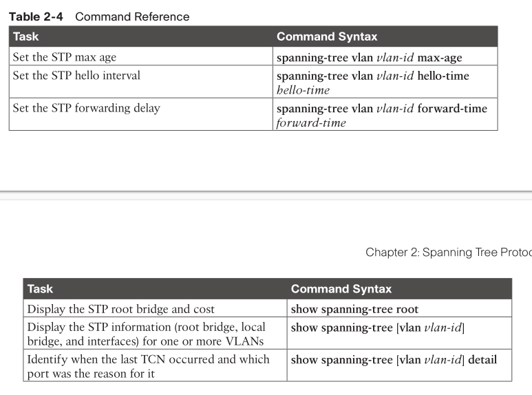

# ch. 3 advanced SPT tunning

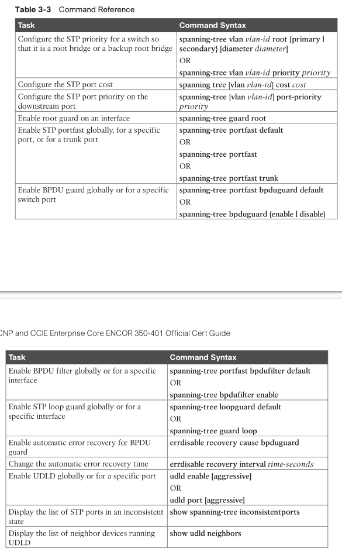

# ch. 4 Multiple Spanning Tree Protocol

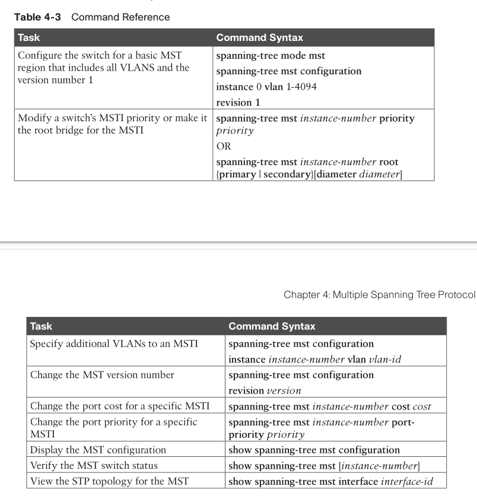

# ch. 5 VLAN Trunks and EtherChannel

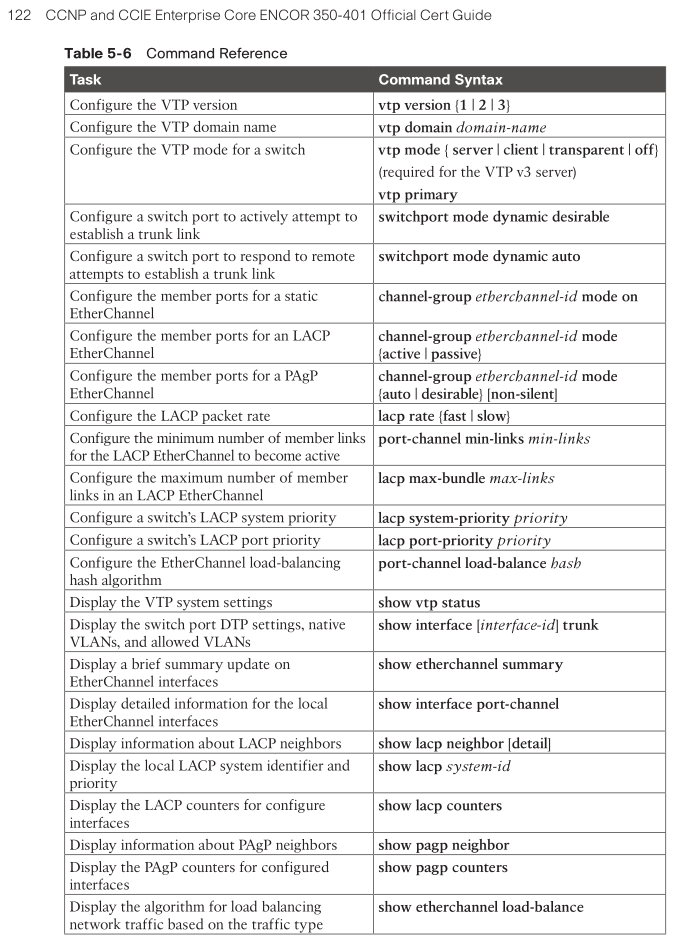

# ch. 6 IP Routing Essentials

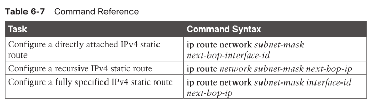

# ch. 8 OSPF

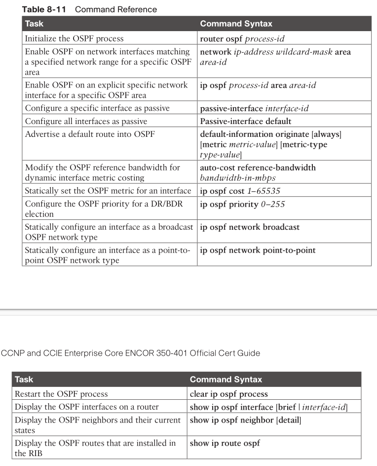

# ch. 9 Advanced OSPF

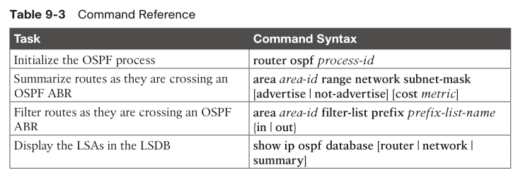

# ch. 10 OSPFv3

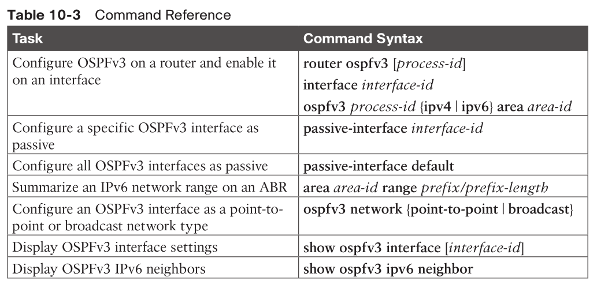

# ch. 11 BGP

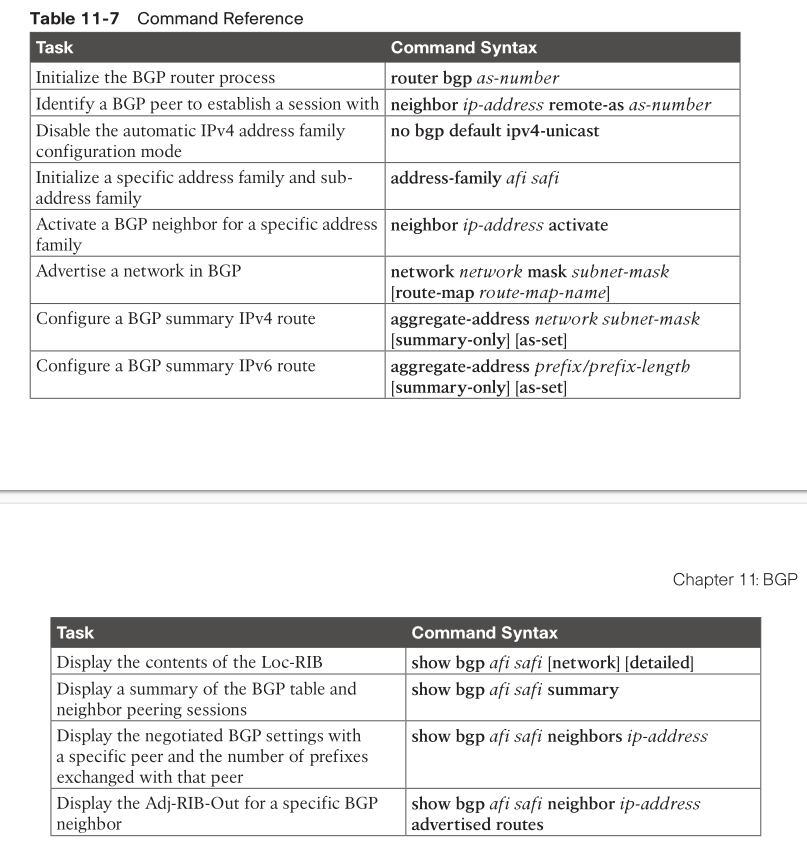

# ch. 12 advanced BGP

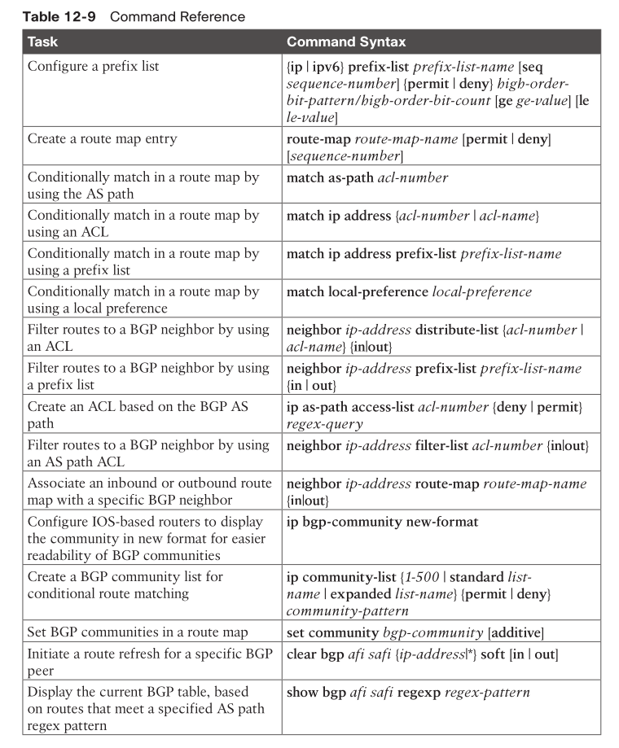
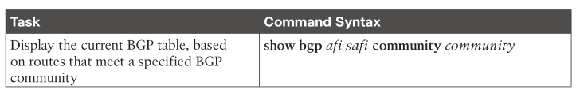

# ch. 14 QoS

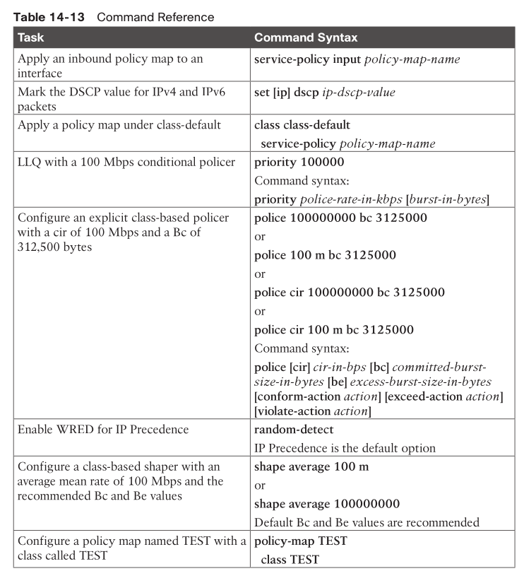

# ch. 15 IP Services

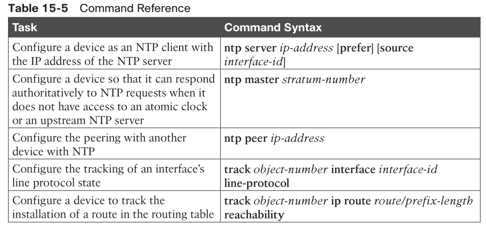
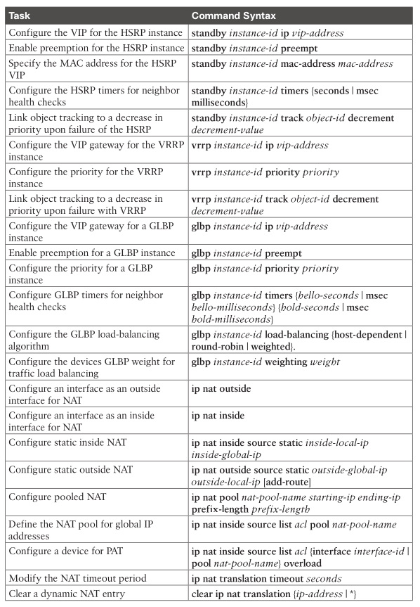
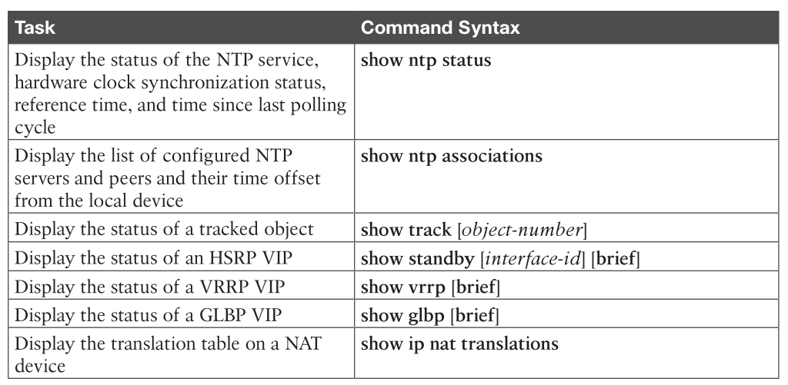