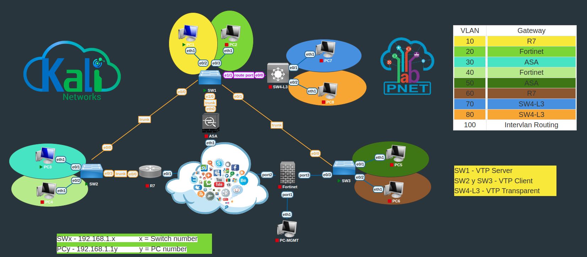

- [Lab: vlan](#lab-vlan)
  - [.bin files](#bin-files)
  - [log file](#log-file)
- [Config l2 switch](#config-l2-switch)
  - [Task 1: Create VLAN's](#task-1-create-vlans)
    - [config VTP](#config-vtp)
    - [config vlan](#config-vlan)
  - [Task 2: Configure Trunks](#task-2-configure-trunks)
  - [Task 3: Assign VLANs](#task-3-assign-vlans)
  - [Task 4: Routing Between VLAN's](#task-4-routing-between-vlans)
    - [config vlan interface / SVI on switch](#config-vlan-interface--svi-on-switch)
    - [config a subinterface on router](#config-a-subinterface-on-router)
    - [config dhcp](#config-dhcp)
  - [Task 6: Internet Access (optional)](#task-6-internet-access-optional)
    - [on router](#on-router)
  - [misc.](#misc)
    - [config route port](#config-route-port)

# Lab: vlan

* https://user.pnetlab.com/store/labs/detail?id=16405723981793



* the location of downloaded lab: `/opt/unetlab/labs/Your\ labs\ from\ PNETLab\ Store`
* download images

```
ishare2 labs          # Will show all labs available
ishare2 labs <number> # Will download images for the lab with the specified number
```

* the location of downloaded images: `/opt/unetlab/addons/`

```
root@pnetlab:/opt/unetlab/addons# ls -l
total 12
drwxr-xr-x 2 root     root     4096 Apr  4  2020 dynamips
drwxr-xr-x 4 www-data www-data 4096 Jan 13  2021 iol
drwxr-xr-x 4 root     root     4096 Oct  3 17:33 qemu
```

## .bin files

* for simulated cisco switches
* `i86bi-Linux-L2-Adventerprisek9-ms.SSA.high_iron_20190423.bin`
* symolic link it to `/opt/unetlab/tmp/<lab #>/<instance #>/

```
root@pnetlab:/opt/unetlab/tmp/1/10# ls -l
total 16
lrwxrwxrwx 1 root unl   88 Oct  3 18:45 i86bi_Linux-L2-Adventerprisek9-ms.SSA.high_iron_20190423.bin -> /opt/unetlab/addons/iol/bin/i86bi_Linux-L2-Adventerprisek9-ms.SSA.high_iron_20190423.bin
lrwxrwxrwx 1 root unl   80 Oct  3 18:47 i86bi_Linux-L3-AdvEnterpriseK9-M2_157_3_May_2018.bin -> /opt/unetlab/addons/iol/bin/i86bi_Linux-L3-AdvEnterpriseK9-M2_157_3_May_2018.bin
lrwxrwxrwx 1 root unl   33 Oct  2 19:03 iourc -> /opt/unetlab/addons/iol/bin/iourc
lrwxrwxrwx 1 root unl   40 Oct  2 19:03 keepalive.pl -> /opt/unetlab/addons/iol/bin/keepalive.pl
-rwxrwxrwx 1 root unl 1190 Oct  2 19:03 startup-config
-rwxrwxrwx 1 root unl  225 Oct  3 17:49 wrapper.txt
```

## log file

* `/opt/unetlab/data/Logs/unl_wrapper.txt`

# Config l2 switch

* Task 1: Create VLAN's
  * mainly VTP
* Task 2: Configure Trunks
  *  limit the vlan's (pruning) that cross the trunk
     *  `allowed vlan`
  *  by default Cisco permit that all the created vlan's go throught the trunk
     *  this could be a STP issue
* Task 3: Assign VLANs
  * mainly config access ports
* Task 4: Routing Between VLAN's
* Task 5: Static Routes (optional)
* Task 6: Internet Access (optional)

## Task 1: Create VLAN's

### config VTP

```
! on primary server
vtp domain mydomain
vtp version 3
vtp password pnet
exit
vtp primary
> This system is becoming primary server for feature vlan 
> No conflicting VTP3 devices found.
> Do you want to continue? [confirm]
show vtp status

! on clients
vtp domain mydomain
vtp version 3
vtp mode client
vtp password pnet
show vtp status
```

### config vlan

```
vlan 200
name test
end
show vlan id 200
show spanning-tree vlan 200
! verify the vlan is allowed in trunk
show interface trunk
```

* all trunk port will join this vlan automatically

```
SW1#show vlan id 200

VLAN Name                             Status    Ports
---- -------------------------------- --------- -------------------------------
200  test                             active    Et0/0, Et0/1, Et0/2
```

## Task 2: Configure Trunks

```
switchport trunk encapulation dot1q
switchport trunk native vlan 999
switchport trunk allowed vlan 1,20,40,50,60,100
switchport mode trunk
switchport nonegotiate
```

## Task 3: Assign VLANs

```
interface e0/2
switchport mode access
switchport access vlan 200

! or 
! switchport host
!   switchport mode will be set to access
!   spanning-tree portfast will be enabled
!   channel group will be disabled
```

* if vlan 200 not configured prior, it will be automatically created

## Task 4: Routing Between VLAN's

### config vlan interface / SVI on switch

```
interface VLAN70
 ip address 192.168.70.1 255.255.255.0
```

### config a subinterface on router

```
interface Ethernet0/0
 no shutdown
interface Ethernet0/0.10
 encapsulation dot1q 10
 ip address 192.168.10.1 255.255.255.0
 ip nat inside
interface Ethernet0/0.60
 encapsulation dot1q 60
 ip address 192.168.60.1 255.255.255.0
 ip nat inside
```

### config dhcp

```
ip dhcp excluded-address 192.168.10.1 192.168.10.10
ip dhcp excluded-address 192.168.10.21 192.168.10.254
ip dhcp excluded-address 192.168.60.1 192.168.60.10
ip dhcp excluded-address 192.168.60.21 192.168.60.254

ip dhcp pool VLAN10
 network 192.168.10.0 /24
 ip default-router 192.168.10.1
 dns-server 8.8.8.8 

ip dhcp pool VLAN60
 network 192.168.60.0 /24
 ip default-router 192.168.60.1
 dns-server 8.8.8.8
```

## Task 6: Internet Access (optional)

### on router

* first configure inside/outside nat interfaces

```
interface ethernet 0/1
 ip nat outside
 ip address dhcp
 no shutdown

interface ethernet 0/0.10
 ip nat inside

inteface ethernet 0/0.60
 ip nat inside
```
* second, create an ACL to match traffic

```
access-list 1 permit 192.168.10.0 0.0.0.255
access-list 1 permit 192.168.60.0 0.0.0.255
```

* third, create a nat rule

```
ip nat inside source list 1 interface ethernet 0/1 overload
```

* now endpoints should have internet access

## misc.

### config route port

```
no switchport
ip address 192.168.100.1 255.255.255.0
```
