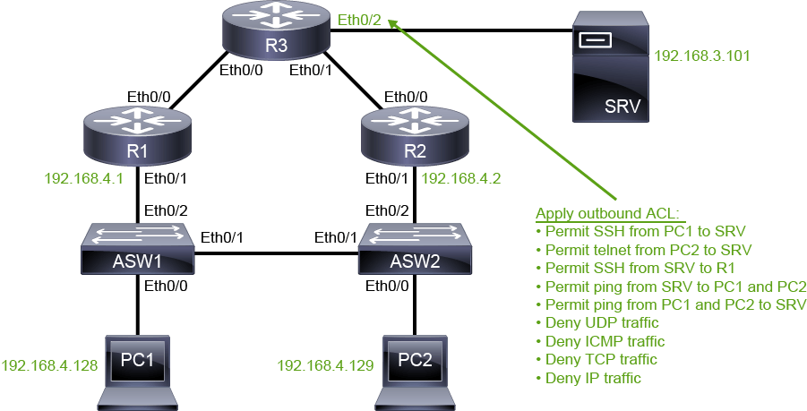
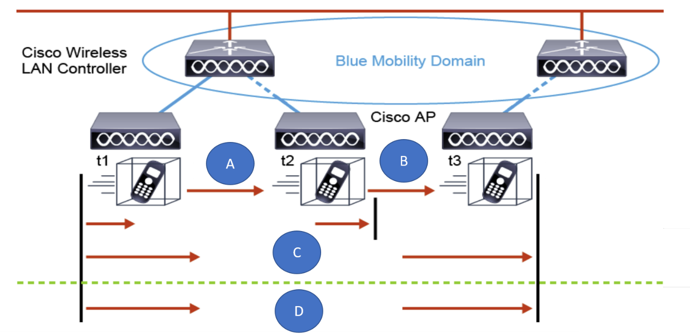

* Within Cisco Express Forwarding, the Routing Information Base (RIB) is stored in which table?
  * FIB
  * Adjacency
  * EIGRP
  * IP Routing

> The correct answer is IP Routing. Routing protocols such as OSPF, EIGRP, and BGP each have their own Routing Information Base (RIB). From each routing protocol RIB, the best routes to each destination network are selected to be installed in the global RIB, or the IP routing table.

* What is a symptom of common inconsistencies between the physical ports in EtherChannel technology?
  * channel is down and interfaces are treated as independent or stand-alone
  * unequal distribution of traffic
  * nonfunctional channel, suspended interfaces in the channel
  * misconfigurations between the switch and a connected device

> The correct answer is nonfunctional channel, suspended interfaces in the channel. Some of the common inconsistencies between the physical ports that are bundled together as EtherChannel are:
>
> * Mismatches in interface speed, duplex, trunking mode characteristics, or layer of operation.
> * Symptoms: nonfunctional channel, suspended interfaces in the channel.

* Which two commands would you issue to verify the BGP routes in the routing table? (Choose two.)
  * show ip bgp l2vpn
  * show ip route
  * show ip bgp
  * show ip bgp neighbors
  * show ip route bgp
  * show ip bgp community

> The correct answers are `show ip route` and `show ip route bgp`.
> 
> The `show ip route` command displays contents of the complete routing table, including BGP routes. 
> The `show ip route bgp` command displays only the BGP routes in the routing table. 
> The `show ip bgp neighbors` command displays BGP and TCP connection information for neighbor sessions. 
> The `show ip bgp` displays entries in the BGP routing table. 
> The `show ip bgp community` command displays routes that belong to specified BGP communities. 
> The `show ip bgp l2vpn` command displays the Layer 2 VPN address family information from the BGP routing table.

* Which router configuration command would you issue to enable proper PAT translation when configuring a **one-to-many** NAT translation?
  * ip nat inside
  * ip nat inside source list access-list-number pool pool-name overload
  * ip nat inside source list access-list-number interface interface overload
  * ip nat outside source list access-list-number pool pool-name

> The correct answer is ip nat inside source list access-list-number interface interface overload.
>
> To configure PAT, you must first configure inside and outside interfaces. Then you configure an ACL that will match all inside local addresses that need to be translated. You must configure NAT so that all inside local addresses are translated to the address of the outside interface. 

* What is considered a good SNR and how is it calculated?
  * –20 dB or lower. Subtract the RSSI from the noise value.
  * –40 dB or higher. Add the noise value to the RSSI.
  * 40 dB or higher. Subtract the RSSI from the noise value.
  * 20 dB or higher. Subtract the noise value from the RSSI.

> The correct answer is 20 dB or higher. Subtract the noise value from the RSSI.
> 
> SNR is measured as a positive value between 0 and 120; the closer the value is to 120, the better. To calculate the SNR value, subtract the noise value from the RSSI. Because both values are usually expressed as negative numbers, the result is a positive number that is expressed in decibels. The general principle is that any SNR above 20dB is good.

* Which two layers in a PaaS cloud service model are managed by the customer? (Choose two).
  * Applications
  * Runtime
  * Middleware
  * Operating System
  * Data

> The correct answers are Applications and Data. In a PaaS cloud model, the customer manages applications and data. The customer manages all five layers in an IaaS cloud model. The service provider manages all layers in a SaaS cloud service model.

---

* what happens if ping a NAT'd server from outside?
```
SRV2#traceroute 198.51.100.201
Type escape sequence to abort.
Tracing the route to 198.51.100.201
VRF info: (vrf in name/id, vrf out name/id)
  1 203.0.113.2 2 msec 0 msec 1 msec
  2 198.51.100.1 1 msec 1 msec 1 msec
  3 198.51.100.201 1 msec *  2 msec
```

* on R1, `debug ip nat` is on, and here is R1 saw:

```
R1#debug ip nat              
IP NAT debugging is on
R1#
*Feb  4 14:56:13.505: NAT: s=203.0.113.102, d=198.51.100.201->10.10.2.101 [43]
*Feb  4 14:56:13.507: NAT: s=203.0.113.102, d=198.51.100.201->10.10.2.101 [44]
*Feb  4 14:56:13.508: NAT: s=203.0.113.102, d=198.51.100.201->10.10.2.101 [45]
*Feb  4 14:56:13.508: NAT*: s=203.0.113.102, d=198.51.100.201->10.10.2.101 [46]
*Feb  4 14:56:13.509: NAT: s=10.10.2.101->198.51.100.201, d=203.0.113.102 [2]
*Feb  4 14:56:13.510: NAT*: s=203.0.113.102, d=198.51.100.201->10.10.2.101 [47]
R1#
*Feb  4 14:56:16.511: NAT*: s=203.0.113.102, d=198.51.100.201->10.10.2.101 [48]
*Feb  4 14:56:16.512: NAT: s=10.10.2.101->198.51.100.201, d=203.0.113.102 [3]
```

Here is what happens when you enter the traceroute 198.51.100.201 command on server SRV2:

Server SRV2 sends three requests with time-to-live (TTL) 1. Router 2 drops these packets and therefore no output is shown on router R1.

Then, server SRV2 sends three requests with TTL 2. Router 1 translates these packets and then drops them because the TTL is exceeded.

Finally, server SRV2 sends three requests with TTL 3. Router 1 translates each of these requests and then routes them to server SRV1. __Server SRV1 responds only to every second request__: the first one and the last one. These two responses are translated on router R1 on their way back to server SRV2.

---



Configure an access control list (ACL) called out-to-srv and apply it in the outbound direction at interface Ethernet0/2 on router R3. The ACL must meet the listed requirements. Configure the requirements exactly in the given order and configure **exactly one access control entry (ACE) per requirement**:

* Allow PC1 to connect to server SRV using SSH.
* Allow PC2 to connect to server SRV using Telnet.
* Allow server SRV to connect to router R1 and interface Ethernet0/1 using SSH.
* Allow server SRV to successfully ping PC1 and PC2.
* Allow PC1 and PC2 to successfully ping server SRV.
* Explicitly deny all UDP traffic.
* Explicitly deny all ICMP traffic.
* Explicitly deny all TCP traffic.
* Explicitly deny all IP traffic.

Note
Make sure that you configure the requirements in the given order and that you use only one ACE per requirement so that you end up with an ACL that has n**ine lines**. Do not allow more traffic than needed, regardless of whether this traffic can be generated in this lab topology. For example, router R1 must not be able to send any IP packets to server SRV unless they are response packets of an SSH session that was set up from server SRV.

```
R3#configure terminal
R3(config)#ip access-list extended out-to-srv
R3(config-ext-nacl)#permit tcp host 192.168.4.128 host 192.168.3.101 eq 22
R3(config-ext-nacl)#permit tcp host 192.168.4.129 host 192.168.3.101 eq telnet
R3(config-ext-nacl)#permit tcp host 192.168.4.1 eq 22 host 192.168.3.101 established
R3(config-ext-nacl)#permit icmp 192.168.4.128 0.0.0.1 host 192.168.3.101 echo-reply
R3(config-ext-nacl)#permit icmp 192.168.4.128 0.0.0.1 host 192.168.3.101 echo
R3(config-ext-nacl)#deny udp any any
R3(config-ext-nacl)#deny icmp any any
R3(config-ext-nacl)#deny tcp any any
R3(config-ext-nacl)#deny ip any any
R3(config-ext-nacl)#exit
R3(config)#interface Ethernet0/2
R3(config-if)#ip access-group out-to-srv out
R3(config-if)#end
```

---



* Refer to the exhibit. In which two ways can the Layer 2 roaming occur? (Choose two.)
  * Intracontroller Roaming
  * Intercontroller Roaming
  * Intercluster Roaming
  * Intracluster Roaming
  * Cross AP Roaming.

> Layer 2 roaming occurs when the client moves from one AP to another and is maintained in the same client subnet/VLAN. This type of roaming can occur in two ways: Intracontroller Roaming and Intercontroller Roaming.

* What are two characteristics of an auto-anchor authentication operation? (Choose two.)
  * The guest associates to the local controller, and a local session is created.
  * Traffic from the wired network to the client goes through the same tunnel.
  * Guest traffic is routed to the internet and the WLC provides path isolation.
  * The guest receives web login pages from the local WLC.
  * Cisco ISE provides web portal pages and guest authentication.

> The correct answers are:
> The guest associates to the local controller, and a local session is created. Traffic from the wired network to the client goes through the same tunnel.
> Characteristics of an Auto-Anchor operation include:
> * The guest associates to the local controller, and a local session is created.
> * A session (via a tunnel) is created to the Auto-Anchor WLC (session is per SSID, not client).
> * Packets from the client are encapsulated and sent through the tunnel to the Auto-Anchor WLC.
> * The Auto-Anchor WLC de-encapsulates the client packets and delivers them to the wired network.
> * Traffic from the wired network to the client goes through the same tunnel.

* If you are troubleshooting issues with the WLAN configuration, what are three network-side parameters that you should check? (Choose three.)
  * proper credentials
  * correct channels
  * radio policy
  * interface group
  * SSID settings

> Answer
> The correct answers are radio policy, interface group, and SSID settings. Radio policy, Interface Group, and SSID settings are three Network-Side parameters that should be checked. Proper credentials and correct channels are client-side parameters that should be checked.

---

* In fast switching, after looking up the first packet that is destined for a particular IP network, which mechanism is used to find the destination?
  * EIGRP table
  * Forwarding Information Base
  * fast-switching cache
  * adjacency table

> The correct answer is fast-switching cache.
>
> In fast switching, after the lookup of the first packet that is destined for a particular IP network, the router initializes the fast-switching cache that is used by the fast-switching mode. When subsequent frames arrive, the destination is found in this fast-switching cache. The frame is rewritten with corresponding link addresses and is sent over the outgoing interface.

* Which statement about OSPFv3 for IPv4 and IPv6 address families is true?
  * They are transported over IPv4.
  * Peering occurs over IPv6 link-local addresses.
    * LZ: why not this one? even OSPFv3 can carry ipv4 routes, but the peering has to be built over ipv6 link-local addresses
  * There is no peering with traditional OSPFv2 routers.
  * Peering occurs over IPv4 link-local addresses.

> The correct answer is There is no peering with traditional OSPFv2 routers. No peering occurs with traditional OSPFv2 routes in the OSPFv3 for IPv4 and IPv6 families.

* Which statement about FHRP is false?
  * VRRP is an open FHRP standard.
  * GLBP is FHRP that allows multiple active forwarders to load-balance outgoing traffic.
  * HSRP is an FHRP and is defined in RFC 2281.
  * FHRP allows hosts to configure two or more redundant gateways.

> The correct answer is FHRP allows hosts to configure two or more redundant gateways.
> 
> Cisco routers and switches commonly use three FHRPs. A common feature of FHRPs is to provide a default gateway failover that is transparent to hosts.
> 
> * Hot Standby Router Protocol (HSRP)—HSRP is an FHRP that Cisco designed to create a redundancy framework between network routers or switches to achieve default gateway failover capabilities. Only one router forwards traffic. HSRP is defined in RFC 2281.
> * Virtual Router Redundancy Protocol (VRRP): VRRP is an open FHRP standard that offers the ability to add more than two routers for additional redundancy. Only one router forwards traffic. VRRP is defined in RFC 5798.
> * Gateway Load Balancing Protocol (GLBP): GLBP is an FHRP that Cisco designed to allow multiple active forwarders to load-balance outgoing traffic.

* Which virtualization platform is currently supported by Cisco Unified Communications applications?
  * Microsoft Hyper-V
  * Citrix Zen
  * VMware ESXi
  * Red Hat KVM

> The correct answer is VMware ESXi. Cisco Unified Communications applications started supporting virtualization with VMware ESXi 4.0 and UC application version 8.0. Most current versions of collaboration applications start ESXi support at version 5.0. Other virtualization applications such as Microsoft’s Hyper-V, Citrix Zen, and Red Hat KVM are not currently supported.

* What is the minimum number of wireless access points required to provide basic **location** services within 7 meters (23 feet)?
  * 1
  * 2
  * 3
  * 4

> The correct answer is 3.
>
> If you want to provide presence, which provides device count and dwell time, it can be accomplished with a single AP. The accuracy is 20 m, which is a pretty large area. However, if you are trying to determine the number of devices in a venue, then the accuracy does not need to be as high as when you are trying to determine whether the devices are in a specific area of a venue.
>
> To improve the accuracy, you need at least three APs to hear client traffic. Note that the traffic can be data or probes. Depending on the size of the venue, more than three APs may be necessary to provide good coverage, which will provide 7 m of accuracy.

* Which two AP requirements are needed to achieve location accuracy within 5 meters (16.4 feet)? (Choose two.)
  * Enable FastLocate.
  * Use modular APs.
  * Increase the AP density.
  * Add a hyperlocation module.
  * Enable Fastlane.

> The correct answers are Enable FastLocate and Increase the AP density.
>
> If you want to provide presence, which provides device count and dwell time, it can be accomplished with a single AP. The accuracy is 20 m, which is a pretty large area. However, if you are trying to determine the number of devices in a venue, then the accuracy does not need to be as high as when you are trying to determine whether the devices are in a specific area of a venue.
>
> To achieve 5 m of accuracy, you need to enable FastLocate and you also need to increase the density of the APs. FastLocate, adds the ability to get RSSI or location information using data packets that the AP receives for higher location refresh rates. Using the data packet, location-based service updates are initiated by the network and are available more frequently, which provides more data points to accurately represent the end-user activity.

* Which command can you issue to check the filters that you have placed on the output of your debug command?
  * show debug filters
  * show debug condition
  * show no debug all
  * show no debug filters

> The correct answer is show debug condition. The show debug condition command displays the debugging conditions that have been set.

* Which type of packets are an end-station, user-generated packets that are always forwarded by network devices to other end-station devices?
  * control plane
  * data plane
  * management plane
  * services plane

> The correct answer is data plane. Control plane packets consists of network device generated or received packets that are used for the creation and operation of the network itself. Management plane packets are network device generated or received packets, or management station generated or received packets that are used to manage the network. Services plane packets — A special case of data plane packets, services plane packets are also user-generated packets that are forwarded by network devices to other end-station devices.

* Refer to the exhibit. Review this sequence of commands. Which description does not explain the effect of these configuration commands?
```
Router(config)# aaa authorization exec MYTACAUTH group TACSRVGROUP local if-authenticated     
Router(config)# aaa authorization commands 15 MYTACAUTH group TACSRVGROUP local
Router(config)# aaa authorization config-commands
```
  * If the user is authenticated, they will immediately be dropped into EXEC (enable) mode.
  * The commands define the configuration of a named method list for EXEC and level 15 command authorization.
  * User EXEC sessions and any level 15 commands will be recorded.
  * The commands provide fallback to local authentication.

> `aaa authorization exec MYTACAUTH group TACSRVGROUP local if-authenticated` Notice “if-authenticated” keyword at the end of the line. if authenticated user will immediately be dropped into exec (enable) mode. 
> `aaa authorization commands 15 MYTACAUTH group TACSRVGROUP local` Notice that above command as well, the above commands define the configuration of a named method list for EXEC and level 15 command authorization. Also commands provide fallback to local authentication. 
> The correct answer that does not explain the effect of these configuration commands is "User EXEC sessions and any level 15 commands will be recorded" because there is no accounting commands configured to record the user activity. Enabling AAA Accounting for each level of commands ensures there is accountability for use of privileged commands on the router.

* Where does Cisco TrustSec dynamic classification generally take place?
* at the client
* at the access layer
* at the aggregation layer
* in the data center

> The correct answer is at the access layer. Classification is the assignment of an SGT to an IP address. This task can be accomplished either dynamically or statically. Generally, dynamic classification is done at the access layer and static classification is done in the data center.

* Refer to the exhibit. Which option lists the four components in the displayed MACsec key that are encrypted?
  * DMAC, SMAC, 802.1 AE Header, 802.1Q
  * TYPE, PAYLOAD, ICV, CRC
  * CMD, TYPE, PAYLOAD, ICV
  * 802.1Q, CMD, TYPE, PAYLOAD


> The correct answer is 802.1Q, CMD, TYPE, PAYLOAD. The remaining components are not encrypted.

* Where do the Cisco AMP malware detection and analytics engines run?
  * in the client device
  * in a Cisco ASA appliance
  * in a Cisco ISE
  * in the Cisco Collective Security Intelligence Cloud

> The correct answer is In the Cisco Collective Security Intelligence Cloud.

* What is a characteristic of a 802.1X single-host mode?
  * second client causes unauthorized port state
  * one device (first MAC address) authenticated
  * all subsequent devices get access based on first device authentication
  * multiple hosts can be attached to a single 802.1X-enabled port

> The correct answer is second client causes unauthorized port state. In single-host mode, only one client can be connected to the 802.1X-enabled port. When the port state changes to “up,” the switch detects the client and sends an EAPOL frame. Client access is granted after authentication. Packets from other hosts are dropped. If the client leaves, or is replaced with another client, the switch changes the port link state to “down.” The port is then returned to the unauthorized state.

* Which two headers are located in the VXLAN overlay network segment? (Choose two.)
  * UDP
  * Outer IP
  * Outer MAC
  * Inner (Original) MAC
  * Inner (Original) IP

> The correct answers are Inner (Original) MAC and Inner (Original) IP. The Inner (Original) MAC and Inner (Original) IP Headers reside in the overlay network. The UDP, Outer IP, and Outer MAC Headers reside in the underlay network.

* Which Cisco SD-WAN benefit addresses the problems and challenges of common WAN deployments by extending to the data center, branch, and cloud?
  * Transport-independent overlay
  * Centralized network and policy management
  * Transport link independent
  * Seamless connectivity

> The correct answer is Transport-independent overlay. 
> * Centralized network and policy management enables operational simplicity, resulting in reduced change control and deployment times. 
> * Transport link independent deployments enable a mix of MPLS and low-cost broadband or any combination of transports in an active-active fashion, optimizing capacity, and reducing bandwidth costs. 
>   * _Transport-Independent Overlay_ refers to SD-WAN overlay network being independent of the underlying transport technology.
>   * _Transport Link Independent_ refers to the ability to operate without relying on a single physical transport link, so that SD-WAN can failover between multiple links
> * Seamless connectivity is connectivity to a public cloud and movement of the WAN Edge to the branch.
>   * it refers to a network setup where users experience continuous, uninterrupted access to applications, services, and data, regardless of location or underlying transport changes.

---

* What is the preferred HSRP authentication scheme?
  * MD5
  * Plaintext
  * RSA
  * SHA-1

> The correct answer is MD5. MD5 is the preferred HSRP authentication scheme.

* How does a VM uniquely identify itself to other virtually and physically networked devices
  * The administrator can set software and networking identifiers via the VM configuration file.
  * The operating system will automatically define unique identifiers by incrementing the default hardware addresses as needed.
  * The VM inherits its identifiers from the operating system and its associated hardware.
  * The administrator can set software and networking identifiers via the operating system.

> The correct answer is The administrator can set software and networking identifiers via the VM configuration file. A VM is the virtual equivalent to a physical PC or server so it requires the same set of software and networking identifiers as any physical device. One of the benefits of a VM is that such identifiers can be set by the administrator to a desired value by simple manipulation of the VM configuration file.

* When configuring guest Wi-Fi web authentication access on a Cisco WLC, in which case will a Wi-Fi user need to enter the username and password, and accept conditions on a policy page?
  * webauth
  * authpolicy
  * consent
  * webconsent

> The correct answer is webconsent. The WebAuth option type webconsent is a combination of webauth and consent web authentication types. The controller presents a policy page with Accept or Deny buttons along with username or password. You need to enter the correct credentials and click the Accept button to access the network

* Which category of QoS tools provides for the assignment of different traffic classes to certain portions of network resources?
  * classification and marking tools
  * policing, shaping, and re-marking tools
  * congestion management or scheduling tools
  * link-specific tools

> The correct answer is policing, shaping, and re-marking tools.
> 
> The policing, shaping, and remarking tools assign different classes of traffic to certain portions of network resources. When traffic exceeds available resources, some traffic might be dropped, delayed, or re-marked to avoid congestion on a link. Each session is monitored to ensure that it does not use more than the allotted bandwidth. If a session uses more than the allotted bandwidth, traffic is dropped (policing), slowed down (shaped), or re-marked (marked down) to conform.

* Match each NTP restriction with its respective function.

> Peer = A device is allowed to synchronize itself to remote systems that pass the access list 
> Serve = A device is not allowed to synchronize itself to remote systems that pass the access list 
> Serve-Only = It allows synchronization requests only 
> Query-Only = It allows control queries only

* Which ntp access-group command option allows time requests and NTP control queries, but does not allow the system to synchronize itself to a device whose address passes the access list criteria?
  * peer
  * serve
  * serve-only
  * query-only

> The correct answer is serve. Use the ntp access-group command in global configuration mode to control access to Network Time Protocol (NTP) services on the system. The serve option allows time requests and NTP control queries, but does not allow the system to synchronize with the remote system.

* When members of a Marketing team are allowed to access Facebook for marketing purposes, but are denied access to Facebook games, this is an example of which type of NGFW feature?
  * application visibility control
  * context awareness
  * intrusion prevention system
  * advanced malware protection

> The correct answer is application visibility and control. Application visibility and control (AVC) is a feature of Next-Generation Firewalls (NGFWs) that allows for granular control over applications. It can differentiate between different functionalities within an application and apply policies accordingly. In this case, AVC enables the firewall to allow access to specific parts of Facebook (for marketing purposes) while blocking other parts (such as Facebook games).

* Which device authenticates a wireless client that is external to the Cisco SD-Access fabric?
  * AP
  * wireless LAN controller
  * border node
  * fabric edge switch

> The correct answer is wireless LAN controller.
> 
> Once the Cisco SD-Access fabric is deployed, there is a dedicated VXLAN tunnel between a fabric access point and the fabric edge switch. There is a CAPWAP tunnel also between the AP and the WLC. Whenever a new client connects to a fabric SSID, the authentication details are forwarded by the AP to the WLC and the WLC is then responsible to authenticate the endpoint credentials against the AAA Server specified in the WLAN. Post authentication success, WLC passes on the Layer 2 Lisp instance ID information to the AP.

* Which statement describes how SD-WAN applies the principles of SDN to the WAN?
  * It optimizes the underlying infrastructure to better support resource-hungry, business-critical applications at the branch or remote site locations.
  * It ensures that the control and data planes are synchronized, transported, and collapsed together, which allows for simplified operations, troubleshooting, automation, and planning.
  * It ensures that MPLS and LTE transports are paired in an active and backup configuration, most often with SaaS traffic being backhauled to a central hub.
  * It decouples the control and data planes to allow for centralized provisioning, monitoring, troubleshooting, operational simplicity, and automation.

> The correct answer is It decouples the control and data planes to allow for centralized provisioning, monitoring, troubleshooting, operational simplicity, and automation.
>
> In recent years, Cisco SD-WAN solutions have evolved to address these challenges. Cisco SD-WAN is part of a broader technology of software-defined networking (SDN). SDN is a centralized approach to network management that abstracts the underlying network infrastructure from its applications. This decoupling of data plane forwarding and the control plane allows you to centralize the intelligence of the network and allows more network automation, operations simplification, centralized provisioning, monitoring, and troubleshooting. Cisco SD-WAN applies these principles of SDN to the WAN.

* You have started a NETCONF SSH session from a client with an on-box NETCONF server. What is the next step after you see the initial hello message from the server?
  * Re-establish the NETCONF SSH session.
  * Say hello to the server and exchange the capabilities.
  * Send RPCs to the NETCONF server.
  * Discover the available schemas for the device.

> The correct answer is Say hello to the server and exchange the apabilities. Before you can send RPCs to the NETCONF server, you must say hello to the server and complete the capabilities exchange. This exchange is defined in Section 3.1 of RFC 6242.

* Which HTTP status code is returned as a result of sending a request in XML format to a server that only accepts JSON?
  * 400 Bad Request
  * 404 Not Found
  * 415 Unsupported Media Type
  * 501 Not Implemented

> The correct answer is 415 Unsupported Media Type. The REST API client error code 415 is returned when the client sent a request body in a format that the server does not support.