- [ch. 1-5: total 47, wrong: 2, arguable: 1](#ch-1-5-total-47-wrong-2-arguable-1)
- [ch. 6: 26/34](#ch-6-2634)
- [ch. 8-10: 18/34](#ch-8-10-1834)
- [ch. 11-12: 20/36](#ch-11-12-2036)
- [ch. 13-14: 16/32](#ch-13-14-1632)
- [ch. 15-16 (24/36)](#ch-15-16-2436)
- [ch. 17-19: 23/33](#ch-17-19-2333)
- [ch. 20-21: 31/33](#ch-20-21-3133)
- [ch. 22-24: 28/43](#ch-22-24-2843)
- [ch. 25-26: 23/32](#ch-25-26-2332)
- [ch. 27-29: 33/39](#ch-27-29-3339)
- [final test: 122/151](#final-test-122151)

# ch. 1-5: total 47, wrong: 2, arguable: 1

* https://itexamanswers.net/ccnp-encor-v8-chapters-1-5-l2-redundancy-test-online.html
* ? 16: Why is it important that the network administrator consider the spanning-tree network diameter when choosing the root bridge?
  * > BPDUs may be discarded because of expiring timers.
  * The network diameter limitation is 9.
  * The cabling distance between the switches is 100 meters.
  * Convergence is slower as the BPDU travels away from the root.

> Explanation: The optional diameter keyword in the `spanning-tree vlan <vlan-id> root {primary | secondary} [diameter <diameter>]` command allows for tuning of the STP convergence. The diameter keyword should reference the maximum number of Layer 2 hops that a switch can be from the root bridge and modify the timers accordingly. The timers do not need to be modified on other switches because they are carried throughout the topology through the root bridge BPDUs.

* 30: Given the following configuration, which two statements are true? (Choose two.)
    ```
    switch(vlan)# vtp version 2
    switch(vlan)# vtp mode server
    switch(vlan)# vtp domain Cisco
    switch(vlan)# vtp password mypassword
    ```
  * This switch can advertise its VLAN configuration to other switches in the Cisco domain only, but can receive advertisements from other domains.
  * The password will prevent unauthorized routers from participating in the Cisco domain.
  * > This switch can send and receive advertisements from only the Cisco domain.
  * > This switch can create, modify, and delete all VLANs within the Cisco domain.
  * This switch maintains a full list of all VLANs and can create VLANs, but cannot delete or modify existing VLANs.

> Explanation: A switch in VTP server mode can create, modify, and delete VLANs as well as transmit that information (if the switch has the highest VTP configuration revision number) to other switches in the same VTP domain.

* 46: Which statement describes the term root guard in the operation of STP?
  * It is a feature that prevents any alternative or root ports from becoming designated ports because of a loss of BPDUs on the root port.
  * > It is a feature that prevents a configured port from becoming a root port.
  * It is a value that decides which switch can become the root bridge.
  * It is a safety mechanism that shuts down ports configured with STP portfast upon receipt of a BPDU.

# ch. 6: 26/34

* https://itexamanswers.net/ccnp-encor-v8-chapters-6-7-routing-essentials-and-eigrp-test-online.html

* 2: What are two characteristics of link-state routing protocols? (Choose two.)
  * They can load balance across unequal metric cost paths.
  * They use path attributes to determine the best loop-free path.
  * They periodically send full routing table updates to directly connected neighbors.
    * this is incorrect, during periodical refreshing, only its originated LSAs are re-advertised. ([see here](./06-routing-basics.md#periodical-refreshing))
  * > They provide routers with a synchronized identical map of the network.
  * > They use more CPU and memory resources than distance vector protocols do.

* 15: Refer to a portion of an EIGRP topology table:
```
P 172.18.3.0/24, 1 successors, __ is 2172416
via 172.18.4.3 (2172416/28160), Serial0/0/1
P 172.18.5.0/24, 1 successors, __ is 2495120
via 172.18.6.3 (2495120/227692), Serial0/1/0
P 192.168.24.0/24, 1 successors, __ is 2684416
via 192.168.13.5 (2684416/2072316), Serial0/0/0
via 172.18.4.3 (2854912/2342912), Serial0/0/1
P 10.34.1.0/24, 1 successors, __ is 3072
via 10.13.1.3 (3072/2937), GigabitEthernet0/1
via 10.14.1.4 (5376/2937), GigabitEthernet0/2
```
What is the reported distance of the successor route for 172.18.3.0/24?
  * 2684416
  * 2172416
  * 2072316
  * > 28160

* 20: Which statement describes the autonomous system number used in EIGRP configuration on a Cisco router?
  * It carries the geographical information of the organization.
  * It is a globally unique autonomous system number that is assigned by IANA.
  * > It functions as a process ID in the operation of the router.
  * It identifies the ISP that provides the connection to network of the organization.

* 22: Refer to the exhibit. All the routers that are displayed are part of the EIGRP domain. Assuming EIGRP metric weights are not altered in the configurations, which path will a packet take that originates from a host on the 192.168.1.0/24 network and is going to a host on the 192.168.2.0/24 network?
  * R1, R2, R3
  * R1, R5, R3
  * R1, R4, R3
  * > R1, R2, R5, R3

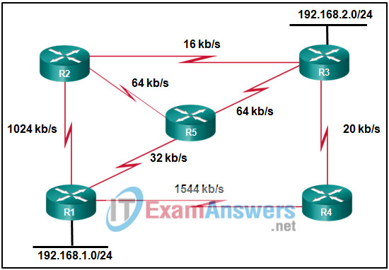

> EIGRP only uses the slowest bandwidth in its composite metric. The slowest bandwidth in the path R1, R2, R5, R3 is 64 kb/s and thus offers the best path to the 192.168.2.0/24 network.

? didn't get it

* 23: Which two metric weights are set to one by default when costs in EIGRP are being calculated? (Choose two.)
  * k6
  * > k3
  * > k1
  * k4
  * k5
  * k2

* 26: If all router Ethernet interfaces in an EIGRP network are configured with the default EIGRP timers, how long will a router wait by default to receive an EIGRP packet from its neighbor before declaring the neighbor unreachable?
  * 10 seconds
  * > 15 seconds
  * 20 seconds
  * 30 seconds

* 34: What is the administrative distance of an EIGRP summary route?
  * 110
  * > 5
  * 90
  * 20

# ch. 8-10: 18/34

* https://itexamanswers.net/ccnp-encor-v8-chapters-8-10-ospf-test-online.html
* 3: Which three requirements are necessary for two OSPFv2 routers to form an adjacency? (Choose three.)
  * > The OSPF hello or dead timers on each router must match.
  * > The link interface subnet masks must match.
  * The OSPFv2 process ID must be the same on each router.
  * > The two routers must include the inter-router link network in an OSPFv2 network command.
  * The OSPFv2 process is enabled on the interface by entering the ospf process area-id command.
  * The link interface on each router must be configured with a link-local address.

> Several variables must match for an OSPF neighbor adjacency to be formed between two OSPF routers. These variables include: area ID, hello and dead timers, interface MTU, and interface subnet.

* 6: Refer to the exhibit. What destination address will RTB use to advertise LSAs?
  * 10.1.7.17
  * > 224.0.0.6
  * 224.0.0.5
  * 255.255.255.255
  * 172.16.1.1
  * 172.16.2.1

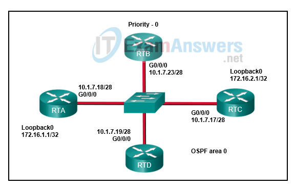

> A DR and BDR are elected on multiaccess networks to reduce the number of OSPF adjacencies formed. Non-DR routers will form adjacencies with the DR and BDR and send LSU packets to the AllDR-Routers multicast address of 224.0.0.6

* 12: Which two statements describe OSPF route summarization? (Choose two.)
  * OSPF can perform automatic summarization on major classful network boundaries even if no summarization commands are entered from the CLI.
  * Once OSPF route summarization is configured, the summary route will be advertised even if none of the networks in the address range are in the routing table.
  * Automatic OSPF route summarization is performed by the ABR.
  * > The area 51 range 172.0.0.0 255.0.0.0 command identifies area 51 as the area that contains the range of networks to be summarized.
  * > The metric of the summary route is equal to the lowest cost network within the summary address range.

* 13: What feature can be configured to filter routes as they are crossing an OSPF ABR?
  * > distribute list
  * prefix list
  * summarization
  * route map

* 18: Which LSA type is flooded by a designated router to other OSPF routers within the same area?
  * type 1
  * > type 2
  * type 3
  * type 4

> Type 2 LSAs are originated and flooded by the DR to inform other OSPF routers within multiaccess networks

* 21: Which statement is true about the difference between OSPFv2 and OSPFv3?
  * OSPFv3 routers do not need to elect a DR on multiaccess segments.
  * OSPFv3 routers use a 128 bit router ID instead of a 32 bit ID.
  * OSPFv3 routers use a different metric than OSPFv2 routers use.
  * > OSPFv3 routers do not need to have matching subnets to form neighbor adjacencies.

* 22: Which two OSPFv3 LSAs advertise address prefix information? (Choose two.)
  * type 1
  * type 2
  * type 4
  * > type 8
  * > type 9

* 25: Which is a difference between OSPFv2 and OSPFv3?
  * OSPFv3 uses a 128-bit router ID.
  * OSPFv3 and OSPFv2 use different protocol ID numbers.
  * OSPFv3 uses different packet types than OSPFv2.
  * > OSPFv3 does not have built in support for neighbor authentication.

* 26: How are OSPFv3 routes that are learned from type 1 LSAs identified in the IPv6 routing table?
  * > O
  * EX
  * IA
  * OI

> OSPF uses the code `O` to identify intrarea routes learned from type 1 LSAs in the routing table, and `O IA` to identify inter-area routes learned from type 3 LSAs

* 29: Refer to the exhibit. What two addresses will OSPFv3 neighbors connected to the g0/1 interface of R2 use as the destination address for sending OSPFv3 link-state updates to R2?
  * FF02::5
  * > FE80::2
  * 2001:DB8:11::100
  * 2001:DB8:11:20::1
  * > FF02::6

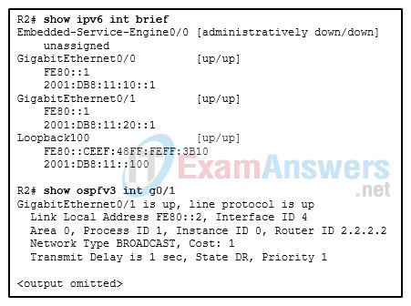

> Router R2 is a DR. Other OSPFv3 routers form an adjacency with the DR and send link-state updates to the ALLDRouters multicast ff02:06 and to the link -local address of the DR, which for g0/1 on R2 is fe80::2.

* 30: Which type of LSA only exists on networks containing a DR?
  * router
  * > network
  * AS external
  * summary

* 31: Which type of LSAs are reduced through interarea summarization?
  * type 1 LSAs from all OSPF routers
  * type 4 LSAs from ASBRs
  * > type 3 LSAs from ABRs
  * type 2 LSAs from DRs

> Interarea summarization reduces the number of type 3 LSAs advertised by an ABR.

* 32: At what level does OSPF maintain a unique LSDB?
  * > area
  * network
  * link
  * router

> Each OSPF router maintains a link state database (LSDB) for each area it participates in.

# ch. 11-12: 20/36

* https://itexamanswers.net/ccnp-encor-v8-chapters-11-12-bgp-test-online.html
* __IPv6 address are hexadecimal__

* 6: Refer to the exhibit. A network administrator is configuring BGP on a router. Which configuration step is needed in order to establish the BGP session with the neighbor router?
  * Configure the keepalive timer.
  * > Initialize and activate the address family.
  * Advertise the networks attached to the router.
  * Restart the BGP process.

> For a BGP session to initiate, one address family for a neighbor must be activated. On Cisco routers the IPv4 address family is activated by default; however, it may cause confusion when working with other address families. The BGP router configuration command `no bgp default ip4-unicast` disables the automatic activation of the IPv4 AFI.

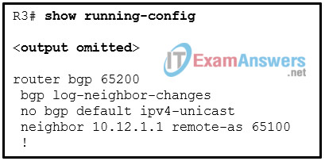

* 8: Which BGP routers will become peers and share routing information?
  * BGP routers that are configured with the same network command
  * BGP routers that are configured with the same peer command
  * > BGP routers that are configured with the neighbor command
  * BGP routers that share routing information with all routers in the same AS by default

* 9: Which two statements describe the configuration differences when MP-BGP is applied using the IPv6 protocol compared to IPv4 protocol? (Choose two.)
  * > The IPv6 address family must be initialized and the neighbor activated.
  * > Routers with only IPv6 addressing must have the BGP RID statically defined.
  * IPv4 addresses cannot be used to define a BGP RID.
  * IPv6 uses multicast to establish neighbor sessions.
  * Routers with only IPv6 addressing must use AS numbers beyond 65535.

 > The BGP configuration rules in IPv4 apply to IPv6, except that the IPv6 address family must be initialized, and the neighbor is activated. Routers with only IPv6 addressing must statically define the BGP RID to allow sessions to form.

* 13: Which BGP state is the one where BGP initiates the TCP connection and sends an Open message to the sender?
  * Passive
  * > Connect
  * OpenSent
  * Established

* 18: A company is deploying BGP multihoming to provide network connection redundancy for several branch locations. One of the network design objectives is to provide deterministic routing among company locations during failover by providing a specific location to handle branch transit traffic. Which two design criteria should be applied to the specific facility? (Choose two.)
  * > The bandwidth can be sized according to the traffic needs.
  * The facility should be in a central place from all company locations.
  * OSPF is the preferred IGP for the facility.
  * > The routing pattern is bidirectional and predictable.
  * BGP route policies should apply to only allow for local BGP routes to be advertised.

> Multihomed environments should be configured so that branch routers cannot act as transit routers. In most designs, transit routing of traffic from another branch is undesirable, as WAN bandwidth may not be sized accordingly. If transit behavior is required, it should be restricted to the data centers or specific locations with these design criteria: Proper routing design can accommodate outages. Bandwidth can be sized accordingly. The routing pattern is bidirectional and predictable.

* 20: A network administrator is configuring a prefix list with the command
`ipv6 prefix-list IPV6-1 seq 5 permit 2001:db8:abcd:30::/60 ge 61 le 63`
Which two networks match the prefix match specification? (Choose two.)
  * `2001:db8:abcd:30::/60`
  * > `2001:db8:abcd:34::/62`
  * `2001:db8:abcd:20::/62`
  * > `2001:db8:abcd:36::/63`
  * `2001:db8:abcd:60::/64`

* 22: Refer to the exhibit. Considering the route map configuration for BGP, which statement describes the condition for a network prefix to match the route map TEST?
  * The network prefix needs to match both ACL1 and ACL2 independently of the processing action.
  * If the processing action is permit, the network prefix needs to match either ACL1 or ACL2.
  * > The network prefix needs to match either ACL1 or ACL2 independently of the processing action.
  * If the processing action is deny, the network prefix needs to match both ACL1 and ACL2.

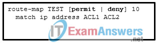

> In route map configuration, if there are multiple variables (ACLs, prefix lists, tags, and so on) configured for a specific route map sequence, only one variable must match for the prefix to qualify. The Boolean logic uses an OR operator for this configuration. The processing action is performed only after a match occurs.

* 24: Which three statements describe the weight attribute for BGP? (Choose three.)
  * > It is a Cisco-defined attribute.
  * It is a nontransitive attribute that uses a 32-bit value called metric.
  * > It is not advertised to other routers.
  * > It is a 16-bit value assigned locally on the router.
  * It is not advertised between eBGP peers and is typically used to influence the next-hop address for outbound traffic.
    * LZ: this should also be correct, even ChatGPT says so
  * It is a well-known discretionary path attribute and is included with path advertisements throughout an AS.

* 28: Which two statements describe private BGP communities? (Choose two.)
  * > A private BGP community requires a route map configuration.
  * Private BGP communities are used to signify no transit networks.
  * An organization needs to register for a private BGP community.
  * > Private BGP communities are within the range of 0xFFFF0000 to 0xFFFFFFFF.
    * LZ: this is completely wrong, this range is for well-known attributes
  * A private BGP community uses the first 16 bits to represent its AS and the second 16 bits to represent a pattern.
    * LZ: this is correct

> Private BGP communities follow a particular convention where the first 16 bits represent the AS of the community origination, and the second 16 bits represent a pattern defined by the originating AS. A private BGP community pattern can vary from organization to organization, does not need to be registered, and can signify geographic locations for one AS while signifying a method of route advertisement in another AS.

* 29: Refer to the exhibit. Given the above configuration commands, which two statements are true? (Choose two.)
  * RTA will set the atomic aggregate attribute to false.
  * > RTA will set the atomic aggregate attribute to true.
  * RTA will send the supernet route as well as all other specific BGP routes that belong to that supernet.
  * > RTA will create the supernet route even if no other specific routes belonging to the supernet are in the route table.
    * LZ: there is a static aggregated prefix configured
  * RTA will send the supernet route and suppress the more specific routes known to BGP.
    * LZ: there is also a dynamic aggregated prefix configured, but it only will be created if there is a more specifics in the routing table

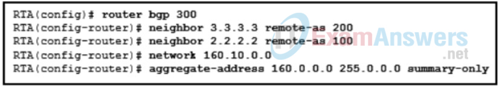

> Route summarization on BGP edge routers via dynamic method is configured by specifying an aggregation network prefix. The aggregate-address command advertises the aggregated route (the supernet) in addition to the specific original component network prefixes. By using the optional summary-only keyword, the component network prefixes in the summarized network range are suppressed. When a BGP router summarizes a route, it does not advertise the AS_Path information from before the aggregation. This effect is indicated by the atomic aggregate attribute. The atomic aggregate attribute indicates that a loss of path information has occurred.

* 30: Refer to the exhibit. A network administrator issues the show bgp ipv4 unicast command to check the routes in the BGP table. What does the indication of 0.0.0.0 under Next Hop mean? Chapters 11 - 12: BGP Exam (Answers) 13
  * The route is the best route for the network prefix.
  * > The route is originated from a connected network to the router.
  * The route is learned through a static route.
  * The route is learned through IGP.

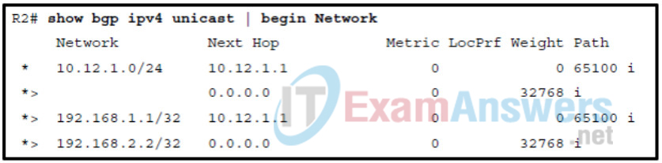

> As the BGP prefix is installed into the Loc-RIB table, the following BGP PAs are set, depending on the RIB prefix type:
> * Connected network : The next-hop BGP attribute is set to 0.0.0.0, the BGP origin attribute is set to i (IGP), and the BGP weight is set to 32,768.
> * Static route or routing protocol : The next-hop BGP attribute is set to the next-hop IP address in the RIB, the BGP origin attribute is set to i (IGP), the BGP weight is set to 32,768, and the MED is set to the IGP metric.
>
> BGP origin attributes
> * IGP origin (i)
> * EGP origin (e)
> * Incomplete origin (?)

* 31: A network administrator is configuring route summarization for received routes before advertising to the next peer with the commands:
```
R1(config)# router bgp 65500
R1(config-router)# aggregate-address 172.16.0.0 255.255.240.0 as-set summary-only
R1(config-router)# end
```
* How will the aggregate route be advertised after the commands are entered?
  * The aggregate route will be advertised together with the smaller component network prefixes.
  * The advertised aggregate route will increase the hop counts as it indicates multiple autonomous systems.
  * The aggregate route will be advertised as an atomic aggregate route.
  * > The aggregate route will be advertised with previous BGP path information.

* 34: A network administrator is configuring an ACL to match networks for BGP route filtering. The administrator creates an ACE permit ip 10.0.64.0 0.0.63.0 255.255.255.0 0.0.0.192 . Which two networks match the ACE? (Choose two.)
  * 10.0.128.0/25
  * 10.0.126.0/25
    * LZ: this one should be correct as well
  * 10.0.130.0/24
  * > 10.0.64.0/24
  * 10.0.63.0/26

> One method for conditional matching of routes in BGP is through extended ACLs. When extended ACLs are used for this purpose, the source fields match against the network portion of the route, and the destination fields match against the network mask. The network portion of the matching networks is 10.0.64.0 through 10.0.127.0. The network mask portion is /24 through /26.
> LZ: 127=64+63
> LZ: 192: the first two bits are arbitrary, /24+0 -> 24+2

# ch. 13-14: 16/32

* https://itexamanswers.net/ccnp-encor-v8-chapters-13-14-multicast-and-qos-test-online.html

* 3: Which is a characteristic of PIM sparse mode?
  * It uses a pruning mechanism to stop the flow of unwanted multicast traffic on interfaces with no downstream neighbors.
  * > It requires an RP on the network to act as the root of the shared distribution tree.
  * It builds the multicast tree by flooding traffic out all interfaces.
  * It is designed for networks where receivers are located on every subnet in the network.

* 9: An administrator has configured and enabled multicast together with PIM sparse mode on all VLANs on the network. Which feature helps to reduce multicast traffic being broadcast on the access layer switches?
  * source registration
  * PIM Pruning
  * > IGMP snooping
  * SPT switchover

> IGMP snooping stops multicast traffic from being broadcast on the access layer switches by examining IGMP joins that are sent by receivers and maintaining a table of interfaces to IGMP joins.

* 10: Which two IGMPv3 modes are used to signal membership to a multicast host group? (Choose two.)
  * preclude
  * join
  * > include
  * rendezvous
  * > exclude
  * leave

> The two IGMP modes that are used to signal membership are Include mode (the receiver announces membership to a multicast group and provides a include list) and Exclude mode (receiver announces membership to multicast group and provides exclude list).

* 11: Which statement describes a characteristic of IP multicast routing?
  * PIM hello messages are sent every 60 seconds by default out each PIM enabled interface.
  * > PIM dense mode flood and prune behavior repeats every three minutes.
  * PIM sparse mode builds the multicast tree through flooding of traffic out every interface.
  * PIM sparse mode and PIM dense mode require an RP on the network.

* 13: Which two statements about Protocol Independent Multicast (PIM) are true? (Choose two.)
  * > Three of the forwarding modes for PIM are PIM dense mode (PIM-DM), PIM sparse mode (PIM-SM), and PIM sparse-dense mode.
  * > PIM is a multicast routing protocol that makes packet-forwarding decisions independent of the unicast IP routing protocol that is running in the network.
  * PIM should be configured on the device that hosts the source of the muticast traffic.
    * PIM should be configured on the FHR
  * PIM sparse mode is most useful when there are few senders, many receivers, and the volume of multicast traffic is high.
  * PIM should be configured only on the first and the last hop routers in the multicast tree.
  * PIM does not require an IGP protocol to be configured in the network.

* 16: Which nonproprietary mechanism does PIM use to discover and announce RP set information for each group prefix for all the routers in a PIM domain?
  * Static RP
  * > BSR
  * RPF
  * Auto-RP

* 18: What two fields are available in IPv4 and IPv6 headers to mark packets for QoS? (Choose two.)
  * > Traffic Class
  * Class of Service
    * layer 2 uses CoS
  * > Type of Service
  * Priority
  * VLAN ID

* 20: Which is a QoS model that a network engineer would implement to ensure a source to destination quality of service standard for a specified data flow?
  * best effort
  * low latency queuing
  * differentiated services
  * class-based weighted fair queuing
  * > integrated services

> Best effort is the default packet forwarding design and provides no QoS. The differentiated services model enforces and applies QoS mechanisms on a hop-by-hop basis, not source to destination. Class-based weighted fair queuing and low latency queuing are queuing algorithms.

* 21: What would be the Tc value in ms for a 1 Gbps interface configured with a policer defined with a CIR of 150 Mbps and a Bc of ~~12~~15 Mb?
  * 10,000 ms
  * 1000 ms
  * > 100 ms
  * 10 ms

> The Tc value is calculated by using the formula Bc (bits)/ CIR (bps) X 1000
> TC = (15 Mb/150 Mbps) X 1000 
> Tc = (15,000,000 bits/150,000,000 bps) X 1000 
> Tc = 100 ms

* 22: What statement describes the Class of Service field?
  * > It is a Layer 2 field.
  * It is a field that is 6 bits long.
  * It is a field that is 8 bits long.
  * It is a Layer 1 field.

* 25: Which two procedures should be implemented when deploying VoIP in a campus network? (Choose two.)
  * voice and data traffic in the same VLAN and mark the traffic for high priority treatment
  * a traffic shaping QoS policy to guarantee minimum delay for the voice traffic
  * > packet marking for voice traffic with a 802.1p CoS value of 5
  * priority queuing with voice traffic given the high-priority queue
  * > a voice class low-latency queuing (LLQ) QoS policy

* 27: Match the queuing algorithm with its description. (Not all options apply.)

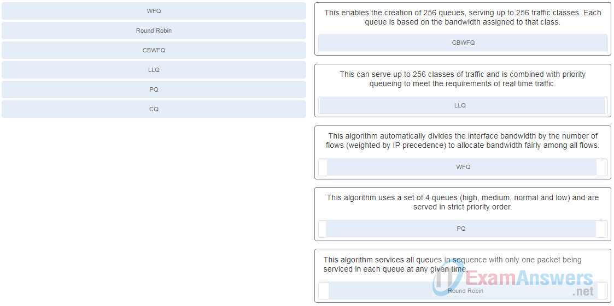

* 28: What is the value of the DSCP marker for video traffic on a WLAN?
  * > AF41
  * O
  * AF11
  * EF

* 29: Which statement describes NBAR2?
  * NBAR2 can identify a variety of protocols and applications by using up to Layer 6 data.
  * NBAR2 supports only scavenger traffic.
  * > NBAR2 uses MQC to match traffic to specific protocols.
  * NBAR2 does not require monthly protocol packs to identify new and emerging applications.

> NBAR2 is a deep packet inspection engine that uses Layer 3 through 7 data to identify a variety of protocols. it can operate in either Protocol discovery mode or Modular QoS CLI (MQC) mode.

# ch. 15-16 (24/36)

* https://itexamanswers.net/ccnp-encor-v8-chapters-15-16-ip-services-and-vpns-test-online.html

* 8: Which router command is required to configure VRRP to support IPv6?
  * standby 1 ipv6 FE80::1:1
  * > fhrp version vrrp v3
  * standby 6 ipv6 autoconfig
  * vrrp 22 address-family ipv6

* 11: Which two NTP details are displayed by issuing the show ntp associations command on a switch configured to use NTP? (Choose two.)
  * reference time
  * > NTP server IP address
  * > reference clock IP address
  * "Clock is synchronized" statement
    * this is shown in `show ntp status`
  * NTP uptime

* 17: Refer to the exhibit. What statement is true about the output of the show standby command?
  * > The router is currently forwarding packets.
  * This router is tracking two properly operating interfaces.
  * The current priority of this router is 120.
  * This router is in the HSRP down state because its tracked interfaces are down.

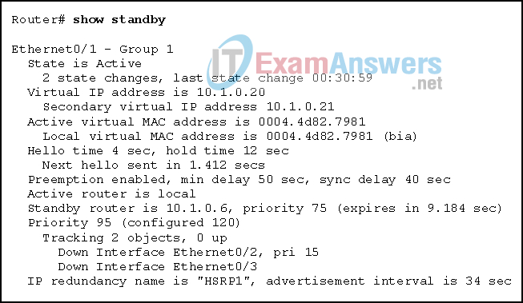

> The output shows that the active router is local and indicates that this router is the active router and is currently forwarding packets.

* 21: How many bytes of overhead are added to each IP packet while it is transported through a GRE tunnel?
  * 8
  * 32
  * 16
  * > 24

* 22: Refer to the exhibit. Which IP address is configured on the physical interface of the CORP router?
  * 10.1.1.2
  * 209.165.202.134
  * > 209.165.202.133
  * 10.1.1.1

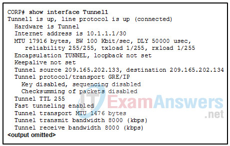

* 26: Which LISP header is used to provide a secure boundary between multiple organizations?
  * outer LISP UDP header
  * outer LISP IP header
  * > Instance ID
  * RLOC

> The 24-bit Instance ID field is a value used to provide device- and path-level network virtualization to prevent IP address duplication within a LISP site or provide a secure boundary between multiple organizations.

* 27: How is routing handled within a LISP site?
  * through the use of virtual tunnels
  * through the use of virtual controllers
  * > through the use of an interior routing protocol
  * through the use of RLOCs

* 34: Which algorithm is considered insecure for use in IPsec encryption?
  * AES
  * > 3DES
  * SHA-1
    * LZ: this one is also not secure, use SHA-3 or SHA-256 instead
  * RSA

* 36: What is the first step in establishing an IPsec VPN?
  * creation of a secure tunnel to negotiate a security association policy
  * > detection of interesting traffic
  * negotiation of ISAKMP policies
  * creation of an IPsec tunnel between two IPsec peers

> Before an IPsec tunnel can be configured, interesting traffic must be detected. Interesting traffic is defined by an access list permit statement. Once interesting traffic is detected, by matching the access list, IKE phase 1 negotiations can begin that will establish the tunnel.

# ch. 17-19: 23/33

* 5: What technological factor limits the number of unique spatial streams that can be supported by a MIMO device?
  * the number of radios
  * the number of transmitters
  * the number of receivers
  * > the processing capacity

> A MIMO device can distribute spatial streams across multiple radio chains and does not have to assign a unique spatial stream to an individual transmitter/receiver. The number of possible spatial streams depends on the processing capacity and the transmitter feature set of the wireless device.

* refer [here](./17-wireless.md#spatial-multiplexing)
* https://www.youtube.com/watch?v=5IigzGDBYB0

* 13: What are two benefits of deploying a centralized wireless LAN topology? (Choose two.)
  * decreasing the cable length requirement when utilizing lightweight access points in an embedded wireless network topology
  * > convenience of enforcing security policies for all wireless users
  * lowering the investment cost when utilizing lightweight access points in a Mobility Express topology
  * > maximizing the number of APs that can join a single WLC
  * decreasing the RTT between two wireless clients on a single access point

> A centralized or unified wireless LAN topology utilizes a centralized WLC location that provides easy enforcement of security policies and the ability to maximize the number of APs that can join to it. The centralized topology also supports user mobility because all of the APs associate to the same WLC no matter how many APs the user device associates with while roaming.
> * __Mobility Express__ topology: one AP also hosts the WLC functionality

* 15: Which protocol and port number are used when an AP sends a unicast CAPWAP Discovery Request packet to the IP address of a controller? (Choose two.)
  * > UDP
  * > 5246

* 17: What information is needed by an AP for stateful switchover (SSO) using high availability with a standby WLC?
  * the standby WLC
  * the group name of the SSO pair
  * the IP address of both the primary and standby WLC
  * > the active primary WLC

* 18: Why would an AP that successfully discovers a WLAN controller be denied from joining that WLC?
  * The name of the WLC is different from the pre-configured name on the Cisco lightweight AP.
  * > The WLC already has the maximum number of APs joined to it.
  * The WLC has a software release downloaded on it that is different from the lightweight AP software.
  * The WLC is configured to be the standby WLC in an SSO group.

* 20: A wireless engineer accesses the WLC and configures a lightweight access point to function as a sniffer. Which two functions will be performed by the lightweight access point in this mode? (Choose two.)
  * > The lightweight AP will forward captured traffic to a PC running network analyzer software.
  * The lightweight AP will check for IDS events and determine the position of stations through location-based services.
  * > The lightweight AP will dedicate all of the physical radios to receiving 802.11 traffic from other sources.
  * The lightweight AP will correlate MAC addresses heard on the wired network with those heard over the air to detect rogue devices.
    * LZ: that's a different mode than sniffer
  * The lightweight AP will offer one or more functioning BSSs on a specific channel.

* 26: A company deploys a Cisco wireless network over a large campus. The wireless network uses lightweight APs and multiple WLCs. A network technician walks around the campus to verify that wireless clients can roam smoothly between APs bound to different WLCs and assigned different VLANs and IP subnets. The technician verifies that while the client roams around campus, the client retains the same VLAN and IP address assigned. Which roaming scenario is the technician verifying?
  * intracontroller roaming
  * local-to-local roaming
  * Layer 2 roaming
  * > Layer 3 roaming

> In a Cisco wireless network, when a client initiates an intercontroller roam, the two controllers involved can compare the VLAN numbers that are assigned to the respective WLAN interfaces. If the VLAN IDs are the same, the client undergoes a Layer 2 intercontroller roam (also called local-to-local roam) and can continue to use the original IP address on the new controller. If the two VLAN IDs differ, the controllers arrange a Layer 3 roam that will allow the client to keep using the same IP address.

* 26: A company deploys a Cisco wireless network over the campus. Wireless network access is needed for visitors to access the internet while on campus. What are two best practices in setting up APs and WLCs for secure wireless connections for visitors? (Choose two.)
  * only using private IP addresses for APs and clients
  * using static IP addressing for clients to better locate visitor clients
  * > putting the anchor controller specific for visitors behind firewall
  * > configuring a WLC to be a static anchor controller specific for visitors to associate
  * deploying autonomous APs for visitors

* 28: Which two Cisco location solutions can work with Cisco management platforms to provide real-time location services for a wireless network? (Choose two.)
  * Prime Infrastructure
  * > Mobility Services Engine
  * > DNA Space
  * DNA Center
  * Identity Services Engine

> Cisco APs and WLCs can integrate with management platforms like Cisco Prime Infrastructure or DNA Center, along with location servers like Cisco Mobility Services Engine (MSE), Cisco Connected Mobile Experiences (CMX), or Cisco DNA Spaces to gather location information in real time and present that information in a relevant way.

# ch. 20-21: 31/33

* 14: Which three statements concerning wireless network security are accurate? (Choose three.)
  * > A wireless client first associates with an AP and then authenticates for network access.
  * WPA2-Personal prevents attackers from being able to use a key to unencrypt data that was already transmitted over the air.
  * Every device using the WLAN must be configured with an identical pre-shared key, unless PSK with ISE is used.
    * LZ: this one should be correct as well
    * P.595: "_be aware that every device using the WLAN must be configured with an identical pre-shared key, unless PSK with Identity Services Engine (ISE) is used._"
  * WPA versions use a three-way handshake procedure to exchange a pre-shared key between a client and an AP.
  * > Open authentication uses no client or AP verification.
  * > WPA1, WPA2, and WPA3 support both PSK or 802.1x client authentication modes.

* 30: A network administrator opens the Client View screen on the WLC to review the performance data of a wireless client. The administrator notices that the client has a connection score value of 78%. What can the administrator conclude from this information?
  * The client has a received signal strength of 78% at the AP.
  * The client is using its wireless connection only 78% of the time.
  * > The client is currently using a data rate that is 78% of its maximum capability.
  * The client is currently in the bottom 78% of all wireless clients in data usage.

> The connection score shown in the Client View window is determined by dividing the current data rate of the client by the lower maximum supported date rate. It is a measure of how much of its maximum capability it is using. If the client had a maximum rate of 100 Mbps, then a connection score of 78% would mean the client is currently using 78 Mbps.

# ch. 22-24: 28/43

* 3: What are three benefits of employing a hierarchical network design? (Choose three.)
  * Use of a hierarchical design allows replacement of redundant devices with high-capacity network equipment.
  * The hierarchical model allows the use of high-performance switches at all design layers, thus allowing for a fully-meshed topology.
  * > Hierarchically designed networks can more easily be expanded to suit future needs.
  * > Hierarchical design models enhance existing bandwidth through the use of link aggregation.
  * A hierarchical design uses firewalls instead of complicated port-based and distribution layer security policies.
  * > The hierarchical model allows for specialized functionality at each layer, simplifying device management.

> Hierarchical design provides fault containment by constraining the network changes to a subset of the network, which affects fewer systems and makes it easy to manage as well as improve resiliency. In a modular layer design, network components can be placed or taken out of service with little or no impact to the rest of the network and this facilitates troubleshooting, problem isolation, and network management.

* 11: A network engineer has to decide between a Layer 2 Access Layer (STP-based) and a Layer 3 Access Layer (Routed access) campus design option. Which statement must be considered for a decision to be made?
  * The Routed access option is the best cost-effective solution.
  * The STP based access option supports spanning VLANs across multiple access switches, whereas the Routed access option does not.
    * LZ: this is also correct
  * > The Routed access option offers easier troubleshooting than the STP-based option.
  * The STP based option does not require FHRP, whereas the Routed access option does.

> The Routed access design has a number of advantages over the STP-based design: No FHRP required – no need for FHRP protocols such as HSRP and VRRP. No STP required – since there are no L2 links to block, this design removes the need for STP. Easier troubleshooting – It offers common end-to-end troubleshooting tools (such as ping and traceroute). The Routed access is an excellent design for many environments, but it has the same limitation as the STP-based design, in which it does not support spanning VLANs across multiple access switches. Additionally, it might not be the most cost-effective solution because access layer switches with Layer 3 routing capability might cost more than Layer 2 switches do.

* 15: An administrator issued the following commands on router R1:
```
R1(config)# logging 192.168.10.2
R1(config)# logging trap 5
```
* What conclusion can be drawn from this configuration?
  * The only messages that appear on the syslog server are those with severity level of 5​.
  * > Messages with severity level of 6 or higher appear only on the router console output.
    * LZ: this is wrong. Should be level 5 or lower
  * Messages with severity level of 5 or higher appear on the router console output and are sent to the syslog server.
  * The only messages that appear on the syslog server are those with severity level of 4 or lower​.


* 16: What is the description for a Syslog Level 1 event?
  * system unusable
  * > immediate action needed
  * error condition
  * critical condition

* 20: What is the description for a Syslog Level 5 event?
  * > normal, but significant condition
  * debugging message
  * warning condition
  * informational message

* 21: What is the description for a Syslog Level 6 event?
  * normal, but significant condition
  * > informational message
  * debugging message
  * warning condition

* 22: Which layer of the Cisco SD-Access Architecture contains the underlay and the overlay networks?
  * controller
  * > network
  * management
  * physical

* 23: Which two statements describe the SD-Access overlay network? (Choose two.)
  * It provides underlay and fabric automation and orchestration.
  * > It is a virtualized network interconnecting all network devices.
  * > It has three planes of operation: control, data, and policy.
  * It is the underlying physical layer transporting data between network devices.
  * It includes all devices that actively participate in the SD-Access fabric.

* 26: Which IGP is used in the automated underlay model of the Cisco SD-Access architecture?
  * OSPF
  * BGP
  * > IS-IS
  * EIGRP

* 30: What are three functions of the Cisco SD-WAN vBond orchestrator? (Choose three.)
  * delivering quality of experience (QoE) for SaaS applications
  * providing a single pane of glass network management system
  * > providing a control plane connection over DTLS tunnels to communicate with SD-WAN routers
    * LZ: this should be vSmart function
  * forecasting and what-if analysis
  * > providing NAT traversal between SD-WAN routers
  * > providing load balancing of SD-WAN routers

* 36: Which network monitoring tool can provide a complete audit trail of basic information of all IP flows on a Cisco router and forward the data to a device?
  * > NetFlow
  * SIEM
  * SPAN
  * Wireshark

* 39: Refer to the exhibit. The RSPAN configuration for each switch is shown. The network administrator has configured RSPAN to allow the monitoring of traffic to a corporate server. Unfortunately, the administrator is unable to sniff any traffic from the link. Why is the administrator unable to sniff traffic?
  * > VLAN 100 has not been properly configured as an RSPAN VLAN.
    * need `remote-span` config bit underl vlan config
  * Only VLAN 1 can be used as the RSPAN VLAN.
  * The source and destination interfaces are reversed on SW2.
    * LZ: this is also correct answer ?
  * The session numbers on the two switches do not match.
  * The remote interface on SW1 should be identified as fa0/3.

# ch. 25-26: 23/32

* https://itexamanswers.net/ccnp-encor-v8-chapters-25-26-access-control-and-infrastructure-security-test-online.html

* 5: Which solution provides comprehensive network and data protection for organizations before, during, and after a malware attack?
  * Cisco Umbrella
  * Cisco ISE
  * > Cisco AMP
  * Cisco Stealthwatch

* 7: What security capability is provided by applying Cisco WSA web reputation filters before an attack?
  * > prevents client devices from accessing dangerous websites containing malware or phishing links
  * uses URL filtering to shut down access to websites known to host malware
  * provides administrators with granular control over web and mobile application usage behavior
  * inspects the network continuously for instances of undetected malware and breaches

* 18: hat are two limitations of PACLs? (Choose two.)
  * only support numbered ACLs
  * only support extended ACLs
  * can only filter Layer 2 traffic
  * > no support of ACLs that filter IPv6 packets
  * > no filtering of outbound traffic

* 19: An administrator defined a local user account with a secret password on router R1 for use with SSH. Which three additional steps are required to configure R1 to accept only encrypted SSH connections? (Choose three.)
  * Configure DNS on the router.
  * Enable inbound vty Telnet sessions.
  * > Configure the IP domain name on the router.
  * > Configure a host name other than “Router”.
  * Generate two-way pre-shared keys.
  * > Generate crypto keys.

> There are three steps to configure SSH support on a Cisco router:
> * Step 1: Configure a hostname.
> * Step 2: Configure a domain name.
> * Step 3: Generate crypto keys.

* 20: Which command produces an encrypted password that is easily reversible?
  * username {username} secret {password}
  * username {username} algorithm-type sha256 {password}
  * enable secret {password}
  * > service password-encryption

> The `service password-encryption` command uses a Cisco proprietary Vignere cypher algorithm which is weak and easily reversible. The `enable secret` and the `username secret` commands encrypt passwords using the MD5 hashing algorithm and the `username algorithm-type sha 256` command uses a SHA-256 hashed secret and is considered uncrackable.

* 23: Which statement describes a difference between RADIUS and TACACS+?
  * RADIUS separates authentication and authorization, whereas TACACS+ combines them as one process.
  * RADIUS does not support EAP for 802.1x, whereas TACACS+ does.
  * > RADIUS encrypts only the password, whereas TACACS+ encrypts all communication.
  * RADIUS uses TCP, whereas TACACS+ uses UDP.

* 27: What is the Control Plane Policing (CoPP) feature designed to accomplish?
  * disable control plane services to reduce overall traffic
  * manage services provided by the control plane
  * direct all excess traffic away from the route processor
  * > prevent unnecessary traffic from overwhelming the route processor
    * LZ: unnecessary traffic?

* 28: Which command can be issued to protect a Cisco router from unauthorized automatic remote configuration?
  * no cdp enable
  * no service pad
  * > no service config
  * no ip proxy-arp

* 29: Which vulnerability can be mitigated by disabling CDP and LLDP on a Cisco device?
  * > advertising detailed information about a device
  * automatic remote configuration
  * half-open or orphaned TCP connections
  * answering APR requests intended for other devices

# ch. 27-29: 33/39

* https://itexamanswers.net/ccnp-encor-v8-chapters-27-29-virtualization-automation-and-programmability-test-online.html

* 3: What are three responsibilities of the the NFV virtualized infrastructure manager? (Choose three.)
  * performing all FCAPS functions for VNFs
  * > managing and controlling NFVI hardware resources
  * ? performing life cycle management of all NFVI resources
  * creating, maintaining, and tearing down VNF network services
    * this is done by NFV Orchestrator
  * creating an end-to-end network
  * > collecting performance measurements and fault information

* 4: Which two components of the ETSI NFV architectural framework make up the NFV management and orchestration (MANO)? (Choose two.)
  * Virtualized Infrastructure Manager
  * NFV infrastructure
  * NFV element manager
  * OSS/BSS
  * NFV orchestrator

* 7: What function does Cisco DNA Center provide as part of a Cisco enterprise NFV solution?
  * VNF life cycle management, monitoring, device programmability, and hardware acceleration
  * communication between different VNFs and to the outside world
  * CPU, memory, and storage resources to run NVFs and applications
  * > VNF management and orchestration

* 11: Which two HTTP functions correspond to the UPDATE function in CRUD? (Choose two.)
  * > PUT
  * DELETE
  * > PATCH
  * GET
  * POST

* 12： What are two syntax rules for writing a JSON array? (Choose two.)
  * A semicolon separates the key and list of values.
  * A space must separate each value in the array.
  * The array can include only one value type.
  * > Values are enclosed in square brackets.
  * > Each value in the array is separated by a comma.

* 22: In a hosted Chef type of deployment, where is the Chef server located?
  * on a LAN located near to the other chef components
  * > in the cloud
  * on a workstation
  * in the enterprise core
    * LZ: this is private chef

# final test: 122/151

* https://itexamanswers.net/ccnp-encor-v8-final-test-online.html

* 1: What is the IPv6 address used by OSPFv3 non-DR/BDR routers to send link-state updates and link-state acknowledgments?
  * FF02::2
  * FF02::5
  * > FF02::6
  * FF02::9

* 2: Refer to the exhibit. Both routers R1 and R2 are configured for OSPFv3 and are routing for both IPv4 and IPv6 address families. Which two destination addresses will R1 use to establish a full adjacency with R2? (Choose two.)
  * ff02::5
    * LZ: should be this one
  * > fe80::2
  * > 2001:db8:22::100
    * LZ: not global IPv6 addr., only link-local addr to ensure ospf traffic stay local
  * 172.17.66.1
  * 2001:db8:21:20::2

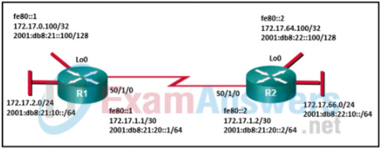

* 8: Which function is provided by the Cisco SD-Access Architecture controller layer?
  * It presents all information to the user via a centralized management dashboard.
  * It interconnects all of the network devices, thus forming a fabric of interconnected nodes.
  * > It provides network automation and operational status information to the management layer.
  * It delivers data packets to and from the network devices participating in SD-Access.

* 22: Refer to the exhibit. All the displayed switches are Cisco 2960 switches with the same default priority and operating at the same bandwidth. Which three ports will be STP designated ports? (Choose three.)
  * > fa0/10
  * > fa0/21
  * > fa0/13
  * fa0/20
  * fa0/9
  * fa0/11

* 36: A network engineer that works for a company that uses lightweight APs is examining various performance factors for the wireless network in a particular area of the company. The engineer notices that one AP has an index value of 40 for air quality. What significance, if any, does this value provide?
  * The engineer should physically examine the surrounding area of the AP for potential RF obstructions.
    * LZ: why this is wrong?
  * The engineer might evaluate this index value over a period of 30 days to see if the air conditioning or heat is affecting the RF range of the AP.
  * An air quality value of 40 is within acceptable performance range for a lightweight AP, so no action is required by the network engineer.
  * > Because of poor air quality, the engineer should be concerned and evaluate other wireless channels for possible use.

* 42: Which two methods are used by a single-root I/O virtualization (SR-IOV) enabled switch to switch traffic between VNFs? (Choose two.)
  * through a DMVPN
  * through a VXLAN
  * > through an external switch
  * > through the pNIC
  * through a vSwitch

* 45: What type of signal requires little extra bandwidth because data is being sent at a relatively low bit rate?
  * orthogonal frequency division multiplexing
  * direct sequence spread spectrum
  * > narrowband
  * parallel

* 47: An administrator has configured an access list on R1 to allow SSH administrative access from host 172.16.1.100. Which command correctly applies the ACL?
  * R1(config-if)# ip access-group 1 in
  * R1(config-if)# ip access-group 1 out
  * > R1(config-line)# access-class 1 in
  * R1(config-line)# access-class 1 out

* 49: What is true about TCAM lookups that are associated with CEF switching?
  * > A single TCAM lookup provides Layer 2. Layer 3, and ACL information
  * TCAM includes only Layer 3 lookup information.
  * TCAM lookup tables are used only for the rapid processing of ACLs within CEF.
  * TCAM lookup tables are used only for the Layer 3 forwarding operation.
    * LZ: also can do layer 2 forwarding

* 52: Refer to the exhibit. Switch SW-A is to be used as a temporary replacement for another switch in the VTP Student domain. What two pieces of information are indicated from the exhibited output? (Choose two.)
  * > There is a risk that the switch may cause incorrect VLAN information to be sent through the domain.
  * > This switch will update its VLAN configuration when VLAN changes are made on a VTP server in the same domain.
  * VTP will block frame forwarding on at least one redundant trunk port that is configured on this switch.
  * The other switches in the domain can be running either VTP version 1 or 2.
  * VLAN configuration changes made on this switch will be sent to other devices in the VTP domain.

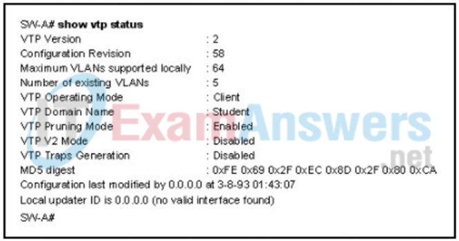

> If a switch on the same VTP domain is added to the network and the switch has a higher configuration revision number, valid VLANs can be deleted and VLANs from the new switch can be sent to other switches in the VTP domain. This can result in loss of connectivity for some network devices. Always put a false domain name on a new switch and then change the VTP domain name to the correct one so the configuration revision number will be at 0 on the switch to be added.

* 53: Which two mode combinations would result in the successful negotiation of an EtherChannel? (Choose two.)
 auto; auto
* active; passive
 active; on
 passive; auto
 desirable; active
* desirable; desirable

* 62: Which three functions are performed at the distribution layer of the hierarchical network model? (Choose three.)
  * transports large amounts of data between different geographic sites
  * forwards traffic to other hosts on the same logical network
  * > forwards traffic that is destined for other networks
  * > isolates network problems to prevent them from affecting the core layer
  * allows end users to access the local network
  * > provides a connection point for separate local networks

* 70: What is the function of a QoS trust boundary?
  * A trust boundary identifies the location where traffic cannot be remarked.
  * A trust boundary only allows traffic to enter if it has previously been marked.
  * > A trust boundary identifies which devices trust the marking on packets that enter a network.
  * A trust boundary only allows traffic from trusted endpoints to enter the network.
    * LZ: this is incorrect b/c it's not about blocking traffic, but QoS markings

> A trust boundary is a point in the network where a device decides whether to accept or reject the QoS markings (such as CoS or DSCP values) on incoming packets

* 86: A company has an extensive wireless network of multiple APs and a WLC. Users in one particular area complain of the lack of wireless connectivity. The network engineer verifies that the two APs in that area are communicating with the WLC. The network engineer checks the status of one particular client and the WLC interface shows a black client status dot for DHCP. The network engineer checks the status of another client and it too shows a black status dot of DHCP. What is the most likely problem?
  * > The wireless devices do not have IP addressing information to participate on the wireless network.
  * The WLC has not been configured for DHCP.
  * The AP in the area has not received the proper IP addressing information.
    * LZ: AP doesn't do layer 3 stuff
  * The AP in the area has received an IP address, mask, and default gateway, but has not received the IP address of one or more WLCs with which to register.

* 87: How do Layer 3 switches differ from traditional routers?
  * Layer 3 switches never perform routing lookups. Routers must always perform routing lookups.
  * > Layer 3 switches use ASICs for routing. Routers are software based.
  * Layer 3 switches are used in LANs. Routers are used in WANs.
  * Layer 3 switches forward packets based on MAC addresses only. Routers use IP addresses for forwarding.

* 92: What are two main components of SD-Access? (Choose two.)
  * > Cisco Campus Fabric solution
  * Cisco Identity Services Engine
  * > Cisco DNA Center
  * Cisco Network Control Platform
  * Cisco Network Data Platform

* 98: A company has decided to implement VXLANs. What are two types of VTEP interfaces that will be deployed? (Choose two.)
  * > local LAN interface
  * VNI
  * > IP interface
  * tunnel interface
  * PETR

* 104: Which two statements are true about WRED? (Choose two.)
  * > WRED will use the average queue depth of an interface when determining if a packet should be dropped.
  * WRED does not support ECN.
  * WRED uses a tail drop system for its queue buffers.
  * > WRED uses the IP precedence or DSCP marking of a packet when determining if a packet should be dropped.
  * WRED will drop packets marked AFx1 more aggressively than it will drop packets marked AFx3 from the queue.

* 108: What function is performed by the OSPF designated router?
  * summarizing routes between areas
  * > dissemination of LSAs
  * redistribution of external routes into OSPF
  * maintaining the link-state database

> OSPF designated routers are elected on multiaccess networks to disseminate LSAs to other OSPF routers. By having a single router disseminate LSAs, the exchanging of LSAs is more efficient.

* 109: What technology will allow containers in different physical servers to communicate?
  * an underlay network
  * > an overlay network
  * a vSwitch
  * container bridging

* 118: Which three options must match in order to establish an EtherChannel between two directly connected switches? (Choose three.)
  * port numbers that are used for the EtherChannel
  * > VLAN memberships of the interfaces that are used for EtherChannel
  * domain names on the switches
  * > speed of the interfaces that are used for EtherChannel
  * > duplex settings of the interfaces that are used for EtherChannel
  * port security settings on the interfaces that used for EtherChannel

> Speed and duplex settings must match for all interfaces in an EtherChannel. All interfaces in the EtherChannel must be in the same VLAN if the ports are not configured as trunks. Any ports may be used to establish an EtherChannel. Domain names and port security settings are not relevant to EtherChannel.

* 125: Refer to the exhibit. A network administrator is configuring an EtherChannel link between two switches, SW1 and SW2. Which statement describes the effect after the commands are issued on SW1 and SW2?
  * The EtherChannel is established without negotiation
  * > The EtherChannel fails to establish.
  * The EtherChannel is established after SW2 initiates the link request.
  * The EtherChannel is established after SW1 initiates the link request.

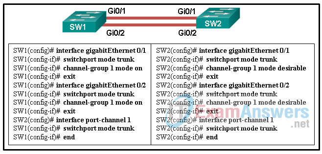

> The interfaces GigabitEthernet 0/1 and GigabitEthernet 0/2 are configured “on” for the EtherChannel link. This mode forces the interface to channel without PAgP or LACP. The EtherChannel will be established only if the other side is also set to “on”. However, the mode on SW2 side is set to PAgP desirable. Thus the EtherChannel link will not be established.

* 127: Which component of the Cisco SD-Access Architecture provides policy-based network segmentation and mobility for wired and wireless hosts?
  * network control platform
  * > overlay network
  * underlay network
  * DNA Center

> The SD-Access fabric is the overlay network, and it provides policy-based network segmentation, host mobility for wired and wireless hosts, and enhanced security beyond the normal switching and routing capabilities of a traditional network.

* 128: Refer to the exhibit. Router R6 has sent a join message to router R4 requesting multicast traffic for users in the multicast group 224.1.1.1. How will the multicast traffic that is sent from the multicast server SRC through the R1-R3-R5 path be handled at router R6?
  * The multicast traffic will be forwarded to all users in the multicast group 224.1.1.1.
  * The multicast traffic will be sent to switch SW1, which will drop the traffic.
  * > The multicast traffic will be dropped.
    * RPF check
    * PIM-SM uses the RPF lookup function to determine **where it needs to send joins** and prunes. 
      * (S,G) joins (which are SPT states) are sent toward the source. 
      * (*,G) joins (which are shared tree
states) are sent toward the RP.
  * The multicast traffic will be sent back to the rendezvous point (RP) through the R4-R2-R1 path.

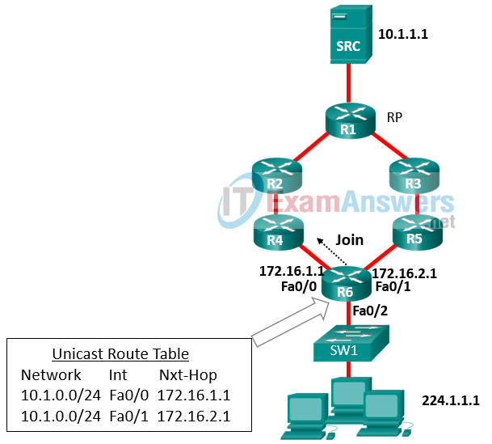

* 135: What are three characteristics of a VLAN access port? (Choose three.)
  * > A switch port can become an access port through static or dynamic configuration.
    * via dynamic auto on both side maybe
  * The VLAN that the access port is assigned to will be automatically deleted if it does not exist in the VLAN database of the switch.
  * An access port should have the 802.1Q encapsulation associated with it.
  * > An access port is created with the switchport mode access command and then associated with a VLAN with the switchport access vlan command.
  * > An access port is associated with a single VLAN.
  * An access port created with the switchport mode access command will send DTP frames by default.

* 151: Which type of OSPF link-state advertisement is an ASBR summary LSA?
  * type 6
  * type 3
  * > type 4
  * type 5
